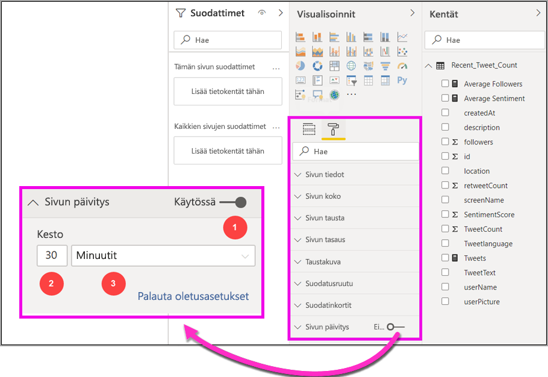
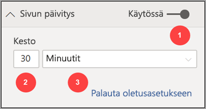
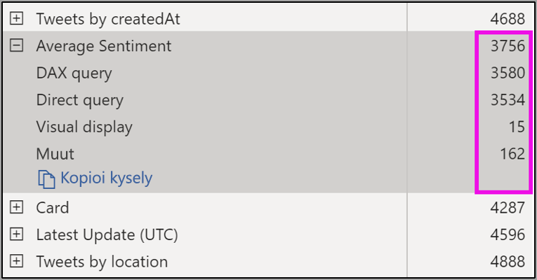
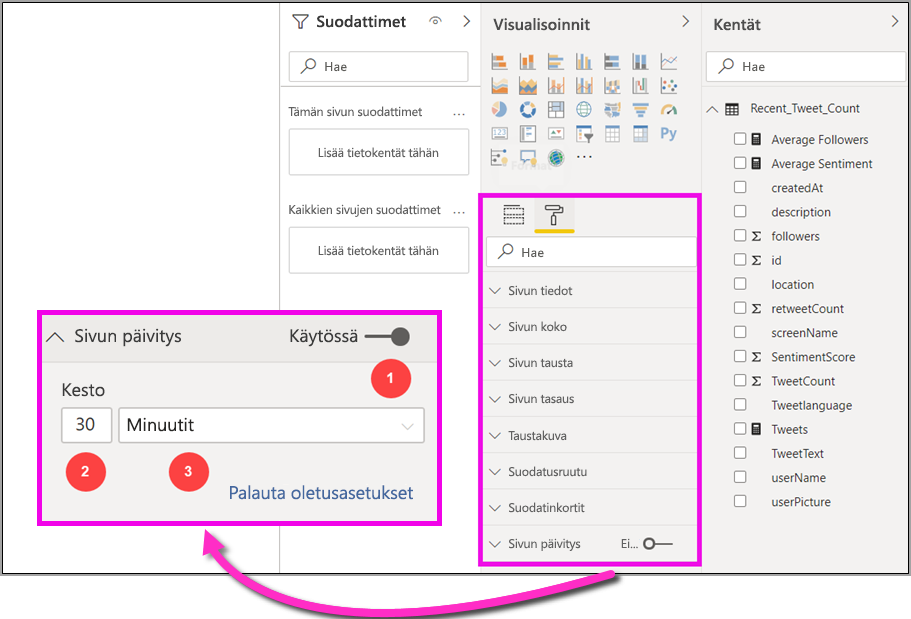

# Automaattinen sivun päivitys Power BI Desktopissa (esiversio)

Kun valvot tärkeitä tapahtumia, on tärkeää, että tiedot päivitetään heti, kun lähdetiedot päivittyvät. Esimerkiksi teollisuudessa on tärkeää tietää, milloin koneessa on vika tai milloin sellainen on odotettavissa.

Power BI:n automaattisella sivun päivitystoiminnolla aktiivinen raportti voi kysellä uusia tietoja tietyin määritetyin väliajoin [DirectQuery-lähteistä](https://docs.microsoft.com/power-bi/desktop-directquery-about).

## Automaattisen sivun päivityksen käyttäminen

Tässä esikatseluversiossa sinun on otettava automaattinen sivun päivitystoiminto käyttöön Power BI Desktopissa. Valitse **Tiedosto > Asetukset ja vaihtoehdot** > **Asetukset** ja sitten vasemmasta ruudusta **Esikatselutoiminnot**. Ota toiminto käyttöön valitsemalla *Automaattinen sivun päivitys* -kohdan vieressä oleva valintaruutu. Automaattinen sivun päivitys on käytettävissä vain DirectQuery-tietolähteille.

Jos haluat käyttää automaattista sivun päivitystä, valitse raporttisivu, jolla haluat käyttää sitä. Valitse **Visualisoinnit**-ruudusta **Muotoilu**-kuvake (maalitela) ja etsi **Sivun päivitys** -kohta ruudun alaosasta. 

Seuraavassa kuvassa näkyy **Sivun päivitys** -kortti. Numeroitujen elementtien selitykset löytyvät muutamasta seuraavasta kappaleesta:

1.  Automaattinen sivun päivitys -liukusäädin: tällä voit ottaa sivun päivityksen käyttöön ja poistaa sen käytöstä.
2.  Sivun päivitysvälin arvo: tämä on päivitysvälin numeroarvo.
3.  Sivun päivitysvälin yksikkö: tämä on päivitysvälin mittayksikkö.

Tässä voit ottaa sivun päivityksen käyttöön ja valita päivitysvälin. Se on oletusarvoisesti 30 minuuttia. Pienin sallittu arvo on yksi sekunti. Raportti päivitetään valitsemasi arvon mukaisesti. 

## Päivitysvälin määrittäminen

Kun automaattinen sivun päivitys on käytössä, Power BI Desktop lähettää jatkuvasti kyselyitä DirectQuery-lähteeseesi. Kyselyn lähettämisen ja tietojen vastaanottamisen välillä on viive, joten jos käytät lyhyttä päivitysväliä, varmista, että kyselyt palauttavat kysellyt tiedot määritetyllä päivitysvälillä. Jos tietoja ei palauta päivitysvälin puitteissa, luot tilanteita, joissa visualisointeja päivitetään määritettyä harvemmin.

Suosittelemme, että päivitysvälin tulisi olla enintään sama kuin uusien tietojen saapumistahti:

* Jos lähteeseen saapuu uusia tietoja 20 minuutin välein, päivitysväli ei voi olla 20 minuuttia. 

* Jos uusia tietoja saapuu joka sekunti, päivitysvälin tulisi olla myös yksi sekunti. 

Jos käytät lyhyttä päivitysväliä (esimerkiksi yksi sekunti), ota huomioon myös DirectQuery-tietolähdetyyppi, kyselyiden sille aiheuttama kuormitus, raportin käyttäjien etäisyys kapasiteettisi palvelinkeskuksesta ja muut vastaavat seikat. 

Voit arvioida näitä Power BI Desktopin Suorituskyvyn analysointi -toiminnolla. Sillä voit vahvistaa, onko jokaisella visualisointikyselyllä tarpeeksi aikaa palauttaa tulos lähteestä, ja selvittää, mihin aika kuluu. Suorituskyvyn analysoinnin tulosten perusteella voit tehdä muutoksia tietolähteeseen tai kokeilla muilla visualisoinneilla ja raporttisi mittareilla.

Seuraavasta kuvasta näet DirectQueryn tulokset Suorituskyvyn analysointi -toiminnossa:

Mietitään hetken muitakin tämän tietolähteen ominaisuuksia. 

1.  Tietoja saapuu kahden sekunnin välein. 
2.  Suorituskyvyn analysointi näyttää kyselyiden enimmäismäärän näyttöajaksi noin 4,9 sekuntia (4 668 millisekuntia). 
3.  Tietolähde on määritetty suoriutumaan noin 1 000 samanaikaisesta kyselystä sekunnissa. 
4.  Odotat, että raporttia käyttää samanaikaisesti noin 10 käyttäjää.

Tämä tuottaa siis seuraavan tuloksen:

* **5 visualisointia x 10 käyttäjää = noin 50 kyselyä**.

Tämä laskelma tuottaa paljon enemmän kuormitusta kuin tietolähde tukee. Tietoja saapuu kahden sekunnin välein, joten päivitysvälin tulisi olla kaksi sekuntia. Koska kyselyn suorittaminen kestää kuitenkin noin viisi sekuntia, se tulisi määrittää viittä sekuntia suuremmaksi. 

Ota huomioon, että tämä voi myös vaihdella, kun julkaiset raportin palveluun, koska raportti käyttää pilvessä isännöityä Analysis Services -esiintymää. Sinun kannattaa siis ehkä muokata päivitysväliä tämän mukaisesti. 

Huomioidakseen kyselyt ja päivitysvälit Power BI suorittaa seuraavan päivityskyselyn vasta, kun kaikki jäljellä olevat päivityskyselyt on suoritettu. Jos siis päivitysvälisi on lyhyempi kuin aika, joka kyselyiden käsittelyyn kuluu, Power BI päivittää silti uudelleen vasta, kun jäljellä olevat kyselyt on suoritettu valmiiksi. 

Tutustutaan seuraavaksi siihen, miten voit tunnistaa ja korjata suorituskykyongelmia kapasiteetin järjestelmänvalvojana. Voit myös tutustua **automaattisen sivun päivityksen usein kysyttyjen kysymysten** osioon, joka löytyy tämän artikkelin lopusta. Sieltä löydät kysymyksiä ja vastauksia suorituskykyyn ja vianmääritykseen liittyen.

## Automaattinen sivun päivitys Power BI palvelussa

Voit myös määrittää automaattisia sivun päivitysvälejä raporteille, jotka on luotu Power BI Desktopissa ja julkaistu Power BI -palveluun. 

Power BI -palvelun raporttien automaattinen sivun päivitys määritetään samankaltaisella tavalla kuin Power BI Desktopissa. Seuraavassa kuvassa näytetään Power BI -palvelun **sivun päivitysmääritykset**:

1.  Automaattinen sivun päivitys -liukusäädin: tällä voit ottaa sivun päivityksen käyttöön ja poistaa sen käytöstä.
2.  Sivun päivitysvälin arvo: tämä on päivitysvälin numeroarvo (täytyy olla kokonaisluku).
3.  Sivun päivitysvälin yksikkö: tämä on päivitysvälin mittayksikkö.

### Sivun päivitysvälit

Power BI -palvelussa sallittuihin sivun päivitysväleihin vaikuttaa raportin työtilatyyppi. Tämä koskee kaikkia seuraavia raportteja:

* Tämä koskee raportin julkaisemista työtilaan, jossa automaattinen sivun päivitys on käytössä.
* Tämä koskee työtilassa jo olevaa sivun päivitysvälin muokkaamista.
* Tämä koskee raportin luomista suoraan palvelussa.

Power BI Desktop ei rajoita päivitysväliä: se voi olla jopa vain yksi sekunti. Kun raportteja julkaistaan Power BI -palveluun, tietyt rajoitukset ovat kuitenkin voimassa. Ne on kuvattu seuraavissa osioissa.

### Päivitysvälien rajoitukset

Power BI -palvelussa automaattisen sivun päivitysrajoitukset ovat voimassa eri tekijöiden perusteella: niitä ovat esimerkiksi työtila ja se, käytetäänkö Premium-palveluita.

Selventääksemme tämän toimintaa meidän on syytä käydä läpi hieman taustaa [kapasiteeteista ja työtiloista](whitepaper-powerbi-premium-deployment.md#capacities).

**Kapasiteetti** on Power BI:n peruskäsite. Se tarkoittaa joukkoa resursseja (tallennus, suoritin ja muisti), joilla isännöidään ja tarjotaan Power BI -sisältöä. Kapasiteetit ovat joko jaettuja tai varattuja. **Jaettu kapasiteetti** jaetaan muiden Microsoftin asiakkaiden kanssa, kun taas **varattu kapasiteetti** on varattu täysin yhdelle asiakkaalle. Varatut kapasiteetit esitellään [Premium-kapasiteettien](whitepaper-powerbi-premium-deployment.md#capacities) artikkelissa.

Jaetussa kapasiteetissa työnkulut suoritetaan muiden asiakkaiden kanssa jaetuissa laskennallisissa resursseissa. Koska kapasiteetin täytyy jakaa resursseja, käytössä on rajoituksia *tasapuolisuuden* takaamiseksi. Esimerkiksi mallin koko voi olla enintään 1 Gt ja päivittäisiä päivityksiä voi olla enintään kahdeksan.

Power BI **-työtilat** ovat kapasiteeteissa: ne edustavat suojauksen, yhteistyön ja käyttöönoton säilöjä. Kullakin Power BI -käyttäjällä on henkilökohtainen työtila, jota kutsutaan **omaksi työtilaksi**. Yhteistyön ja käyttöönoton mahdollistamiseksi voidaan luoda lisää työtiloja, joita kutsutaan **sovellustyötiloiksi**. Työtilat, mukaan lukien henkilökohtaiset työtilat, luodaan oletusarvoisesti **jaetussa kapasiteetissa**.

Tässä on joitain tietoja kahdesta työtilojen käyttötilanteesta:

**Jaetut työtilat**: tavallisissa työtiloissa (työtilat, jotka eivät kuulu Premium-kapasiteettiin), automaattisella sivun päivityksellä on 30 minuutin päivitysväli (pienin sallittu).

**Premium-työtilat**: Automaattisen sivun päivityksen saatavuus Premium-työtiloissa riippuu työtila-asetuksista, jotka Premium-järjestelmänvalvoja on määrittänyt Power BI Premium -kapasiteetille. Kaksi muuttujaa saattaa vaikuttaa mahdollisuuksiisi käyttää automaattista sivun päivitystä:

 1. *Toiminto käytössä tai poissa käytöstä*: jos kapasiteetin järjestelmänvalvoja on poistanut toiminnon käytöstä, et voi määrittää julkaistulle raportillesi minkäänlaista sivun päivitystä.

 2. *Pienin sallittu päivitysväli*: Kun kapasiteetin järjestelmänvalvoja ottaa toiminnon käyttöön, hänen täytyy määrittää pienin sallittu päivitysväli. Jos päivitysvälisi on sallittua pienempi, Power BI -palvelu kumoaa päivitysvälisi, jotta kapasiteetin järjestelmänvalvojan määrittämää pienintä sallittua päivitysväliä kunnioitetaan.

Alla olevassa taulukossa kuvataan tarkemmin, missä tämä toiminto on käytettävissä ja millaisia rajoituksia kullakin kapasiteettityypillä sekä [tallennustilalla](whitepaper-powerbi-premium-deployment.md#model-storage-modes) on

| Tallennustilan tila | Varattu kapasiteetti | Jaettu kapasiteetti |
| --- | --- | --- |
| Suora kysely | **Tuettu**: kyllä  **Pienin päivitysväli**: yksi sekunti  **Kapasiteetin järjestelmänvalvojan kumous**: kyllä | **Tuettu**: kyllä  **Pienin päivitysväli**: 30 minuuttia  **Kapasiteetin järjestelmänvalvojan kumous**: ei |
| Tuo | **Tuettu**: ei  **Pienin päivitysväli**: –  **Kapasiteetin järjestelmänvalvojan kumous**: – | **Tuettu**: ei  **Pienin päivitysväli**: –  **Kapasiteetin järjestelmänvalvojan kumous**: – |
| Yhdistelmätila (DQ+muut) | **Tuettu**: kyllä  **Pienin päivitysväli**: yksi sekunti  **Kapasiteetin järjestelmänvalvojan kumous**: kyllä | **Tuettu**: kyllä  **Pienin päivitysväli**: 30 minuuttia  **Kapasiteetin järjestelmänvalvojan kumous**: ei |
| Reaaliaikainen yhteys (AS) | **Tuettu**: ei  **Pienin päivitysväli**: –  **Kapasiteetin järjestelmänvalvojan kumous**: – | **Tuettu**: ei  **Pienin päivitysväli**: –  **Kapasiteetin järjestelmänvalvojan kumous**: – |
| Reaaliaikainen yhteys (PBI) | **Tuettu**: ei  **Pienin päivitysväli**: –  **Kapasiteetin järjestelmänvalvojan kumous**: – | **Tuettu**: ei  **Pienin päivitysväli**: –  **Kapasiteetin järjestelmänvalvojan kumous**: – |

> [!NOTE]
> Kun julkaiset automaattista sivun päivitystä käyttävän raportin Power BI Desktopista palveluun, sinun täytyy antaa DirectQuery-tietolähteen tunnistetiedot tietojoukon asetusvalikossa.

## Huomioitavat asiat ja rajoitukset

Sinun on syytä muistaa muutama seikka, kun käytät automaattista sivun päivitystä Power BI Desktopissa ja Power BI -palvelussa.

* Tallennuksen tuontitilaa, reaaliaikaisen yhteyden tilaa tai työntötilaa ei tueta automaattiselle sivun päivitykselle.  
* Yhdistelmämalleja, joilla on vähintään yksi DirectQuery-tietolähde, tuetaan.
* Power BI Desktop ei rajoita päivitysväliä: se voi olla jopa vain yksi sekunti. Kun raportteja julkaistaan Power BI -palveluun, tietyt rajoitukset ovat kuitenkin voimassa. Ne on kuvattu aiemmin tässä asiakirjassa.

### Suorituskyvyn vianmääritys

Automaattisesta sivun päivityksestä on hyötyä valvontakäytössä ja nopeasti muuttuvien tietojen käytössä. Joskus se voi kuitenkin kuormittaa kapasiteettia tai tietolähdettä kohtuuttomasti.

Tietolähteiden kohtuuttoman kuormituksen välttämiseksi Power BI:ssä käytetään seuraavia suojamekanismeja:

1. Kaikki automaattisen sivun päivityksen kyselyt suoritetaan **pienemmällä** prioriteetilla. Näin varmistetaan vuorovaikutteisten kyselyiden (esimerkiksi sivun lataaminen ja visualisointien ristiinsuodatus) etuoikeus.
2. Jos kyselyn suorittaminen ei ole päättynyt seuraavaan päivitysajankohtaan mennessä, Power BI ei suorita uusia päivityskyselyitä ennen edellisten valmistumista. Jos päivitysvälisi on esimerkiksi yksi sekunti ja kyselysi kestävät keskimäärin neljä sekuntia, käytännössä Power BI lähettää kyselyn vain joka neljäs sekunti.

Suorituskyvyssä saattaa silti esiintyä pullonkauloja kahdella osa-alueella:

1. **Kapasiteetti:** Kysely lähetetään ensin Premium-kapasiteettiin, joka kääntää raporttivisualisoinneista luodun DAX-kyselyn lähdekyselyksi.
2. **DirectQuery-tietolähde:** Edellisessä vaiheessa käännetyt kyselyt suoritetaan lähteessä. Lähde on SQL Server, SAP Hana -lähde jne.

Järjestelmänvalvojien käytettävissä olevalla [Premium Metrics -sovelluksella](service-admin-premium-monitor-capacity.md) voit visualisoida, paljonko alhaisemman prioriteetin kyselyt käyttävät kapasiteetista.

Alemman prioriteetin kyselyitä ovat automaattiset sivun päivityskyselyt ja mallin päivityskyselyt. Tällä hetkellä näiden toisistaan erottamiseen ei ole mitään tapaa.

Jos huomaat, että alemman prioriteetin kyselyt ylikuormittavat kapasiteettia, voit ryhtyä tiettyihin toimiin:

1. Voit pyytää suurempaa SKU-versiota.
2. Voit ottaa yhteyttä raportin omistajaan ja pyytää häntä muokkaamaan päivitysväliä.
3. Voit toimia kapasiteetin hallintaportaalissa seuraavasti:
  1. Voit poistaa automaattisen sivun päivityksen käytöstä kyseiseltä kapasiteetilta.
  2. Voit suurentaa pienintä sallittua päivitysväliä, mikä vaikuttaa kaikkiin kyseisen kapasiteetin raportteihin.

### Usein kysyttyjä kysymyksiä

Tämä osio sisältää yleisiä kysymyksiä ja vastauksia seuraavaan liittyen: 

1. Olen raportin tekijä. Määritin raportin päivitysväliksi Desktopissa yhden sekunnin, mutta julkaisemisen jälkeen raporttini ei päivity palvelussa.

    * Tarkista, että automaattinen sivun päivitys on käytössä sivulla. Koska tämä asetus on sivukohtainen, sinun täytyy varmistaa, että se on käytössä kaikilla haluamillasi sivuilla.
    * Tarkista, että olet ladannut sen työtilaan, johon on liitetty Premium-kapasiteetti. Muussa tapauksessa päivitysväliksi lukitaan 30 minuuttia.
    * Jos raporttisi on Premium-työtilassa, tarkista järjestelmänvalvojalta, että hän on ottanut tämän toiminnon käyttöön liitetylle kapasiteetille. Varmista myös, että kapasiteetin pienin sallittu päivitysväli on yhtä suuri tai pienempi kuin raportillasi.

2. Olen kapasiteetin järjestelmänvalvoja. Muokkasin automaattisen sivun päivitysvälin asetuksia, mutta uudet asetukset eivät ole käytössä. Raportteja ei vieläkään päivitetä haluamallani päivitysvälillä tai ollenkaan, vaikka niiden pitäisi päivittyä.

    * Kapasiteetin hallinnan käyttöliittymässä tehdyt automaattisen sivun päivitysvälin asetusten muutokset tulevat käyttöön raporteissa jopa viiden minuutin viipeellä.
    * Sen lisäksi, että otat automaattisen sivun päivityksen käyttöön kapasiteetille, sinun täytyy ottaa se käyttöön myös haluamillesi raportin sivuille.

3. Raporttini on yhdistelmätilassa (DQ+tuonti). Kaikki visualisoinnit eivät päivity.

    * Jos visualisointisi viittaa tuontitaulukoihin, tämä on odotettua. Automaattista sivun päivitystä ei tueta tuontitilassa.
    * Tutustu tämän osion ensimmäiseen kysymykseen.

4. Raporttini päivittyi hyvin palvelussa, mutta yhtäkkiä se lakkasi.

    * Yritä ladata sivu uudelleen ja katso, korjaako tämä ongelman.
    * Tarkista kapasiteetin järjestelmänvalvojalta, onko hän poistanut toiminnon käytöstä tai suurentanut pienintä sallittua päivitysväliä (katso kysymys 2).

5. Olen raportin tekijä. Visualisointini eivät päivity haluamani aikataulun mukaisesti. Ne päivittyvät liian hitaasti.

    * Jos kyselyiden suorittaminen kestää kauan, tämä pidentää myös päivitysväliä. Automaattinen sivun päivitys odottaa, että kaikki kyselyt on suoritettu loppuun, ennen kuin se suorittaa uusia.
    * Kapasiteetin järjestelmänvalvoja on ehkä määrittänyt pienimmän sallitun päivitysvälin, joka on suurempi kuin raportissasi. Ota yhteyttä kapasiteetin järjestelmänvalvojaan ja pyydä pienempää päivitysväliä.

6. Suoritetaanko automaattiset sivun päivityskyselyt välimuistista?

    * Ei, kaikki automaattiset sivun päivityskyselyt ohittavat kaikki välimuistiin tallennetut tiedot.

## Seuraavat vaiheet

Katso lisätietoja seuraavista artikkeleista:

* [DirectQueryn käyttäminen Power BI:ssä](desktop-directquery-about.md)
* [Raporttielementtien suorituskyvyn analysointi Suorituskyvyn analysointi -toiminnolla](desktop-performance-analyzer.md)
* [Power BI Premium -kapasiteettien käyttöönotto ja hallinta](whitepaper-powerbi-premium-deployment.md)
* [Power BI Desktopin tietolähteet](desktop-data-sources.md)
* [Tietojen muotoilu ja yhdistäminen Power BI Desktopissa](desktop-shape-and-combine-data.md)
* [Yhteyden muodostaminen Excel-työkirjoihin Power BI Desktopissa](desktop-connect-excel.md)   
* [Tietojen antaminen suoraan Power BI Desktopiin](desktop-enter-data-directly-into-desktop.md)   
