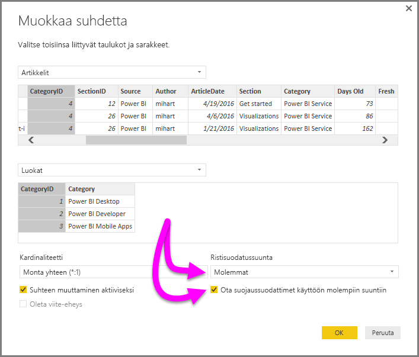

# DirectQueryn kaksisuuntaisen ristiinsuodatuksen käyttöönotto Power BI Desktopissa

Kun raporttien tekijät ja tietojen mallintajat suodattavat taulukoita sopivan tietonäkymän luontia varten, he kohtaavat haasteita määrittäessään, miten suodattimia käytetään raportissa. Aiemmin taulukon suodatinkontekstia pidettiin suhteen toisella puolella, mutta ei toisella. Tämä järjestely vaati usein monimutkaista DAX-kaavaa, jotta haluttu tulos saatiin.

Kaksisuuntaisen ristisuodatuksen avulla raporttien luojat ja tietojen mallintajat voivat nyt hallita entistä paremmin sitä, miten he voivat käyttää suodattimia toisiinsa liittyvien taulukoiden käsittelyssä. Kaksisuuntaisen ristisuodatuksen avulla he voivat käyttää suodattimia taulukkosuhteen *molemmilla* puolilla. Voit käyttää suodattimia välittämällä taulukkosuhteen toisella puolella olevaan toiseen taulukkoon.

## Kaksisuuntaisen ristiinsuodatuksen ottaminen käyttöön DirectQuerylle

Voit ottaa ristiinsuodatuksen käyttöön **Muokkaa suhdetta** -valintaikkunassa. Jos haluat ottaa suhteen ristiinsuodatuksen käyttöön, sinun on määritettävä seuraavat asetukset:

* Määritä **Ristisuodatussuunta**-asetukseksi **Molemmat**.
* Valitse **Ota suojaussuodattimet käyttöön molempiin suuntiin**.

  

> [!NOTE]
> Kun luot ristiinsuodatuksen DAX-kaavoja Power BI Desktopissa, käytä *UserPrincipalName*-nimeä. Tämä kenttä on usein sama kuin käyttäjän kirjautumisnimi, esimerkiksi <em>joe@contoso.com</em>, *Käyttäjänimi*-nimen sijaan. Siksi sinun on ehkä luotava vastaava taulukko, joka yhdistää *UserName*-nimen (tai *EmployeeID*-nimen) *UserPrincipalName*-nimeen.

Saat lisätietoja ja esimerkkejä kaksisuuntaisen ristiinsuodatuksen toiminnasta [teknisestä Kaksisuuntainen ristiinsuodatus Power BI Desktopissa -raportista](https://download.microsoft.com/download/2/7/8/2782DF95-3E0D-40CD-BFC8-749A2882E109/Bidirectional%20cross-filtering%20in%20Analysis%20Services%202016%20and%20Power%20BI.docx).

