# Kirjanmerkkien avulla voit jakaa merkityksellisiä tietoja ja koostaa tarinoita Power BI:ssä 
Käyttämällä **kirjanmerkkejä** Power BI:ssä voit tallentaa raporttisivun senhetkisen määritetyn näkymän suodatukset ja visualisointien tila mukaan lukien. Voit myöhemmin palata tähän tilaan valitsemalla tallennetun kirjanmerkin. 

Voit myös luoda kokoelman kirjanmerkkejä ja järjestää ne haluamaasi järjestykseen. Siten voit myöhemmin käydä läpi jokaisen kirjanmerkin osana esitystä ja korostaa merkityksellisiä tietoja tai kertoa haluamasi tarinan visualisoinneilla ja raporteilla. 

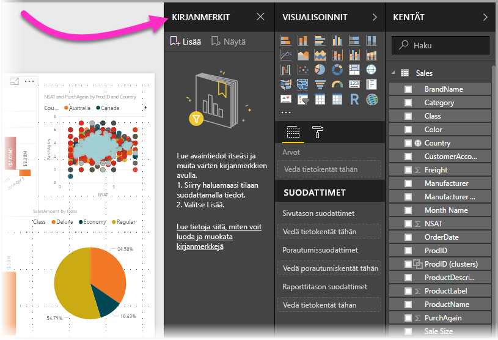

Kirjanmerkeille on useita käyttötarkoituksia. Niiden avulla voit seurata omaa edistymistäsi raporttien luomisessa, sillä niitä on helppo lisätä, poistaa ja nimetä uudelleen. Kirjanmerkeillä voit myös koota PowerPoint-tyyppisiä esityksiä käymällä läpi kirjanmerkkejä järjestyksessä, jolloin voit raporttisi avulla kertoa haluamasi tarinan. Käyttötapoja voi olla monia muitakin riippuen siitä, miten haluat niitä käyttää.

> [!TIP]
> Tietoa Omien kirjanmerkkien käytöstä Power BI ‑palvelussa saat Omat kirjanmerkit ‑toiminnon julkaisusta kertovasta [blogikirjoituksesta](https://powerbi.microsoft.com/blog/announcing-personal-bookmarks-in-the-power-bi-service/). 

### Kirjanmerkkien esiversion käyttöönotto (maaliskuuta 2018 edeltävissä versioissa)
Power BI Desktopin maaliskuun 2018 versiosta alkaen kirjanmerkit ovat olleet yleisesti saatavilla. 

Suosittelemme aina päivittämään uusimpaan versioon. Jos Power BI Desktop -versiosi on kuitenkin tätä vanhempi, voit käyttää **kirjanmerkki**toimintoa **Power BI Desktopin** **lokakuun 2017** versiossa ja myös **Power BI -palvelussa**, jos raportissa on kirjanmerkit otettu käyttöön. Ota esiversio-ominaisuus käyttöön valitsemalla **Tiedosto > Asetukset ja vaihtoehdot > Asetukset > Esiversio-ominaisuudet**. Valitse sitten **Kirjanmerkit**-valintaruutu. 

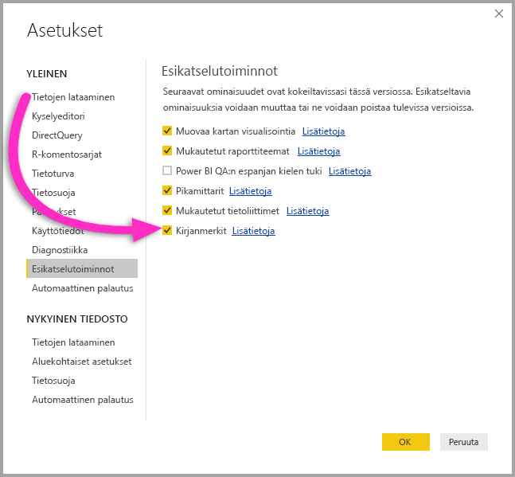

Kun olet ottanut kirjanmerkkien esiversion käyttöön, sinun on käynnistettävä **Power BI Desktop** uudelleen.

## Kirjanmerkkien käyttäminen
Voit käyttää kirjanmerkkejä valitsemalla valintanauhasta **Näytä** ja sitten **Kirjanmerkit-ruutu**-valintaruudun. 

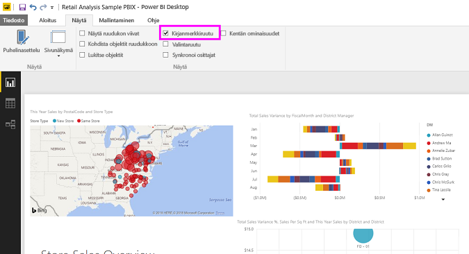

Kun luot kirjanmerkin, seuraavat elementit tallennetaan sen mukana:

* Nykyinen sivu
* Suodattimet
* Osittajat, mukaan lukien osittajan tyyppi (esimerkiksi avattava luettelo tai luettelo) ja osittajan tila
* Visualisoinnin valinnan tila (kuten ristiinkorostussuodattimet)
* Lajittelujärjestys
* Porautumissijainti
* Näkyvyys (objektin näkyvyys **Valinta**-ruutua käyttämällä)
* Näkyvien objektien kohdistus- tai **korostus**-tilat

Määritä raporttisivu sellaiseksi kuin haluat sen näkyvän kirjanmerkissä. Kun raporttisivu ja visualisoinnit ovat sellaisessa järjestyksessä kuin haluat, lisää kirjanmerkki valitsemalla **Kirjanmerkit**-ruudusta **Lisää**. 

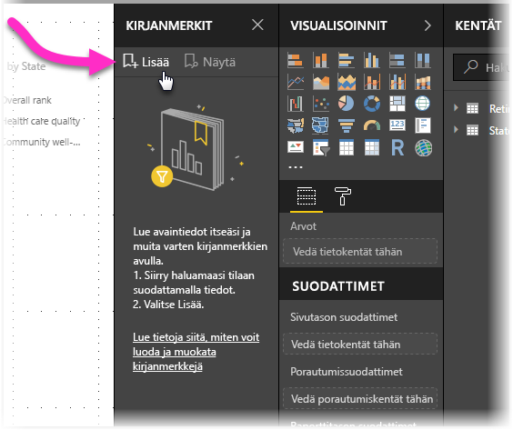

**Power BI Desktop** luo kirjanmerkin ja antaa sille yleisen nimen. Kirjanmerkin voi helposti *nimetä uudelleen*, *poistaa* tai *päivittää* valitsemalla sen nimen vieressä olevan ellipsikuvakkeen. Valitse sitten haluamasi toiminto avautuvasta valikosta.

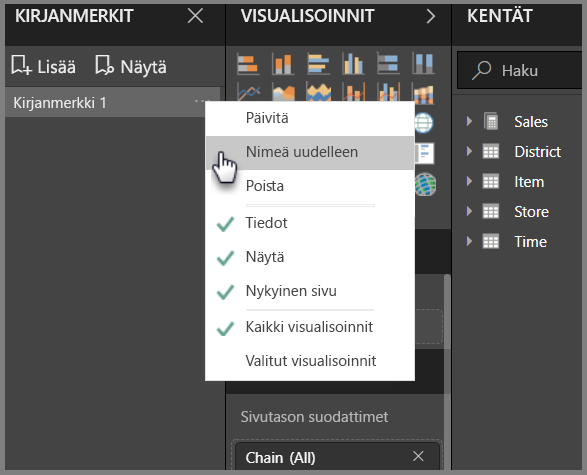

Kun olet lisännyt kirjanmerkin, saat sen näkyviin napsauttamalla sitä **Kirjanmerkit**-ruudussa. 

Voit myös valita, käyttääkö kukin kirjanmerkki *tieto*-ominaisuuksia, kuten suodattimia ja osittajia, *näyttö*-ominaisuuksia, kuten korostus ja sen näkyvyys, ja sivun muutoksia, jotka esittävät sen sivun, joka oli näkyvissä lisättäessä kirjanmerkkiä. Nämä ominaisuudet ovat hyödyllisiä, jos haluat vaihtaa raporttinäkymästä tai visualisoinnista toiseen kirjanmerkkien avulla – tällöin haluat todennäköisesti poistaa tieto-ominaisuudet käytöstä, jotta suodattimia ei palauteta käyttäjien vaihtaessa näkymää tai valitessa kirjanmerkkejä. 

Tee muutokset valitsemalla kirjanmerkin nimen vieressä oleva ellipsikuvake edellisen kuvan mukaisesti ja valitsemalla sitten valintaruudut tai poistamalla niiden valinta *Tiedot*- ja *Näyttö*-ohjausobjektien ja muiden ohjausobjektien kohdalla. 

## Kirjanmerkkien järjestäminen
Kun luot kirjanmerkkejä, niiden luontijärjestys ei välttämättä ole sama kuin missä haluat esittää ne yleisöllesi. Se ei ole ongelma, sillä voit helposti muuttaa kirjanmerkkien järjestystä.

Se tapahtuu vetämällä ja pudottamalla niitä **Kirjanmerkit**-ruudussa seuraavassa kuvassa esitetyllä tavalla. Kirjanmerkkien välissä näkyvä keltainen palkki näyttää, mihin vetämäsi kirjanmerkki sijoitetaan.

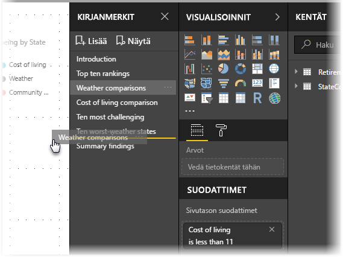

Kirjanmerkkien järjestys voi muodostua tärkeäksi, kun käytät kirjanmerkkien **Näytä**-ominaisuutta seuraavassa osiossa kuvatulla tavalla.

## Kirjanmerkit diaesityksenä
Kun sinulla on kokoelma kirjanmerkkejä, jotka haluat esittää järjestyksessä, voit aloittaa diaesityksen valitsemalla **Kirjanmerkit**-ruudun **Näytä**-vaihtoehdon.

**Näytä**-tilassa on tiettyjä merkille pantavia ominaisuuksia:

1. Kirjanmerkin nimi näkyy kankaan alareunan otsikkorivillä.
2. Kirjanmerkin otsikkorivillä on nuolia, joilla siirtyä seuraavaan tai edelliseen kirjanmerkkiin.
3. Voit poistua **Näytä**-tilasta valitsemalla **Kirjanmerkit**-ruudusta **Lopeta** tai **X**-kuvake kirjanmerkin otsikkoriviltä. 

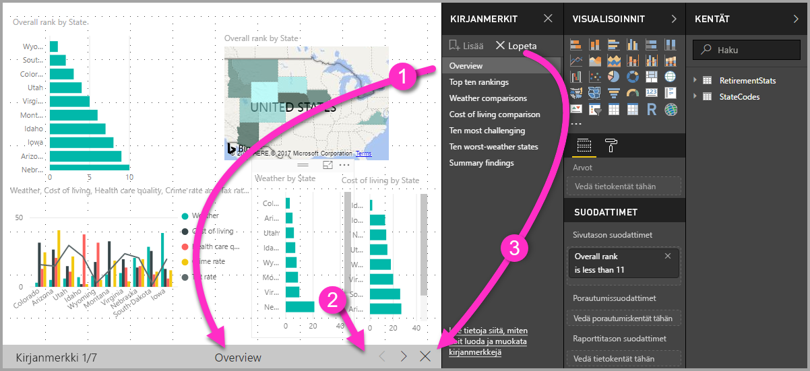

Kun olet **Näytä**-tilassa, voit sulkea **Kirjanmerkit**-ruudun napsauttamalla X-kuvaketta, niin saat enemmän tilaa esitykselle. **Näytä**-tilassa kaikki visualisoinnit ovat vuorovaikutteisia ja käytettävissä ristiinkorostukseen samalla tavalla kuin muutoinkin niitä käsiteltäessä. 

## Näkyvyys Valinta-ruutua käyttämällä
Kirjanmerkkien julkaisun myötä ohjelmaan lisättiin myös uusi **Valinta**-ruutu. **Valinta**-ruutu sisältää luettelon kaikista objekteista nykyisellä sivulla. Sen avulla voit valita objekteja ja määrittää niiden näkyvyyden. 

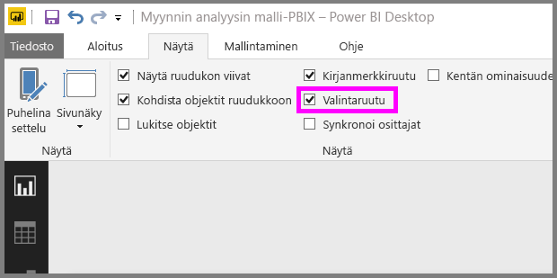

Voit valita objektin **Valinta**-ruutua käyttämällä. Visualisoinnin oikealla puolella olevalla silmäkuvakkeella voit vaihtaa objektin näkyväksi tai näkymättömäksi. 

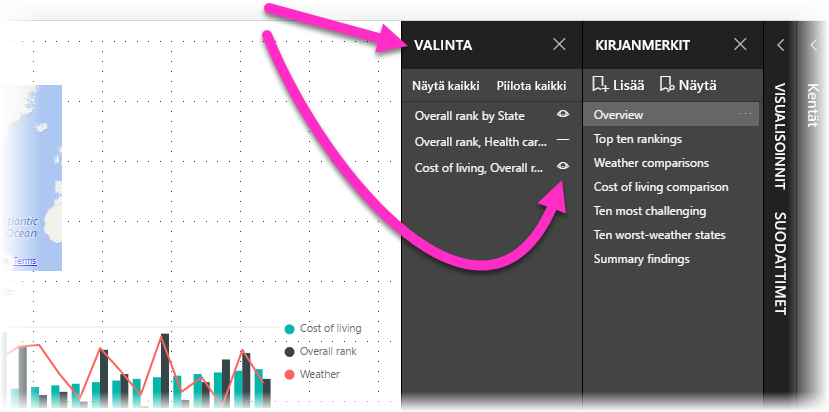

Kun kirjanmerkki lisätään, samalla tallennetaan myös kunkin objektin näkyvyystila **Valinta**-ruudussa olevan asetuksen mukaan. 

On tärkeää huomata, että **osittajat** jatkavat raporttisivun suodattamista riippumatta siitä, ovatko ne näkyvissä. Voit luoda monia eri kirjanmerkkejä käyttämällä eri osittajan asetuksia, jolloin yhden ja saman raporttisivun saa näyttämään hyvin erilaiselta eri kirjanmerkeissä. Niissä voi myös korostaa eri tietoja.

## Muotojen ja kuvien kirjanmerkit
Kirjanmerkkeihin voi linkittää muotoja ja kuvia. Kun napsautat objektia, tämän ominaisuuden ansiosta näet siihen liittyvän kirjanmerkin. Tämä voi olla erityisen hyödyllistä käsiteltäessä painikkeita; voit lukea lisätietoja [Power BI:n painikkeita](desktop-buttons.md) käsittelevässä artikkelissa. 

Liitä kirjanmerkki objektiin valitsemalla objekti ja laajentamalla sitten **Muotoile muoto** -ruudussa **Toiminto**-osiota seuraavassa kuvassa esitetyllä tavalla.

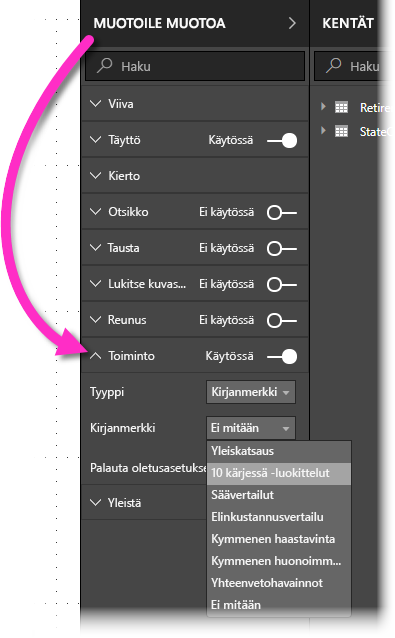

Kun otat **Toiminto**-liukusäätimen **käyttöön**, voit valita, onko objekti Takaisin-painike, kirjanmerkki vai Q&A-komento. Jos valitset kirjanmerkin, voit valita, mihin kirjanmerkkiisi objekti on linkitetty.

Objekteihin linkitetyt kirjanmerkit avaavat monia hyödyllisiä mahdollisuuksia. Voit luoda visuaalisen sisällysluettelon raporttisivullesi tai tarjota samoista tiedoista erilaisia näkymiä, kuten visualisointityyppejä – vain objektia napsauttamalla.

Muokkaustilassa voit valita linkin napsauttamalla sitä Ctrl-näppäin painettuna. Sama onnistuu muokkaustilan ulkopuolella vain napsauttamalla objektia. 

## Kirjanmerkkiryhmät

**Power BI Desktopin** vuoden 2018 elokuun versiosta alkaen voit luoda ja käyttää kirjanmerkkiryhmiä. Kirjanmerkkiryhmä on kokoelma määrittämiäsi kirjanmerkkejä, jotka voidaan näyttää ja järjestää ryhmänä. 

Voit luoda kirjanmerkkiryhmän pitämällä alhaalla CTRL-näppäintä ja valitsemalla kirjanmerkit, jotka haluat sisällyttää ryhmään. Napsauta sitten minkä tahansa valitun kirjanmerkin vieressä olevaa kolmea pistettä ja valitse esiin tulevasta valikosta **Ryhmä**.

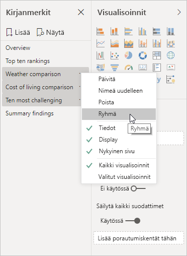

**Power BI Desktop** määrittää ryhmän nimeksi automaattisesti *Ryhmä 1*. Jos haluat määrittää sille toisen nimen, sinun tarvitsee vain kaksoisklikata nimeä.

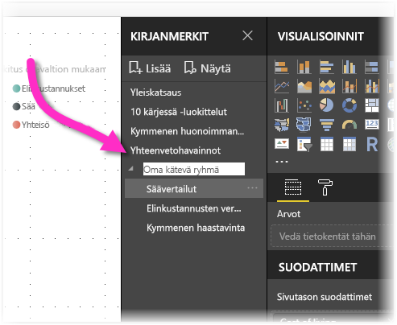

Kun klikkaat jossakin kirjanmerkkiryhmässä sen nimeä, voit vain laajentaa tai kutistaa kirjanmerkkiryhmää, eikä se edusta itse kirjanmerkkiä. 

Kun käytät kirjanmerkkien **Näkymä**-ominaisuutta, noudata seuraavia ohjeita:

* Jos valittu kirjanmerkki on ryhmässä, kun valitset **Näytä** kirjanmerkeistä, tarkasteluistunnossa näytetään vain *kyseisen ryhmän* kirjanmerkit. 

* Jos valittu kirjanmerkki ei ole ryhmässä tai se on ylimmällä tasolla (kuten kirjanmerkkiryhmän nimi), näytetään koko raportin kaikki kirjanmerkit, mukaan lukien minkä tahansa ryhmän kirjanmerkit. 

Voit poistaa kirjanmerkkien ryhmittelyn valitsemalla minkä tahansa kirjanmerkin ryhmässä, klikkaamalla kolmea pistettä ja valitsemalla sitten esiin avautuvasta valikosta **Poista ryhmittely**. 

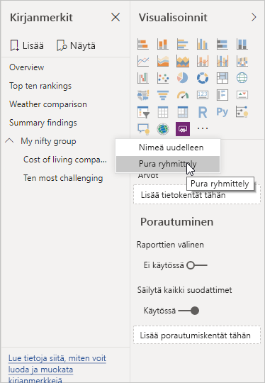

Huomaa, että kun valitset **Poista ryhmittely** jollekin ryhmän kirjanmerkille, kaikkien kirjanmerkkien ryhmittely poistetaan (se poistaa ryhmän, mutta ei itse kirjanmerkkejä). Jos haluat poistaa yhden kirjanmerkin ryhmästä, tästä ryhmästä on **poistettava** jäsen, mikä poistaa ryhmittelyn, ja valittava sitten halutut jäsenet uuteen ryhmään (CTRL:n avulla ja klikkaamalla jokaista kirjanmerkkiä). Valitse sitten uudelleen **Ryhmä**. 

## Korostuksen käyttäminen
Kirjanmerkit toivat mukanaan myös **korostuksen**. **Korostus**toiminnolla voit kiinnittää huomion tiettyyn kaavioon, kun esimerkiksi näytät kirjanmerkkejäsi esityksessä **Näytä**-tilassa.

Tutustutaan seuraavaksi **korostus**- ja **kohdistustilan** eroihin.

1. **Tarkastelu**tilassa yksi visualisointi voi täyttää koko kankaan, kun valitset **tarkastelutilan** kuvakkeen.
2. **Korostuksella** voit nostaa esiin yhden visualisoinnin sen alkuperäisessä koossa siten, että kaikki muut sivun visualisoinnit häivytetään lähes läpinäkyviksi. 

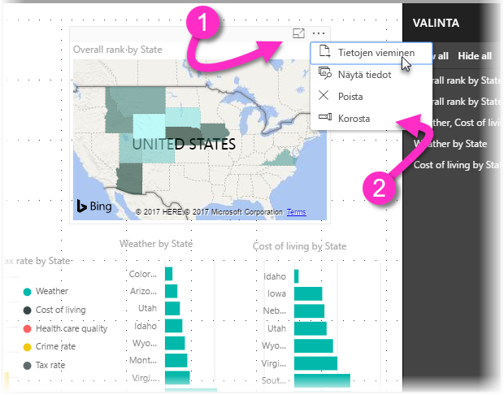

Kun edellisen kuvan visualisoinnin **kohdistus**kuvaketta napsautetaan, sivu näyttää seuraavanlaiselta:

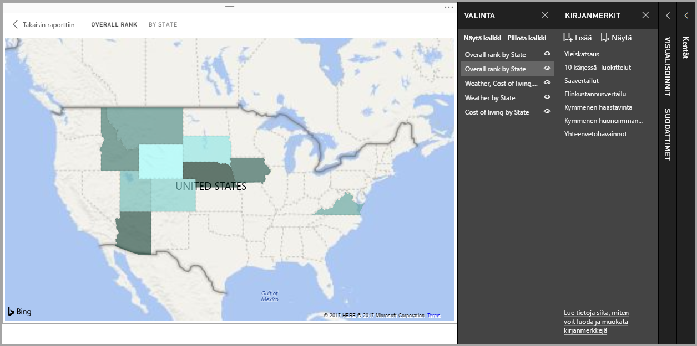

Sen sijaan kun **korostus**tila valitaan visualisoinnin ellipsivalikosta, sivu näyttää tältä:

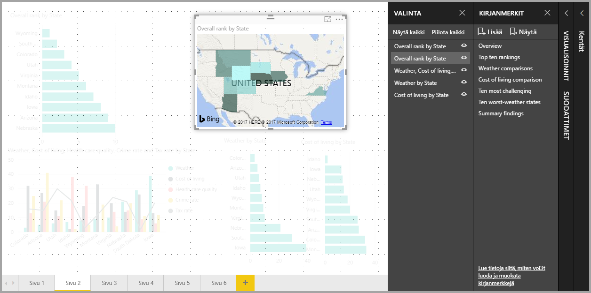

Jos kohdistus- tai korostustila on valittuna, kun kirjanmerkki lisätään, kyseinen tila säilytetään kirjanmerkissä.

## Kirjanmerkit Power BI -palvelussa
Kun julkaiset vähintään yhden kirjanmerkin sisältävän raportin **Power BI -palveluun**, voit tarkastella ja käyttää näitä kirjanmerkkejä **Power BI -palvelussa**. Kun kirjanmerkit ovat käytettävissä raportissa, voit valita **Näytä > Valinta-ruutu** tai **Näytä > Kirjanmerkit-ruutu**, kun haluat nähdä jommankumman ruudun.

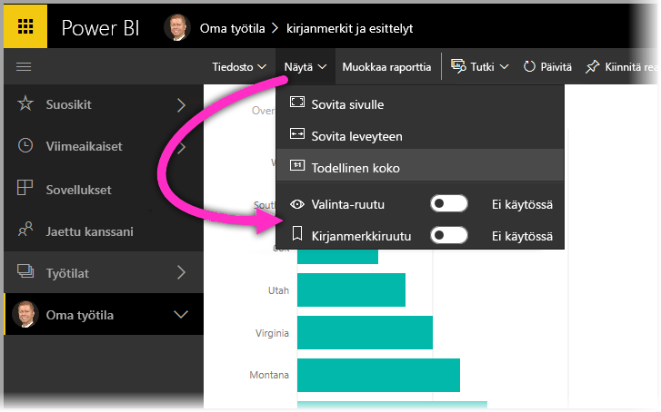

**Power BI -palvelun** **Kirjanmerkit-ruutu** toimii samalla tavalla kuin **Power BI Desktopissa**, mukaan lukien **Näytä**-kohdan mahdollisuus näyttää kirjanmerkit järjestyksessä diaesityksen tapaan.

Huomaa, että kirjanmerkkien selaaminen tapahtuu käyttämällä harmaata kirjanmerkkien otsikkoriviä mustien nuolten sijaan, sillä mustilla nuolilla selataan kirjanmerkkien sijaan raporttisivuja.

## Rajoitukset ja huomioitavat asiat
Tähän versioon **kirjanmerkkitoiminnosta** liittyy tiettyjä rajoituksia ja huomioitavia asioita.

* Useimmat mukautetut visualisoinnit toimivat yleensä hyvin kirjanmerkeissä. Jos kohtaat ongelmia kirjanmerkkien ja mukautetun visualisoinnin kanssa, ota yhteyttä kyseisen visualisoinnin tekijään ja pyydä häntä lisäämään kirjanmerkkituen visualisointiin. 
* Jos lisäät visualisoinnin raporttisivulle kirjanmerkin luomisen jälkeen, visualisointi näkyy oletustilassaan. Tämä tarkoittaa myös sitä, että jos lisäät osittajan sivulle, jolle on aiemmin luotu kirjanmerkkejä, osittaja toimii oletustilassaan.
* Visualisointien siirtely kirjanmerkin luomisen jälkeen näkyy kirjanmerkissä. 

## Seuraavat vaiheet
Seuraavissa artikkeleissa on lisätietoja ominaisuuksista, jotka muistuttavat kirjanmerkkejä tai toimivat niiden kanssa:

* [Porautumisen käyttäminen Power BI Desktopissa](desktop-drillthrough.md)
* [Koontinäytön ruudun tai raporttivisualisoinnin näyttäminen tarkastelutilassa](consumer/end-user-focus.md)

