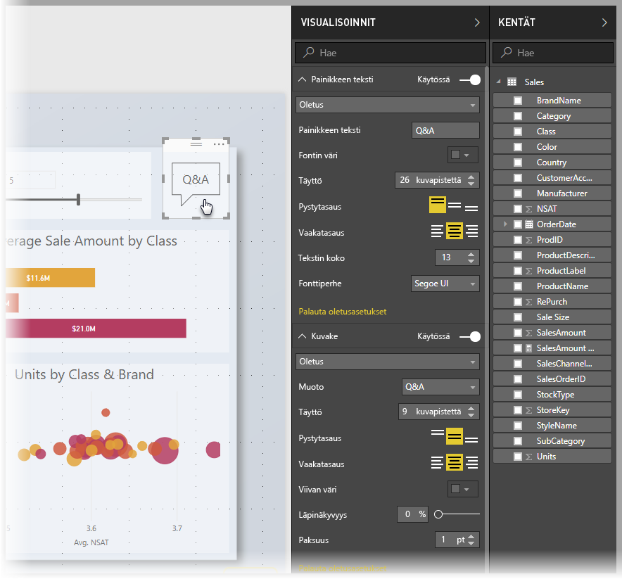
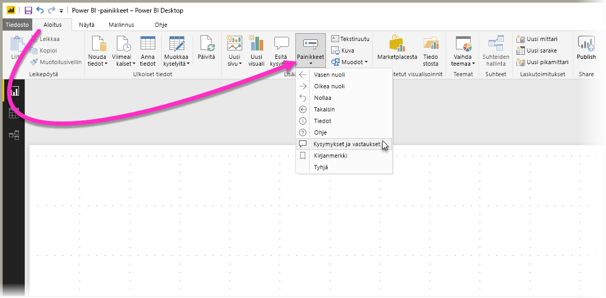
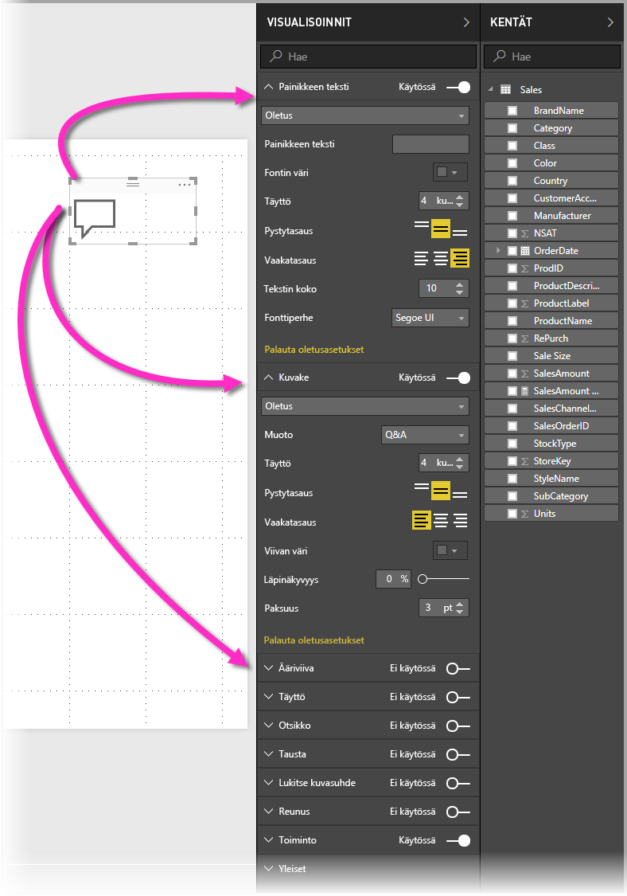
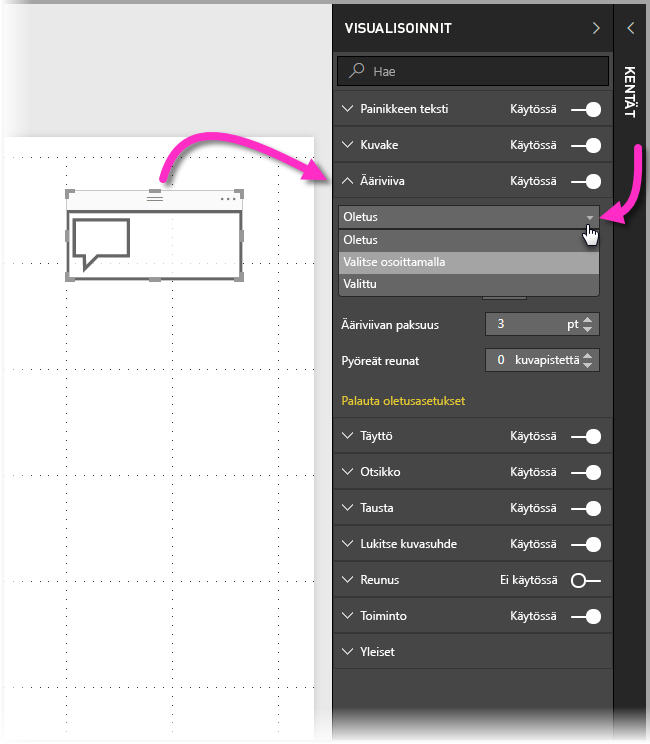
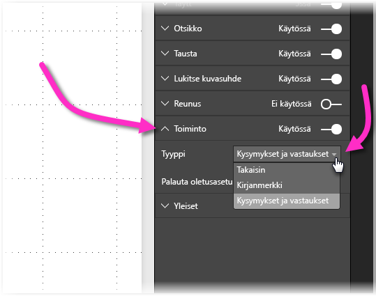

# Painikkeiden käyttö Power BI:ssä
Power BI:n **painikkeiden** avulla voit tehdä raportteja ja raporttinäkymiä, jotka toimivat sovellusten tavoin ja luovat kiinnostavan ympäristön, jossa käyttäjät voivat osoittaa ja valita Power BI -sisältöä hiirellä ja vuorovaikuttaa sen kanssa muilla tavoilla. Voit lisätä painikkeita raportteihin **Power BI Desktopissa** ja jakaa tai julkaista näitä raportteja Power BI -palvelussa, jolloin voit luoda käyttäjille sovellusten kaltaisia raporttinäkymiä.

Voit käyttää **Power BI Desktopissa** luomiasi painikkeita **Power BI -palvelussa** julkaistuissa raporteissa tai raporttinäkymissä.

## Painikkeiden luominen raporteissa
Voit luoda painikkeen **Power BI Desktop** -raportissa valitsemalla **Aloitus**-valintanauhan ja sitten **Painikkeet**. Näyttöön tulee avattava valikko, josta voit valita haluamasi painikkeen seuraavassa kuvassa esitetyistä eri vaihtoehdoista. 

Kun luot painikkeen ja valitset raportin, sen raporttialustalla **Visualisoinnit**-ruudussa näytetään useita tapoja, joilla voit mukauttaa painikkeen tarpeidesi mukaiseksi. Voit esimerkiksi ottaa käyttöön **Painikkeen tekstin** tai poistaa sen käytöstä **Visualisoinnit**-ruudun liukusäätimellä. Voit myös muuttaa mm. painikkeen kuvaketta, painikkeen täyttöä, otsikkoa ja sitä, minkä toiminnon painikkeen napsauttaminen raportissa tai raporttinäkymässä käynnistää.

## Voit määrittää painikkeen ominaisuudet, kun sillä ei tehdä mitään, kun osoitin on sen päällä tai kun painike on valittu

Power BI:n painikkeilla on kolme tilaa: oletus (miltä painike näyttää, kun sitä ei osoiteta ja kun se ei ole valittuna), osoitettuna ja valittuna (kun painiketta on *napsautettu*). Monia **Visualisoinnit**-ruudun kortteja voidaan muokata yksitellen mukaan näiden kolmen tilan mukaan, minkä ansiosta painikkeita voidaan mukauttaa joustavasti.

**Visualisoinnit**-ruudun seuraavien korttien avulla voit säätää painikkeen muotoilua tai toimintaa sen kolmen tilan perusteella:

* Painikkeen teksti
* Kuvake
* Ääriviiva
* Täyttö

Jos haluat valita, miltä painikkeen pitäisi näkyä kussakin tilassa, laajenna jokin korteista ja valitse kortin yläosassa näkyvä avautuva luettelo. Seuraavassa kuvassa **Ääriviiva**-kortti on laajennettu ja avattava luettelo valittu niin, että kaikki kolme tilaa näkyvät:

## Painikkeen toiminnon valitseminen

Voit valita, mikä toiminto käynnistetään, kun käyttäjä valitsee painikkeen Power BI:ssä. Voit käyttää painikkeiden toimintojen asetuksia **Visualisoinnit**-ruudun **Toiminto**-kortista.

Painikkeen toiminnon asetukset ovat seuraavat:

* Takaisin
* Kirjanmerkki
* Q&A

Valitsemalla **Takaisin** käyttäjä palautetaan raportin edelliselle sivulle. Tämä on hyödyllinen ominaisuus erityisesti sivuilla, joissa poraudutaan alaspäin.

Valitsemalla **Kirjanmerkki** käyttäjä näkee raporttisivun, joka on liitetty senhetkisen raportin kirjanmerkkiin. Katso [lisätietoja kirjanmerkeistä Power BI:ssä](desktop-bookmarks.md). 

Valitsemalla **Q&A** avattavasta valikosta käyttäjä näkee **Q&A Explorer** -ikkunan. 

Tietyillä painikkeilla on automaattisesti valittu oletustoiminto. Esimerkiksi **Q&A**-painiketyypin oletustoiminnoksi valitaan automaattisesti **Q&A**. Katso lisätietoja **Q&A Explorerista** [tästä blogikirjoituksesta](https://powerbi.microsoft.com/blog/power-bi-desktop-april-2018-feature-summary/#Q&AExplorer).

Voit kokeilla tai testata raportin painikkeita käyttämällä *CTRL + NAPSAUTUS* -yhdistelmää haluamaasi painikkeeseen. 

## Seuraavat vaiheet
Seuraavissa artikkeleissa on lisätietoja ominaisuuksista, jotka muistuttavat painikkeita tai toimivat niiden kanssa:

* [Porautumisen käyttäminen Power BI Desktopissa](desktop-drillthrough.md)
* [Koontinäytön ruudun tai raporttivisualisoinnin näyttäminen kohdistustilassa](service-focus-mode.md)
* [Kirjanmerkkien käyttäminen merkityksellisten tietojen jakamiseen ja tarinoiden koostamiseen Power BI:ssä](desktop-bookmarks.md)

