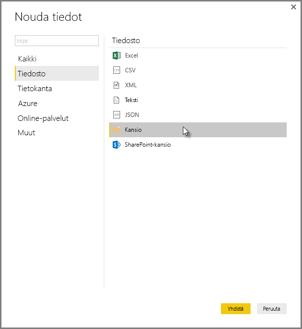
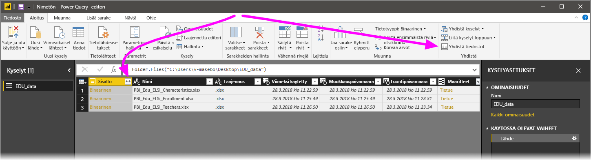
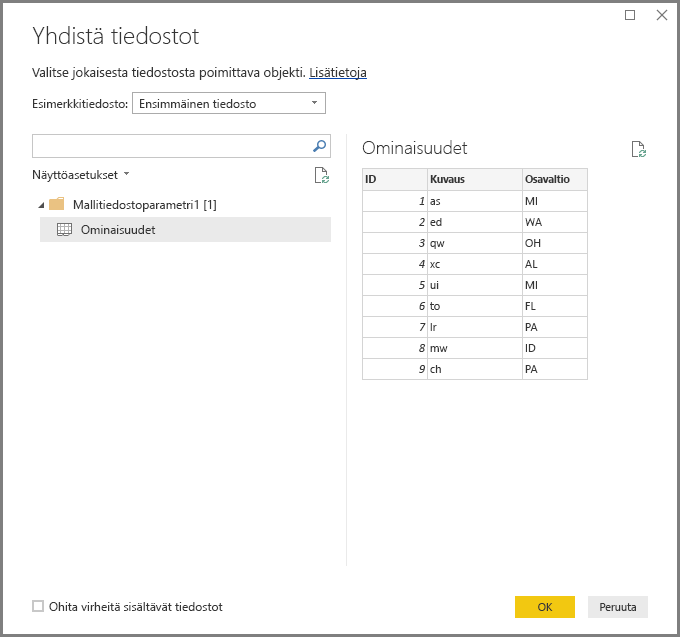
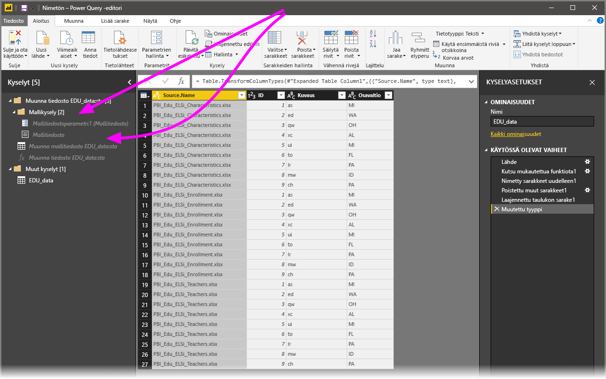

# Power BI Desktopin tiedostojen (binaaritiedostot) yhdistäminen
Yksi tehokas tapa tietojen tuomiseksi **Power BI Desktopiin** on yhdistää useita tiedostoja, joilla on sama rakenne ja yhdistää ne yhdeksi loogiseksi taulukoksi. Marraskuun 2016 julkaisussa **Power BI Desktop** (ja sen myöhemmissä versioissa) tämä kätevä ja suosittu lähestymistapa on entistä kätevämpi ja kattavampi, kuten tässä artikkelissa kerrotaan.

Aloita tiedostojen yhdistäminen samaan kansioon valitsemalla **Nouda tiedot > Tiedosto > Kansio**.

## Edellisten yhdistettyjen tiedostojen (binaaritiedostot) toiminta
Marraskuuta 2016 edeltäneissä **Power BI Desktop** -versioissa tätä toimintoa kutsuttiin nimellä **Yhdistä binaarit**, ja sen avulla pystyit yhdistämään tietyt tiedostotyypit **Yhdistä binaarit** -muunnokseen, mutta rajoituksia oli:

* Muunnoksia ei pidetty yksittäisenä tiedostona ennen kuin tiedostot oli yhdistetty yhdeksi taulukoksi. Niinpä usein piti yhdistää tiedostoja, sitten suodattaa pois *otsikkoarvot* suodattamalla rivit osana muokkausprosessia.
* **Yhdistä binaarit** -muunnos toimi vain *teksti-* tai *CSV*-tiedostojen kohdalla, mutta ei muissa tuetuissa tiedostomuodoissa kuten Excel-työkirjat, JSON-tiedostot yms.

Asiakkaat pyytää entistä helppokäyttöisemmän toiminnan kannalta **Yhdistä binaarit** toiminto, jotta muunnos oli parannetun ja nimetä uudelleen **yhdistää tiedostoja**.

## Nykyisten yhdistettyjen tiedostojen toiminta
**Power BI Desktop** käsittelee nyt **yhdistelmätiedostoja (binaaritiedostoja)** entistä tehokkaammin. Aloita valitsemalla **yhdistä tiedostot** joko **Koti**-valintanauhan välilehdeltä **Kyselyeditorissa** tai itse sarakkeesta.

**Yhdistä tiedostot** toimii nyt seuraavasti:

* **Yhdistä tiedostot** -toiminto analysoi kunkin syötetiedoston ja määrittää oikean tiedostomuodon, kuten *teksti* tai *Excel-työkirja* tai *JSON*-tiedosto.
* Muunnos antaa valita tietyn objektin ensimmäisestä tiedostosta, esimerkiksi *Excel-työkirjan*, poimittavaksi.
  
  
* **Yhdistä tiedostot** suorittaa sitten seuraavat kyselyt automaattisesti:
  
  * Luo esimerkkikyselyn, joka suorittaa kaikki tarvittavat poimintavaiheet yhteen tiedostoon.
  * Luo *funktiokyselykyselyn*, joka parametrisoi tiedoston/binäärisyötteen *esimerkkikyselyyn*. Esimerkkikysely ja funktiokysely on linkitetty, jotta esimerkkikyselyyn tehdyt muutokset näkyvät funktiokyselyssä.
  * Koskee *funktiokyselyä* alkuperäiseen kyselyyn syötteen binaarein (esimerkiksi *Kansio* -kysely), joten se koskee funktiokyselyä jokaisella rivillä ja laajentaa sitten tuloksena saadut tiedot ylimmän tason sarakkeiksi.
    
    

Uuden **Yhdistä tiedostot** -toiminnan avulla voit helposti yhdistää kaikki tiedostot kansion sisällä, kunhan niillä on sama tiedostotyyppi ja rakenne (esimerkiksi sama määrä sarakkeita).

Lisäksi voit helposti käyttää lisämuunnos- tai poimintavaiheita muokkaamalla automaattisesti luotua *esimerkkikyselyä*, eikä sinun tarvitse huolehtia uusien *funktiokyselyn* vaiheiden muokkaamisesta tai luomisesta. Tehdyt muutokset *esimerkkikyselyyn* luodaan automaattisesti linkitetyssä *funktiokyselyssä*.

## Seuraavat vaiheet
Power BI Desktopin avulla voit muodostaa yhteyden hyvin monenlaisiin tietoihin. Lisätietoja näistä tietolähteistä saat seuraavista resursseista:

* [Mikä on Power BI Desktop?](desktop-what-is-desktop.md)
* [Power BI Desktopin tietolähteet](desktop-data-sources.md)
* [Tietojen muotoilu ja yhdistäminen Power BI Desktopissa](desktop-shape-and-combine-data.md)
* [CSV-tiedostoihin yhdistäminen Power BI Desktopissa](desktop-connect-csv.md)   
* [Tietojen antaminen suoraan Power BI Desktopiin](desktop-enter-data-directly-into-desktop.md)   

