# Yleiset kyselytehtävät Power BI Desktopissa
Power BI Desktopin **kyselyeditorissa** on muutamia usein käytettyjä tehtäviä. Tässä asiakirjassa kerrotaan näistä yleisistä tehtävistä ja annetaan linkkejä lisätietoihin. 

Yleisiä kyselytehtäviä ovat seuraavat:

* tietoihin yhdistäminen
* tietojen muotoileminen ja yhdistäminen
* rivien ryhmitteleminen
* sarakkeiden pivotointi
* mukautettujen sarakkeiden luominen
* kyselykaavat.

Suoritamme näitä tehtäviä muutamien tietoyhteyksien avulla. Voit ladata tiedot tai muodostaa yhteyden niihin, jos haluat suorittaa tässä ohjeartikkelissa kuvatut toimet itse lukiessasi artikkelia.

Ensimmäinen tietoyhteys on Excel-työkirja, jonka voit ladata [tästä linkistä](http://download.microsoft.com/download/5/7/0/5701F78F-C3C2-450C-BCCE-AAB60C31051D/PBI_Edu_ELSi_Enrollment_v2.xlsx). Toinen on verkkoresurssi, jota käytetään myös muissa Power BI Desktop -ohjesisällöissä ja jota voit käyttää seuraavan osoitteen avulla:

[*http://www.bankrate.com/finance/retirement/best-places-retire-how-state-ranks.aspx*](http://www.bankrate.com/finance/retirement/best-places-retire-how-state-ranks.aspx)

Yleiset kyselytehtävät alkavat yhteyden muodostamisella näihin tietolähteisiin.

## Tietoihin yhdistäminen
Kun haluat muodostaa yhteyden tietoihin Power BI Desktopissa, napsauta valintanauhan **Aloitus**-välilehden **Nouda tiedot** -painiketta. Power BI Desktop näyttää valikon, jonka sisältää yleisimmät tietolähteet. Jos haluat nähdä luettelon kaikista tietolähteistä, joihin Power BI Desktop voi muodostaa yhteyden, valitse valikon alareunasta **Lisää...** Saat lisätietoja ohjeartikkelista [Power BI Desktopin tietolähteet](https://docs.microsoft.com/power-bi/desktop-data-sources).

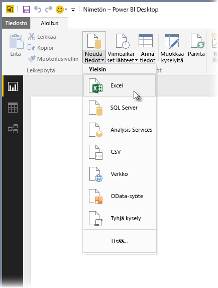

Aloita valitsemalla **Excel**, siirtymällä työkirjaan sijaintiin ja valitsemalla työkirja. Kysely tarkistaa työkirjan ja näyttää löytämänsä tiedot **Siirtymistoiminto**-ikkunassa.

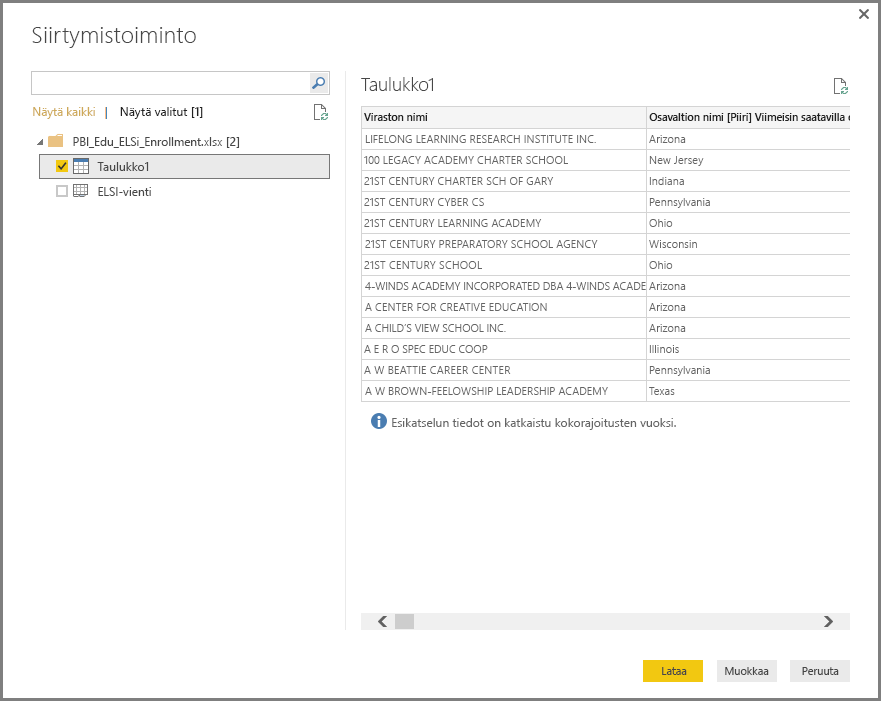

Valitsemalla **Muokkaa** voit muokata tietoja ennen niiden lataamista Power BI Desktopiin. Voit myös *muotoilla* tietoja ennen niiden lataamista. Kyselyn muokkaaminen ennen lataamista on erityisen hyödyllistä, kun käytät suuria tietojoukkoja, joita aiot rajata ennen lataamista. Haluamme tehdä näin, joten valitse **Muokkaa**.

Erityyppisiin tietoihin yhdistäminen on aivan yhtä helppoa. Haluamme muodostaa yhteyden myös verkkoresurssiin. Valitse **Nouda tiedot \> Lisää...** ja sitten **Muu \> Verkko**.

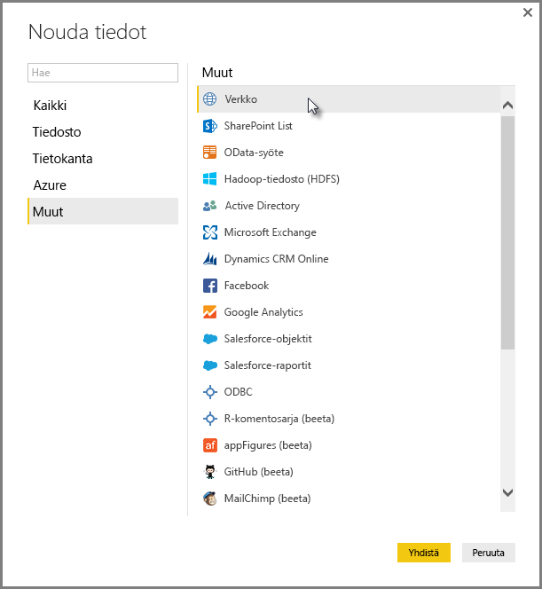

Kun **Verkosta**-ikkuna avautuu, voit kirjoittaa siihen verkkosivun URL-osoitteen.

Valitse **OK**. Kuten aiemminkin, Power BI Desktop tarkistaa työkirjan ja näyttää löytämänsä tiedot **Siirtymistoiminto**-ikkunassa.

Muut tietoyhteydet ovat samankaltaisia. Jos tietoyhteyden muodostaminen edellyttää todennusta, Power BI Desktop pyytää sinulta soveltuvia tunnistetietoja.

Jos haluat vaiheittaiset ohjeet tietoihin yhdistämiseen Power BI Desktopissa, lue ohjeartikkeli [Tietoihin yhdistäminen Power BI Desktopissa](https://docs.microsoft.com/power-bi/desktop-connect-to-data).

## Tietojen muotoileminen ja yhdistäminen
Kyselyeditorilla voit muotoilla ja yhdistää tietoja helposti. Tämä osio sisältää muutamia esimerkkejä tietojen muotoilemisesta. Jos haluat kattavamman esittelyn tietojen muotoilemisesta ja yhdistämisestä, lue ohjeartikkeli **[Tietojen muotoileminen ja yhdistäminen Power BI Desktopissa](https://docs.microsoft.com/power-bi/desktop-shape-and-combine-data)**.

Edellisessä osiossa yhdistimme kaksi tietojoukkoa: Excel-työkirjan ja verkkoresurssin. Kun ne on ladattu kyselyeditoriin, näemme alla olevassa kuvassa näkyvät tiedot ja verkkosivun kyselyn valittuna (se on valittu kyselyeditorin vasemman puolen **Kyselyt**-ruudussa käytettävissä olevien kyselyiden luettelosta).

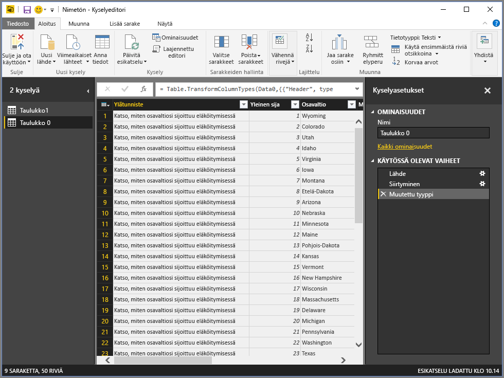

Kun muotoilet tietoja, muokkaat tietolähdettä haluamaasi muotoon ja muotoiluun. Tässä tapauksessa emme tarvitse ensimmäistä saraketta, jonka nimi on *Header*, joten poistamme sen.

**Kyselyeditorissa** monet komennot löytyvät sekä valintanauhasta että hiiren kakkospainikkeen tilannekohtaisesta pikavalikosta. Kun esimerkiksi napsautat *Header*-saraketta hiiren kakkospainikkeella, näyttöön avautuu valikko, jossa voit poistaa sarakkeen. Voit myös valita sarakkeen ja napsauttaa sitten valintanauhan **Poista sarakkeet** -painiketta.

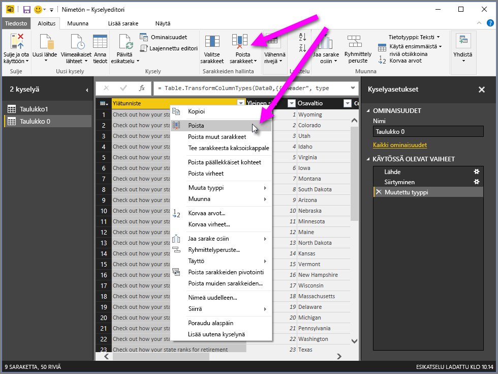

Voit muokata tämän kyselyn tietoja monin eri tavoin: voit esimerkiksi poistaa haluamasi määrän rivejä ylhäältä tai alhaalta, voit lisätä ja jakaa sarakkeita, korvata arvoja ja tehdä muita muotoilutietoja, jotta kyselyeditori saa tiedot haluamassa muodossa.

## Rivien ryhmitteleminen
Kyselyeditorissa voi ryhmitellä arvoja useilta riveiltä yhdeksi arvoksi. Tästä on hyötyä esimerkiksi silloin, jos olet tekemässä yhteenvetoa tarjotuista tuotteista, kokonaismyynnistä tai opiskelijoiden määrästä.

Tässä esimerkissä ryhmittelemme rivejä oppilaitoksen rekisteröitymistietojoukosta. Tiedot ovat peräisin Excel-työkirjasta ja niitä on muotoiltu kyselyeditorilla siten, että saamme käyttöömme vain tarvitsemamme sarakkeet. Lisäksi taulukko on nimetty uudelleen ja sille on tehty muutamia muitakin muokkauksia.

Tarkistetaan, kuinka monta virastoa (tämä käsittää koulupiirit ja muut opetusvirastot, esimerkiksi alueelliset opetusvirastot jne.) kullakin osavaltiolla on. Valitse *State Abbr* -sarake ja napsauta sitten valintanauhan **Aloitus**- tai **Muunna**-sarakkeen **Ryhmittelyperuste**-painiketta (**Ryhmittelyperuste**-painike löytyy molemmista välilehdistä).

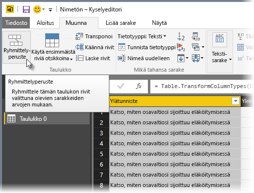

**Ryhmittelyperuste...**-ikkuna avautuu näyttöön. Kun kyselyeditori ryhmittelee rivejä, se luo uuden sarakkeen, jonka se lisää **Ryhmittelyperuste**-tuloksiin. Voit muokata **Ryhmittelyperuste**-toimintoa seuraavin tavoin:

1. *Ryhmittelyperuste*: Tämä on ryhmiteltävä sarake. Kyselyeditori valitsee valitun sarakkeen, mutta voit vaihtaa sitä tässä ikkunassa (voit valita minkä tahansa taulukon sarakkeen).
2. *Uuden sarakkeen nimi:* Kyselyeditori ehdottaa uudelle sarakkeelle nimeä sen perusteella, minkä toiminnon se suorittaa ryhmiteltävälle sarakkeelle. Voit kuitenkin antaa sarakkeelle minkä tahansa haluamasi nimen.
3. *Toiminto*: tässä määrität kyselyeditorin suorittaman toiminnon.
4. *Lisää ryhmittely* ja *Lisää kooste*: Nämä toiminnot näytetään, kun valitset **Lisäasetukset**. Voit suorittaa ryhmittelytoimintoja (**Ryhmittelyperuste**-toimintoja) useille sarakkeille ja suorittaa useita koostetoimintoja **Ryhmittelyperuste**-ikkunassa yhdellä toiminnolla. Kyselyeditori luo uuden sarakkeen (ikkunassa tekemiesi valintojen mukaisesti), joka hyödyntää tietoja useista sarakkeista. 

Jos haluat lisätä **Ryhmittelyperuste**-toimintoon lisää ryhmittelyitä tai koosteita, napsauta **Lisää ryhmittely**- tai **Lisää kooste** -painiketta. Voit poistaa ryhmittelyn tai koosteen napsauttamalla **...**-kuvaketta ja valitsemalla **Poista**. Kokeile tätä ja katso, miltä tulokset näyttävät.
   
   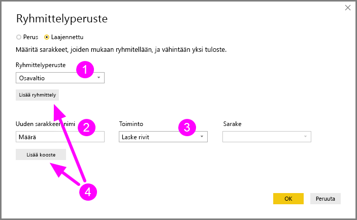

Kun valitset **OK**, kysely suorittaa **Ryhmittelyperuste**-toiminnon ja palauttaa tulokset. Oho, katsopa tätä! Ohiossa, Teksasissa, Illinoisissa ja Kaliforniassa on nyt yli tuhat virastoa.

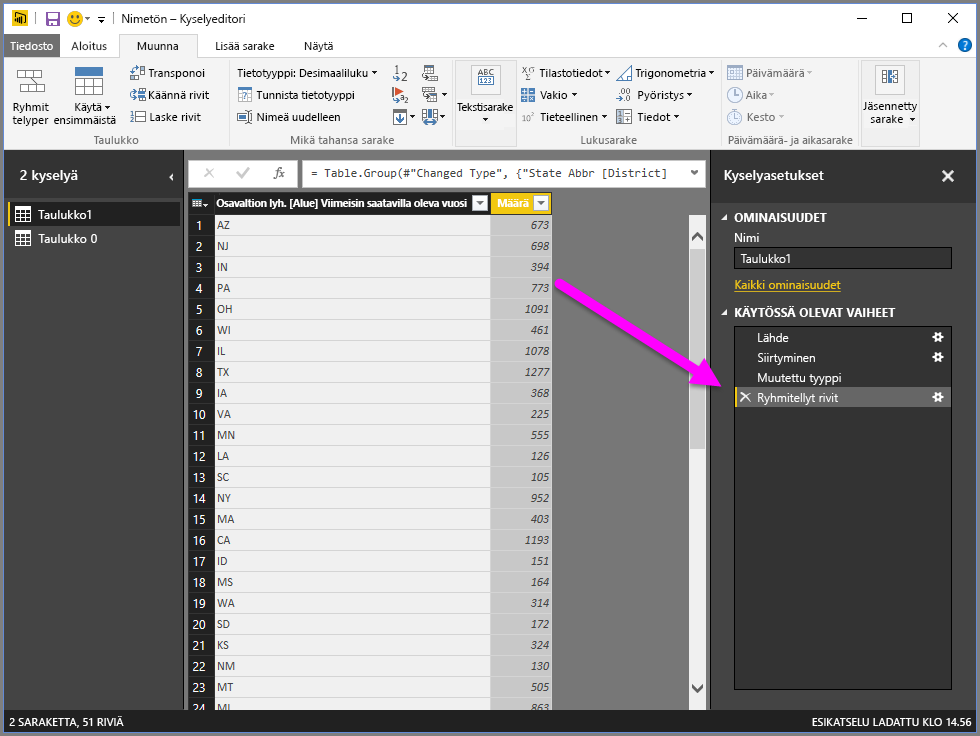

Kyselyeditorilla voit aina poistaa edellisen muotoilutoiminnon napsauttamalla juuri suorittamasi vaiheen vieressä olevaa **X**-kohtaa. Kokeile rohkeasti. Jos et pidä tuloksista, tee vaihe uudelleen, kunnes kyselyeditori muotoilee tiedot haluamallasi tavalla.

## Sarakkeiden pivotointi
Power BI Desktopissa voit pivotoida sarakkeita ja luoda taulukon, joka sisältää koostearvon, joka ilmaisee yksilöllisten arvojen määrää. Jos haluat esimerkiksi tietää, kuinka monta tuotetta sinulla on kussakin tuoteluokassa, voit luoda nopeasti taulukon, jolla saat tämän selville.

Tarkastellaan esimerkkiä. Seuraavaa **Products**-taulukkoa on muotoiltu siten, että se näyttää vain jokaisen yksilöllisen tuotteen (nimellä) ja sen, mihin tuoteluokkaan se kuuluu. Voit luoda uuden taulukon, joka näyttää kunkin luokan tuotteiden määrän (*CategoryName*-sarakkeen perusteella), valitsemalla sarakkeen ja valitsemalla sitten valintanauhan **Muunna**-välilehdestä **Pivot-sarake**.

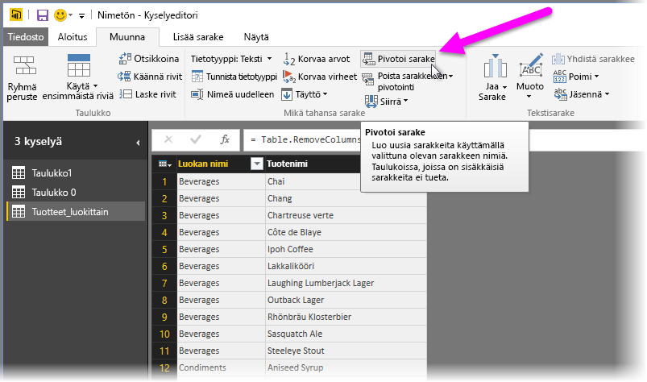

Näyttöön avautuu **Pivot-sarake**-ikkuna, josta näet mitä sarakkeen arvoja käytetään uusien sarakkeiden luomiseen (1). Kun laajennat **lisäasetukset** (2), voit valita, mikä toiminto suoritetaan koostearvoille (3).

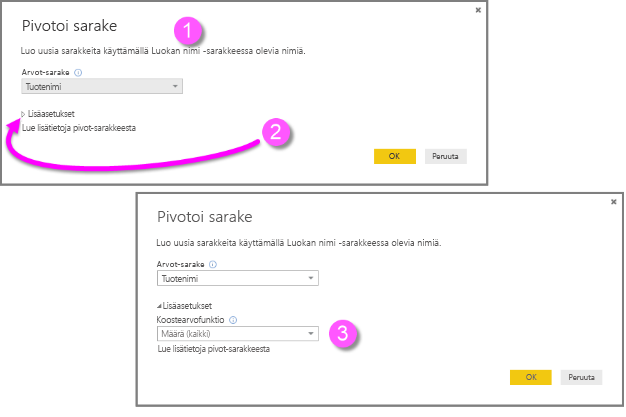

Kun valitset **OK**, kysely näyttää taulukon **Pivot-sarake**-ikkunassa annettujen muunto-ohjeiden mukaisesti.

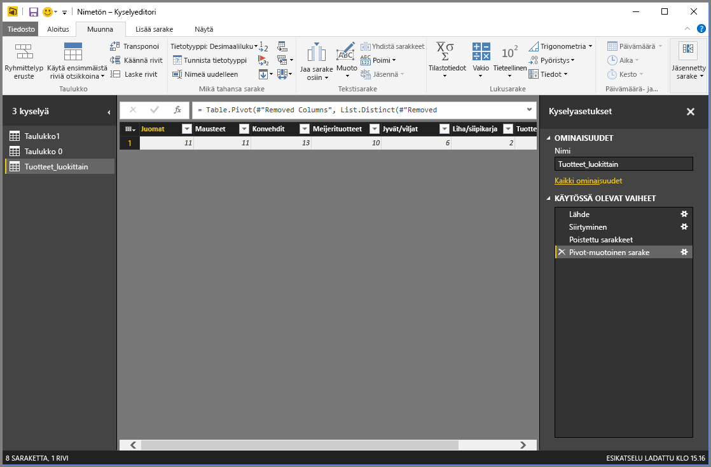

## Mukautettujen sarakkeiden luominen
Kyselyeditorilla voit luoda mukautettuja kaavoja, jotka suoritetaan taulukkosi useille sarakkeille, ja lisätä sitten näiden kaavojen tulokset uuteen (mukautettuun) sarakkeeseen. Kyselyeditorilla voit luoda mukautettuja sarakkeita helposti.

Valitse kyselyeditorin valintanauhan **Lisää sarake** -välilehdestä **Mukautettu sarake**.

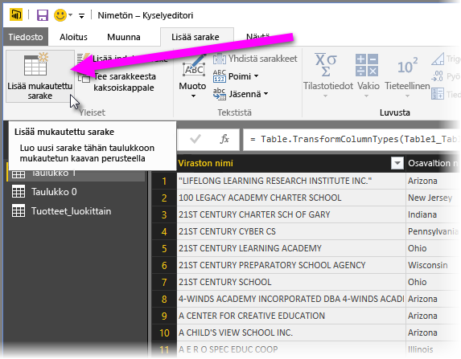

Näyttöön avautuu seuraava ikkuna. Seuraavassa esimerkissä luomme mukautetun sarakkeen nimeltä *Percent ELL*, joka laskee kuinka monen (tämä ilmaistaan prosenttiosuutena) opiskelijan äidinkieli on jokin muu kuin englanti.

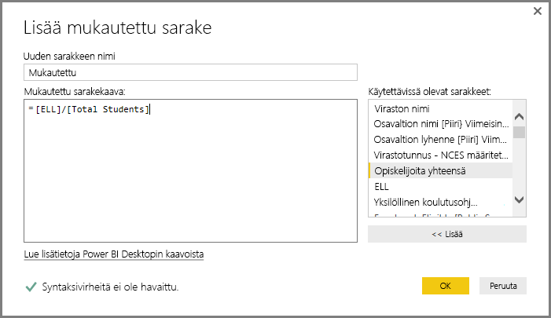

Jos uusi mukautettu sarake ei tarjoa haluamiasi tietoja, voit poistaa sen – kuten minkä tahansa muunkin kyselyeditorissa käytetyn vaiheen – **Kyselyasetukset**-ruudun **Käytössä olevat vaiheet** -osiosta napsauttamalla **Lisätty mukautettu** -kohdan vieressä olevaa **X**-kohtaa.

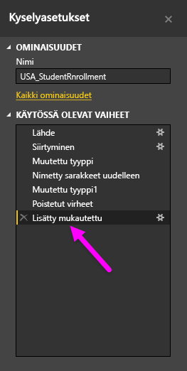

## Kyselykaavat
Voit muokata kyselyeditorin luomia vaiheita ja voit luoda mukautettuja kaavoja, joilla voit hallita tarkemmin tietoihin yhdistämistä ja niiden muotoilua. Aina kun kyselyeditori suorittaa toiminnon tiedoille, toimintoon liittyvä kaava näytetään **kaavarivillä**. Saat **kaavarivin** näkyviin valitsemalla valintanauhan **Näytä**-välilehden **Kaavarivi**-valintaruudun.

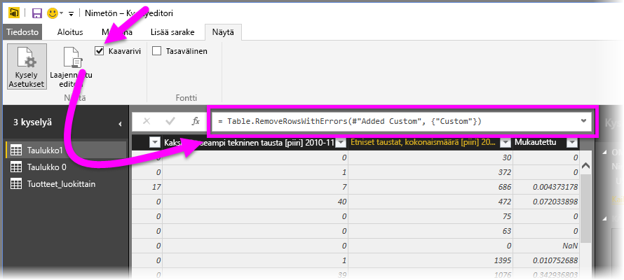

Kyselyeditori säilyttää jokaisen kyselyn kaikki käytetyt vaiheet tekstinä, jota voit tarkastella ja muokata. Voit tarkastella ja muokata minkä tahansa kyselyn tekstiä **laajennetulla editorilla**, jonka saat näkyviin valitsemalla valintanauhan **Näytä**-välilehdessä **Laajennettu editori**.

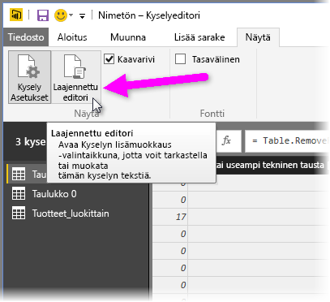

Tässä on näkymä **laajennetusta editorista**: näet siinä **USA\_StudentEnrollment**-kyselyn vaiheet. Nämä vaiheet on luotu Power Query Formula Language -kielellä, jota kutsutaan usein myös **M**-kieleksi. Saat lisätietoja ohjeartikkelista [Lisätietoja Power Query -kaavoista](https://support.office.com/article/Learn-about-Power-Query-formulas-6bc50988-022b-4799-a709-f8aafdee2b2f). Jos haluat tutustua varsinaisen kielen tietoihin, lue ohjeartikkeli [Excelin Microsoft Power Query -kaavakielestä](http://go.microsoft.com/fwlink/?linkid=320633).

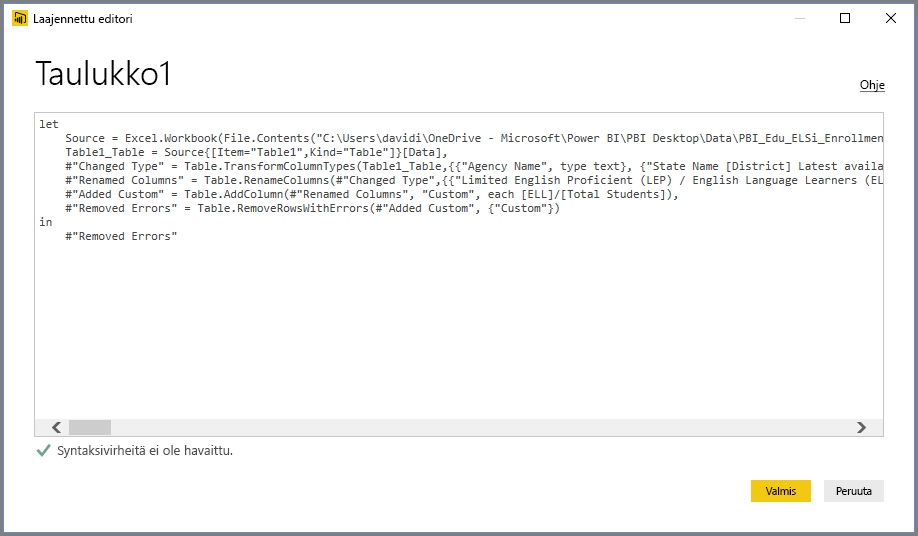

Power BI Desktop tarjoaa laajan valikoiman kaavaluokkia. Saat lisätietoja ja kattavan luettelon kaikista kyselyeditorin kaavoista [Power Query -kaavaluokkien](https://support.office.com/article/Power-Query-formula-categories-125024ec-873c-47b9-bdfd-b437f8716819) ohjeartikkeleista.

Kyselyeditorin kaavaluokat ovat seuraavat:

* Luku
  * Vakiot
  * Tiedot
  * Muunto ja muotoilu
  * Muotoilu
  * Pyöristys
  * Toiminnot
  * Satunnainen
  * Trigonometria
  * Tavut
* Teksti
  * Tiedot
  * Tekstivertailut
  * Poiminta
  * Muokkaus
  * Jäsenyys
  * Muunnokset
* Looginen
* Päivämäärä
* Aika
* Päivämäärä ja aika
* Päivämäärä, aika ja aikavyöhyke
* Kesto
* Tietue
  * Tiedot
  * Muunnokset
  * Valinta
  * Sarjoitus
* Luettelo
  * Tiedot
  * Valinta
  * Muunnos
  * Jäsenyys
  * Joukkotoiminnot
  * Järjestäminen
  * Keskiarvot
  * Yhteenlasku
  * Numeeriset
  * Generaattorit
* Taulukko
  * Taulukon luominen
  * Muunnokset
  * Tiedot
  * Rivitoiminnot
  * Saraketoiminnot
  * Jäsenyys
* Arvot
* Aritmeettiset toiminnot
* Parametrityypit
* Metatiedot
* Tietojen käyttö
* URI
* Binaarimuodot
  * Lukujen lukeminen
* Binaari
* Viivat
* Lauseke
* Funktio
* Virhe
* Vertailutoiminto
* Jakotoiminto
* Yhdistämistoiminto
* Korvaustoiminto
* Tyyppi.

## Seuraavat vaiheet
Voit tehdä kaikenlaista Power BI Desktopilla. Saat lisätietoja sen toiminnoista seuraavista resursseista:

* [Mikä on Power BI Desktop?](desktop-what-is-desktop.md)
* [Power BI Desktopin kyselyiden yleiskatsaus](desktop-query-overview.md)
* [Power BI Desktopin tietolähteet](desktop-data-sources.md)
* [Tietoihin yhdistäminen Power BI Desktopissa](desktop-connect-to-data.md)
* [Tietojen muotoilu ja yhdistäminen Power BI Desktopissa](desktop-shape-and-combine-data.md)

