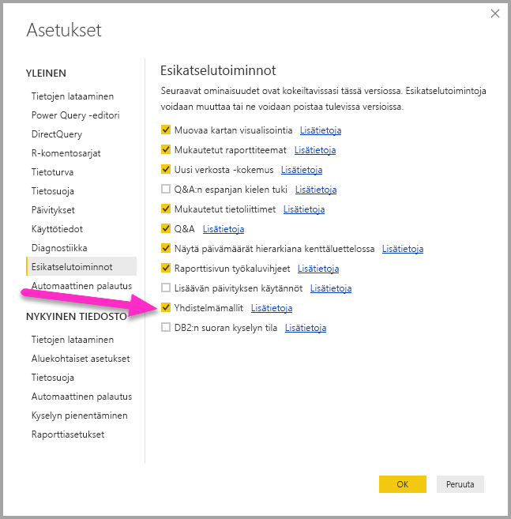
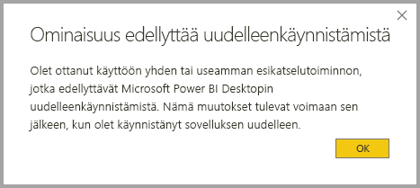

# Yhdistelmämallit Power BI Desktopissa (esikatselu)

Kun aiemmin **Power BI Desktopissa** käytit DirectQuerya raportissa, muita tietoyhteyksiä – DirectQuery tai tuonti – ei sallittu tälle raportille. **Yhdistelmämallien** ansiosta tämä rajoitus on poistettu. Raporttiin voi saumattomasti sisällyttää tietoyhteyksiä useasta DirectQuerysta tai tietojen tuontiyhteydestä valitsemanasi yhdistelmänä.

**Power BI Desktopin** **yhdistelmämallit** koostuvat kolmesta toisiinsa liittyvästä ominaisuudesta:

* **Yhdistelmämallit** – antavat mahdollisuuden sisällyttää raporttiin useita tietoyhteyksiä, kuten DirectQuery-yhteydet tai tuonnin, minä tahansa yhdistelminä.
* **Monta moneen -yhteydet** – yhdessä **yhdistelmämallien** kanssa voit muodostaa **monta moneen -yhteyksiä** taulukoiden välille ilman tarvetta yksilöllisille arvoille taulukoissa. Tämä poistaa tarpeen aiemmille kiertotavoille, kuten uusien taulukoiden lisäämiselle vain yhteyksien muodostamisen takia. 
* **Tallennustilan tila** – voit nyt määrittää, mitkä visualisoinnit edellyttävät kyselyä taustatietolähteisiin. Ne visualisoinnit, jotka eivät sitä tarvitse, tuodaan DirectQuery-kyselyyn pohjautumisesta huolimatta. Se parantaa suorituskykyä ja vähentää taustajärjestelmien kuormitusta. Aiemmin jopa osittajien kaltaiset yksinkertaiset visualisoinnit käynnistivät kyselyjä taustalähteisiin. 

Nämä kolme toisiinsa liittyvää **yhdistelmämallien** ominaisuutta on kukin kuvattu omissa artikkeleissaan:

* **Yhdistelmämallit** on kuvattu tässä artikkelissa.
* **Monta moneen -yhteydet** on kuvattu [Monta moneen -yhteydet Power BI Desktopissa (esikatselu)](desktop-many-to-many-relationships.md) -artikkelissa.
* **Tallennustilan tila** on kuvattu omassa [Tallennustilan tila Power BI Desktopissa (esikatselu)](desktop-storage-mode.md) -artikkelissaan.

## Yhdistelmämallien esikatselutoiminnon käyttöönotto

**Yhdistelmämallit**-ominaisuus on esikatseluvaiheessa. Sen täytyy olla käytössä **Power BI Desktopissa**. Ota **yhdistelmämallit** käyttöön valitsemalla **Tiedosto > Asetukset ja vaihtoehdot > Asetukset > Esiversio-ominaisuudet**. Valitse sitten **Yhdistelmämallit**-valintaruutu. 

Ominaisuuden käyttöönotto edellyttää **Power BI Desktopin** käynnistämistä uudelleen.

## Yhdistelmämallien käyttäminen

**Yhdistelmämalleilla** voit muodostaa yhteyksiä kaikenlaisiin tietolähteisiin, kun käytät **Power BI Desktopia** tai **Power BI -palvelua**. Lisäksi voit muodostaa näitä yhteyksiä eri tavoin. Voit tuoda tietoja Power BI:hin, mikä on yleisin tapa hakea tietoja, tai voit muodostaa yhteyden tietoihin suoraan niiden alkuperäisessä lähdesäilössä DirectQuerya käyttämällä. Lisätietoja DirectQuerysta on artikkelissa [DirectQueryn käyttäminen Power BI:ssä](desktop-directquery-about.md).

DirectQuerya käytettäessä **yhdistelmämalleilla** on mahdollista luoda Power BI -malli (kuten Power BI Desktopin yksittäinen .pbix-tiedosto), joka toimii seuraavasti:

* yhdistää tietoja yhdestä tai useammasta DirectQuery-lähteestä ja/tai
* yhdistää tietoja DirectQuery-lähteistä ja tuo tietoja.

**Yhdistelmämalleilla** on mahdollista luoda esimerkiksi malli, joka yhdistää myyntitiedot yrityksen tietovarastosta myyntitavoitteiden tietoihin, jotka sijaitsevat osastokohtaisessa SQL Server -tietokannassa. Mukaan voi lisätä myös laskentataulukosta tuotuja tietoja. Sellaista mallia, johon yhdistetään useamman kuin yhden DirectQuery-lähteen tietoja ja tuotuja tietoja, kutsutaan *yhdistelmämalliksi*.

> [!NOTE]
> Koska yhdistelmämallit ovat vasta esikatselutilassa, niitä ei ole mahdollista julkaista Power BI -palveluun. 

Voit luoda yhteyksiä taulukoiden välille niin kuin ennenkin, vaikka taulukot olisivat peräisin eri lähteistä. Tätä koskee kuitenkin rajoitus: sellaiset ristilähdeyhteyksien kardinaliteetiksi on määritettävä **monta moneen** niiden todellisesta kardinaliteetitista riippumatta. Tällaiset yhteydet toimivat samoin kuin tavalliset **monta moneen** -yhteydet, jotka on kuvattu artikkelissa [Monta moneen -yhteydet Power BI Desktopissa (esikatselu)](desktop-many-to-many-relationships.md). Huomaa, että yhdistelmämallien kontekstissa kaikki tuodut taulukot ovat käytännössä yksittäinen tietolähde riippumatta taustalla olevista tietolähteistä, joista ne tosiasiassa on tuotu.   

## Yhdistelmämallien käyttöesimerkki

Esimerkkinä **yhdistelmämallista** voidaan ajatella raporttia, joka on yhdistetty yrityksen tietovarastoon (Microsoft SQL Serverissä) käyttämällä DirectQuerya. Tietovarasto sisältää tiedot *Maakohtainen myynti*, *Kvartaali* ja *Pyörä (tuote)* seuraavassa kuvassa esitetyllä tavalla.

Tässä vaiheessa voit luoda yksinkertaisia visualisointeja, jotka käyttävät tästä lähteestä peräisin olevia kenttiä. Esimerkiksi seuraava visualisointi näyttää myynnin kokonaismäärän *Tuotenimi*-tiedon mukaan valitussa kvartaalissa. 

Entä jos sinulla olisi tietoja tuotteista vastaavista tuotepäälliköistä ja markkinoinnin prioriteeteista, mutta näitä tietoja säilytetään Excel-taulukoissa? Silloin sinua voisi kiinnostaa tieto *myyntimääristä* *tuotepäälliköittäin*. Näiden paikallisten tietojen lisääminen yrityksen tietovarastoon olisi kuitenkin mahdotonta tai siihen menisi vähintään kuukausia. Saattaisi olla mahdollista tuoda myyntitietoja tietovarastosta (DirectQueryn käyttämisen sijaan), jolloin ne voisi yhdistää laskentataulukosta tuotuihin tietoihin. Tämä lähestymistapa ei kuitenkaan ole mielekäs juuri niistä syistä, jotka alun perinkin johtivat DirectQueryn käyttämiseen: pohjana olevan tietolähteen tietoturvakäytännöt, tarve käyttää uusimpia tietoja ja tietojen silkka mittakaava. 

**Yhdistelmämallit** ratkaisevat tämän ongelman. Yhdistelmämallit antavat mahdollisuuden muodostaa yhteyden tietovarastoon käyttämällä DirectQuerya ja noutaa samalla tietoa muista lähteistä. Tässä tapauksessa muodostetaan ensin DirectQuery-yhteys yrityksen tietovarastoon, käytetään GetData-menetelmää ja valitaan Excel. Seuraavaksi siirrytään paikalliset tiedot sisältävään laskentataulukkoon ja tuodaan taulukko, joka sisältää *Tuotenimet*-, *Tuotepäälliköt*- ja *Prioriteetti*-tiedot.  

Nyt näemme **Kentät**-luettelossa alkuperäisen *Pyörä*-taulukon (Microsoft SQL Serveristä) sekä uuden *Tuotepäälliköt*-taulukon (Excelistä tuodut tiedot). 

**Power BI Desktopin** **suhdenäkymässä** voimme vastaavasti nähdä lisätaulukon nimeltä *Tuotepäälliköt*. 

Nämä taulukot on nyt yhdistettävä mallin muihin taulukoihin. Se tapahtuu tavalliseen tapaan eli muodostamalla yhteyden *Pyörä*-taulukon (Microsoft SQL Serverissä) ja *Tuotepäälliköt*-taulukon (tuotu) välille. Samoin yhteys muodostetaan *Pyörä [tuotenimi]*- ja *Tuotepäälliköt [tuotenimi]* -taulukoiden välille. Kuten aiemmin tässä artikkelissa kuvattiin, ristilähdeyhteyksien kardinaliteetin on olevat **monta moneen**. Se on myös oletusarvoisesti valittu kardinaliteetti. 

Kun tämä yhteys on luotu, se näkyy **Power BI Desktopin** **suhdenäkymässä**.

Taulukkoyhteyksien muodostamisen jälkeen voimme luoda visualisointeja käyttämällä mitä tahansa kenttiä **Kentät**-luettelosta, jolloin voimme saumattomasti yhdistää tietoja useista lähteistä. Esimerkiksi alla oleva visualisointi näyttää yhteenlasketun *myyntimäärän* kullekin *tuotepäällikölle*. 

Tässä esimerkissä näytetään yleinen tapaus, jossa *dimensiotaulukkoa* (kuten *Tuote* tai *Asiakas*) laajennetaan muualta tuoduilla ylimääräisillä tiedoilla. Taulukot voivat myös käyttää DirectQuerya eri lähteisiin yhdistämisessä. Oletetaan esimerkkitaulukon laajentamiseksi, että *maa*- ja *kausikohtaiset* *myyntitavoitteet* tallennetaan erilliseen osastokohtaiseen tietokantaan. Voit muodostaa yhteyden näihin tietoihin **GetDataa** käyttämällä normaaliin tapaan seuraavassa kuvassa esitetyllä tavalla. 

Voimme aiemmin näytetyllä tavalla luoda yhteydet uuden taulukon ja mallin muiden taulukoiden välille sekä luoda visualisointeja, jotka yhdistävät nämä tiedot. **Suhdenäkymässä** näemme uudet muodostetut yhteydet laajennetussa esimerkkiskenaariossa.

Seuraava kuva perustuu uusiin tietoihin ja juuri luomiimme yhteyksiin. Visualisoinnin vasemmassa yläkulmassa näkyy yhteenlaskettu *myyntimäärä* verrattuna *tavoitteeseen* sekä eron näyttävä varianssilaskelma. *Myyntimäärä*- ja *Tavoite*-tiedot ovat peräisin kahdesta eri SQL Server -tietokannasta. 

## Tallennustilan tilan asettaminen

Jokaisella **yhdistelmämallin** taulukolla on **tallennustilan tila**, joka ilmaisee, onko taulukko DirectQuery- vai tuontipohjainen. **Tallennustilan tilaa** voi tarkastella ja muokata **Ominaisuus**-ruudussa. Valitsemalla **Ominaisuudet** hiiren kakkospainikkeella avautuvasta **Kentät**-luettelon pikavalikosta. Seuraavassa kuvassa näet **tallennustilan tilan** (ruudun kapeuden takia lyhennettynä muotoon **Tallennustila...** ).

**Tallennustilan tilan** voi nähdä myös kunkin taulukon työkaluvihjeessä.

Kaikille **Power BI Desktop** -tiedostoille (.pbix-tiedostoille), jotka sisältävät joitakin DirectQuery-taulukoita ja joitakin tuotuja taulukoita, tilarivin ilmaisema **tallennustilan tila** on **Yhdistelmä**. Voit napsauttaa kyseistä termiä tilarivillä ja vaihtaa kaikki taulukot tuontitaulukoiksi.

**Tallennustilan tila** on kuvattu kokonaisuudessaan [Tallennustilan tila Power BI Desktopissa (esikatselu)](desktop-storage-mode.md) -artikkelissa.  

## Lasketut taulukot

Laskettuja taulukoita voi lisätä malliin, joka käyttää DirectQuerya. Lasketun taulukon määrittävä DAX voi viitata joko tuotuihin tai DirectQuery-taulukoihin tai molempien yhdistelmään. 

Lasketut taulukot ovat aina tuotuja, ja näiden taulukoiden tiedot päivitetään, kun taulukko päivitetään. Jos laskettu taulukko viittaa DirectQuery-taulukkoon, DirectQuery-taulukkoon viittaava visualisointi näyttää aina pohjana olevan tietolähteen uusimmat arvot. Laskettuun taulukkoon viittaavat visualisoinnit näyttävät kuitenkin arvot sillä hetkellä, kun laskettu taulukko viimeksi päivitettiin.

## Vaikutukset tietoturvaan 

Yhdistelmämalleilla on tiettyjä vaikutuksia tietoturvaan. Yhteen tietolähteeseen lähetetty kysely voi sisältää arvoja, jotka on noudettu toisesta lähteestä. Aiemmin tässä artikkelissa kuvattiin esimerkki, jossa visualisointi näyttää *myyntimäärän* *tuotepäälliköittäin*. Sen tuloksena lähetetään SQL-kysely **Myynti**-relaatiotietokantaan, jolloin kyseinen SQL-kysely saattaa sisältää *tuotepäälliköiden* ja heihin liittyvien *tuotteiden* nimiä. 

Tämän vuoksi laskentataulukkoon tallennettuja tietoja sisältyy nyt kyselyyn, joka lähetetään relaatiotietokantaan. Jos nämä tiedot ovat luottamuksellisia, asiaa on pohdittava tietoturvan kannalta. Erityisesti sinun kannattaa harkita seuraavia vaikutuksia:

* Jokainen tietokannan järjestelmänvalvoja, joka voi nähdä jäljitys- tai valvontalokeja, voi nähdä näitä tietoja, vaikka hänellä ei olisi oikeuksia tietoihin niiden alkuperäisessä lähteessä eli tässä tapauksessa Excel-tiedostossa.

* Kunkin lähteen salausasetukset on tarkistettava, jotta vältytään tilanteelta, jossa yhdestä lähteestä noudetaan tietoja salatulla yhteydellä, mutta tiedot sisällytetään vahingossa kyselyyn, joka lähetetään toiseen lähteeseen salaamattomalla yhteydellä. 

**Power BI Desktop** näyttää varoitussanoman, joka kehottaa tarkistamaan yhdistelmämallin luomisen tietoturvalle aiheutuvat vaikutukset.  

Vastaavista syistä varovaisuuteen on aihetta, kun avataan epäluotettavasta lähteestä lähetettyjä **Power BI Desktop** -tiedostoja. Jos tiedosto sisältää yhdistelmämalleja, yhdestä tietolähteestä noudettuja tietoja (käyttämällä tiedoston avaavan käyttäjän tunnistetietoja) lähetetään toiseen tietolähteeseen osana kyselyä. Toisessa lähteessä tiedot voivat joutua Power BI Desktop -tiedoston – mahdollisesti pahoissa aikeissa toimivan – luojan käsiin. Näin ollen näet varoituksen, kun useita lähteitä sisältävä Power BI Desktop -tiedosto avataan ensimmäistä kertaa. Tämä varoitus on samanlainen kuin se, jonka näet avatessasi alkuperäisiä SQL-kyselyitä sisältävän tiedoston.  

## Vaikutukset suorituskykyyn  

DirectQuerya käytettäessä suorituskyky on aina otettava huomioon ensisijassa sen varmistamiseksi, että taustalähteellä on riittävästi resursseja hyvän käyttökokemuksen tarjoamiseen. Hyvällä käyttökokemuksella tarkoitetaan, että visualisointien päivittämiseen kuluu korkeintaan viisi sekuntia. Kannattaa myös noudattaa suorituskykyä koskevia neuvoja artikkelissa [DirectQueryn käyttäminen Power BI:ssä](desktop-directquery-about.md). Yhdistelmämallien käyttäminen lisää suorituskykyyn kohdistuvia vaatimuksia, koska yksittäinen visualisointi voi aiheuttaa kyselyjen lähettämisen useisiin lähteisiin ja yhden kyselyn tulokset välitetään usein toiseen lähteeseen. Tällainen tilanne voi tuottaa seuraavia suorituksia:

* **SQL-kysely, joka sisältää suuren määrän literaaliarvoja** – visualisointi voi esimerkiksi pyytää *kokonaismyyntimäärää* (SQL-tietokannasta) joukolle valittuja *tuotepäälliköitä* (laskentataulukosta tuodusta yhdistetystä taulukosta). Silloin on ensin selvitettävä, mistä *tuotteista* nämä tuotepäälliköt vastasivat, ennen kuin lähetetään SQL-kysely, joka sisältää kaikki tuotetunnukset *WHERE*-lauseessa.

* **SQL-kysely, joka suorittaa kyselyjä matalan tason askelvälillä ja kostaa tiedot paikallisesti** – edellistä esimerkkiä jatkaen *tuotepäällikköjen* mukaan suodatettujen *tuotteiden* määrä kasvaa erittäin suureksi, joten tietyssä vaiheessa niiden kaikkien sisällyttämisestä *WHERE*-lauseeseen tulee tehotonta tai mahdotonta. Sen sijaan on tarpeen suorittaa kysely relaatiolähteeseen *tuotteen* alemmalla tasolla ja koostaa tulokset paikallisesti. Jos *Tuotteet*-taulukon kardinaliteetti ylittää miljoonan rajoituksen, kysely epäonnistuu.

* **Useita SQL kyselyjä, yksi per ryhmä arvon mukaan** – kun koostaminen käyttää **DistinctCount**-arvoa toisen lähteen jonkin sarakkeen ryhmittelemänä ja jos ulkoinen lähde ei tue ryhmittelyn määrittävien useiden literaaliarvojen tehokasta välittämistä, on lähetettävä yksi SQL-kysely per ryhmä arvon mukaan. Visualisointi voi esimerkiksi pyytää erillistä *Asiakastilinumero*-määrää (SQL Server -taulukosta) *tuotepäällikköjen* mukaan (laskentataulukosta tuodusta yhdistetystä taulukosta). Silloin visualisoinnin on välitettävä *Tuotepäälliköt*-taulukon tiedot SQL Serveriin lähetettävässä kyselyssä. Esimerkiksi Redshiftin kaltaisissa muissa lähteissä tämä ei olisi mahdollista. Sen sijaan lähetettäisiin yksi SQL-kysely per *myyntipäällikkö* johonkin käytännölliseen rajaan asti, jonka ylittämisen jälkeen kysely epäonnistuu. 

Jokaisella näistä tapauksista on suorituskykyyn omat vaikutuksensa, joiden yksityiskohdat vaihtelevat tietolähteittäin. Hyvä peruslähtökohta on se, että jos kahden lähteen yhdistämiseen käyttävien sarakkeiden kardinaliteetti säilyy alhaisena (muutamassa tuhannessa), suorituskyvyn ei pitäisi heiketä merkittävästi. Kardinaliteetin kasvaessa suorituskyvyn ylläpitämiseen on kiinnitettävä enemmän huomiota. 

Lisäksi **monta moneen** -yhteyksien käyttäminen tarkoittaa, että jokaista summan tai välisumman tasoa varten on lähetettävä erilliset kyselyt pohjana olevaan tietolähteeseen – sen sijaan, että yksityiskohtaiset arvot koostettaisiin paikallisesti. Sellaisenaan kokonaisarvoja sisältävä yksinkertainen taulukkovisualisointi lähettäisi yhden sijaan kaksi SQL-kyselyä. 

## Rajoitukset ja huomioitavat asiat

Tämän version **yhdistelmämalleissa** on muutamia rajoituksia.

Seuraavia monidimensioisia lähteitä ei voi käyttää **yhdistelmämallien** kanssa:

* SAP HANA
* SAP Business Warehouse
* SQL Server Analysis Services
* Power BI -tietojoukot

Kun muodostetaan yhteyttä näihin monidimensioisiin lähteisiin DirectQuerylla, et voi muodostaa yhteyttä myös toiseen DirectQuery-lähteeseen tai yhdistää tuotuihin tietoihin.

DirectQueryn olemassa olevat käyttörajoitukset koskevat edelleen **yhdistelmämallien** käyttämistä. Monet näistä rajoituksista ovat nyt taulukkokohtaisia ja riippuvat taulukon **tallennustilan tilasta**. Esimerkiksi tuodun taulukon laskettu sarake voi viitata muihin taulukoihin, mutta DirectQuery-taulukon laskettu sarake on yhä rajoitettu viittaamaan vain saman taulukon sarakkeisiin. Muut rajoitukset koskevat vain mallia kokonaisuutena, jos jokin mallin taulukoista on DirectQuery-taulukko. Esimerkiksi **Nopeat merkitykselliset tiedot**- ja **Q & A** -ominaisuudet eivät ole käytettävissä mallissa, jos jollakin sen taulukoista **tallennustilan tilana** on DirectQuery. 

## Seuraavat vaiheet

Seuraavissa artikkeleissa kerrotaan lisää yhdistelmämalleista ja kuvataan myös DirectQuery yksityiskohtaisemmin.

* [Moni-moneen-yhteydet Power BI Desktopissa (esikatselu)](desktop-many-to-many-relationships.md)
* [Tallennustilan tila Power BI Desktopissa (esikatselu)](desktop-storage-mode.md)

DirectQuery-artikkeleita:

* [DirectQueryn käyttäminen Power BI:ssä](desktop-directquery-about.md)
* [DirectQueryn tukemat tietolähteet Power BI:ssä](desktop-directquery-data-sources.md)

