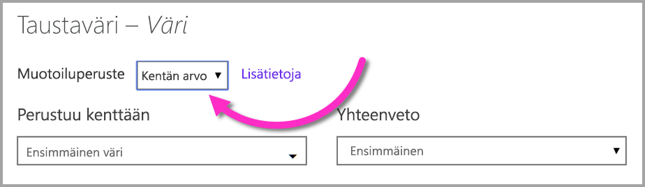
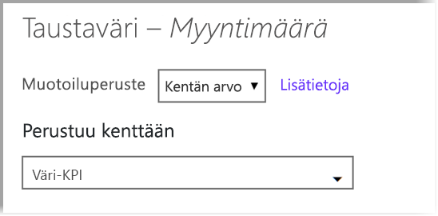

# Ehdollinen muotoilu taulukoissa 
Taulukoiden ehdollisen muotoilun avulla voit määrittää mukautettuja solujen värejä, jotka perustuvat solujen arvoihin tai muihin arvoihin tai kenttiin. Voit käyttää myös liukuvärejä. Voit myös näyttää solun arvot tietopalkeilla. 

Ehdollisen muotoilun käyttämiseksi valitse alaspäin osoittava nuoli Power BI Desktopin **Visualisoinnit**-ruudun **Kentät**-kohdassa sen **Arvon** vierestä, jota haluat muotoilla (tai napsauta kenttää hiiren kakkospainikkeella). Voit hallita kenttien ehdollista muotoilua ainoastaan **Kenttien** **Arvot**-alueella.

Seuraavissa osioissa kuvataan kutakin näistä ehdollisen muotoilun vaihtoehdoista. Yksi tai useampi vaihtoehto voidaan liittää yhteen taulukon sarakkeeseen.

> [!NOTE]
> Taulukkoon käytetty ehdollinen muotoilu ohittaa kaikki ehdollisesti muotoilluissa soluissa käytetyt mukautetut taulukkotyylit.

Jos haluat poistaa ehdollisen muotoilun visualisoinnista, napsauta kenttää uudelleen hiiren kakkospainikkeella, valitse **Poista ehdollinen muotoilu** ja valitse sitten poistettavan muotoilun tyyppi.

## Taustaväriasteikot

Kun valitset **Ehdollisen muotoilun** ja sitten **Taustaväriasteikot**, seuraava valintaikkuna tulee näyttöön.

Voit valita värien perusteena toimivan tietomallin kentän asettamalla **Värien peruste** -määritteen kyseiseen kenttään. Lisäksi voit määrittää valitulle kentälle koostetyypin **Yhteenveto**-arvolla. Väritettävä kenttä on määritetty **Väritettävä**-kentässä, jotta pysyt kärryillä. Voit määrittää ehdollisen muotoilun teksti- ja päivämääräkenttiin. Muista valita muotoilun perustaksi numeerinen arvo.

Jos haluat erillisiä väriarvoja valituille alueille, valitse **Väri sääntöjen mukaan**. Jos haluat käyttää väriasteikkoa, jätä **Väri sääntöjen mukaan** valitsematta. 

### Väri sääntöjen mukaan

Kun valitset **Väri sääntöjen mukaan** -asetuksen, voit antaa yhden tai useamman arvoalueen, joista kukin vastaa valittua väriä.  Kukin arvo alkaa *Jos-arvo* -ehdolla, *ja*-arvoehdolla ja värillä.

Taulukkosolut, joissa kunkin alueen arvot on täytetty annetulla värillä. Seuraavassa kuvassa on kolme sääntöä.

Esimerkkitaulukko näyttää nyt tältä:

### Värin vähimmäis- ja enimmäisarvo

Voit määrittää *vähimmäis-* ja *enimmäis*arvot ja niiden värit. Jos valitset **Erkautuva**-valinnan, voit määritellä myös valinnaisen *Keski*arvon.

Esimerkkitaulukko näyttää nyt tältä:

## Fonttiväriasteikot

Kun valitset **Ehdollisen muotoilun** ja sitten **Fonttiväriasteikot**, seuraava valintaikkuna tulee näyttöön. Tämä valintaikkuna on samantapainen kuin **Taustaväriasteikot**-valintaikkuna, mutta sen kautta voit muuttaa fontin väriä solun taustavärin sijaan.

Esimerkkitaulukko näyttää nyt tältä:

## Tietopalkit

Kun valitset **Ehdollisen muotoilun** ja sitten **Tietopalkit**, seuraava valintaikkuna tulee näyttöön. 

Oletuksena **Näytä vain palkki** -asetusta ei ole valittu, jolloin taulukkosolu näyttää sekä palkin että todellisen arvon.

Jos **Näytä vain palkki** -asetus on valittu, taulukkosolussa näkyy vain palkki.

## Värin muotoileminen kentän arvon mukaan

Voit käyttää mittayksikköä tai värin määrittävää saraketta joko tekstiarvon tai heksadesimaalikoodin mukaan, ja soveltaa tätä väriä taulukon tai matriisivisualisoinnin fonttiväriin. Voit myös luoda mukautetun logiikan tiettyä kenttää varten, ja antaa tämän logiikan soveltaa haluttua väriä fonttiin tai taustaan.

Esimerkiksi seuraavassa taulukossa on kuhunkin tuotemalliin liittyvä väri. 

Jos haluat muotoilla tätä solua sen kentän arvon mukaan, valitse **Ehdollinen muotoilu** -valintaikkuna napsauttamalla hiiren kakkospainikkeella tämän visualisoinnin *Väri*-saraketta ja valitsemalla valikosta **Taustaväri**. 

Valitse avautuvassa valintaikkunassa **Kentän arvo** avattavasta **Muotoiluperuste**-luetteloalueesta seuraavassa kuvassa esitetyllä tavalla.

Voit toistaa tämän prosessin fonttivärille ja visualisoinnin tulos on yhtenäinen väri **Väri**-sarakkeessa seuraavassa näytössä esitetyn mukaisesti.

Voit myös luoda liiketoimintalogiikan perusteella DAX-laskutoimituksen, joka tulostaa eri heksadesimaalikoodit haluamiesi ehtojen mukaan. Tämä on yleensä helpompaa kuin useiden sääntöjen luominen ehdollisen muotoilun valintaikkunassa. Tarkastele *ColorKPI*-kenttää seuraavassa esimerkkikuvassa.

Voit sitten määrittää kenttäarvon **taustavärille** seuraavalla tavalla.

Voit sitten saada seuraavan matriisin kaltaiset tulokset.

Voit luoda monia muita variaatioita käyttämällä mielikuvitustasi ja joitakin DAX-laskutoimituksia.

## Seuraavat vaiheet
Katso lisätietoja seuraavasta artikkelista:  

* [Vinkkejä värimuotoiluun Power BI:ssä](visuals/service-tips-and-tricks-for-color-formatting.md)  

