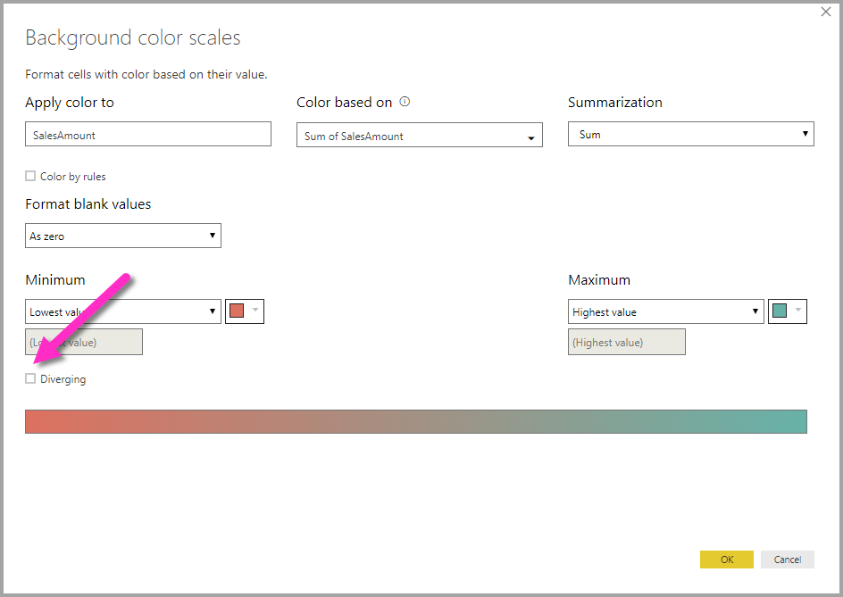

# Ehdollinen muotoilu taulukoissa
Taulukoiden ehdollisen muotoilun avulla voit määrittää mukautettuja solujen taustavärejä perustuen solujen arvoihin. Voit käyttää myös liukuvärejä. Ehdollisen muotoilun käyttämiseksi valitse alaspäin osoittava nuoli Power BI Desktopin **Visualisoinnit**-ruudun **Kentät**-kohdassa sen **Arvon** vierestä, jota haluat muotoilla (tai napsauta kenttää hiiren kakkospainikkeella). Voit hallita kenttien ehdollista muotoilua ainoastaan **Kenttien** **Arvot**-alueella.

Voit valita avautuvassa valintaikkunassa värin sekä *Vähimmäis-* ja *Enimmäis*-arvot. Jos valitset **Erkautuva**-valinnan, voit määritellä myös valinnaisen *Keski*arvon.

Taulukoissa yllä annettujen ohjeiden mukaisesti mukautettu muotoilu ohittaa mitkä tahansa ehdollisesti muotoilluissa soluissa käytetyt mukautetut taulukkotyylit.

Jos haluat poistaa ehdollisen muotoilun visualisoinnista, napsauta vain kenttää uudelleen hiiren kakkospainikkeella ja valitse **Poista ehdollinen muotoilu**.

