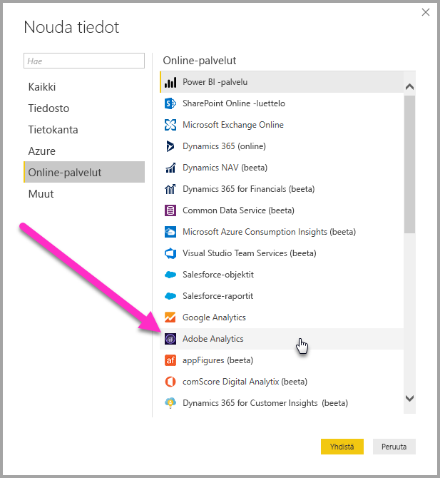
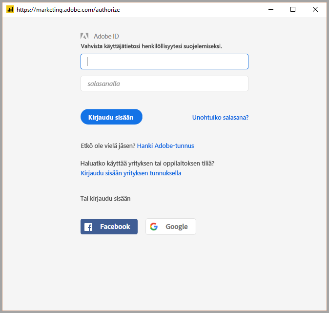
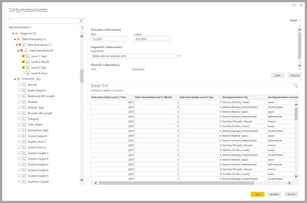
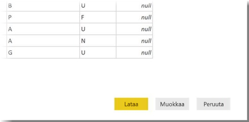

# Adobe Analyticsiin yhdistäminen Power BI Desktopissa 
Voit **Power BI Desktopissa** yhdistää **Adobe Analyticsiin** ja käyttää pohjana olevia tietoja samalla tavalla kuin mitä tahansa muuta tietolähdettä Power BI Desktopissa. 

## Adobe Analyticsin tietoihin yhdistäminen
Voit yhdistää **Adobe Analyticsin** tietoihin valitsemalla Power BI Desktopin **Aloitus**-valintanauhasta **Nouda tiedot**. Valitse vasemmalla olevista luokista **Online-palvelut**, jolloin näkyviin tulee **Adobe Analytics -yhdistin**.

Valitse avautuvasta **Adobe Analytics** -ikkunasta **Kirjaudu sisään** -painike ja kirjaudu sisään Adobe Analytics -tiliisi antamalla tunnistetietosi. Adoben sisäänkirjautumisikkuna avautuu seuraavan kuvan mukaisesti.

Kirjoita käyttäjänimesi ja salasanasi pyydettäessä. Kun yhteys on muodostettu, voit esikatsella ja valita useita dimensioita ja mittayksiköitä Power BI:n **Siirtymistoiminto**-valintaikkunassa ja luoda sitten yksittäisen taulukkotulosteen. Voit myös antaa kaikki tarvittavat valittujen kohteiden edellyttämät syöteparametrit. 

Voit **ladata** valitun taulukon, jolloin koko taulukko tuodaan **Power BI Desktopiin**, tai voit **muokata** kyselyä, joka avautuu **kyselyeditoriin**. Näin voit suodattaa ja tarkentaa käytettävää tietojoukkoa ja ladata sitten tarkennetun tietojoukon **Power BI Desktopiin**.

## Seuraavat vaiheet
Power BI Desktopin avulla voit muodostaa yhteyden hyvin monenlaisiin tietoihin. Lisätietoja näistä tietolähteistä saat seuraavista resursseista:

* [Mikä on Power BI Desktop?](desktop-what-is-desktop.md)
* [Power BI Desktopin tietolähteet](desktop-data-sources.md)
* [Tietojen muotoilu ja yhdistäminen Power BI Desktopissa](desktop-shape-and-combine-data.md)
* [Yhteyden muodostaminen Excel-työkirjoihin Power BI Desktopissa](desktop-connect-excel.md)   
* [Tietojen antaminen suoraan Power BI Desktopiin](desktop-enter-data-directly-into-desktop.md)   

