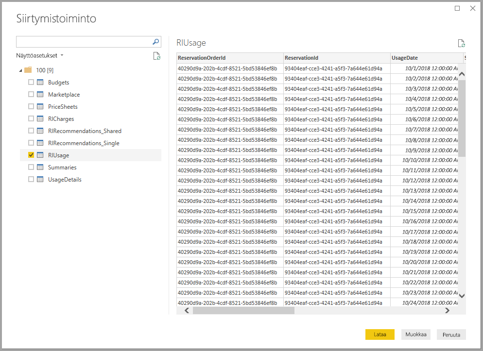
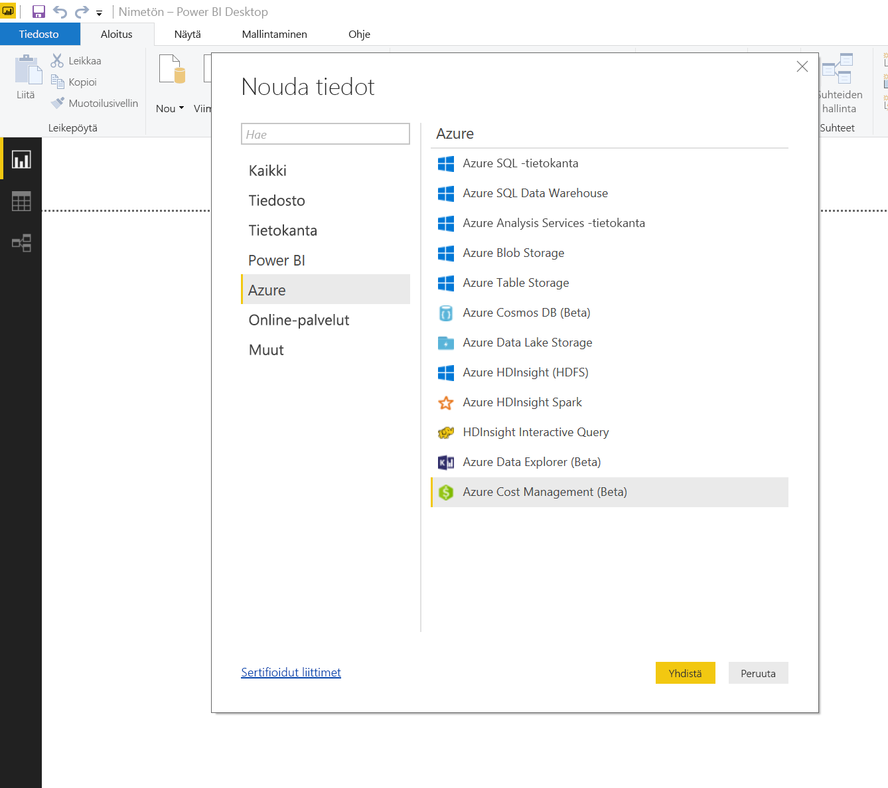
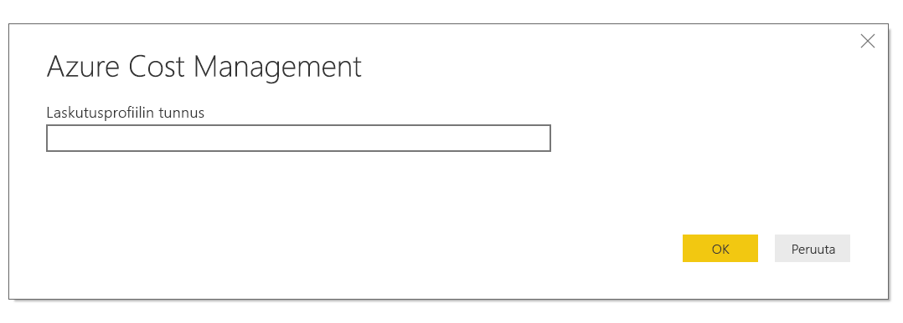
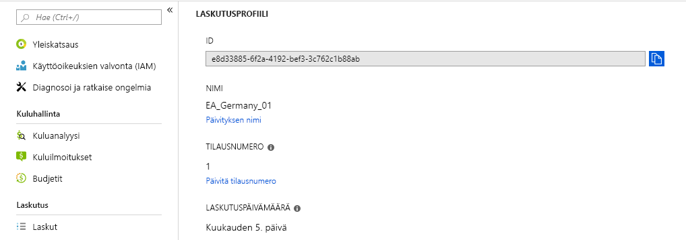
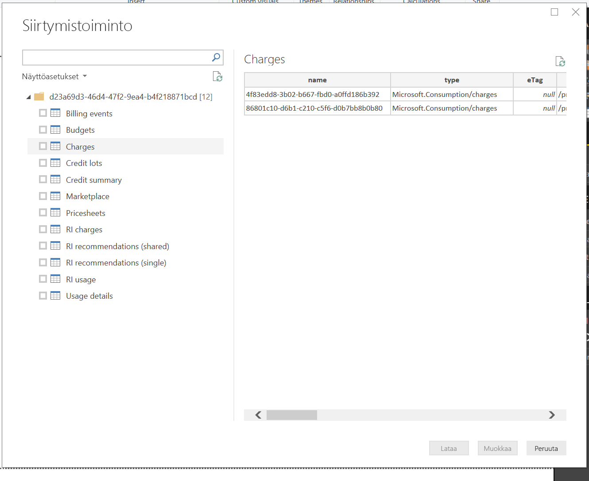
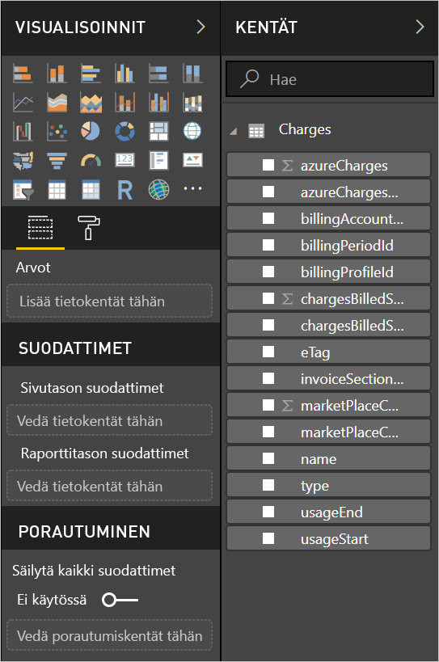

# <a name="analyze-azure-cost-and-usage-data-in-power-bi-desktop"></a>Azuren kustannus- ja käyttötietojen analysointi Power BI Desktopissa

Power BI desktop voi muodostaa yhteyden Azureen, jolloin saat tarkempia tietoja Azuren käytöstä organisaatiossasi. Sen avulla voit luoda mukautettuja raportteja ja mittareita, joiden avulla saat entistä paremman käsityksen ja analyysit Azuren käytöstä.

Power BI tukee tällä hetkellä Enterprise Agreement -sopimusten ja asiakassopimusten laskutustileihin yhdistämistä.

* **Enterprise Agreement** -sopimusten käyttäjien tulee muodostaa yhteys **Azure Consumption Insights** -liittimellä.

* **Asiakassopimusten** käyttäjien tulee muodostaa yhteys **Azure Cost Management -liittimellä**.

## <a name="connect-with-azure-consumption-insights"></a>Yhteyden muodostaminen Azure Consumption Insightsin avulla

Azure Consumption Insightsin avulla voit muodostaa yhteyden Azure Enterprise Agreement -sopimuksen laskutustileihin.

Tässä artikkelissa kerrotaan, kuinka voit hankkia tarvitsemasi tiedot ja kuinka voit siirtyä Azure Enterprise -liittimen käytöstä. Lisäksi saat yhteenvedon *käyttötietosarakkeista*, jotka ovat saatavilla **ACI** (Azure Consumption Insights) -ohjelmointirajapinnassa.

Jotta yhteyden muodostaminen **Azure Consumption Insights** -liittimen avulla onnistuisi, sinulla on oltava käyttöoikeus Azure-portaalin yritysominaisuuksiin.

Voit yhdistää **Azure Consumption Insights** -liittimellä valitsemalla **Power BI Desktopin** **Aloitus**-valintanauhasta **Nouda tiedot**. Valitse vasemmalla olevista kategorioista **Online-palvelut**, jolloin näkyviin tulee **Microsoft Azure Consumption Insights (beeta)** . Valitse **Muodosta yhteys**.


Anna avautuvaan valintaikkunaan oma *rekisteröintinumerosi*.


* Löydät rekisteröintinumerosi [Azure Enterprise Portalista](https://ea.azure.com) seuraavassa kuvassa näkyvästä sijainnista:

  

  Tämä liitinversio tukee vain yritysrekisteröintejä osoitteesta https://ea.azure.com. Kiinassa tehtyjä rekisteröintejä ei tueta tällä hetkellä.

Anna seuraavaksi *tiliavaimesi* yhteyden muodostamista varten.


* Löydät rekisteröintiin tarvittavan tiliavaimesi [Azure Enterprise Portalista](https://ea.azure.com).

  

Kun annat *tiliavaimesi* ja valitset **Yhdistä**, näyttöön avautuu **selainikkuna**, jossa on yhdeksän käytettävissä olevaa taulukkoa:
* **Budgets**: Näyttää budjettitiedot todellisten kustannusten tai käytön tarkastelemiseksi olemassa oleviin budjettitavoitteisiin verrattuna.
* **MarketPlace**: Näyttää käyttöön perustuvat Azure Marketplace -maksut.
* **PriceSheets**: Näyttää käytettävissä olevat hinnat mittarin mukaan rekisteröintiä varten.
* **RICharges**: Näyttää varattuihin esiintymiin liittyvät maksut viimeisten 24 kuukauden ajalta.
* **RIRecommendations_Single**: Näyttää varatun esiintymän ostosuositukset käyttötrendien perusteella yhdessä tilauksessa viimeisten 7, 30 tai 60 päivän ajalta.
* **RIRecommendations_Shared**: Näyttää varatun esiintymän ostosuositukset käyttötrendien perusteella kaikissa tilauksissa viimeisten 7, 30 tai 60 päivän ajalta.
* **RIUsage**: Näyttää varattujen esiintymien kulutustiedot viimeisen kuukauden ajalta.
* **Summaries**: Näyttää kuukausittaisen yhteenvedon saldoista, uusista ostoista, Microsoft Azure Marketplacen palvelumaksuista, muutoksista ja ylitysmaksuista.
* **UsageDetails**: Näyttää erittelyn kulutetuista määristä ja arvioidut maksut rekisteröintiä varten.

Voit avata esikatselun valitsemalla minkä tahansa taulukon vieressä olevan valintaruudun. Voit valita yhden tai useamman taulukon valitsemalla taulukon nimen vieressä olevan ruudun ja sen jälkeen **Lataa**.



> [!NOTE]
> *Summary* (Yhteenveto)- ja *PriceSheet* (Hinnasto) -taulukot ovat käytettävissä vain rekisteröintitason ohjelmointirajapinta-avaimelle. Lisäksi näiden taulukoiden tiedot sisältävät oletusarvoisesti kuluvan kuukauden käyttöä koskevat *Usage* (Käyttö) -tiedot ja *PriceSheet* (Hinnasto) -tiedot. *Summary* (Yhteenveto)- ja *MarketPlace*-taulukot eivät rajoitu kuluvaan kuukauteen.
>
>

Kun valitset **Lataa**, tiedot ladataan **Power BI Desktopiin**.


Kun valitsemasi tiedot on ladattu, valitsemasi taulukot ja kentät näkyvät **Kentät**-ruudussa.


## <a name="using-azure-consumption-insights"></a>Azure Consumption Insightsin käyttö
**Azure Consumption Insights** -liittimen käyttö edellyttää, että sinulla on käyttöoikeus Azure-portaalin yritysominaisuuksiin.

Kun olet ladannut tiedot onnistuneesti **Azure Consumption Insights** -liittimen avulla, voit luoda omia mukautettuja mittareita ja sarakkeita käyttämällä **kyselyeditoria**. Voit myös luoda visualisointeja, raportteja ja koontinäyttöjä, joita voit jakaa **Power BI -palvelussa**.

Azure sisältää myös kokoelman mukautettuja mallikyselyitä, joita voit hakea käyttämällä tyhjää kyselyä. Voit hakea niitä valitsemalla **Power BI Desktopin** **Aloitus**-valintanauhasta **Nouda tiedot** -kohdan avausnuoli ja sen jälkeen **Tyhjä kysely**. Voit tehdä haun myös napsauttamalla hiiren kakkospainikkeella **kyselyeditorin** vasemmassa sivussa näkyvää **Kyselyt**-ruutua ja valitsemalla avautuvasta valikosta **Uusi kysely > Tyhjä kysely**.

Kirjoita **kaavariville** seuraava:

    = MicrosoftAzureConsumptionInsights.Contents

Näkyviin tulee seuraavassa kuvassa esitetty mallikokoelma:


Kun käsittelet raportteja ja luot kyselyitä, käytä seuraavia:

* Voit määrittää kuukausien määrän alkaen nykyisestä päivämäärästä käyttämällä *numberOfMonth*-parametria.
  * Ilmoita kuukausien määrä, jonka haluat tuoda, kuluvasta päivämäärästä alkaen käyttämällä arvoa välillä 1–36. Suosittelemme hakemaan enintään 12 kuukauden tiedot, jotta vältetään Power BI:n tuontirajoituksia ja kyselyiden sallittua tietomäärää koskevat kynnysarvot.
* Voit määrittää historiallisen aikaikkunan kuukausijakson käyttämällä parametreja *startBillingDataWindow* ja *endBillingDataWindow*.
* *Älä* käytä *numberOfMonth*-parametria yhdessä *startBillingDataWindow*- tai *endBillingDataWindow*-parametrin kanssa.

## <a name="migrating-from-the-azure-enterprise-connector"></a>Siirtyminen Azure Enterprise -liittimestä
Osa asiakkaista loi visualisointeja *Azure-yrityssovellusliittimellä (beeta)* , jota ei tulevaisuudessa enää ole saatavilla ja joka korvataan **Azure Consumption Insights** -liittimellä. **Azure Consumption Insights** -liittimessä on mm. seuraavia ominaisuuksia ja parannuksia:

* *taseen yhteenvetoa* ja *Marketplace-ostoksia* varten saatavilla olevat lisätietolähteet
* uudet ja edistykselliset parametrit, kuten *startBillingDataWindow* ja *endBillingDataWindow*
* parempi suorituskyky ja vasteaika.

Jotta siirtyminen uudempaan **Azure Consumption Insights** -liittimeen olisi asiakkaille helpompaa ja he pystyisivät säilyttämään tekemänsä mukautetut koontinäytöt tai raportit, seuraavissa vaiheissa esitellään, kuinka uuteen liittimeen siirrytään.

### <a name="step-1-connect-to-azure-using-the-new-connector"></a>Vaihe 1: Yhdistä Azureen uuden liittimen avulla
Ensimmäinen vaihe on yhteyden muodostaminen **Azure Consumption Insights** -liittimellä, mikä on kuvattu tarkemmin edellä tässä artikkelissa. Valitse tässä vaiheessa **Power BI Desktopin** **Aloitus**-valintanauhasta **Nouda tiedot > Tyhjä kysely**.

### <a name="step-2-use-the-advanced-editor-to-create-a-query"></a>Vaihe 2: Luo kysely laajennetun editorin avulla
Valitse **kyselyeditorin** **Aloitus**-valintanauhan **Kysely**-osasta **Laajennettu editori**. Syötä avautuvaan **Laajennettu editori** -ikkunaan seuraava kysely:

    let    
        enrollmentNumber = "100",
        optionalParameters = [ numberOfMonth = 6, dataType="DetailCharges" ],
        data = MicrosoftAzureConsumptionInsights.Contents(enrollmentNumber, optionalParameters)   
    in     
        data


Sinun tulee luonnollisesti korvata *enrollmentNumber*-arvo omalla rekisteröintinumerollasi, jonka saat [Azure Enterprise Portalista](https://ea.azure.com). Parametri *numberOfMonth* tarkoittaa, kuinka monen kuukauden tiedot nykyisestä päivämäärästä taaksepäin haluat. Käytä nykyisestä kuukaudesta arvoa nolla (0).

Kun valitset **Laajennettu editori** -ikkkunan **Valmis**-painikkeen, esikatselu päivittyy ja näet taulukossa tiedot määrittämältäsi kuukausiväliltä. Valitse **Sulje ja ota käyttöön** ja palaa.

### <a name="step-3-move-measures-and-custom-columns-to-the-new-report"></a>Vaihe 3: Siirrä mittarit ja mukautetut sarakkeet uuteen raporttiin
Seuraavaksi on siirrettävä luomasi mukautetut sarakkeet tai mittarit uuteen tietotaulukkoon. Vaiheet ovat seuraavat:

1. Avaa Muistio (tai muu tekstieditori).
2. Valitse mittari, jonka haluat siirtää, kopioi teksti *Kaava*-kentästä ja lisää se Muistioon.

   
3. Muuta *Kysely1*:n nimeksi alkuperäisen tietotaulukon nimi.
4. Luo taulukkoon uusia mittareita ja mukautettuja sarakkeita napsauttamalla taulukkoa hiiren kakkospainikkeella ja valitsemalla **Uusi mittari**. Leikkaa ja liimaa sen jälkeen tallennetut mittarit ja sarakkeet, kunnes ne ovat kaikki valmiit.

### <a name="step-4-re-link-tables-that-had-relationships"></a>Vaihe 4: Linkitä uudelleen suhteita sisältäneet taulukot
Monissa koontinäytöissä on lisäksi taulukoita, joita käytetään hakuun tai suodatukseen, kuten päivämäärätaulukoita tai mukautettuihin projekteihin käytettyjä taulukoita. Näiden suhteiden muodostaminen uudelleen ratkaisee useimmat jäljellä olevat ongelmat. Näin voit tehdä sen.

- Valitse **Power BI Desktopin** **Mallinnus**-välilehdeltä **Suhteiden hallinta**, jolloin näyttöön avautuu ikkuna, jossa voit hallita mallin sisältämiä suhteita. Linkitä taulukot uudelleen tarpeen mukaan.

    

### <a name="step-5-verify-your-visuals-and-adjust-field-formatting-as-needed"></a>Vaihe 5: Tarkista visualisoinnit ja säädä kentän muotoilua tarpeen mukaan
Kun olet päässyt näin pitkälle, alkuperäisten visualisointiesi, taulukoiden ja yli- ja alirakenteiden pitäisi pääasiassa toimia odotetusti. Muotoiluun saattaa kuitenkin olla tarpeen tehdä joitakin pieniä muokkauksia, jotta kaikki näyttää juuri haluamaltasi. Silmäile kaikki koontinäytöt ja visualisoinnit läpi varmistaaksesi, että ne näyttävät siltä kuin haluat.

## <a name="using-the-azure-consumption-and-insights-aci-api-to-get-consumption-data"></a>Azure Consumption and Insights (ACI) -ohjelmointirajapinnan käyttö kulutustietojen saamiseen
Azure tarjoaa myös [**Azure Consumption and Insights (ACI) -ohjelmointirajapinnan**](https://azure.microsoft.com/blog/announcing-general-availability-of-consumption-and-charge-apis-for-enterprise-azure-customers/). Voit luoda omia mukautettuja ratkaisuja ja kerätä, raportoida ja visualisoida Azuren kulutustietoja ACI-ohjelmointirajapinnan avulla.

### <a name="mapping-names-and-usage-details-between-the-portal-the-connector-and-the-api"></a>Nimien ja käyttötietojen vastaavuudet portaalin, liittimen ja ohjelmointirajapinnan välillä
Tietojen sarakkeet ja nimet Azure-portaalissa ovat vastaavat ohjelmointirajapinnassa ja liittimessä, mutta ne eivät aina ole identtisiä. Seuraava taulukko selventää ohjelmointirajapinnan, liittimen ja Azure-portaalissa näkyvien sarakkeiden välisiä vastaavuuksia. Taulukko kertoo myös, onko sarake vanhentunut. Lisätietoja termeistä ja niiden määritelmät on [Azure-laskutuksen tietohakemistossa](https://docs.microsoft.com/azure/billing/billing-enterprise-api-usage-detail).

| ACI-liittimen / sisältöpaketin sarakkeen nimi | ACI-ohjelmointirajapinnan sarakkeen nimi | EA-sarakkeen nimi | Vanhentunut / käytössä yhteensopivuuden vuoksi aiempien versioiden kanssa |
| --- | --- | --- | --- |
| AccountName |accountName |Tilin nimi |Ei |
| AccountId |accountId | |Kyllä |
| AcccountOwnerId |accountOwnerEmail |AccountOwnerId |Ei |
| AdditionalInfo |additionalInfo |AdditionalInfo |Ei |
| AdditionalInfold | | |Kyllä |
| Consumed Quantity |consumedQuantity |Consumed Quantity |Ei |
| Consumed Service |consumedService |Consumed Service |Ei |
| ConsumedServiceId |consumedServiceId | |Kyllä |
| Cost |cost |ExtendedCost |Ei |
| Cost Center |costCenter |Cost Center |Ei |
| Date |date |Date |Ei |
| Päivä | |Päivä |Ei |
| DepartmentName |departmentName |Department Name |Ei |
| DepartmentID |departmentId | |Kyllä |
| Instance ID | | |Kyllä |
| InstanceId |instanceId |Instance ID |Ei |
| Location | | |Kyllä |
| Meter Category |meterCategory |Meter Category |Ei |
| Meter ID | | |Kyllä |
| Meter Name |meterName |Meter Name |Ei |
| Meter Region |meterRegion |Meter Region |Ei |
| Meter Sub-Category |meterSubCategory |Meter Sub-Category |Ei |
| MeterId |meterId |Meter ID |Ei |
| Kuukausi | |Kuukausi |Ei |
| Product |product |Product |Ei |
| ProductId |productId | |Kyllä |
| Resource Group |resourceGroup |Resource Group |Ei |
| Resource Location |resourceLocation |Resource Location |Ei |
| ResourceGroupId | | |Kyllä |
| ResourceLocationId |resourceLocationId | |Kyllä |
| ResourceRate |ResourceRate |ResourceRate |Ei |
| ServiceAdministratorId |serviceAdministratorId |ServiceAdministratorId |Ei |
| ServiceInfo1 |serviceInfo1 |ServiceInfo1 |Ei |
| ServiceInfo1Id | | |Kyllä |
| ServiceInfo2 |serviceInfo2 |ServiceInfo2 |Ei |
| ServiceInfo2Id | | |Kyllä |
| Store Service Identifier |storeServiceIdentifier |Store Service Identifier |Ei |
| StoreServiceIdentifierId | | |Kyllä |
| Subscription Name |subscriptionName |Subscription Name |Ei |
| Tags |tags |Tags |Ei |
| TagsId | | |Kyllä |
| Mittayksikkö |unitOfMeasure |Mittayksikkö |Ei |
| Vuosi | |Vuosi |Ei |
| SubscriptionId |subscriptionId |SubscriptionId |Kyllä |
| SubscriptionGuid |subscriptionGuid |SubscriptionGuid |Ei |

## <a name="connect-with-azure-cost-management"></a>Yhdistäminen Azure Cost Managementin avulla

Tässä osiossa opit muodostamaan yhteyden asiakassopimusten laskutustiliin.

> [!NOTE]
> Azure Cost Management -liitin tukee tällä hetkellä **asiakassopimusten** asiakkaita.  **Enterprise Agreement** -sopimusten käyttäjien tulee käyttää Microsoft Azure Consumption Insights -liitintä.
>
>

Voit yhdistää **Azure Cost Management** -liittimellä valitsemalla **Nouda tiedot** **Power BI Desktopin** **Aloitus**-valintanauhasta.  Valitse **Azure** vasemmalla olevista luokista, niin näet **Azure Cost Managementin (beeta)** . Valitse **Muodosta yhteys**.



Kirjoita avautuvaan valintaikkunaan *laskutusprofiilin tunnus*.



Voit hakea laskutusprofiilin tunnuksen [Azure-portaalista](https://portal.azure.com).  Siirry kohtaan **Cost Management + Laskutus**, valitse laskutustili ja valitse sitten sivupalkista **Laskutusprofiilit**.  Valitse laskutusprofiili ja valitse sitten sivupalkista **Ominaisuudet**.  Kopioi laskutusprofiilin tunnus.



Sinua pyydetään kirjautumaan sisään Azure-sähköpostiosoitteella ja -salasanalla.  Kun olet kirjautunut, näet **Siirtymistoiminto**-ikkunan, jossa on kaksitoista taulukkoa:

* **Laskutustapahtumat**: Sisältää uusien laskujen, hyvitysostojen ja muiden tietojen tapahtumalokin.
* **Budgets**: Näyttää budjettitiedot todellisten kustannusten tai käytön tarkastelemiseksi olemassa oleviin budjettitavoitteisiin verrattuna.
* **Veloitukset**: Sisältää yhteenvedon Azuren käytöstä kuukausittain, markkinamaksuista ja erikseen laskutetuista veloituksista.
* **Hyvitysostot**: Sisältää tiedon kyseisen laskutusprofiilin Azure-hyvitysten ostotiedoista.
* **Hyvitysten yhteenveto**: Sisältää yhteenvedon kyseisen laskutusprofiilin hyvityksistä.
* **Marketplace**: Näyttää käyttöön perustuvat Azure Marketplace -maksut.
* **Hintataulukot**: Sisältää valittua laskutusprofiilia koskevat hintatiedot.
* **Varattujen esiintymien veloitukset**: Näyttää varattuihin esiintymiin liittyvät maksut viimeisten 24 kuukauden ajalta.
* **Varattujen esiintymien suositukset (yksi)** : Näyttää varatun esiintymän ostosuositukset käyttötrendien perusteella yhdessä tilauksessa viimeisten 7, 30 tai 60 päivän ajalta.
* **Varattujen esiintymien suositukset (jaetut)** : Näyttää varatun esiintymän ostosuositukset käyttötrendien perusteella kaikissa tilauksissa viimeisten 7, 30 tai 60 päivän ajalta.
* **Varattujen esiintymien käyttö**: Näyttää varattujen esiintymien kulutustiedot viimeisen kuukauden ajalta.
* **Käyttötiedot**: Näyttää erittelyn valittua laskutusprofiilin tunnusta koskevista kulutetuista määristä ja arvioidut maksut.

Voit avata esikatselun valitsemalla minkä tahansa taulukon vieressä olevan valintaruudun.  Voit valita yhden tai useamman taulukon valitsemalla taulukon nimen vieressä olevan ruudun ja sen jälkeen **Lataa**.



Kun valitset **Lataa**, tiedot ladataan **Power BI Desktopiin**.


Kun valitsemasi tiedot on ladattu, valitsemasi taulukot ja kentät näkyvät **Kentät**-ruudussa.



Katso video [kulujen analysoinnista Power BI:ssä Azure Consumption Insightsin](https://www.youtube.com/watch?v=QKBMXXrlpEk) avulla. Siitä saat lisätietoja kustannustietojen analysoinnista Power BI Desktopissa Azure Consumption Insights -liittimen avulla.

## <a name="writing-custom-queries"></a>Mukautettujen kyselyjen kirjoittaminen

Jos haluat mukauttaa kuukausien määrää, muuttaa api-versiota tai tehdä edistyneitä hakuja, voit luoda mukautetun M-kyselyn.

Voit hakea niitä valitsemalla **Power BI Desktopin** **Aloitus**-valintanauhassa olevasta **Nouda tiedot** -kohdasta avattavan valikon ja valitsemalla sitten **Tyhjä kysely**.  Voit tehdä haun myös napsauttamalla hiiren kakkospainikkeella **Kyselyeditorin** vasemmassa sivussa näkyvää **Kyselyt**-ruutua ja valitsemalla avautuvasta valikosta **Uusi kysely > Tyhjä kysely**.

Kirjoita **Kaavariviin** seuraava haku, ja korvaa `billingProfileId` omalla tunnuksellasi sekä ”veloitukset” minkä tahansa kelvollisen taulukon nimellä (luettelo yllä).

```
let
    Source = AzureCostManagement.Tables(billingProfileId, [ numberOfMonths = 3 ]),
    charges = Source{[Key="charges"]}[Data]
in
    charges
```

Voit muokata `numberOfMonths`-arvoksi minkä tahansa arvon välillä 1 – 36, ja lisäksi voit myös antaa:

* `apiVersion`, jos haluat muokata, mitä ohjelmointirajapinnan versiota kysely käyttää.
* `lookbackWindow`, jos haluat käyttää RI-suosituksia (yksittäisiä tai jaettuja) ja muokata aikaväliä, johon suositukset perustuva (kelvolliset vaihtoehdot: 7, 30 ja 60 päivää)


## <a name="next-steps"></a>Seuraavat vaiheet
Power BI Desktopin avulla voit muodostaa yhteyden hyvin monenlaisiin tietoihin. Lisätietoja näistä tietolähteistä saat seuraavista resursseista:

* [Mikä on Power BI Desktop?](desktop-what-is-desktop.md)
* [Power BI Desktopin tietolähteet](desktop-data-sources.md)
* [Tietojen muotoilu ja yhdistäminen Power BI Desktopissa](desktop-shape-and-combine-data.md)
* [Yhteyden muodostaminen Excel-työkirjoihin Power BI Desktopissa](desktop-connect-excel.md)   
* [Tietojen antaminen suoraan Power BI Desktopiin](desktop-enter-data-directly-into-desktop.md)   
