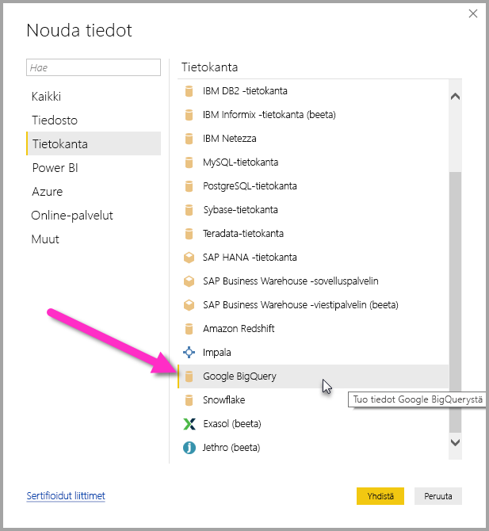
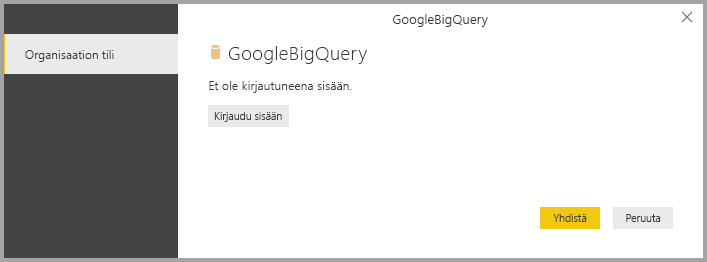
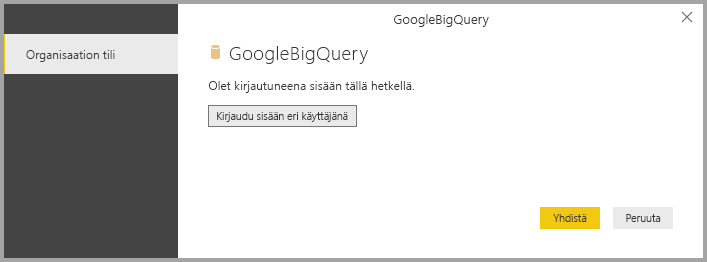
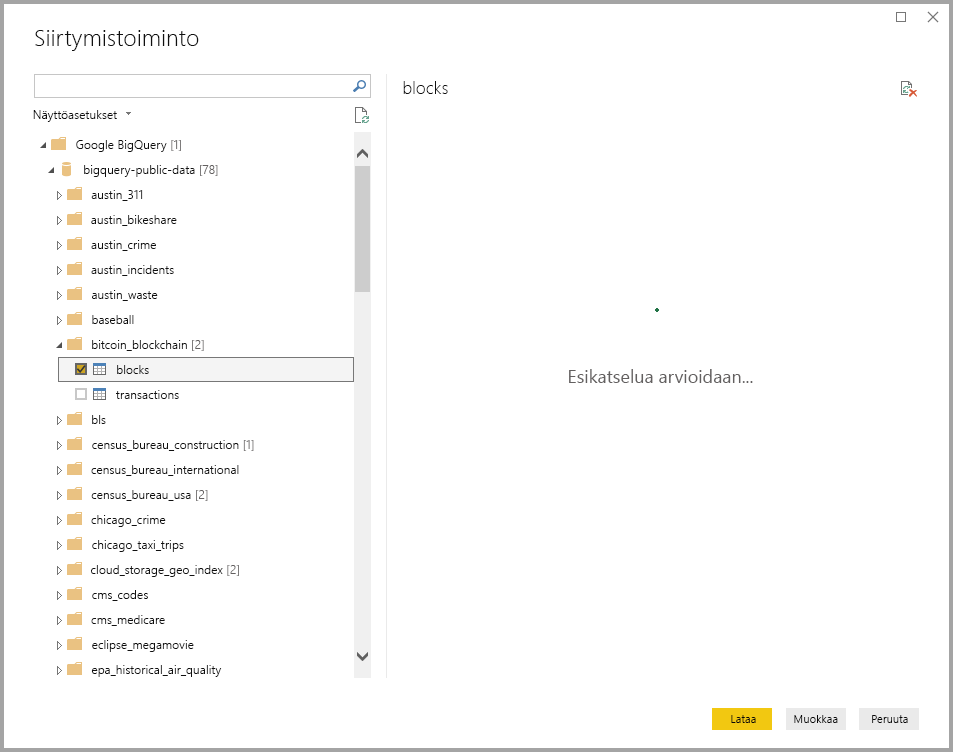

# <a name="connect-to-a-google-bigquery-database-in-power-bi-desktop"></a>Google BigQuery -tietokantaan yhdistäminen Power BI Desktopissa
Power BI Desktopissa voi muodostaa yhteyden Google **BigQuery** ‑tietokantaan ja käyttää siihen liittyviä tietoja samaan tapaan kuin muita tietolähteitä käytetään Power BI Desktopissa.

## <a name="connect-to-google-bigquery"></a>Muodosta yhteys Google BigQueryyn
Jos haluat muodostaa yhteyden Google **BigQuery** ‑tietokantaan, valitse Power BI Desktopissa **Aloitus**-valintanauhasta **Nouda tiedot**. Valitse vasemmalla näkyvistä luokista **Tietokanta**, jolloin näkyviin tulee **Google BigQuery**.



Näkyviin tulevassa **Google BigQuery** -ikkunassa kirjaudu sisään Google BigQuery -tiliisi ja valitse **Yhdistä**.



Kun olet kirjautunut sisään, seuraava ikkuna osoittaa, että todentaminen onnistui. 



Kun yhteyden muodostaminen onnistuu, näyttöön avautuu **Siirtymistoiminto**-ikkuna, jossa näet palvelimella käytettävissä olevat tiedot. Voit valita ikkunasta yhden tai useita elementtejä tuotavaksi **Power BI Desktopiin**.



## <a name="considerations-and-limitations"></a>Huomioitavat asiat ja rajoitukset
Seuraavat Google **BigQuery** -liittimeen liittyvät rajoitukset ja tärkeät seikat on syytä huomioida:

* Google BigQuery -liitin on käytettävissä Power BI Desktopissa ja Power BI -palvelussa. Power BI -palvelussa liitintä voi käyttää pilvipalveluiden välistä yhteyttä käyttämällä Power BI:stä Google BigQueryyn.

Voit käyttää Power BI:tä Google BigQueryn **laskutusprojektissa**. Oletusarvon mukaan Power BI käyttää ensimmäistä luettelon projektia, joka on palautettu käyttäjälle. Voit mukauttaa laskutusprojektin toimintaa käyttäessäsi sitä Power BI:n kanssa noudattamalla seuraavia ohjeita:

 * Määritä seuraava vaihtoehto pohjana olevassa M:ssä Lähde-vaiheessa, jota voidaan mukauttaa käyttämällä **Power Query -editoria** Power BI Desktopissa:

    ```Source = GoogleBigQuery.Database([BillingProject="Include-Billing-Project-Id-Here"])```

## <a name="next-steps"></a>Seuraavat vaiheet
Power BI Desktopin avulla voit muodostaa yhteyden hyvin monenlaisiin tietoihin. Lisätietoja näistä tietolähteistä saat seuraavista resursseista:

* [Mikä on Power BI Desktop?](desktop-what-is-desktop.md)
* [Power BI Desktopin tietolähteet](desktop-data-sources.md)
* [Tietojen muotoilu ja yhdistäminen Power BI Desktopissa](desktop-shape-and-combine-data.md)
* [Yhteyden muodostaminen Excel-työkirjoihin Power BI Desktopissa](desktop-connect-excel.md)   
* [Tietojen antaminen suoraan Power BI Desktopiin](desktop-enter-data-directly-into-desktop.md)   

