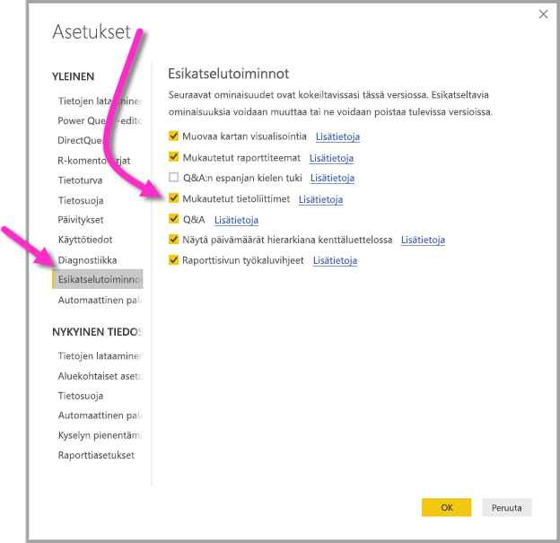

# Power BI -tietovoiden luomiin tietoihin yhdistäminen Power BI Desktopissa (esikatselu)
**Power BI Desktopissa** voit yhdistää **Power BI -tietovoiden** luomiin tietoihin samaan tapaan kuin muihin tietolähteisiin Power BI Desktopissa.

**Power BI -tietovuot (esikatselu)** -liittimen avulla voit yhdistää tietovoiden luomiin entiteetteihin Power BI -palvelussa. Koska tietovuot ovat esikatselussa, sinun on suoritettava muutamia vaiheita, jotta saat tietovoiden liittimen käyttöön järjestelmässäsi. 

## Power BI -tietovoiden liittimen (esikatselu) lataaminen ja käyttöönotto

Sinun on ladattava **Power BI -tietovoiden** liittimen kopio ja kopioitava se tiettyyn sijaintiin tietokoneellesi. Power BI Desktopin tulevassa kuukausipäivityksessä liitin lisätään automaattisesti tietoliittimien luetteloon, jolloin näitä vaiheita ei tarvita.

Voit ladata **Power BI -tietovoiden liittimen** seuraavasta sijainnista: [Power BI -tietovoiden liitin](https://visuals.azureedge.net/cds-analytics/PublicPreview/CDSA.mez)

Ota **Power BI -tietovoiden** liitin (esikatselu) käyttöön tietokoneellasi seuraavasti:

1. Lataa .MEZ-tiedoston (tietoliittimen tiedosto) kopio. Yksityistä esikatselua käyttävät asiakkaat saavat .MEZ-tiedoston lataustiedot suoraan Microsoftilta.

2. Sijoita ladattu tietoliittimen tiedosto seuraavaan kansioon tietokoneellasi: **Tiedostot > Power BI Desktop-> Mukautetut liittimet -kansio**

3. Valitse Power BI Desktopissa **Tiedosto > Asetukset ja vaihtoehdot > Asetukset** ja sitten vasemmasta ruudusta **Esikatselutoiminnot**.

    

4. Valitse **Mukautetut tietoliittimet** -ruutu, jos se ei ole valittuna. 

5. Käynnistä **Power BI Desktop** uudelleen, jotta liitin tulee näkyviin.

## Power BI -tietovoiden liittimen (esikatselu) käyttäminen
Kun **Power BI Desktop** on käynnistetty uudelleen, liitin näkyy käytettävissä olevan tietolähteenä. Jos haluat yhdistää tietovarantoon, valitse **Nouda tiedot > Power BI -tietovuot (beeta)** seuraavan kuvan mukaisesti:

## Huomioitavat asiat ja rajoitukset

Jotta voit käyttää tätä **Power BI -tietovoiden liittimen** esikatseluversiota, sinulla on oltava **Power BI Desktopin** uusin versio. Voit aina [ladata Power BI Desktopin](desktop-get-the-desktop.md) ja asentaa sen tietokoneellesi, jotta sinulla on varmasti uusin versio.  

Huomautus: Kun Power BI -tietovoiden liitin näkyy **Power BI Desktopin** tulevassa kuukausipäivityksessä, sinun *on poistettava* tämä ladattu .MEZ-tiedosto sijainnista **Tiedostot > Power BI Desktop > Mukautetut liittimet** -kansio ristiriitojen välttämiseksi. 

## Seuraavat vaiheet
Voit tehdä monenlaisia kiinnostavia asioita Power BI Desktopin tietoyhteyksien avulla. Seuraavista **Power BI Desktopia** koskevista artikkeleista saattaa olla hyötyä:

* [Power BI Desktopin tietolähteet](desktop-data-sources.md)
* [Tietojen muotoilu ja yhdistäminen Power BI Desktopissa](desktop-shape-and-combine-data.md)
* [Tietojen antaminen suoraan Power BI Desktopiin](desktop-enter-data-directly-into-desktop.md)   

