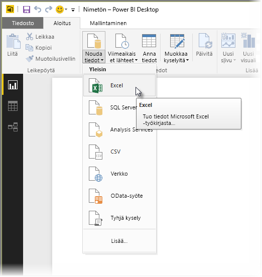
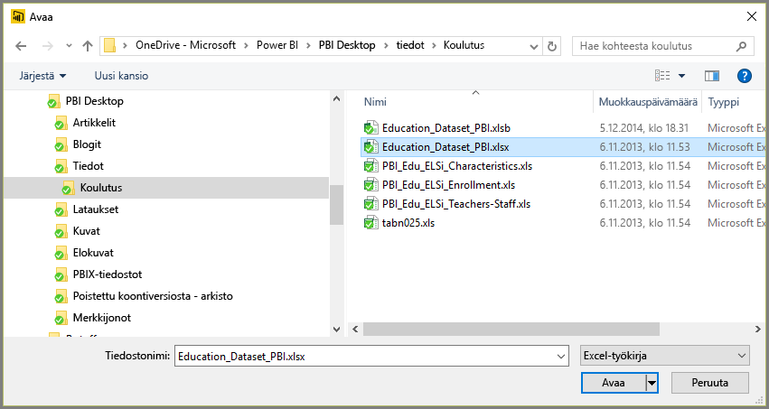
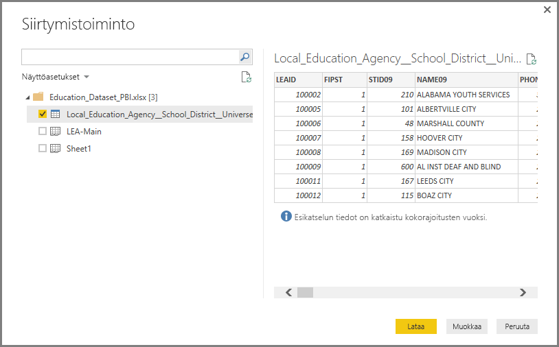
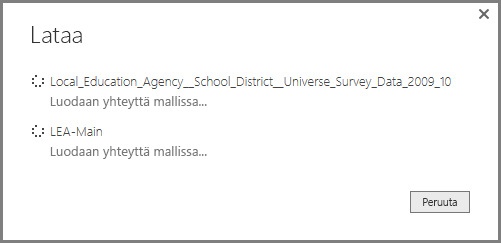
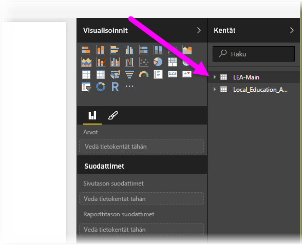

# Exceliin yhdistäminen Power BI Desktopissa
Excel-työkirjaan yhdistäminen Power BI Desktopista on helppoa, ja tässä artikkelissa kerrotaan, miten se tehdään.

Valitse Power BI Desktopin **Aloitus**-valintanauhasta **Nouda tiedot > Excel**.

Valitse työkirja avautuvasta **Avaa**-valintaikkunasta.

Power BI Desktop näyttää työkirjan muiden tietoelementtien taulukot **Siirtymistoiminto**-ikkunassa. Kun valitset taulukon vasemmasta ruudusta, tietojen esikatselu tulee näkyviin oikeanpuoleiseen ruutuun.

Voit tuoda tiedot valitsemalla Lataa-painikkeen. Jos haluat muokata tietoja **kyselyeditorissa** ennen niiden tuomista Power BI Desktopiin, valitse **Muokkaa**-painike.

Kun lataat tiedot, Power BI Desktop näyttää **Lataa**-ikkunan ja tietojen lataamiseen liittyvät tiedot.  

Kun lataus on valmis, Power BI Desktop näyttää Excel-työkirjasta tuodut taulukot ja kentät työpöydän oikeassa reunassa olevassa **Kentät**-ruudussa.

Siinä kaikki.

Nyt voit käyttää Excel-työkirjasta tuotuja tietoja Power BI Desktopissa ja luoda niiden avulla visualisointeja ja raportteja. Voit myös käsitellä muita tietoja, joihin haluat ehkä yhdistää tai jotka haluat ehkä tuoda Excel-työkirjoista, tietokannoista tai muista tietolähteistä.

### Seuraavat vaiheet
Power BI Desktopin avulla voit muodostaa yhteyden hyvin monenlaisiin tietoihin. Lisätietoja näistä tietolähteistä saat seuraavista resursseista:

* [Mikä on Power BI Desktop?](desktop-what-is-desktop.md)
* [Power BI Desktopin tietolähteet](desktop-data-sources.md)
* [Tietojen muotoilu ja yhdistäminen Power BI Desktopissa](desktop-shape-and-combine-data.md)
* [CSV-tiedostoihin yhdistäminen Power BI Desktopissa](desktop-connect-csv.md)   
* [Tietojen antaminen suoraan Power BI Desktopiin](desktop-enter-data-directly-into-desktop.md)   

