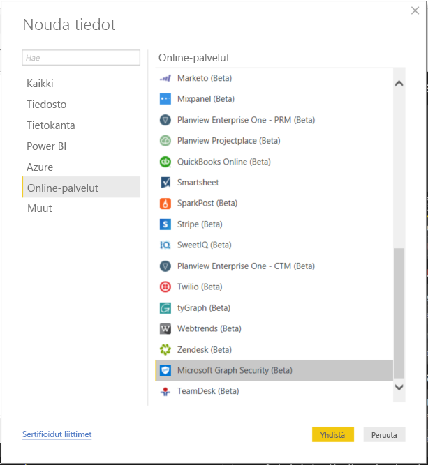
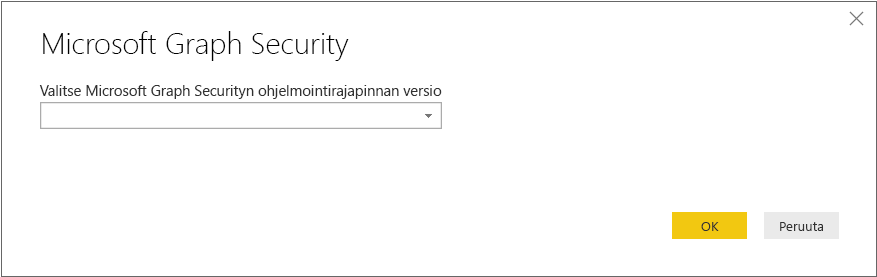
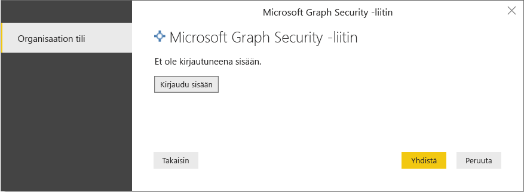
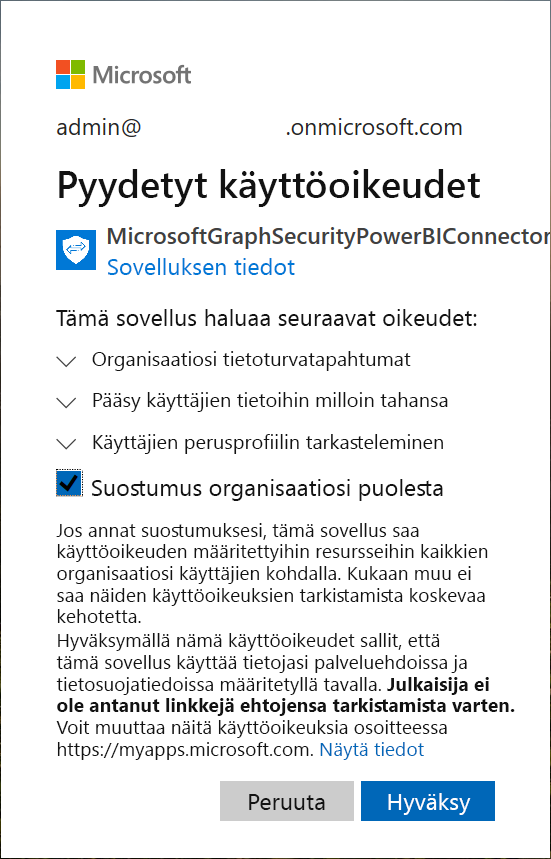
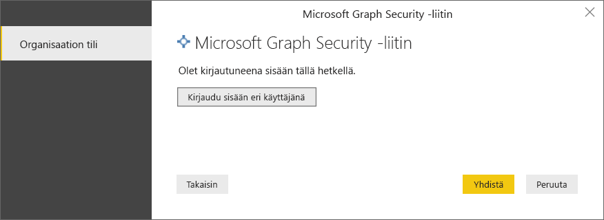
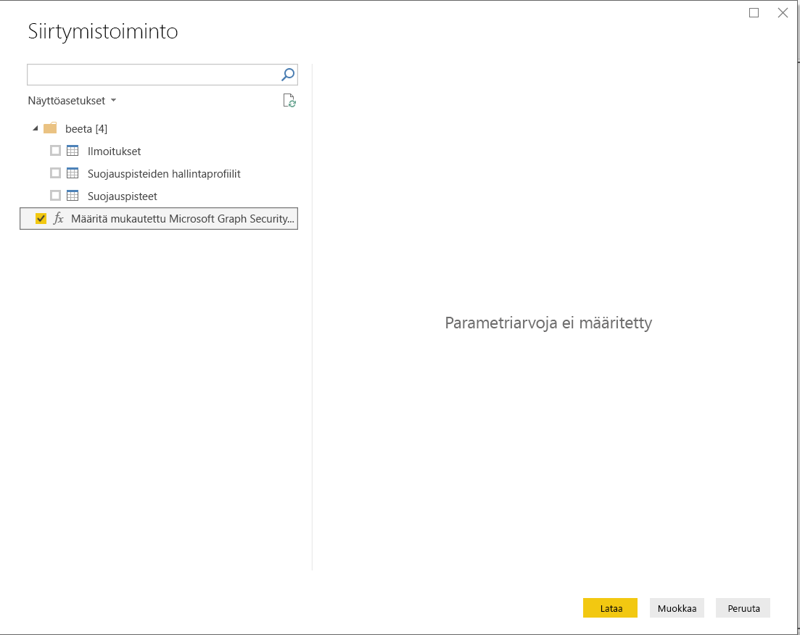
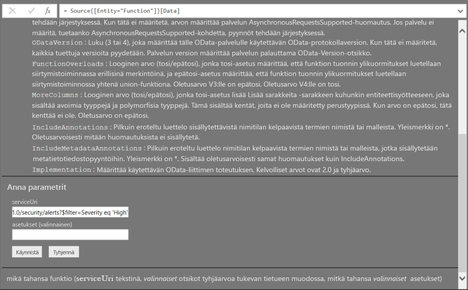
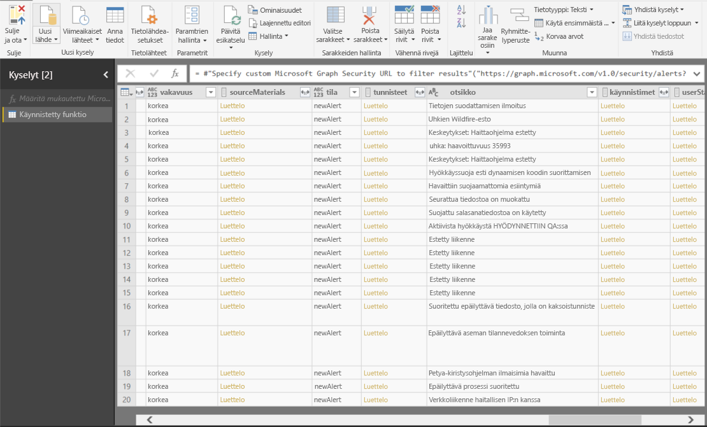

# Muodosta yhteys Microsoft Graph Security -ohjelmointirajapintaan Power BI Desktopissa

Voit käyttää Power BI Desktopin Microsoft Graph Security -liitintä yhteyden muodostamiseen [Microsoft Graph Security -ohjelmointirajapintaan](https://aka.ms/graphsecuritydocs). Sen jälkeen voit luoda koontinäyttöjä ja raportteja, joista saat tietoja tietoturvaan liittyvistä [ilmoituksista](https://docs.microsoft.com/graph/api/resources/alert?view=graph-rest-1.0) ja [suojauspisteistä](https://docs.microsoft.com/graph/api/resources/securescores?view=graph-rest-beta).

Microsoft Graph Security -ohjelmointirajapinta luo yhteyden useisiin Microsoftin ja sen ekosysteemin kumppaneiden [suojausratkaisuihin](https://aka.ms/graphsecurityalerts), jotta ilmoitusten korrelaatio on entistä selvempi. Tämän yhdistelmän avulla päästään käsiksi runsaisiin kontekstitietoihin ja samalla se yksinkertaistaa automaatiota. Organisaatiot saavat tarkat tiedot nopeasti ja voivat käyttää useita suojaustuotteita. Tästä huolimatta kustannuksia ja monimutkaisuutta voidaan vähentää.

## Microsoft Graph Security -liittimen käytön edellytykset

Microsoft Graph Security -liittimen käyttö edellyttää, että saat *juuri* sille luvan Azure Active Directory (Azure AD) -vuokraajan järjestelmänvalvojalta. Katso [Microsoft Graph Securityn todentamisen vaatimukset](https://aka.ms/graphsecurityauth).
Lupaan tarvitaan liittimen sovellustunnus ja nimi, jotka ovat täällä ja [Azure-portaalissa](https://portal.azure.com):

| Ominaisuus | Arvo |
|----------|-------|
| **Sovelluksen nimi** | `MicrosoftGraphSecurityPowerBIConnector` |
| **Sovelluksen tunnus** | `cab163b7-247d-4cb9-be32-39b6056d4189` |
|||

Azure AD -vuokraajan järjestelmänvalvoja voi antaa suostumuksensa liittimen käyttöä varten seuraavilla menetelmillä:

* [Suostumuksen antaminen Azure AD -sovelluksille](https://docs.microsoft.com/azure/active-directory/develop/v2-permissions-and-consent)

* Vastaus pyyntöön, jonka logiikkasovellus lähettää ensimmäisen suorituskerran aikana [sovelluksen suostumuskäyttökokemuksen](https://docs.microsoft.com/azure/active-directory/develop/application-consent-experience) kautta
   
Käyttäjätilin, jolla kirjaudutaan Microsoft Graph Security -liittimeen, roolin on oltava Azure AD:n suojauksen lukija, **jos** käyttäjällä ei ole *suojauksen järjestelmänvalvojan* roolia. Katso [Azure AD -roolien määrittäminen käyttäjille](https://docs.microsoft.com/graph/security-authorization#assign-azure-ad-roles-to-users).

## Microsoft Graph Security -liittimen käyttäminen

Käytä liitintä seuraavasti:

1. Valitse **Nouda tiedot** > **Lisää** Power BI Desktopin **Aloitus**-valintanauhasta.
2. Valitse vasemmalla olevan ikkunan luokkien luettelosta **Online-palvelut**.
3. Valitse **Microsoft Graph Security (beeta)** .

    
    
4. Valitse **Microsoft Graph Security** -ikkunasta Microsoft Graph -ohjelmointirajapintaversio kyselyyn: **v1.0** tai **beeta**.

    
    
5. Kirjaudu sisään Azure Active Directory -tiliisi, kun sitä pyydetään. Tilin roolin on oltava *suojauksen lukija* tai *suojauksen järjestelmänvalvoja*, kuten edellisessä osassa mainittiin.

     
    
6. Jos olet vuokraajan järjestelmänvalvoja *etkä* ole vielä antanut suostumusta Microsoft Graph Security Power BI -liittimelle (sovellukselle), näkyviin tulee seuraava valintaikkuna. Valitse **Suostumus organisaatiosi puolesta**.

    
    
7. Kun olet kirjautunut sisään, näet seuraavan valintaikkunan, joka osoittaa, että todentaminen onnistui. Valitse **Muodosta yhteys**.

    
    
8. Yhteyden muodostamisen jälkeen **siirtymistoimintoikkuna** näyttää ilmoitukset, suojauspisteet ja muut entiteetit, jotka ovat käytettävissä [Microsoft Graph Security -ohjelmointirajapinnassa](https://aka.ms/graphsecuritydocs) vaiheessa 4 valitun version mukaisesti. Valitse yksi tai useampia entiteettejä tuotavaksi ja käytettäväksi Power BI Desktopissa. Valitse sitten **Lataa**, jotta saat näkyviin vaiheen 9 jälkeen esitetyn tulosnäkymän.

    
    
9. Jos haluat käyttää lisäkyselyä Microsoft Graph Security -ohjelmointirajapinnassa, valitse **Määritä mukautettu Microsoft Graph Security -URL-osoite tulosten suodattamiseksi**. Tämän toiminnon avulla voit tehdä [OData.Feed](https://docs.microsoft.com/power-bi/desktop-connect-odata)-kyselyn Microsoft Graph Security -ohjelmointirajapinnalle, kun sinulla on tarvittavat oikeudet.

   Seuraavassa esimerkissä käytetään toimintoa `https://graph.microsoft.com/v1.0/security/alerts?$filter=Severity eq 'High'` *serviceUri*. Jos haluat nähdä ohjeet kyselyjen luomiseen uusimpien tulosten suodattamista, järjestämistä tai noutamista varten, katso [OData-järjestelmän kyselyasetukset](https://docs.microsoft.com/graph/query-parameters).

   
    
   Kun valitset **Käynnistä**, **OData.Feed**-funktio lähettää kutsun ohjelmointirajapinnalle, joka avaa kyselyeditorin. Voit suodattaa ja tarkentaa käytettävää tietojoukkoa. Sen jälkeen voit ladata tiedot Power BI Desktopiin.

Tässä on tulosikkuna Microsoft Graph Security -entiteeteistä, joista teimme kyselyn:

   
    

Nyt olet valmis käyttämään Microsoft Graph Security -liittimestä tuotuja tietoja Power BI Desktopissa. Voit luoda kaavioita tai raportteja. Voit myös käyttää tietoja Excelin työkirjoista, tietokannoista tai muista tietolähteistä tuomiesi muiden tietojen kanssa.

## Seuraavat vaiheet
* Tutustu tätä liitintä käyttäviin Power BI -näytteisiin ja -malleihin [Microsoft Graph Security GitHub Power BI -näytesäilössä](https://aka.ms/graphsecuritypowerbiconnectorsamples).

* Käyttäjäskenaarioita ja lisätietoja on [Microsoft Graph Security Power BI -liitintä koskevassa blogimerkinnässä](https://aka.ms/graphsecuritypowerbiconnectorblogpost).

* Voit muodostaa yhteyden monenlaisiin tietoihin käyttämällä Power BI Desktopia. Katso lisätietoja seuraavista resursseista:

    * [Mikä on Power BI Desktop?](desktop-what-is-desktop.md)
    * [Power BI Desktopin tietolähteet](desktop-data-sources.md)
    * [Tietojen muotoilu ja yhdistäminen Power BI Desktopissa](desktop-shape-and-combine-data.md)
    * [Yhteyden muodostaminen Excel-työkirjoihin Power BI Desktopissa](desktop-connect-excel.md)
    * [Tietojen antaminen suoraan Power BI Desktopiin](desktop-enter-data-directly-into-desktop.md)
