# Yhdistäminen LinkedIn Sales Navigatoriin Power BI Desktopissa

**Power BI Desktopissa** voit muodostaa yhteyden **LinkedIn Sales Navigatoriin** sekä etsiä ja kehittää sen avulla suhteita aivan samalla tavalla kuin muiden tietolähteiden kanssa Power BI Desktopissa, minkä lisäksi voit luoda valmiita raportteja kehityksestä.

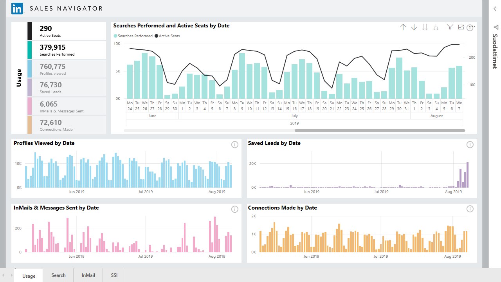

Jos haluat muodostaa yhteyden LinkedIn-tietoihin käyttämällä **LinkedIn Sales Navigatoria**, tarvitset LinkedIn Sales Navigator Enterprise -tilauksen, minkä lisäksi sinun on oltava Sales Navigator -sopimuksen järjestelmänvalvoja tai raportoiva käyttäjä.

Seuraava video on lyhyt esittely ja opetusohjelma **LinkedIn Sales Navigator** -mallisovelluksen käytöstä; mallisovellus kuvataan tarkemmin [edempänä tässä artikkelissa](#using-the-linkedin-sales-navigator-template-app). 

> [!VIDEO https://www.youtube.com/embed/ZqhmaiORLw0]

## Yhdistäminen LinkedIn Sales Navigatoriin

Voit yhdistää **LinkedIn Sales Navigatorin** tietoihin valitsemalla Power BI Desktopin **Aloitus**-valintanauhasta **Nouda tiedot**. Valitse vasemmalla olevista luokista **Online-palvelut** ja vieritä sitten, kunnes näkyviin tulee **LinkedIn Sales Navigator (Beta)** .

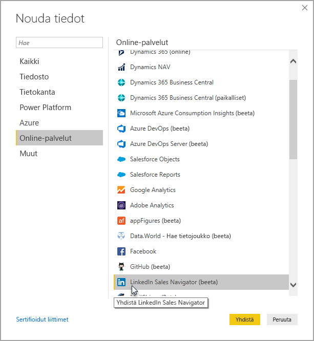

Saat ilmoituksen, että muodostat yhteyden kolmannen osapuolen liittimeen, joka on vielä kehitteillä. 

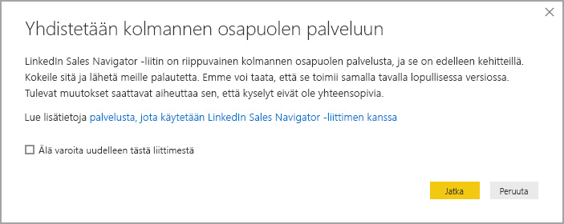

Kun valitset **Jatka**, sinua pyydetään määrittämään, mitä tietoja haluat.

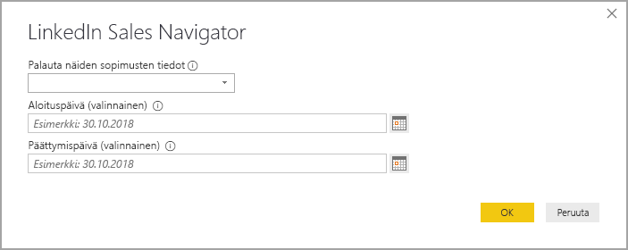

Valitse näkyviin tulevan **LinkedIn Sales Navigator** -ikkunan ensimmäisestä avattavasta valitsimesta, mitä tietoja haluat palautettavan, joko *Kaikki yhteystiedot* tai *Valitut yhteystiedot*. Voit sitten rajoittaa palautettavat tiedot tietylle aikavälille määrittämällä alkamis- ja päättymispäivämäärän.

Kun olet antanut tiedot, Power BI Desktop muodostaa yhteyden LinkedIn Sales Navigator -sopimukseesi liittyviin tietoihin. Käytä samaa sähköpostiosoitetta, jolla kirjaudut sisään LinkedIn Sales Navigatoriin verkkosivuston kautta. 

Kun olet muodostanut yhteyden, näyttöön tulee kehote valita LinkedIn Sales Navigator -sopimuksen tietoja **Navigator**-ikkunasta.

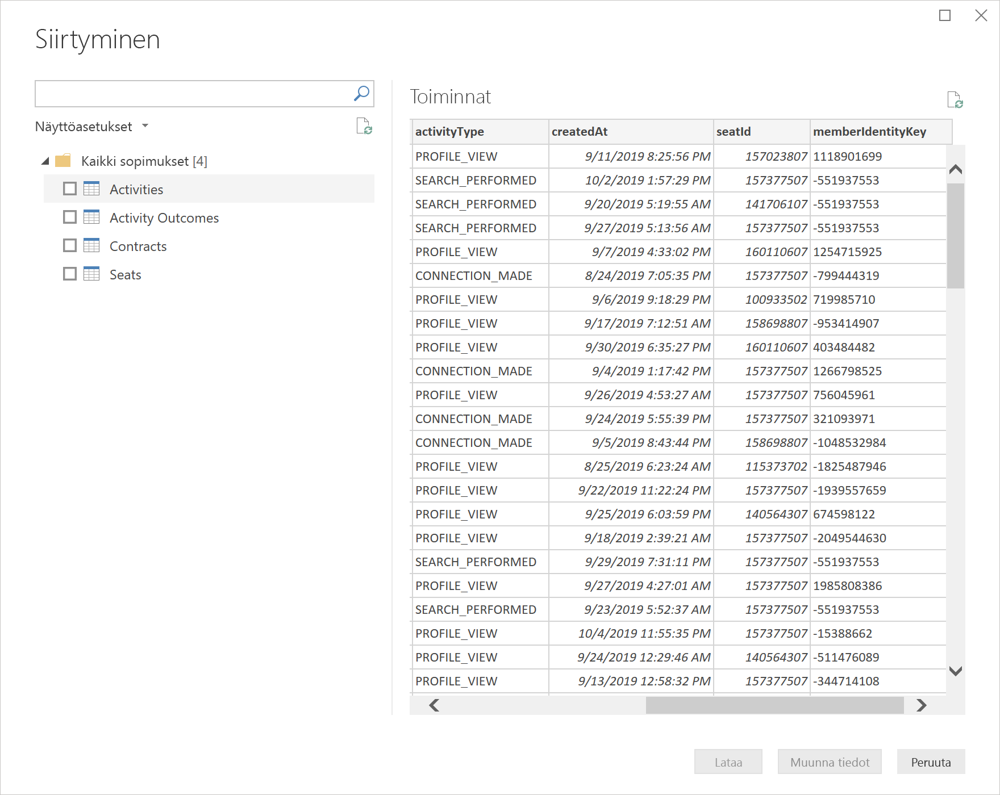

Voit luoda LinkedIn Sales Navigator -tiedoilla millaisia raportteja tahansa. Asioiden helpottamiseksi tarjolla on myös LinkedIn Sales Navigatorin .PBIX-tiedosto, jonka voit ladata ja jossa on valmiina mallitietoja, niin ettei sinun tarvitse aloittaa tyhjästä vaan voit tutustua tietoihin ja raportteihin.

Voit ladata PBIX-tiedoston seuraavasta sijainnista:
* [LinkedIn Sales Navigatorin PBIX](service-template-apps-samples.md)

PBIX-tiedoston lisäksi LinkedIn Sales Navigatorissa on myös mallisovellus, jonka voit ladata ja jota voit käyttää. Seuraavassa osiossa mallisovellus kuvataan tarkasti.

## LinkedIn Sales Navigator -mallisovelluksen käyttäminen

Voit helpottaa **LinkedIn Sales Navigatorin** käyttöä hyödyntämällä [mallisovellusta](service-template-apps-overview.md), joka luo LinkedIn Sales Navigator -tiedoistasi automaattisesti valmiin raportin.

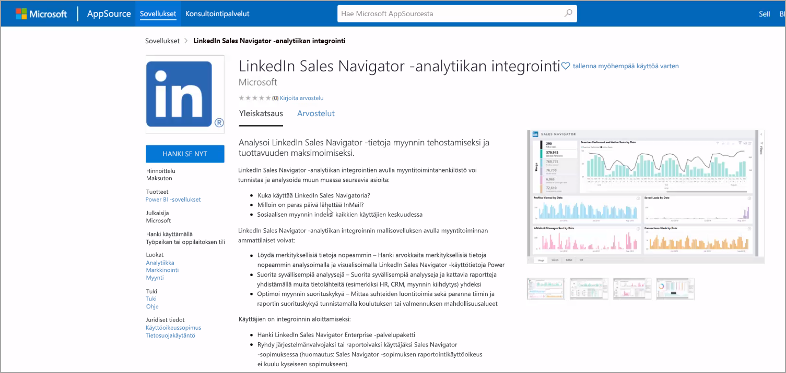

Kun lataat sovelluksen, voit valita, muodostetaanko yhteys tietoihisi vai haluatko tutustua sovellukseen käyttämällä mallitietoja. Voit aina palata taaksepäin ja muodostaa yhteyden omiin LinkedIn Sales Navigatorin tietoihisi, kun olet ensin tutkinut mallitietoja. 

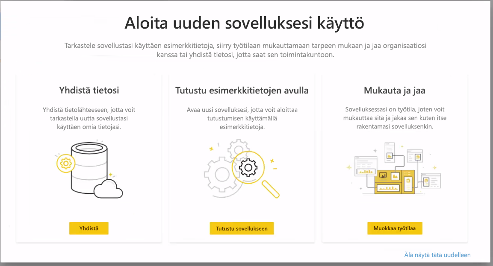

Saat **LinkedIn Sales Navigatorin** mallisovelluksen seuraavasta linkistä:
* [LinkedIn Sales Navigator -mallisovellus](https://appsource.microsoft.com/product/power-bi/pbi-contentpacks.linkedin_navigator-preview?flightCodes=17ad4c68-fbc5-4925-a351-139fd384ec33)

Mallisovelluksessa on neljä välilehteä, jotka auttavat analysoimaan ja jakamaan tietoja:

* Käyttö
* Hae
* InMail
* SSI

**Käyttö**-välilehdellä näkyvät yleiset LinkedIn Sales Navigatorin tietosi.

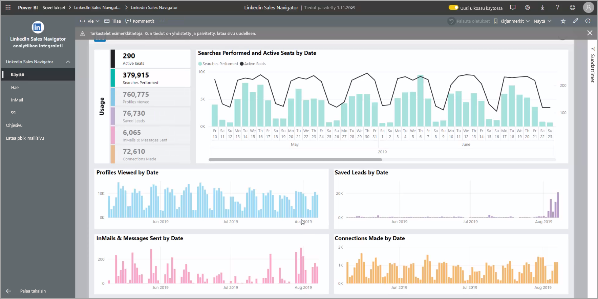

**Hae**-välilehdellä voit porautua syvemmälle hakutuloksiin:

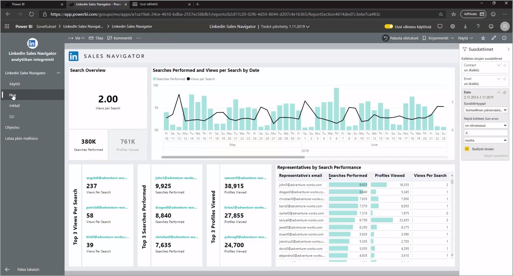

**InMail**-välilehdellä on tietoja InMailin käytöstäsi, kuten lähetettyjen InMail-viestien määrä, hyväksymisprosentti ja muita hyödyllisiä tietoja:

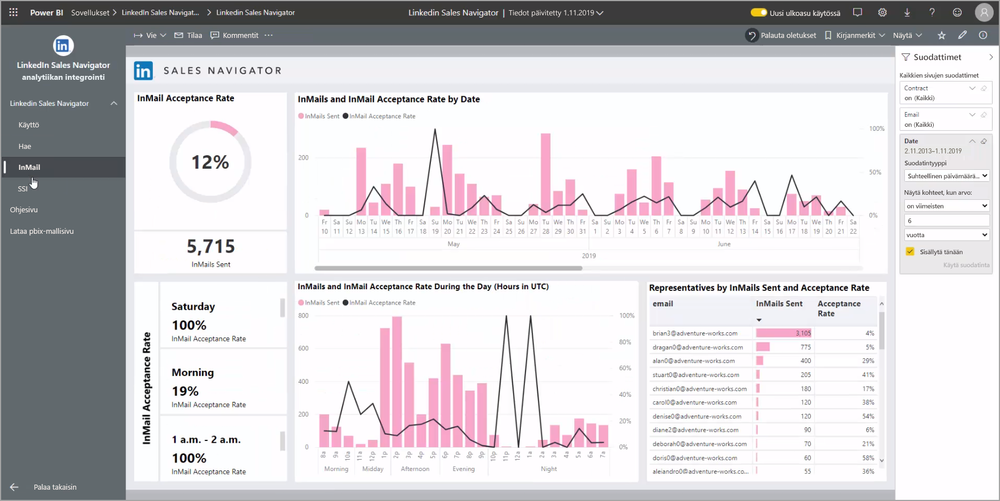

**SSI**-välilehdellä on lisätietoja SSI (Social Selling Index) -arvostasi:

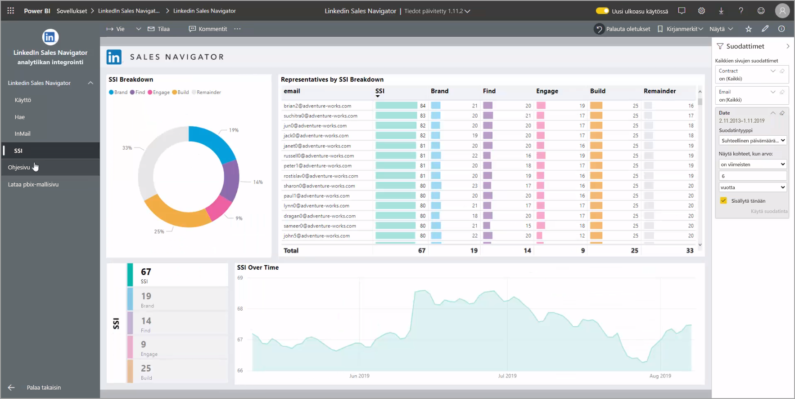

Jos haluat siirtyä mallitiedoista omiin tietoihisi, valitse oikeasta yläkulmasta **muokkaa sovellusta** (kynäkuvake) ja valitse sitten näkyviin tulevasta ruudusta **Yhdistä tietosi**.

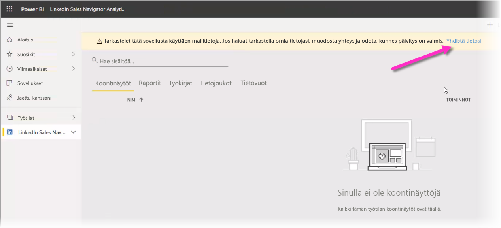

Voit sitten muodostaa yhteyden omiin tietoihisi ja valita, monenko päivän tiedot ladataan. Voit ladata enintään 365 päivän tiedot. Sinun tulee kirjautua sisään käyttämällä samaa sähköpostiosoitetta, jolla kirjaudut sisään LinkedIn Sales Navigatoriin verkkosivuston kautta. 

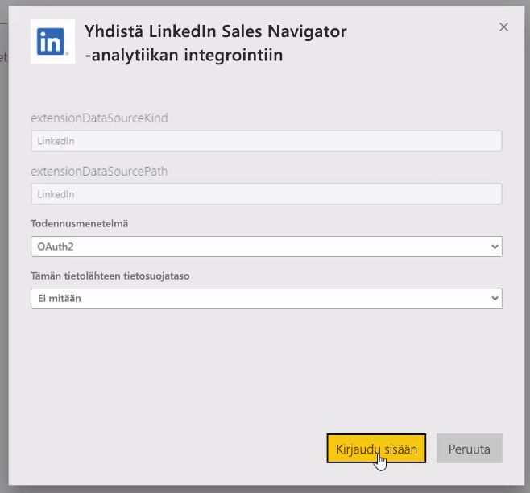

Mallisovellus päivittää sitten sovelluksen tiedot omilla tiedoillasi. Voit myös määrittää ajoitetun tietojen päivityksen, niin että sovelluksesi tiedot ovat niin ajan tasalla kuin päivitystiheytesi määrittää. 

Kun tiedot ovat päivittyneet, näet sovelluksen täyttyneen omilla tiedoillasi.

## Ohjeiden hakeminen

Jos yhteyden muodostaminen tietoihisi aiheuttaa ongelmia, voit ottaa yhteyttä LinkedIn Sales Navigator -tukeen osoitteessa https://www.linkedin.com/help/sales-navigator. 

## Seuraavat vaiheet
Power BI Desktopin avulla voit muodostaa yhteyden hyvin monenlaisiin tietoihin. Lisätietoja näistä tietolähteistä saat seuraavista resursseista:

* [Mikä on Power BI Desktop?](desktop-what-is-desktop.md)
* [Power BI Desktopin tietolähteet](desktop-data-sources.md)
* [Tietojen muotoilu ja yhdistäminen Power BI Desktopissa](desktop-shape-and-combine-data.md)
* [Yhteyden muodostaminen Excel-työkirjoihin Power BI Desktopissa](desktop-connect-excel.md)   
* [Tietojen antaminen suoraan Power BI Desktopiin](desktop-enter-data-directly-into-desktop.md)   

