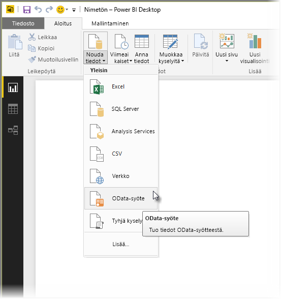
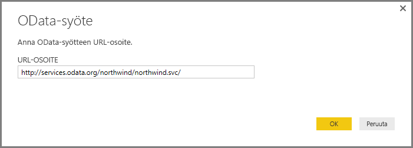
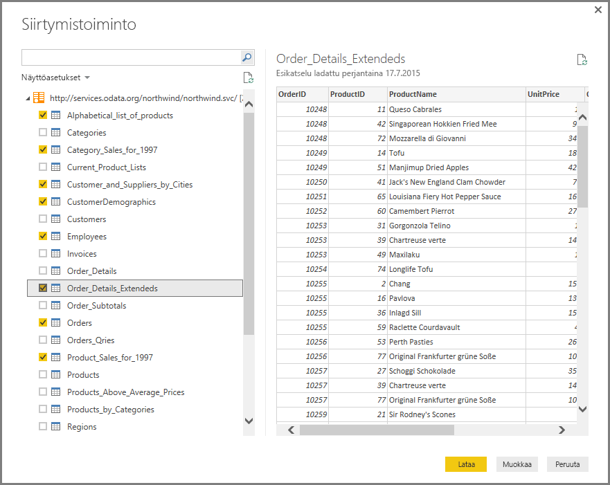
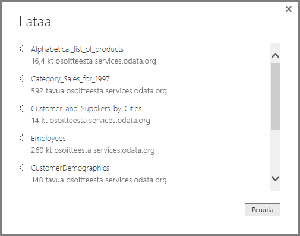
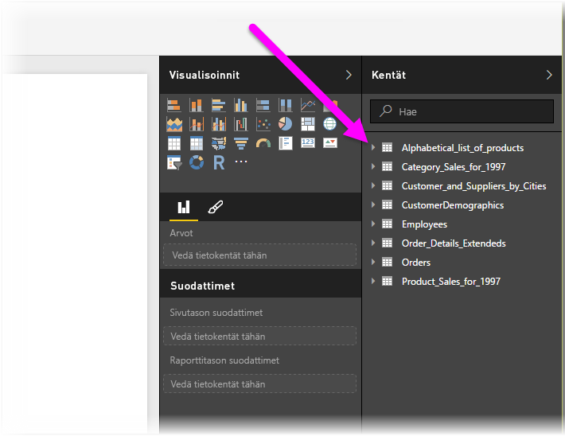

# OData-syötteisiin yhdistäminen Power BI Desktopissa
Power BI Desktopissa voi muodostaa yhteyden **OData-syötteeseen** ja käyttää sen tietoja samaan tapaan kuin muita tietolähteitä käytetään Power BI Desktopissa.

Jos haluat muodostaa yhteyden OData-syötteeseen, valitse **Nouda tiedot > OData-syöte** Power BI Desktopin**Aloitus**-valintanauhasta.

Näyttöön tulevassa **OData-syöte**-ikkunassa kirjoita tai liitä OData-syötteen URL-osoite ruutuun ja valitse **OK**.

Power BI Desktop muodostaa yhteyden OData-syötteeseen ja näyttää käytettävissä olevat taulukot ja muut tietoelementit **Siirtymistoiminto**-ikkunassa. Kun valitset elementin, **Siirtymistoiminto**-ikkunan oikeanpuoleisessa ruudussa näkyy tietojen esikatselu. Voit valita tuontia varten niin monta taulukkoa kuin haluat. **Siirtymistoiminto**-ikkuna näyttää valittuna olevan taulukon esikatselunäkymän.

**Muokkaa**-painikkeen valitseminen käynnistää **Kyselyeditorin**, jossa voit muotoilla ja muuntaa ODatan tietoja ennen niiden tuomista Power BI Desktopiin. Voit vaihtoehtoisesti valita **Lataa**-painikkeen ja tuoda kaikki vasemmassa ruudussa valitsemasi tietoelementit.

Kun **Lataa** valitaan, Power BI Desktop tuo valitut kohteet ja näyttää tuonnin edistymisen **Lataa**-ikkunan.

Kun toiminto on valmis, Power BI Desktop tuo valitut taulukot ja muut tietoelementit käytettäviksi **Kentät**-ruudussa, joka näkyy Power BI Desktopin *Raportit*-näkymän oikeassa reunassa.

Siinä kaikki.

Olet nyt valmis käyttämään OData-syötteestä tuotuja tietoja Power BI Desktopissa visualisointien tai raporttien luomiseen tai vuorovaikutukseen muiden tietojen kanssa, joihin ehkä haluat olla yhteydessä ja joita tuot, kuten Excel-työkirjat, tietokannat tai muut tietolähteet.

## Seuraavat vaiheet
Power BI Desktopin avulla voit muodostaa yhteyden hyvin monenlaisiin tietoihin. Lisätietoja näistä tietolähteistä saat seuraavista resursseista:

* [Mikä on Power BI Desktop?](desktop-what-is-desktop.md)
* [Power BI Desktopin tietolähteet](desktop-data-sources.md)
* [Tietojen muotoilu ja yhdistäminen Power BI Desktopissa](desktop-shape-and-combine-data.md)
* [Yhteyden muodostaminen Excel-työkirjoihin Power BI Desktopissa](desktop-connect-excel.md)   
* [Tietojen antaminen suoraan Power BI Desktopiin](desktop-enter-data-directly-into-desktop.md)   

