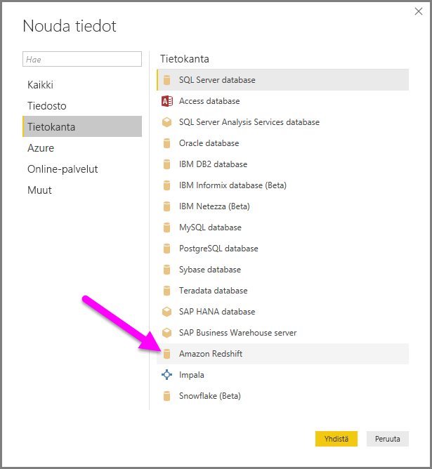
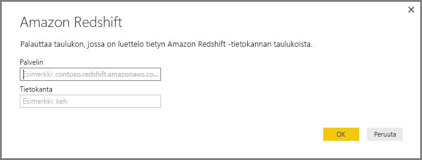
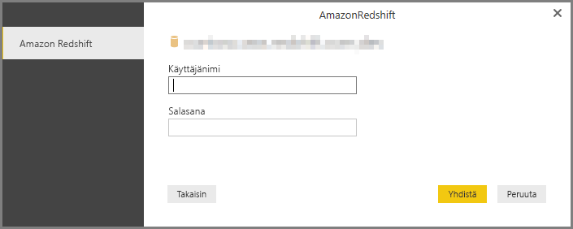
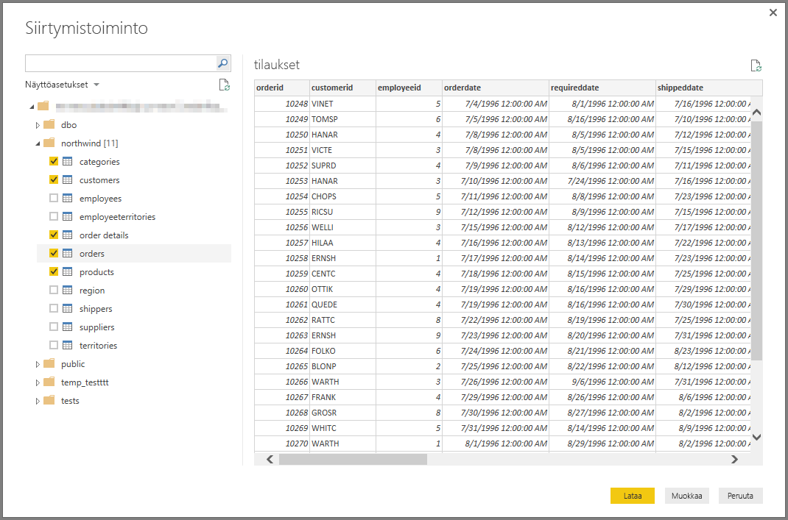

# Yhteyden muodostaminen Amazon Redshiftiin Power BI Desktopissa
**Power BI Desktopissa** voi muodostaa yhteyden **Amazon Redshift** ‑tietokantaan ja käyttää sen tietoja samaan tapaan kuin muita tietolähteitä käytetään Power BI Desktopissa.

## Yhteyden muodostaminen Amazon Redshift-tietokantaan
Jos haluat muodostaa yhteyden **Amazon Redshift** ‑tietokantaan, valitse Power BI Desktopissa **Aloitus**-valintanauhasta **Nouda tiedot**. Valitse näkymän vasemmasta laidasta **Tietokanta**, ja näkyviin tulee **Amazon Redshift**.

Kirjoita tai liitä näytölle avautuvan **Amazon Redshift** -ikkunan tekstikenttään halutun **Amazon Redshift** ‑palvelimen ja tietokannan nimi. Käyttäjä voi määrittää *Palvelin*-kenttään haluamansa portin seuraavassa muodossa: *palvelinURL:portti*

Kirjoita näytölle avautuvaan kehoteikkunaan käyttäjänimesi ja salasanasi.

Kun yhteyden muodostaminen onnistuu, näytölle avautuu **Siirtymistoiminto**-ikkuna, jossa näet palvelimella käytettävissä olevat tiedot. Voit valita ikkunasta yhden tai useita elementtejä tuotavaksi **Power BI Desktopiin**.

Kun olet tehnyt haluamasi valinnat **Siirtymistoiminto**-ikkunassa, voit joko **Lataa** tiedot tai **Muokkaa** tietoja.

* Jos valitset **Lataa**, sinua pyydetään käyttämään joko *Tuo*- tai *DirectQuery*-tilaa. Lisätietoja saat tästä [DirectQueryn toiminnasta kertovasta artikkelista](desktop-use-directquery.md).
* Jos valitset **Muokkaa**, näytölle avautuu **Kyselyeditori**, jossa voit soveltaa tietoihin erilaisia muuntoja ja suodattimia. Monia niistä sovelletaan suoraan taustalla olevaan **Amazon Redshift** ‑tietokantaan (jos tuettu).

## Seuraavat vaiheet
Power BI Desktopin avulla voit muodostaa yhteyden hyvin monenlaisiin tietoihin. Lisätietoja näistä tietolähteistä saat seuraavista resursseista:

* [Power BI Desktopin käytön aloittaminen](desktop-getting-started.md)
* [Power BI Desktopin tietolähteet](desktop-data-sources.md)
* [Tietojen muotoilu ja yhdistäminen Power BI Desktopissa](desktop-shape-and-combine-data.md)
* [Yhteyden muodostaminen Excel-työkirjoihin Power BI Desktopissa](desktop-connect-excel.md)   
* [Tietojen antaminen suoraan Power BI Desktopiin](desktop-enter-data-directly-into-desktop.md)   

