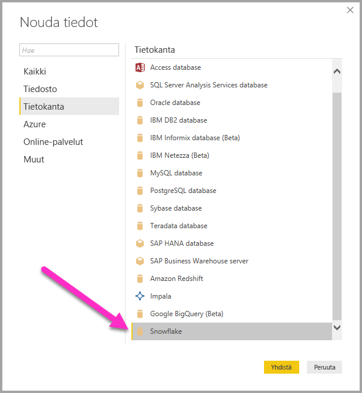
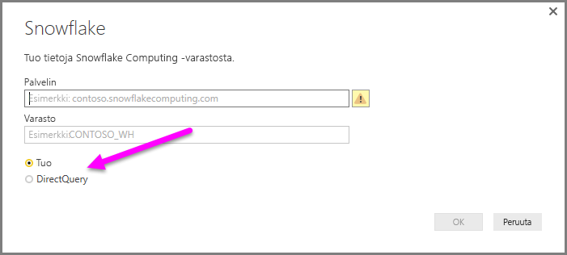
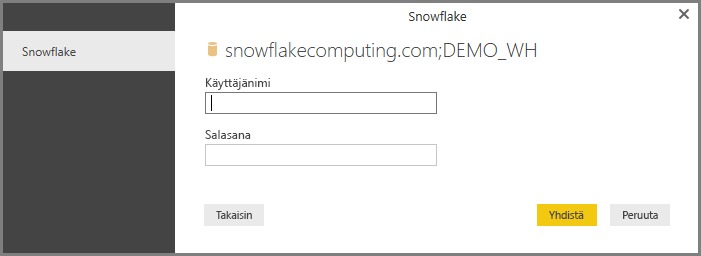
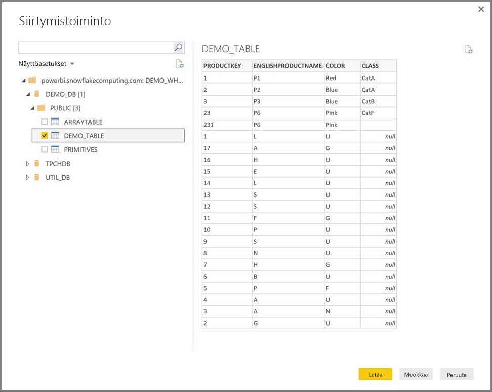

# Snowflakeen yhdistäminen Power BI Desktopissa
Voit muodostaa Power BI Desktopissa yhteyden **Snowflake Computing** -varastoon ja käyttää sen tietoja samaan tapaan kuin muita tietolähteitä käytetään Power BI Desktopissa. 

> [!NOTE]
> Sinun *täytyy* myös asentaa **Snowflaken ODBC-ohjain** tietokoneisiin, joissa käytetään **Snowflake**-liitintä, käyttämällä arkkitehtuuria, joka vastaa **Power BI Desktopin** versiota, joko 32- tai 64-bittistä. Käytä seuraavaa linkkiä ja [lataa sopiva Snowflaken ODBC-ohjain](http://go.microsoft.com/fwlink/?LinkID=823762).
> 
> 

## Snowflake Computing -varastoon yhdistäminen
Jos haluat muodostaa yhteyden **Snowflake Computing** ‑varastoon, valitse Power BI Desktopin **Aloitus**-valintanauhasta **Nouda tiedot**. Valitse vasemmalla näkyvistä luokista **Tietokanta**, jolloin näkyviin tulee **Snowflake**.

Kirjoita tai liitä näkyviin tulevan **Snowflake**-ikkunan ruutuun Snowflake Computing -varastosi nimi ja valitse **OK**. Huomaa, että voit **tuoda** tiedot suoraan Power BI:hin tai käyttää **DirectQueryä**. Lue lisätietoja [DirectQueryn käyttämisestä](desktop-use-directquery.md).

Kirjoita käyttäjänimesi ja salasanasi pyydettäessä.

> [!NOTE]
> Kun annat tietyn **Snowflake**-palvelimen käyttäjänimen ja salasanan, Power BI Desktop käyttää samoja tunnistetietoja, kun yhteyttä yritetään muodostaa seuraavan kerran. Voit muokata näitä tunnistetietoja valitsemalla **Tiedosto > Asetukset ja vaihtoehdot > Tietolähdeasetukset**.
> 
> 

Kun yhteyden muodostaminen onnistuu, näytölle avautuu **Siirtymistoiminto**-ikkuna, jossa näet palvelimella käytettävissä olevat tiedot. Voit valita ikkunasta yhden tai useita elementtejä tuotavaksi **Power BI Desktopiin**.

Voit myös **ladata** valitun taulukon, joka tuo koko taulukon **Power BI Desktopiin**, tai voit **muokata** kyselyä, joka avautuu **kyselyeditoriin**, jolloin voit suodattaa ja tarkentaa tietojoukkoa, jota haluat käyttää, ja ladata tarkennetun tietojoukon **Power BI Desktopiin**.

## Seuraavat vaiheet
Power BI Desktopin avulla voit muodostaa yhteyden hyvin monenlaisiin tietoihin. Lisätietoja näistä tietolähteistä saat seuraavista resursseista:

* [Mikä on Power BI Desktop?](desktop-what-is-desktop.md)
* [Power BI Desktopin tietolähteet](desktop-data-sources.md)
* [Tietojen muotoilu ja yhdistäminen Power BI Desktopissa](desktop-shape-and-combine-data.md)
* [Yhteyden muodostaminen Excel-työkirjoihin Power BI Desktopissa](desktop-connect-excel.md)   
* [Tietojen antaminen suoraan Power BI Desktopiin](desktop-enter-data-directly-into-desktop.md)   

