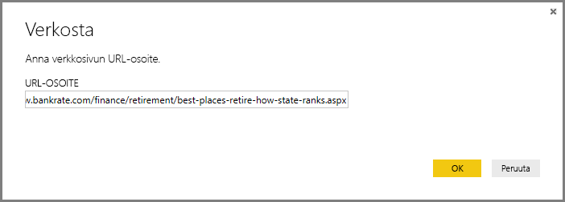
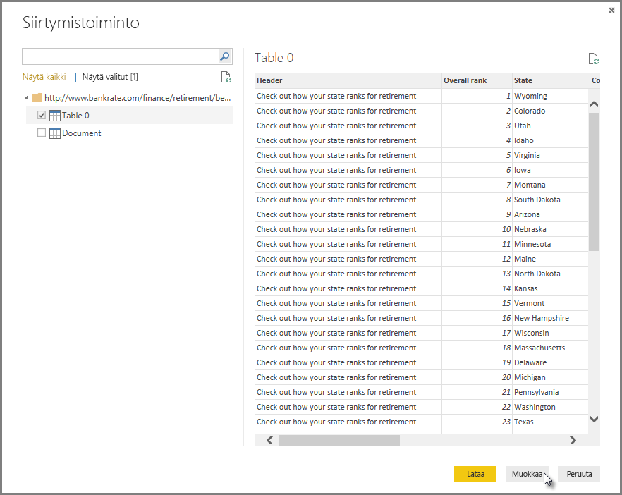
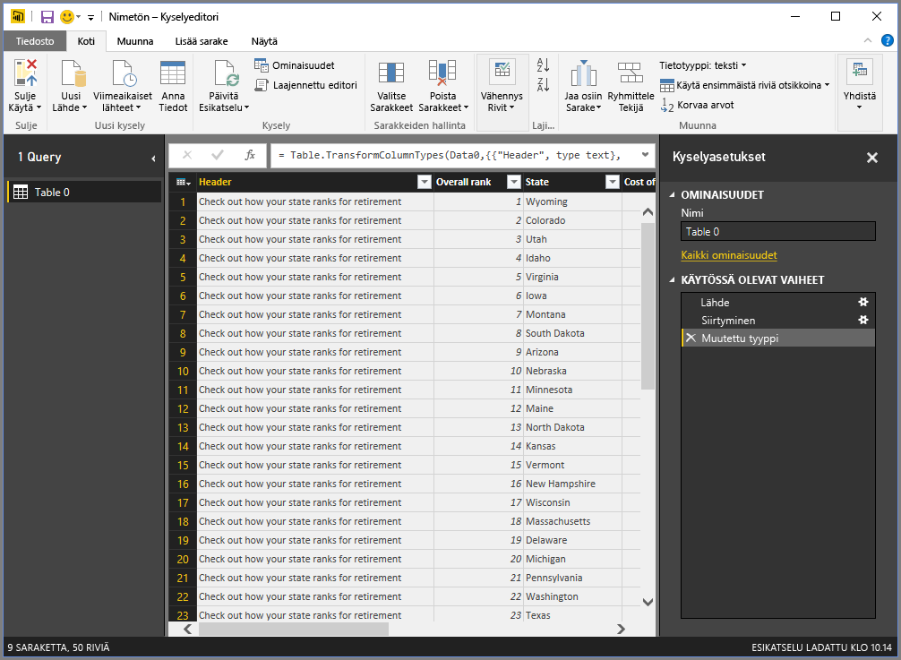
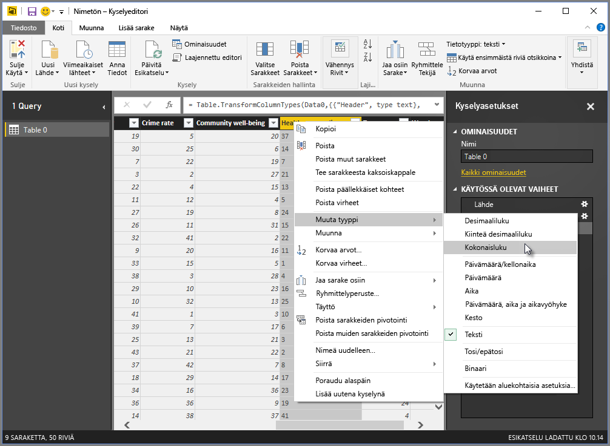
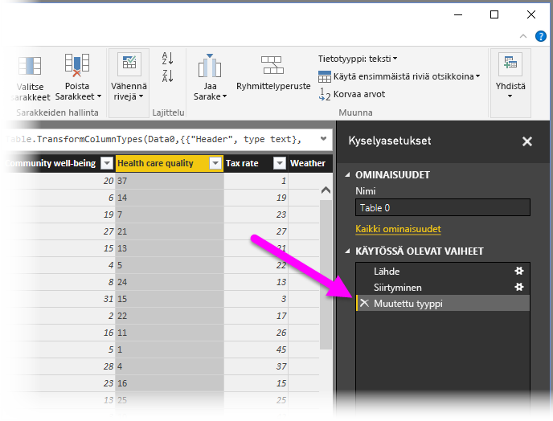
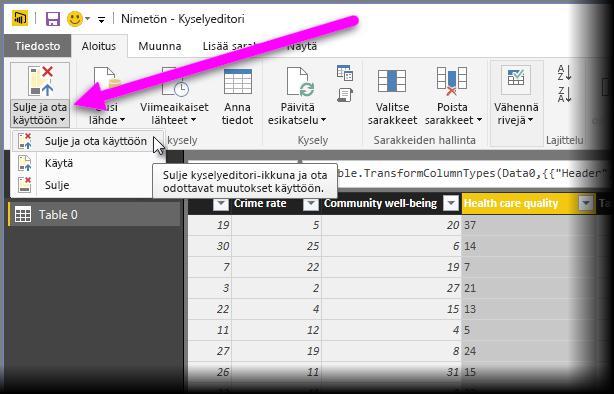
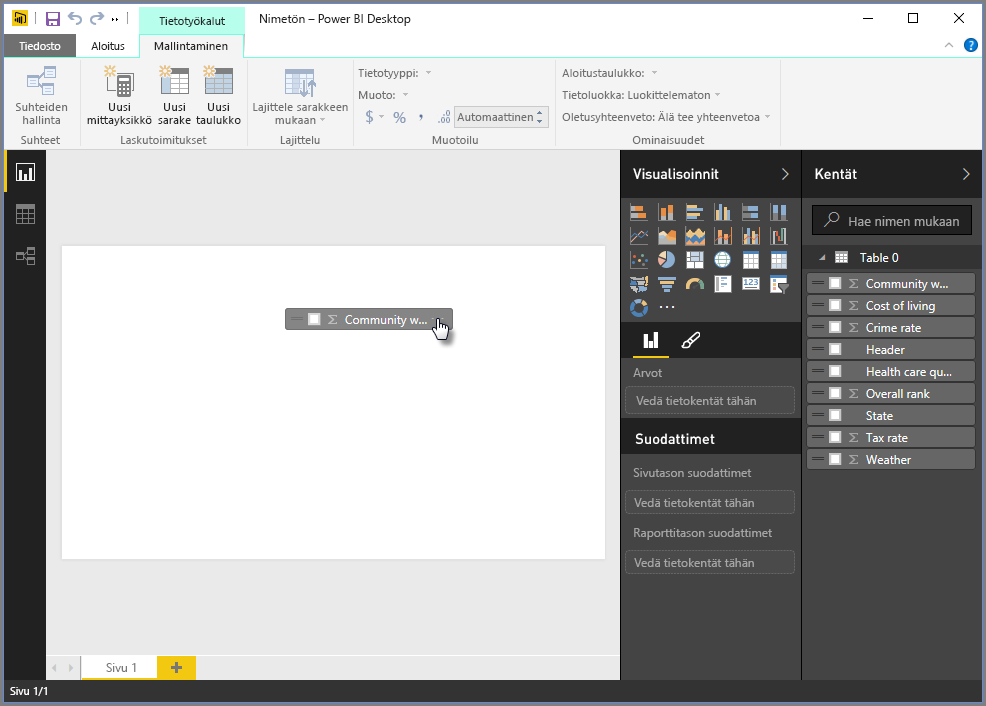
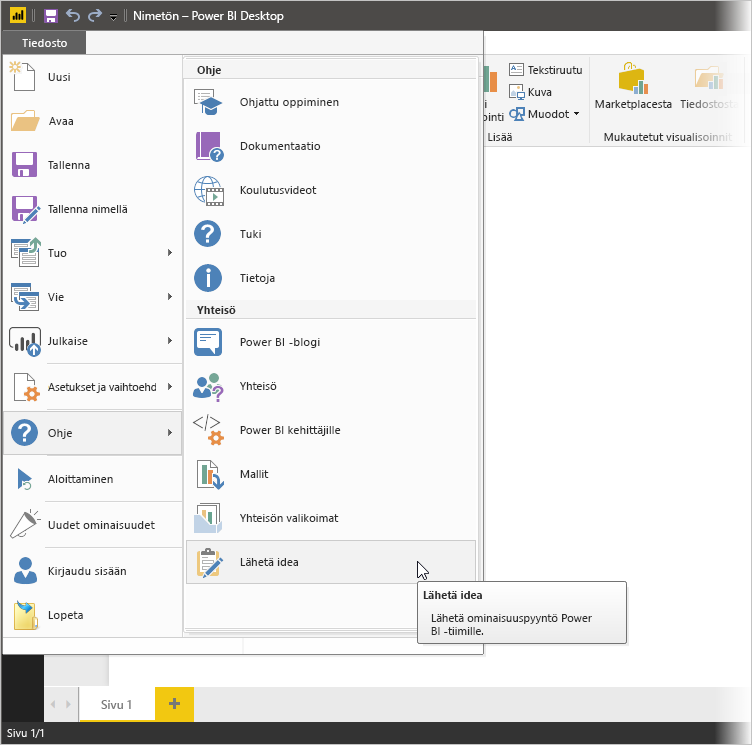

# Tietoihin yhdistäminen Power BI Desktopissa
Power BI Desktopilla voit helposti muodostaa yhteyden alati laajenevaan tietomaailmaan. Jos sinulla ei ole Power BI Desktopia, voit [ladata](http://go.microsoft.com/fwlink/?LinkID=521662) ja asentaa sen.

Power BI Desktopissa on käytössä *monenlaisia* tietolähteitä. Seuraavassa kuvassa näytetään, miten voit yhdistää tietoihin, valitsemalla **Tiedosto**-valintanauhan ja sitten **Nouda tiedot \> Lisää**.

## Esimerkki yhteyden muodostamisesta tietoihin
Tässä esimerkissä muodostamme yhteyden **Web** tietolähteeseen.

Kuvittele, että jäät eläkkeelle ja haluat asumaan sinne, jossa on paljon aurinkoa, alhaiset verot ja hyvä terveydenhuolto. Tai... ehkä olet tietoanalyytikko ja haluat tietojen auttavan asiakkaita, kuten vaikka auttamalla sadetakkien valmistajaa aloittamaan kampanjan, kun sataa *paljon*.

Joka tapauksessa löydät verkkoresurssin, joka sisältää kiinnostavaa tietoa näistä ja muista aiheista:

[*http://www.bankrate.com/finance/retirement/best-places-retire-how-state-ranks.aspx*](http://www.bankrate.com/finance/retirement/best-places-retire-how-state-ranks.aspx)

Valitse **Nouda tiedot \> Verkko**  ja kirjoita osoite.

Kun valitset **OK**, Power BI Desktopin **Kysely**-toiminto käynnistyy. Power BI Desktop muodostaa yhteyden verkkoresurssiin, ja **Siirtymistoiminnon** ikkuna palauttaa verkkosivulta löydetyt tulokset. Tässä tapauksessa se löysi taulukon (Table 0) ja yleisen asiakirjan. Meitä kiinnostaa taulukko, joten valitsemme sen luettelosta. **Siirtymistoiminnon** ikkuna näyttää esikatselun.

Tässä vaiheessa voimme muokata kyselyä ennen taulukon lataamista valitsemalla ikkunan alareunassa **Muokkaa** tai voimme ladata taulukon.

Jos valitaan **Muokkaa**, taulukko ladataan ja kyselyeditori käynnistetään. **Kyselyasetukset**-ruutu avautuu (jos ei, valitse valintanauhassa **Näytä** ja avaa **Kyselyasetukset**-ruutu valitsemalla **Näytä \> kyselyasetukset**). Se näyttää tältä.

Nämä pisteet ovat numeroiden sijaan tekstiä, vaikka niiden pitää olla lukuja meidän tarkoituksessamme. Voit vaihtaa sitä helposti napsauttamalla vain hiiren kakkospainikkeella sarakkeen otsikkoa ja valitsemalla **Muuta tyyppi \> Kokonaisluku**. Valitse useita sarakkeita, valitse ensimmäinen sarake, paina **VAIHTO**-näppäin pohjaan, valitse vierekkäisiä sarakkeita ja vaihda sitten kaikki valitut sarakkeet napsauttamalla hiiren kakkospainikkeella jotain valittua sarakeotsikkoa. Paina **CTRL**, kun valitset sarakkeita, jotka eivät ole vierekkäin.

**Kyselyasetukset**-kohdassa **Käytössä olevat vaiheet** kuvastavat tehtyjä muutoksia. Samalla, kun teet muita muutoksia tietoihin, kyselyeditori tallentaa nämä muutokset kohtaan **Käytössä olevat vaiheet**, jota voit säätää, järjestää, käyttää uudelleen tai poistaa tarpeen mukaan.

Taulukkoon voi edelleen tehdä muutoksia sen jälkeen, kun se on ladattu, mutta toistaiseksi tämä riittää. Kun kaikki on valmista, valitaan **Sulje ja ota käyttöön** **Aloitus**-valintanauhasta, ja Power BI Desktop ottaa muutokset käyttöön ja sulkee kyselyeditorin.

Kun tietomalli on ladattu, voimme Power BI Desktopin **Raportti**-näkymässä aloittaa visualisointien luomisen vetämällä kentät piirtoalustan.

Kyseessä on tietysti yksinkertainen malli, joka sisältää yhden tietoyhteyden. Useimmissa Power BI Desktop -raporteissa meillä on yhteydet eri tietolähteisiin tarpeidesi mukaan suhteilla, jotka tuottavat monipuolisen tietomallin. 

## Seuraavat vaiheet
Voit tehdä kaikenlaista Power BI Desktopilla. Saat lisätietoja sen toiminnoista seuraavista resursseista:

* [Mikä on Power BI Desktop?](desktop-what-is-desktop.md)
* [Power BI Desktopin kyselyiden yleiskatsaus](desktop-query-overview.md)
* [Power BI Desktopin tietolähteet](desktop-data-sources.md)
* [Tietojen muotoilu ja yhdistäminen Power BI Desktopissa](desktop-shape-and-combine-data.md)
* [Yleiset kyselytehtävät Power BI Desktopissa](desktop-common-query-tasks.md)   

Haluatko antaa palautetta? Hienoa – Käytä **Lähetä idea** -valikon kohtaa Power BI Desktopissa tai katso [yhteisön palautetta](http://community.powerbi.com/t5/Community-Feedback/bd-p/community-feedback). Odotamme kuulevamme sinusta!

