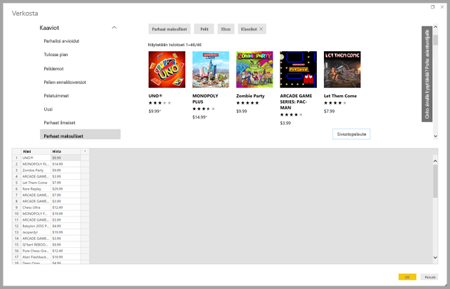
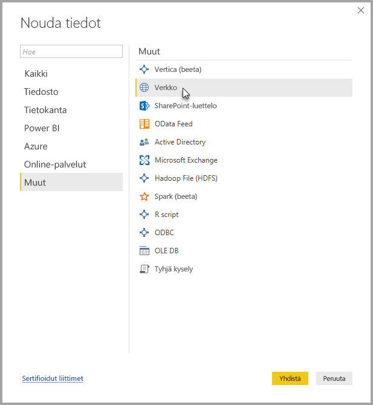
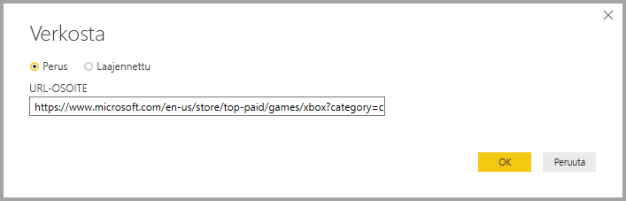
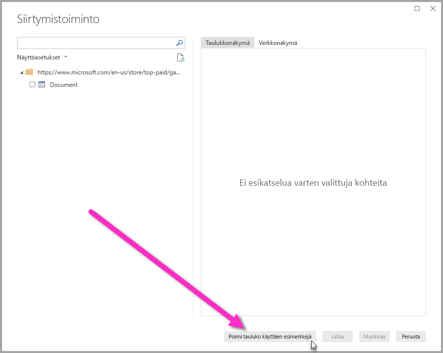
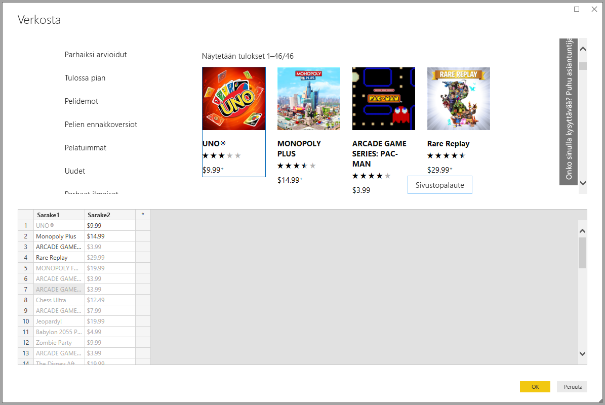
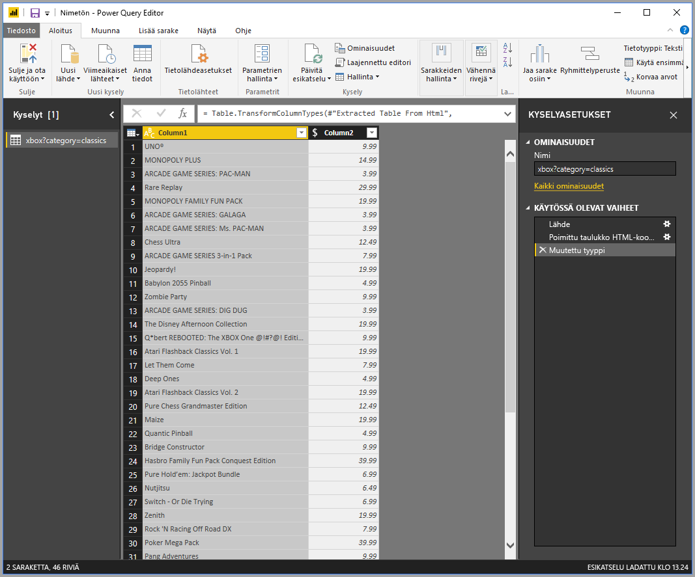

# Tietojen tuominen verkkosivulta esimerkkejä antamalla

Tietojen tuominen verkkosivulta antaa käyttäjien poimia tietoja helposti verkkosivuilta ja tuoda niitä *Power BI Desktopiin*. Verkkosivuilla olevat tiedot eivät kuitenkaan usein ole siisteissä taulukoissa, joista tietoja on helppo poimia. Tietojen poiminta tällaisilta sivuilta voi olla haastavaa, vaikka tiedot olisivat jäsenneltyjä ja yhdenmukaisia.

Ongelmaan on ratkaisu. *Tuo esimerkin mukaisia tietoja verkosta* -toiminnon avulla voit näyttää Power BI Desktopille, mitä tietoja haluat poimia, antamalla yhden tai useampia esimerkkejä yhdistimen valintaikkunassa. Power BI Desktop kerää sivulta muita tietoja, jotka vastaavat esimerkkejäsi. Tämän ratkaisun avulla voit poimia verkkosivuilta kaikenlaisia tietoja, mukaan lukien sekä *taulukoissa* että taulukoiden ulkopuolella olevia tietoja.

Kuvissa olevat hinnat ovat vain esimerkkejä varten.

## Tuo esimerkin mukaisia tietoja verkosta -toiminnon käyttö

Valitse **Nouda tiedot** **Aloitus**-valintanauhasta. Valitse esiin tulevasta valintaikkunasta **Muut** vasemmassa ruudussa olevista luokista ja valitse sitten **Verkko**. Jatka valitsemalla **Yhdistä**.

Syötä sitten **Verkosta**-kohtaan sen verkkosivun URL-osoite, josta haluat poimia tietoja. Tässä artikkelissa käytämme Microsoft Store -verkkosivua ja näytämme, miten tämä yhdistin toimii.

Jos haluat edetä mukana, voit käyttää [Microsoft Storen URL-osoitetta](https://www.microsoft.com/store/top-paid/games/xbox?category=classics), jota käytämme artikkelissa:

    https://www.microsoft.com/store/top-paid/games/xbox?category=classics

Kun valitset **OK**, siirryt **Siirtymistoiminto**-valintaikkunaan, jossa esitetään verkkosivulta mahdollisesti automaattisesti havaitut taulukot. Alla olevassa kuvassa näytetyssä tapauksessa ei löytynyt taulukoita. Jos haluat antaa esimerkkejä, valitse **Lisää taulukko käyttäen esimerkkejä**.

**Lisää taulukko käyttäen esimerkkejä** -kohdassa on vuorovaikutteinen ikkuna, jossa voit esikatsella verkkosivun sisältöä. Anna poimittavien tietojen malliarvot.

Tässä esimerkissä poimimme kunkin sivustolla olevan pelin *Nimen* ja *Hinnan*. Voimme tehdä niin antamalla pari esimerkkiä sivulta kussakin sarakkeessa. Kun kirjoitat esimerkkejä, *Power Query* poimii tiedot, jotka sopivat esimerkkisyötteiden rakenteeseen, käyttämällä älykkäitä tietojen poiminta-algoritmeja.

> [!NOTE]
> Arvoehdotukset sisältävät vain arvot, jotka ovat enintään 128 merkkiä pitkiä.

Kun olet tyytyväinen verkkosivulta poimittuihin tietoihin, siirry Power Query -editoriin valitsemalla **OK**. Voit soveltaa muita muunnoksia tai muotoilla tietoja, kuten yhdistää nämä tiedot muihin tietolähteisiin.

Voit sitten luoda visualisointeja tai käyttää muuten verkkosivun tietoja luodessasi Power BI Desktop -raportteja.

## Seuraavat vaiheet

Power BI Desktopin avulla voit muodostaa yhteyden hyvin monenlaisiin tietoihin. Lisätietoja näistä tietolähteistä saat seuraavista resursseista:

* [Sarakkeen lisääminen esimerkistä Power BI Desktopissa](desktop-add-column-from-example.md)
* [Verkkosivuille yhdistäminen Power BI Desktopista](desktop-connect-to-web.md)
* [Power BI Desktopin tietolähteet](desktop-data-sources.md)
* [Tietojen muotoilu ja yhdistäminen Power BI Desktopissa](desktop-shape-and-combine-data.md)
* [Yhteyden muodostaminen Excel-työkirjoihin Power BI Desktopissa](desktop-connect-excel.md)
* [CSV-tiedostoihin yhdistäminen Power BI Desktopissa](desktop-connect-csv.md)
* [Tietojen antaminen suoraan Power BI Desktopiin](desktop-enter-data-directly-into-desktop.md)
