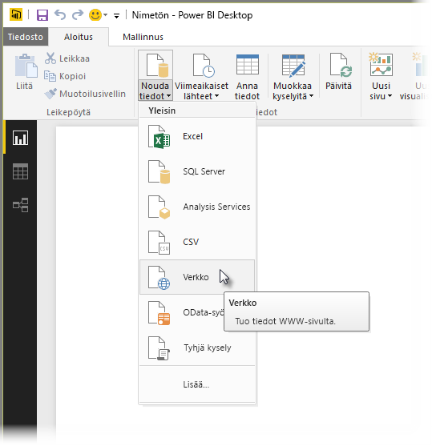
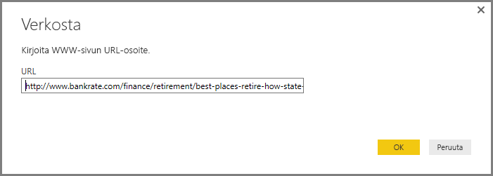
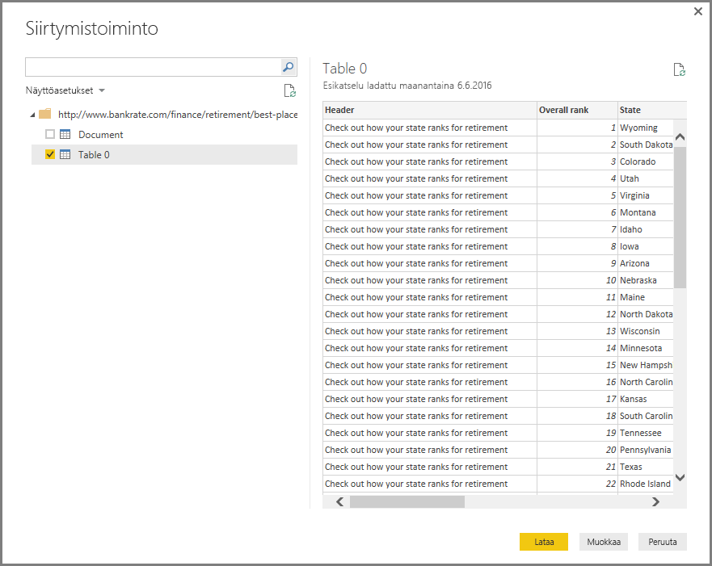
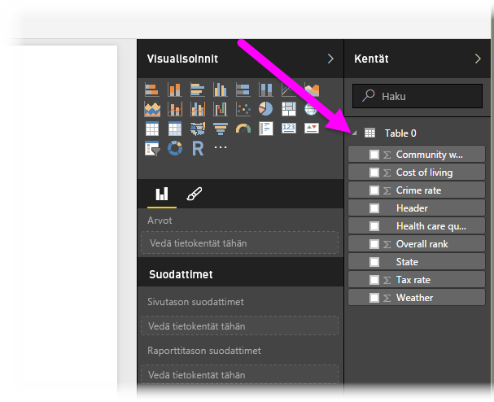

# Verkkosivuun yhdistäminen Power BI Desktopista
Voit muodostaa yhteyden verkkosivuun ja tuoda sen tiedot Power BI Desktopiin visualisoinneissa ja tietomalleissa käyttöä varten.

Valitse Power BI Desktopissa **Nouda tiedot > Verkko** **Aloitus**-valintanauhasta.

Näyttöön tulee valintaikkuna, jossa kysytään sen verkkosivun URL-osoite, josta haluat tuoda tiedot.

Kun olet kirjoittanut (tai liittänyt) URL-osoitteen, valitse **OK**. Power BI Desktop muodostaa yhteyden kyseiseen sivuun ja esittää sivun käytettävissä olevat tiedot **Siirtymistoiminto**-ikkunassa. Kun valitset jonkin käytettävissä olevista tietoelementeistä, kuten koko sivun taulukon, **Siirtymistoiminto**-ikkunassa näkyy kyseisten tietojen esikatselu ikkunan oikeassa reunassa.

Voit valita **Muokkaa**-painikkeen, joka käynnistää **Kyselyeditorin**, jossa voit muotoilla ja muuntaa verkkosivun tietoja ennen niiden tuomista Power BI Desktopiin. Voit vaihtoehtoisesti valita **Lataa**-painikkeen ja tuoda kaikki vasemmassa ruudussa valitsemasi tietoelementit.

Kun **Lataa** valitaan, Power BI Desktop tuo valitut kohteet ja tuo ne käytettäviksi **Kentät**-ruudussa, joka näkyy Power BI Desktopin Raportit-näkymän oikeassa reunassa.

Muuta ei tarvita, kun haluat muodostaa yhteyden verkkosivuun ja tuoda sen tiedot Power BI Desktopiin.

Sen jälkeen voit vetää kentät raporttipohjaan ja luoda haluamasi visualisoinnit. Voit myös käyttää verkkosivun tietoja samalla tavalla kuin muitakin tietoja. Voit muotoilla tietoja, voit luoda sen ja mallin muiden tietolähteiden välille suhteita sekä käyttää muita toimintoja, jotta saat luotua juuri sellaisen Power BI -raportin kuin haluat.

Jos haluat nähdä tarkempia tietoja yhteyden muodostamisesta verkkosivuun ja toiminnoista, tutustu [Power BI Desktopin aloitusoppaaseen](desktop-getting-started.md).

### Seuraavat vaiheet
Power BI Desktopin avulla voit muodostaa yhteyden hyvin monenlaisiin tietoihin. Lisätietoja näistä tietolähteistä saat seuraavista resursseista:

* [Power BI Desktopin tietolähteet](desktop-data-sources.md)
* [Tietojen muotoilu ja yhdistäminen Power BI Desktopissa](desktop-shape-and-combine-data.md)
* [Yhteyden muodostaminen Excel-työkirjoihin Power BI Desktopissa](desktop-connect-excel.md)   
* [CSV-tiedostoihin yhdistäminen Power BI Desktopissa](desktop-connect-csv.md)   
* [Tietojen antaminen suoraan Power BI Desktopiin](desktop-enter-data-directly-into-desktop.md)   

