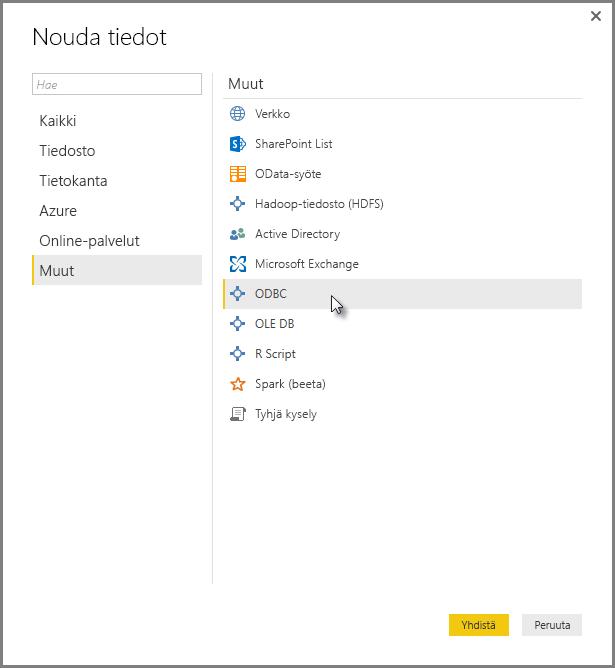
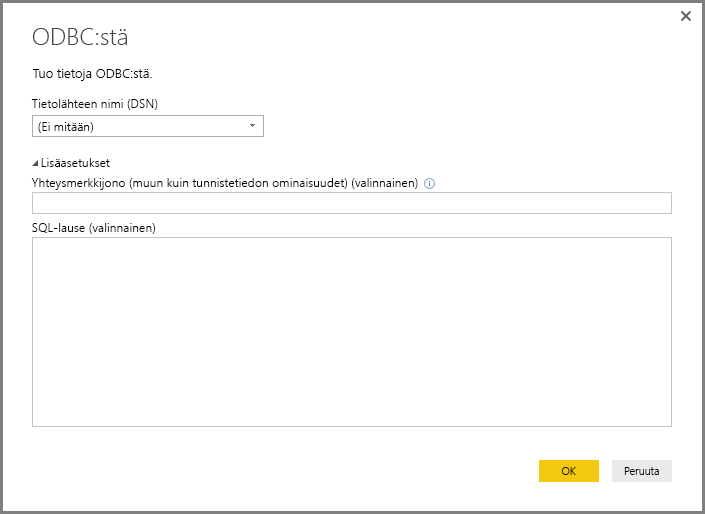
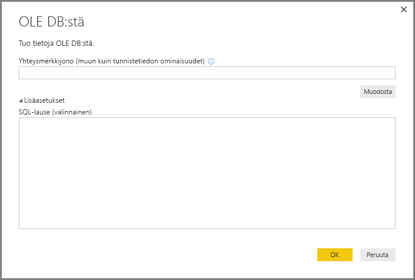
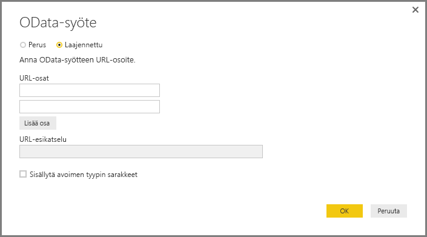
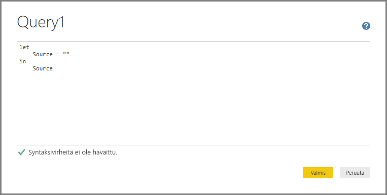
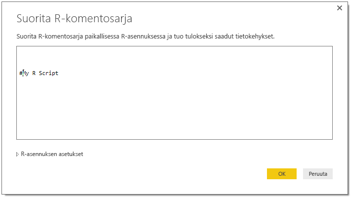

# Tietoihin yhdistäminen yleisten liittymien avulla Power BI Desktopissa
Voit muodostaa yhteyden moniin eri tietolähteisiin **Power BI Desktopissa** käyttämällä valmiita uusia tietoyhteyksiä, jotka ovat väliltä **Access-tietokannat** ja **Zendesk**-resurssit, kuten **Nouda tiedot** -ikkunassa on esitetty. Voit myös muodostaa yhteyden *muihin* tietolähteisiin laajentaaksesi yhteysvaihtoehtoja, käyttämällä yleisiä liittymiä (kuten **ODBC** tai **REST API**) **Power BI Desktopissa**.

## Power BI Desktopin dataliitännät
**Power BI Desktop** sisältää jatkuvasti kasvavan määrän tietoyhteyksiä, jotka on rakennettu yhdistämään tiettyyn tietolähteeseen. Esimerkiksi **SharePoint-luettelon** yhteys tarjoaa tiettyjä kenttiä ja tukitietoja sen yhteyden aikana, jotka on suunniteltu **SharePoint-luetteloa varten**, kuten on asian laita muita tietolähteitä löydettäessä ikkunasta, joka tulee näkyviin, kun valitset **Nouda tiedot > Lisää...**  (katso edellinen kuva).

Lisäksi **Power BI Desktopin** avulla voit yhdistää tietolähteitä, joita ei ole tunnistettu **Nouda tiedot** -luettelossa käyttämällä jotakin seuraavista yleisistä dataliitännöistä:

* **ODBC**
* **OLE DB**
* **OData**
* **REST APIt**
* **R-komentosarja**

Antamalla näiden yleisten liittymien yhdistämisikkunoihin tarvittavat, oikeat parametrit, tietolähteiden maailma **Power BI Desktopissa** kasvaa huomattavasti.

Seuraavissa osissa on luetteloita tietolähteistä, joihin pääset käyttämällä näitä yleisiä liittymiä.

Etkö löydä tietolähdettä, jota haluat käyttää **Power BI Desktopissa**? Lähetä ideasi Power BI -tiimille kohtaan [luettelo ideoista ja pyynnöistä](https://ideas.powerbi.com/).

## Tietolähteet, joihin pääsee ODBC:n kautta
**ODBC**-liitäntä **Power BI Desktopissa** tuo tietoja mistä tahansa kolmannen osapuolen ODBC-ohjaimelta määrittämällä **tietolähteen nimen (DSN)** tai  *yhteysmerkkijonoja*. Vaihtoehtona voit myös määrittää SQL-lausekkeen, jota suoritetaan ODBC-ohjainta vasten.

Seuraavassa luettelossa annetaan muutamia esimerkkejä tietolähteistä, joihin **Power BI Desktop** voit muodostaa yhteyden yleisen **ODBC** -liittymän avulla.

| Power BI Desktopin yleinen liitin | Ulkoinen tietolähde  | Lisätietoja: |
| --- | --- | --- |
| ODBC |Cassandra |[Cassandra ODBC -ohjain](http://www.simba.com/drivers/cassandra-odbc-jdbc/) |
| ODBC |Couchbase DB |[Couchbase ja Power BI](https://powerbi.microsoft.com/blog/visualizing-data-from-couchbase-server-v4-using-power-bi/) |
| ODBC |DynamoDB |[DynamoDB ODBC-ohjain](http://www.simba.com/drivers/dynamodb-odbc-jdbc/) |
| ODBC |Google BigQuery |[Bigquery ODBC -ohjain](http://www.simba.com/drivers/bigquery-odbc-jdbc/) |
| ODBC |Hbase |[Hbase ODBC -ohjain](http://www.simba.com/drivers/hbase-odbc-jdbc/) |
| ODBC |Hive |[Hive ODBC -ohjain](http://www.simba.com/drivers/hive-odbc-jdbc/) |
| ODBC |IBM Netezza |[IBM Netezza -tiedot](https://www.ibm.com/support/knowledgecenter/SSULQD_7.2.1/com.ibm.nz.datacon.doc/c_datacon_plg_overview.html) |
| ODBC |Presto |[Presto ODBC -ohjain](http://www.simba.com/drivers/presto-odbc-jdbc/) |
| ODBC |Project Online |[Project Online -artikkeli](desktop-project-online-connect-to-data.md) |
| ODBC |Progress OpenEdge |[Progress OpenEdge ODBC -ohjaimen blogimerkintä](https://na01.safelinks.protection.outlook.com/?url=https%3A%2F%2Fwww.progress.com%2Fblogs%2Fconnect-microsoft-power-bi-to-openedge-via-odbc-driver&data=02%7C01%7CMatt.Masson%40microsoft.com%7C5e63742e6c454308b58a08d4034b5923%7C72f988bf86f141af91ab2d7cd011db47%7C1%7C0%7C636137069555329811&sdata=gSu2Rq3vZ0uBVOgjaXxd8Y3uBf%2B8DidX6PG33jwAduY%3D&reserved=0) |

## Tietolähteet, joihin pääsee OLE DB:n kautta
**OLE DB**-liitäntä **Power BI Desktopissa** tuo tietoja mistä tahansa kolmannen osapuolen OLE DB -ohjaimelta määrittämällä *yhteysmerkkijonon*. Vaihtoehtona voit myös määrittää SQL-lausekkeen, jota suoritetaan OLE DB -ohjainta vasten.

Seuraavassa luettelossa annetaan muutamia esimerkkejä tietolähteistä, joihin **Power BI Desktop** voit muodostaa yhteyden yleisen **OLE DB** -liittymän avulla.

| Power BI Desktopin yleinen liitin | Ulkoinen tietolähde  | Lisätietoja: |
| --- | --- | --- |
| OLE DB |SAS OLE DB |[SAS-palvelu OLE DB:lle](https://support.sas.com/downloads/package.htm?pid=648) |
| OLE DB |Sybase OLE DB |[Sybase-palvelu OLE DB:lle](http://infocenter.sybase.com/help/index.jsp?topic=/com.sybase.infocenter.dc35888.1550/doc/html/jon1256941734395.html) |

## Tietolähteet, joihin pääsee OData:n kautta
**OData**-liitin **Power BI Desktopissa**, jonka avulla voit tuoda tietoja mistä tahansa **OData**-osoitteesta kirjoittamalla tai liittämällä **OData** URL-osoite. Voit lisätä useita URL-osoitteen osia kirjoittamalla tai liittämällä kyseiset linkit annettuihin tekstiruutuihin **OData-syöte**-ikkunassa.

Seuraavassa luettelossa annetaan muutamia esimerkkejä tietolähteistä, joihin **Power BI Desktop** voit muodostaa yhteyden yleisen **OData**-liittymän avulla.

| Power BI Desktopin yleinen liitin | Ulkoinen tietolähde  | Lisätietoja: |
| --- | --- | --- |
| OData |Tulossa pian |Palaa pian takaisin tutustumaan OData-tietolähteisiin |

## Tietolähteet, joihin pääsee REST API:n kautta
Voit muodostaa yhteyden tietolähteisiin käyttämällä **RESTi-ohjelmointirajapintoja** ja siten käyttää tietoja eri tietolähteistä, jotka tukevat **REST:a**.

Seuraavassa luettelossa annetaan muutamia esimerkkejä tietolähteistä, joihin **Power BI Desktop** voit muodostaa yhteyden yleisen **REST API** -liittymän avulla.

| Power BI Desktopin yleinen liitin | Ulkoinen tietolähde  | Lisätietoja: |
| --- | --- | --- |
| REST-ohjelmointirajapinnat |Couchbase DB |[Couchbase REST -ohjelmointirajapinnan tiedot](https://powerbi.microsoft.com/blog/visualizing-data-from-couchbase-server-v4-using-power-bi/) |

## Tietolähteet, joihin pääsee R-komentosarjan kautta
Voit käyttää **R-komentosarjoja** tietolähteisiin pääsemiseksi ja käyttää kyseisiä tietoja **Power BI Desktopissa**.

Seuraavassa luettelossa annetaan muutamia esimerkkejä tietolähteistä, joihin **Power BI Desktop** voit muodostaa yhteyden yleisen **R-komentosarjan** liittymän avulla.

| Power BI Desktopin yleinen liitin | Ulkoinen tietolähde  | Lisätietoja: |
| --- | --- | --- |
| R-komentosarja |SAS-tiedostot |[R komentosarjan ohjeet CRAN:lta](https://cran.r-project.org/doc/manuals/R-data.html) |
| R-komentosarja |SPSS-tiedostot |[R komentosarjan ohjeet CRAN:lta](https://cran.r-project.org/doc/manuals/R-data.html) |
| R-komentosarja |R-tilastotiedostot |[R komentosarjan ohjeet CRAN:lta](https://cran.r-project.org/doc/manuals/R-data.html) |

## Seuraavat vaiheet
**Power BI Desktopin** avulla voit muodostaa yhteyden hyvin monenlaisiin tietolähteisiin. Lisätietoja näistä tietolähteistä saat seuraavista resursseista:

* [Mikä on Power BI Desktop?](desktop-what-is-desktop.md)
* [Power BI Desktopin tietolähteet](desktop-data-sources.md)
* [Tietojen muotoilu ja yhdistäminen Power BI Desktopissa](desktop-shape-and-combine-data.md)
* [Yhteyden muodostaminen Excel-työkirjoihin Power BI Desktopissa](desktop-connect-excel.md)   
* [Tietojen antaminen suoraan Power BI Desktopiin](desktop-enter-data-directly-into-desktop.md)   

