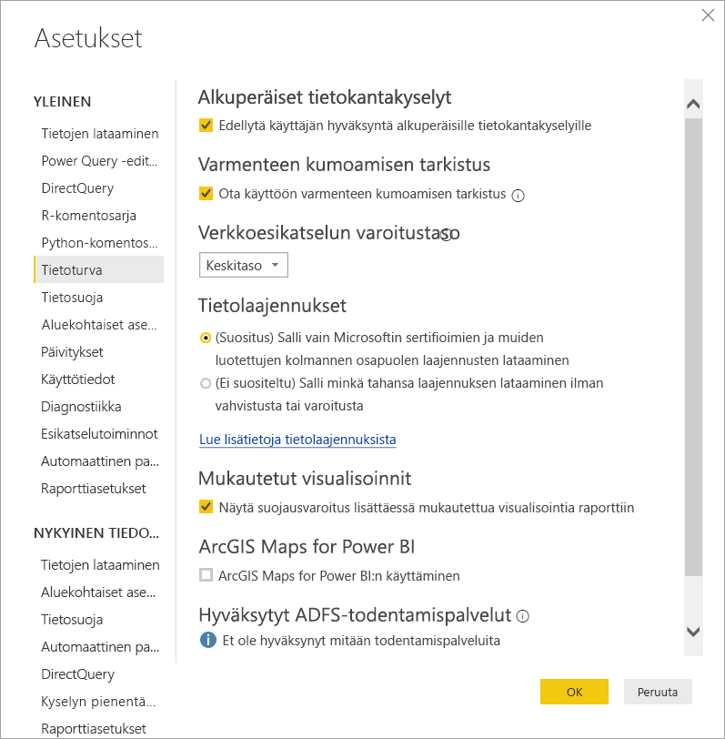
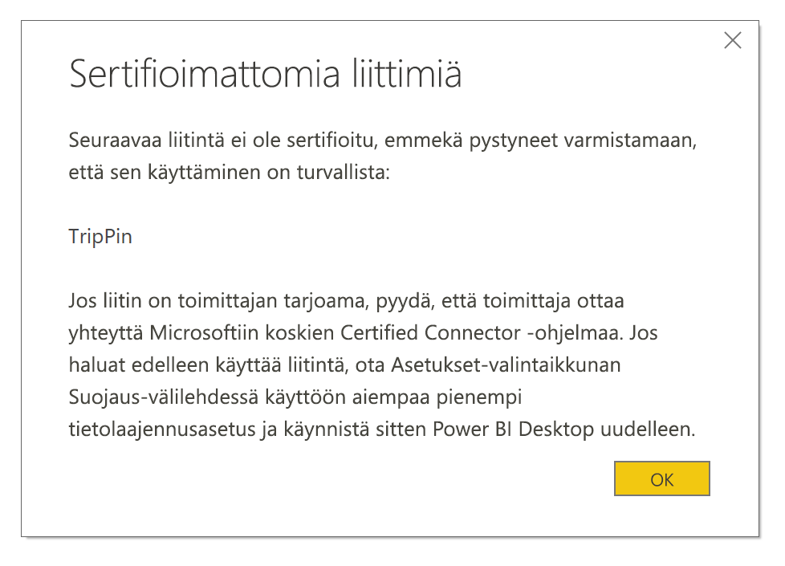

# Liittimen laajennettavuus Power BI:ssä

Asiakkaat ja kehittäjät voivat Power BI:ssä laajentaa monella tapaa niitä tietolähteitä, joihin he voivat muodostaa yhteyden, kuten olemassa olevilla yhdistimillä ja yleisillä tietolähteillä (kuten ODBC OData Oledb, WWW, CSV, XML, JSON). Kyseisten tietolähteiden lisäksi kehittäjät voivat luoda tietolaajennuksia, joita kutsutaan **mukautetuiksi liittimiksi** ja sertifioida liittimen **sertifioiduksi liittimeksi**.

Tällä hetkellä **mukautetut liittimet** otetaan käyttöön ominaisuusvalitsimen avulla. Ennen kuin tämä ominaisuus siirretään beetaversiosta yleisesti saataville, olemme lisänneet valikon, jonka avulla voit turvallisesti hallita järjestelmässä käytettävissä olevaa mukautetun koodin tasoa: voit sallia kaikki mukautetut liittimet tai vain Microsoftin sertifioimat ja jakelemat liittimet **Nouda tiedot** -valintaikkunasta.

## Mukautetut liittimet

**Mukautetut liittimet** voivat sisältää runsaasti mahdollisuuksia – liiketoiminnallesi tärkeistä pienistä ohjelmointirajapinnoista laajoihin toimialakohtaisiin palveluihin, joiden tarjoaja on jokin muu taho kuin Microsoft. Monien liittimien jakelijana toimii toimittaja itse, joten jos sinulla on tarve tietylle liittimelle, ota yhteyttä toimittajaan.

Käyttääksesi **mukautettuja liittimiä** laita ne  *\[asiakirjojen]\\Power BI Desktopin\\mukautetut liittimet* -kansioon ja muuta sen suojausasetuksia seuraavassa osassa kuvatulla tavalla.

Sinun ei tarvitse säätää tietoturva-asetuksia käyttääksesi **sertifioituja liittimiä**.

## Tietolaajennuksen tietoturva

Muuttaaksesi tietolaajennuksen tietoturva-asetuksia **Power BI Desktopissa** valitse **Tiedosto > Asetukset ja vaihtoehdot > Asetukset > Tietoturva**.

**Tietolaajennukset**-valikosta voit valita kahdesta suojaustasosta:

* (Suositeltu) Salli vain sertifioitujen laajennusten lataaminen
* (Ei suositeltu) Salli minkä tahansa laajennuksen lataaminen ilman varoitusta

Jos aiot käyttää **mukautettuja liittimiä** tai itse kehittämiäsi tai kolmannen osapuolen kehittämiä ja jakelemia liittimiä, sinun on valittava **(Ei suositeltu) Salli minkä tahansa laajennuksen lataaminen ilman varoitusta** -vaihtoehto. Microsoft ei suosittele tätä tietoturva-asetusta, ellet aio käyttää **mukautettuja liittimiä**.

Jos **(Suositeltu)**-tietoturva-asetus on käytössä ja järjestelmässä käytetään mukautettuja liittimiä, näkyviin tulee virheilmoitus, jossa kuvataan tietoturvan vuoksi lataamatta jätetyt liittimet.

Ratkaistaksesi tämän ongelman ja käyttääksesi kyseisiä liittimiä sinun on muutettava tietoturva-asetukseksi **(Ei suositeltu)** aiemmin kuvattujen ohjeiden mukaisesti ja käynnistettävä **Power BI Desktop** uudelleen.

## Sertifioidut liittimet

Rajoitettua alijoukkoa tietolaajennuksia pidetään **sertifioituina** ja kyseiset sertifioidut liittimet ovat saatavilla **Nouda tiedot** -valintaikkunasta, mutta niiden ylläpidosta ja tuesta vastaa silti liittimen kehittänyt kolmas osapuoli. Vaikka Microsoft toimii näiden liittimien jakelijana, se ei vastaa niiden suorituskyvystä tai jatkuvasta toimivuudesta.

Jos haluat hankkia mukautetulle liittimelle sertifioinnin, pyydä toimittajaasi ottamaan yhteyttä osoitteeseen dataconnectors@microsoft.com.
