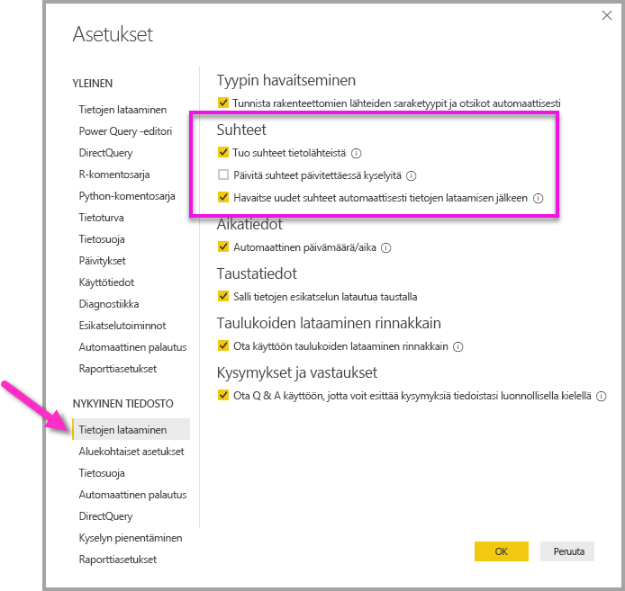

# Suhteiden luominen ja hallinta Power BI Desktopissa
Jos tuot useita taulukoita, luot todennäköisesti analyyseja kaikkien tuotavien taulukoiden tietojen perusteella. Näiden taulukoiden välisiä suhteita tarvitaan tuloksien tarkkaan laskemiseen ja oikeiden tietojen esittämiseen raporteissa. Power BI Desktop tekee näiden suhteiden luomisesta helppoa. Itse asiassa sinun ei useimmiten tarvitse tehdä mitään, sillä automaattinen tunnistus tekee kaiken puolestasi. Joissakin tilanteissa sinun on ehkä luotava suhteita itse tai muokattava niitä. Joka tapauksessa on tärkeää ymmärtää Power BI Desktopissa olevia suhteita ja miten niitä voi luoda ja muokata.

## Automaattinen tunnistus latauksen aikana
Jos suoritat kyselyn kahdesta tai useammasta taulukosta yhtä aikaa, Power BI Desktop yrittää löytää ja luoda tiedoista suhteita, kun tiedot on ladattu. Suhdeasetukset **Kardinaliteetti**, **Ristisuodatussuunta** ja **Tee tästä suhteesta aktiivinen** määritetään automaattisesti. Power BI Desktop tarkastelee kyselyyn sisältyvien taulukoiden sarakkeiden nimiä selvittääkseen, sisältyykö niihin mahdollisesti suhteita. Jos suhteita löytyy, ne luodaan automaattisesti. Jos Power BI Desktop ei voi määrittää osumaa luotettavasti, se ei luo suhdetta. Voit kuitenkin edelleen luoda tai muokata suhteita manuaalisesti **Suhteiden hallinta** -valintaikkunassa.

## Suhteen luominen automaattisella tunnistuksella
Valitse **Aloitus**-välilehdessä **Suhteiden hallinta** \> **Automaattinen tunnistus**.

## Suhteen luominen manuaalisesti
1. Valitse **Aloitus**-välilehdessä **Suhteiden hallinta** \> **Uusi**.

2. Valitse taulukko **Luo suhde** -valintaikkunan ensimmäisen taulukon avattavasta luettelosta. Valitse sarake, jota haluat käyttää suhteessa.

3. Valitse toisen taulukon avattavasta luettelosta toinen taulukko, jonka haluat suhteeseen. Valitse toinen sarake, jota haluat käyttää, ja valitse sitten **OK**.

   

Oletusarvoisesti Power BI Desktop määrittää automaattisesti uutta suhdetta varten asetukset **Kardinaliteetti** (suunnan), **Ristisuodatus** ja **Tee tästä suhteesta aktiivinen**. Voit kuitenkin muuttaa näitä asetuksia tarvittaessa. Lisätietoja on artikkelissa [Tietoja lisäasetuksista](#understanding-additional-options).

Jos millään suhteeseen valituista taulukoista ei ole yksilöllisiä arvoja, näkyviin tulee seuraava virhe: *Jossakin sarakkeista on oltava yksilöiviä arvoja*. Vähintään yhdessä suhteen taulukossa *tulee olla* erillisiä, yksilöllisiä avainarvoja, mikä on yleinen vaatimus kaikissa relaatiotietokannan tekniikoissa. 

Jos kohtaat virheen, on olemassa muutamia tapoja korjata ongelma:

* **Poista kaksoiskappaleet** -toiminnon avulla voit luoda sarakkeen, jossa on yksilöllisiä arvoja. Tämän huono puoli on se, että voit menettää tietoja, kun rivien kaksoiskappaleet poistetaan; usein avaimen (rivin) kopioinnille on syynsä.
* Lisää malliin listatuista erillisistä avainarvoista koostettu välitaulukko, joka yhdistetään suhteen molempiin alkuperäisiin sarakkeisiin.

Lisätietoja on tässä [blogikirjoituksessa](https://blogs.technet.microsoft.com/cansql/2016/12/19/relationships-in-power-bi-fixing-one-of-the-columns-must-have-unique-values-error-message/).

## Suhteen muokkaaminen
1. Valitse **Aloitus**-välilehdessä **Suhteiden hallinta**.

2. Valitse **Suhteiden hallinta** -valintaikkunassa haluamasi suhde ja valitse sitten **Muokkaa**.

## Lisäasetuksien määrittäminen
Kun luot tai muokkaat suhteen, voit määrittää lisäasetuksia. Oletusarvoisesti Power BI Desktop määrittää lisäasetukset automaattisesti parhaan arvauksen perusteella, ja ne voivat olla erilaisia eri suhteissa sarakkeiden tietojen mukaan.

### Kardinaliteetti
**Kardinaliteetti**-asetuksella voi olla jokin seuraavista arvoista:

**Monta yhteen (\*:1)** : Monta yhteen -suhde on yleisin suhdetyyppi ja myös suhdetyypin oletusasetus. Monta yhteen -tyyppi tarkoittaa sitä, että arvo voi esiintyä toisessa taulukossa useammin kuin kerran ja esiintyä vain kerran toisessa taulukossa, jota kutsutaan usein hakutaulukoksi.

**Yksi yhteen (1:1)** : Yksi yhteen -suhteessa tämä tarkoittaa, tietty arvo esiintyy vain kerran kummassakin taulukossa, joiden välille on muodostettu suhde.

**Yksi moneen (1:*)** : Yksi moneen -suhteessa arvo esiintyy vain kerran toisen taulukon sarakkeessa, ja toisessa liittyvässä taulukossa arvo voi esiintyä useammin kuin kerran.

**Monta moneen (\*:\*)** : Yhdistelmämallien avulla voit muodostaa Monta moneen -yhteyksiä taulukoiden välille, mikä poistaa taulukoiden yksilöllisten arvojen vaatimukset. Se myös poistaa edelliset ratkaisut, kuten uusien taulukoiden lisäämisen vain yhteyksien muodostamiseksi. Lisätietoja on artikkelissa [Moni-moneen-kardinaliteetin sisältävät suhteet](https://docs.microsoft.com/power-bi/desktop-many-to-many-relationships). 

Lisätietoja siitä, milloin kardinaliteetin asetuksia muutetaan, on artikkelissa [Tietoja lisäasetuksista](#understanding-additional-options).

### Ristisuodatussuunta
**Ristisuodatus**-asetuksella voi olla jokin seuraavista arvoista:

**Molemmat**: Suodatuksessa molempia taulukoita käsitellään yhtenä taulukkona. **Molemmat**-asetus toimii hyvin silloin, kun käsitellään yhtä taulukkoa, jossa on useita ympäröiviä hakutaulukoita. Esimerkki on myyntitulostaulukko, jossa on osaston hakutaulukko. Tätä kokoonpanoa kutsutaan usein tähtirakenteeksi (päätaulukko, jolla on useita hakutaulukoita). Jos kuitenkin haluat käsitellä vähintään kahta taulukkoa, joilla on myös hakutaulukoita (joista osa on yhteisiä), niin **Molemmat**-asetusta ei kannata käyttää. Jos käytetään edellistä esimerkkiä, niin tässä tapauksessa olisi myös budjettitaulukko, jossa on jokaisen osaston tavoitebudjetti. Osastotaulukko liittyy siis sekä myynti- että budjettitaulukkoon. Vältä **Molemmat**-asetusta tällaisessa tilanteessa.

**Yksittäinen**: Yleisin, ja oletussuunta, mikä tarkoittaa, että yhdistettyjen taulukoiden suodatusvalinnat toimivat siinä taulukossa, johon arvot kerätään. Jos tuot tietomallin Power Pivot Excel 2013:sta aiemmasta versiosta, kaikki suhteet ovat yhteen suuntaan toimivia. 

Lisätietoja siitä, milloin ristisuodatussuunnan asetuksia muutetaan, on artikkelissa [Tietoja lisäasetuksista](#understanding-additional-options).

### Suhteen muuttaminen aktiiviseksi
Kun Tee suhteesta aktiivinen -asetus on valittuna, suhde toimii aktiivisena oletusarvoisena suhteena. Niissä tapauksissa, joissa kahden taulukon välillä on useampi kuin yksi suhde, Power BI Desktop voi käyttää aktiivista suhdetta luomaan automaattisesti visualisointeja, jotka sisältävät molemmat taulukot.

Lisätietoja siitä, milloin tietty suhde määritetään aktiiviseksi, on artikkelissa [Tietoja lisäasetuksista](#understanding-additional-options).

## Tietoja suhteista
Kun olet muodostanut suhteen kahden taulukon välille, voit käsitellä molempien taulukoiden tietoja aivan kuin ne olisivat samassa taulukossa. Näin sinun ei tarvitse huolehtia suhteiden yksityiskohdista tai taulukoiden karsimisesta yhdeksi taulukoksi ennen niiden tuomista. Monissa tilanteissa Power BI Desktop voi luoda suhteet automaattisesti puolestasi. Jos Power BI Desktop ei kuitenkaan voi määrittää varmasti kahden taulukon välistä suhdetta, se ei luo suhdetta automaattisesti. Tällöin sinun on luotava suhde. 

Tehdään nopea harjoitus, jotta saat paremman käsityksen siitä, miten suhteet toimivat Power BI Desktopissa.

>[!TIP]
>Voit suorittaa tämän harjoituksen itse: 
>
> 1. Kopioi seuraava **Projektitunnit**-taulukko Excel-laskenta taulukkoon (otsikko pois lukien), valitse kaikki solut ja valitse sitten **Lisää** \> **Taulukko**. 
> 2. Valitse **Luo taulukko** -valintaikkunassa **OK**. 
> 3. Valitse mikä tahansa taulukon solu, valitse **Taulukon rakenne** \> **Taulukon nimi** ja kirjoita sitten*Projektitunnit*. 
> 4. Tee samat toimet **Yritysprojekti**-taulukolle. 
> 5. Tuoda tiedot käyttämällä Power BI Desktopin **Nouda tiedot** -toimintoa. Valitse kaksi taulukkoa tietolähteeksi ja valitse sitten **Lataa**.

Ensimmäisessä taulukossa, eli **Projektitunnit**-taulukossa, ovat palvelupyyntöihin perustuvat tiedot siitä, kuinka monta tuntia kukin henkilö on käyttänyt tiettyyn projektiin. 

**Projektitunnit**

| **Palvelupyyntö** | **Lähettäjä** | **Tunnit** | **Projekti** | **Lähetyspvm** |
| ---:|:--- | ---:|:--- | ---:|
| 1001 |Vasala, Jani |22 |Sininen |1\.1.2013 |
| 1002 |Vasala, Jani |26 |Punainen |1\.2.2013 |
| 1003 |Kurri, Viljo |34 |Keltainen |4\.12.2012 |
| 1004 |Vasala, Jani |13 |Oranssi |2\.1.2012 |
| 1005 |Tuominen, Antero |29 |Purppura |1\.10.2013 |
| 1006 |Laurinen, Kalevi |35 |Vihreä |1\.2.2013 |
| 1007 |Mylläri, Harri |10 |Keltainen |1\.10.2013 |
| 1008 |Vasala, Frans |28 |Oranssi |2\.1.2012 |
| 1009 |Kurri, Viljo |22 |Purppura |1\.2.2013 |
| 1010 |Tuominen, Antero |28 |Vihreä |1\.10.2013 |
| 1011 |Tuominen, Antero |9 |Sininen |15.10.2013 |

Tämä toinen **Yritysprojekti**-taulukko on luettelo projekteista, joille on määritetty prioriteetti: A, B tai C. 

**Yritysprojekti**

| **ProjNimi** | **Prioriteetti** |
| --- | --- |
| Sininen |A |
| Punainen |B |
| Vihreä |C |
| Keltainen |C |
| Purppura |B |
| Oranssi |C |

Huomaa, että kummassakin taulukossa on projektisarake. Kummassakin nimi on hieman erilainen, mutta arvot näyttävät olevan samat. Tämä on tärkeää, ja palaamme siihen hetken päästä.

Nyt kun olemme tuoneet nämä kaksi taulukkoa malliin, luodaan raportti. Haluamme ensimmäiseksi saada selville lähetettyjen tuntien määrän projektin prioriteetin mukaan, joten valitaan **Kentät**-ruudusta **Prioriteetti** ja **Tunnit**.

Raporttipohjalla olevaa taulukkoa tarkastellessa nähdään, että jokaisen projektin tuntien määrä on 256 osalta, ja se on myös kokonaismäärä. Tämä määrä ei selvästikään ole oikein. Miksi? Siksi, että tietyssä taulukossa olevien arvojen kokonaismäärää (**Projekti**-taulukon **Tunnit**-arvo), jotka on ositettu toisen taulukon arvoilla (**Yritysprojekti**-taulukon **Prioriteetti**-arvo), ei voida laskea luomatta näiden kahden taulukon välille suhdetta.

Luodaan siis suhde näiden kahden taulukon välille.

Muistatko molemmissa taulukoissa olevat sarakkeet, joilla on projektin nimi mutta samannäköiset arvot? Luomme näiden kahden sarakkeen avulla suhteen taulukoiden välille.

Miksi nämä sarakkeet? No, **Projektitunnit**-taulukon **Projekti**-sarakkeessa on arvoja, kuten Sininen, Punainen, Keltainen ja Oranssi. Itse asiassa monella rivillä on sama arvo. **Projekti**-sarakkeelle on siis useita väriarvoja.

**Yritysprojekti**-taulukon **ProjNimi**-sarakkeessa kutakin väriarvoa on vain yksi projektin nimeä varten. Tässä taulukossa kukin väriarvo on yksilöllinen, mikä on tärkeää, koska voimme luoda näiden kahden taulukon välille suhteen. Tässä tapauksessa Monta yhteen -suhteen. Monta yhteen -suhteessa vähintään yhden taulukon sarakkeen on sisällettävä yksilöllisiä arvoja. Joissakin suhteissa on joitakin lisäasetuksia, joita tarkastelemme myöhemmin. Luodaan nyt suhde kahden taulukon projektisarakkeiden välille.

### Uuden suhteen luominen
1. Valitse **Aloitus**-välilehdessä **Suhteiden hallinta**.
2. Valitse **Suhteiden hallinta** -valintaikkunassa **Uusi**, jolloin **Luo suhde** -valintaikkuna avautuu. Siinä suhteeseen voidaan valita halutut taulukot, sarakkeet ja mahdolliset lisäasetukset.
3. Valitse avattavassa luettelossa **Projektitunnit** ensimmäiseksi taulukoksi ja valitse sitten **Projekti**-sarake. Tämä puoli on suhteen *monta*-osa.
4. Toisessa avattavassa luettelossa **Yritysprojekti** on esimääritetty toiseksi taulukoksi. Valitse **ProjNimi**-sarake. Tämä puoli on suhteen *yksi*-osa. 
5. Hyväksy suhteen oletusasetukset ja valitse sitten **OK**.

   

6. Valitse **Suhteiden hallinta** -valinta ikkunassa **Sulje**.

Totta puhuen loit tämän suhteen nyt vaikealla tavalla. Olisit päässyt helpommalla valitsemalla **Automaattinen tunnistus** -vaihtoehdon **Suhteiden hallinta** -valintaikkunassa. Itse asiassa automaattinen tunnistus olisi luonut suhteen automaattisesti puolestasi heti, kun latasit tiedot, jos molemmilla sarakkeilla olisi ollut sama nimi. Mutta eihän siinä olisi ollut mitään haastetta!

Tarkastellaan seuraavaksi taas raporttipohjalla olevaa taulukkoa.

Sehän näyttää nyt paljon paremmalta.

Kun tunnit lasketaan yhteen **Prioriteetti**-sarakkeen mukaan, Power BI Desktop etsii **Yritysprojekti**-hakutaulukosta kaikki yksilölliset väriarvot ja sitten kaikkien näiden arvojen esiintymät **Projektitunnit**-taulukosta ja laskee sitten jokaisen yksilöllisen arvon kokonaissumman.

Tämähän oli helppoa. Automaattisen tunnistuksen ansiosta et välttämättä joudu tekemään näinkään paljon.

## Tietoja lisäasetuksista
Kun suhde luodaan joko automaattisella tunnistuksella tai manuaalisesti, Power BI Desktop määrittää automaattisesti lisäasetuksia taulukoiden tietojen perusteella. Nämä suhteiden lisäasetukset ovat **Luo suhde**- ja **Muokkaa suhdetta** -valintaikkunan alaosassa.

 

Power BI määrittää yleensä nämä asetukset automaattisesti, eikä sinun tarvitse koskea niihin. Monissa tilanteissa näitä asetuksia kannattaa kuitenkin muuttaa itse.

## Automaattiset suhteen päivitykset

Voit hallita sitä, miten Power BI käsittelee ja mukauttaa automaattisesti yhteyksiä raporteissasi ja malleissasi. Jos haluat määrittää, miten Power BI käsittelee suhdeasetuksia, valitse Power BI Desktopissa **Tiedosto** > **Asetukset ja vaihtoehdot** > **Asetukset** ja valitse sitten vasemmassa ruudussa **Tietojen lataaminen**. **Suhteet**-vaihtoehdot tulevat näkyviin.

   

Valittavissa on kolme asetusta, jotka voidaan valita ja ottaa käyttöön: 

- **Tuo suhteet tietolähteistä ensimmäisen lataamisen yhteydessä**: Tämä vaihtoehto on oletusarvoisesti valittuna. Kun se on valittuna, Power BI tarkistaa tietolähteessä määritetyt suhteet, kuten viiteavain-/perusavain-suhteet tietovarastossa. Jos tällaisia suhteita on olemassa, ne peilataan myös Power BI -tietomalliin, kun tiedot ladataan ensimmäisen kerran. Tämän asetuksen avulla voit aloittaa nopeasti mallisi käyttämisen sen sijaan, että etsisit ja määrittäisit suhteet itse.

- **Päivitä tai poista suhteita, kun tiedot päivitetään**: Oletusarvoisesti tämä asetus ei ole valittuna. Jos valitset sen, Power BI tarkistaa tietolähteen suhteisiin tehdyt muutokset, kun tietojoukkosi päivitetään. Jos nämä suhteet muuttuvat tai ne poistetaan, Power BI peilaa muutokset omassa tietomallissaan päivittämällä tai poistamalla niitä vastaavasti.

   > [!WARNING]
   > Jos käytät rivitason suojausta, joka on riippuvainen määritetyistä suhteista, tämän asetuksen valitseminen ei ole suositeltavaa. Jos poistat suhteet, josta RLS-asetuksesi ovat riippuvaisia, mallisi suojaus voi heiketä. 

- **Havaitse uudet suhteet automaattisesti tietojen lataamisen jälkeen**: Tämä asetus on kuvattu artikkelissa [Automaattinen tunnistus latauksen aikana](#autodetect-during-load). 

## Tietojen tulevat päivitykset vaativat eri kardinaliteetin
Power BI Desktop osaa tavallisesti määrittää suhteen parhaan kardinaliteetin automaattisesti. Jos haluat kuitenkin ohittaa automaattisen asetuksen, koska tiedät tietojen muuttuvan tulevaisuudessa, voit muuttaa sitä asetuksen **Kardinaliteetti**-ohjausobjektilla. Katsotaan esimerkkiä, jossa meidän on valittava eri kardinaliteetti.

**Yritysprojektiprioriteetti**-taulukko on luettelo yrityksen kaikista projekteista ja niiden prioriteeteista. **Projektibudjetti**-taulukossa on ne projektit, joiden budjetti on hyväksytty.

**Yritysprojektiprioriteetti**

| **ProjNimi** | **Prioriteetti** |
| --- | --- |
| Sininen |A |
| Punainen |B |
| Vihreä |C |
| Keltainen |C |
| Purppura |B |
| Oranssi |C |

**Projektibudjetti**

| **HyväksytytProjektit** | **Budjettiallokointi** | **Allokointipvm** |
|:--- | ---:| ---:|
| Sininen |40 000 |1\.12.2012 |
| Punainen |100 000 |1\.12.2012 |
| Vihreä |50 000 |1\.12.2012 |

Jos luomme suhteen **Projektibudjetti**-taulukon **HyväksytytProjektit**-sarakkeen ja **Yritysprojektiprioriteetti**-taulukon **Projekti**-sarakkeen välille, Power BI määrittää automaattisesti **Kardinaliteeti**-asetukseksi **Yksi yhteen (1:1)** ja **Ristisuodatussuunta**-asetukseksi **Molemmat**. 

 

Power BI tekee nämä asetukset siksi, että Power BI Desktopin kannalta kahden taulukon paras yhdistelmä on seuraava:

| **ProjNimi** | **Prioriteetti** | **Budjettiallokointi** | **Allokointipvm** |
|:--- | --- | ---:| ---:|
| Sininen |A |40 000 |1\.12.2012 |
| Punainen |B |100 000 |1\.12.2012 |
| Vihreä |C |50 000 |1\.12.2012 |
| Keltainen |C |  |  |
| Purppura |B |  |  |
| Oranssi |C |  |  |

Taulukoiden välillä on yksi yhteen -suhde, koska yhdistettyjen taulukoiden **ProjNimi**-sarakkeessa ei ole toistuvia arvoja. **ProjNimi**-sarake on yksilöllinen, koska jokainen arvo esiintyy vain kerran; siksi molempien taulukoiden arvot voidaan yhdistää suoraan ilman kahdentamista.

Mutta oletetaan, että tiedät tietojen muuttuvan seuraavan kerran, kun päivität ne. **Projektibudjetti**-taulukon päivitetyssä versiossa on nyt ylimääräisiä sinisiä ja punaisia projekteja:

**Projektibudjetti**

| **HyväksytytProjektit** | **Budjettiallokointi** | **Allokointipvm** |
| --- | ---:| ---:|
| Sininen |40 000 |1\.12.2012 |
| Punainen |100 000 |1\.12.2012 |
| Vihreä |50 000 |1\.12.2012 |
| Sininen |80 000 |1\.6.2013 |
| Punainen |90 000 |1\.6.2013 |

 Nämä uudet rivit merkitsevät, että näiden kahden taulukon paras yhdistelmä näyttää nyt tältä: 

| **ProjNimi** | **Prioriteetti** | **Budjettiallokointi** | **Allokointipvm** |
| --- | --- | ---:| ---:|
| Sininen |A |40 000 |1\.12.2012 |
| Punainen |B |100 000 |1\.12.2012 |
| Vihreä |C |50 000 |1\.12.2012 |
| Keltainen |C |  |  |
| Purppura |B |  |  |
| Oranssi |C |  |  |
| Sininen |A |80 000 |1\.6.2013 |
| Punainen |B |90 000 |1\.6.2013 |

Tässä uudessa yhdistetyssä taulukossa **ProjNimi**-sarakkeessa on toistuvia arvoja. Alkuperäisillä taulukoilla ei ole enää yksi yhteen -suhdetta, kun taulukko päivitetään. Tässä tapauksessa, koska tiedämme tulevien päivitysten aiheuttavan kaksoisarvoja **ProjNimi**-sarakkeeseen, **Kardinaliteetti**-asetukseksi kannattaa vaihtaa **Monta yhteen (\*:1)** siten, että *monet* ovat **Projektibudjetti**-taulukon puolella ja *yksi* **Yritysprojektiprioriteetti**-taulukon puolella.

## Ristisuodatussuunnan säätäminen monimutkaisia taulukoita ja suhteita varten
Useimmissa suhteissa ristisuodatussuunnaksi on määritetty **Molemmat**. Joissakin harvinaisemmissa tilanteissa tämä asetus on määritettävä poikkeamaan oletusarvosta, kuten tuotaessa malleja vanhemmasta Power Pivot -versiosta, jolloin kaikki suhteet on määritetty yksisuuntaisiksi. 

**Molemmat**-asetuksen avulla Power BI Desktop voi käsitellä liitettyjen taulukoiden kaikkia ominaisuuksia yhtenä taulukkona. Joissakin tilanteissa Power BI Desktop ei voi kuitenkaan määrittää suhteiden ristisuodatussuuntaa **Molemmat**-asetuksen mukaiseksi sekä säilyttää yksiselitteistä oletusarvojoukkoa raportointia varten. Jos suhteen ristisuodatussuunnaksi ei ole määritetty **Molemmat**, se yleensä johtuu siitä, että tämä suunnan asetus aiheuttaisi moniselitteisyyttä. Jos oletusarvoinen ristisuodatin ei käy, kokeile määrittää asetus tiettyyn taulukkoon tai valitse asetukseksi **Molemmat**.

Yksisuuntainen ristisuodatus toimii monissa tilanteissa. Itse asiassa, jos olet tuonut mallin Power Pivot Excel 2013:sta tai aiemmasta versiosta, kaikki suhteet on määritetty yksisuuntaisiksi. Yksisuuntainen tarkoittaa, että yhdistettyjen taulukoiden suodatusvalinnat toimivat siinä taulukossa, johon tiedot kerätään. Ristisuodatuksen ymmärtäminen voi olla joskus hieman hankalaa, joten katsotaanpa esimerkkiä.

Jos yksisuuntaisella ristisuodatuksella luodaan projektin tunnit sisältävä yhteenveto, voit tehdä yhteenvedon (tai suodattaa) **Yritysprojekti**-taulukosta ja sen **Prioriteetti**-sarakkeesta tai **YrityksenTyöntekijä**-taulukosta ja sen **Kaupunki**-sarakkeesta. Jos taas haluat laskea työntekijöiden määrän projektia kohti (harvinaisempi kysymys), se ei toimi. Saat sarakkeen, jonka arvot ovat kaikki samoja. Seuraavassa esimerkissä molempien suhteiden ristisuodatuksen suunta on määritetty yksisuuntaiseksi **Projektitunnit**-taulukkoa kohti. **Arvot**-ruudussa on **Projekti**-kentän asetuksena **Määrä**:

 

Suodattimen määritystä käytetään **Yritysprojekti**-taulukosta **Projektitunnit**-taulukon suuntaan (kuten seuraavassa kuvassa) mutta ei vastavirtaan **YrityksenTyöntekijä**-taulukkoon. 

 

Suodatin kuitenkin toimii, jos ristisuodatuksen suunnaksi määritetään **Molemmat**. **Molemmat**-asetuksen avulla suodattimen määritystä käytetään myös **YrityksenTyöntekijä**-taulukkoon.

 

Kun ristisuodatuksen suunnaksi määritetään **Molemmat**, raportti näyttää oikealta:

 

Ristisuodatus molempiin suuntiin toimii hyvin edellä olevan kaltaisiin taulukkosuhteisiin. Tätä rakennetta kutsutaan yleisimmin tähtirakenteeksi, kuten tässä:

 

Ristisuodatuksen suunta ei toimi hyvin yleisempään tietokannoista usein löytyvään malliin, kuten tässä kaaviossa:

 

Jos sinulla on tällainen silmukoita sisältävä taulukkomalli, ristisuodatus voi luoda moniselitteisen suhdejoukon. Jos esimerkiksi X-taulukon kenttä lasketaan yhteen ja sitten suodatetaan Y-taulukon kentän mukaan, suodattimen tarkoitettu kulkusuunta ei ole selkeä, eli suodatetaanko ylemmän vai alemman taulukon kautta. Tavallinen esimerkki tämäntyyppisestä mallista on se, että X-taulukko on myyntituloksia sisältävä taulukko ja Y-taulukossa on budjettitiedot. Silloin keskellä olevat taulukot ovat molempien taulukoiden käyttämiä hakutaulukoita, esimerkiksi Yksikkö tai Alue. 

Samaan tapaan kuin aktiivisissa tai passiivisissa suhteissa, Power BI Desktop ei salli suhteen määrittämistä **Molemmat**-arvoon, jos se loisi moniselitteisyyttä raporteissa. Voit käsitellä tätä tilannetta useilla eri tavoilla. Seuraavassa on kaksi yleisintä:

* Vähennä moniselitteisyyttä poistamalla suhteet tai merkitsemällä ne passiivisiksi. Sitten voit ehkä määrittää suhteen ristisuodatusasetukseksi vaihtoehdon **Molemmat**.
* Poista silmukat tuomalla taulukko kahdesti (erinimisenä toisella kerralla). Tämä luo tähtirakennetta muistuttavan suhdemallin. Tähtirakennetta käytettäessä kaikkiin suhteisiin voidaan määrittää arvo **Molemmat**.

## Väärä aktiivinen suhde
Kun Power BI Desktop luo suhteita automaattisesti, se havaitsee joskus useamman kuin yhden suhteen kahden taulukon välillä. Kun näin tehdään, vain yksi suhteista määritetään aktiiviseksi. Aktiivinen suhde toimii oletussuhteena niin, että kun valitset kenttiä kahdesta eri taulukosta, Power BI Desktop voi luoda automaattisesti visualisoinnin puolestasi. Joissakin tapauksissa automaattisesti valitut suhteet voivat kuitenkin olla vääriä. **Suhteiden hallinta** -valintaikkunan avulla voit määrittää suhteen aktiiviseksi tai passiiviseksi, tai voit määrittää aktiivisen suhteen **Muokkaa suhdetta** -valintaikkunassa. 

Jotta voidaan varmistaa, että oletussuhde on aina olemassa, Power BI Desktop sallii kerrallaan vain yhden aktiivisen suhteen kahden taulukon välillä. Siksi sinun on ensin määritettävä nykyinen suhde passiiviseksi ja määritettävä sitten haluamasi suhde aktiiviseksi.

Tarkastellaan esimerkkiä. Ensimmäinen taulukko on **ProjektinPalvelupyynnöt** ja toinen taulukko on **TyöntekijänRooli**.

**ProjektinPalvelupyynnöt**

| **Palvelupyyntö** | **Avaaja** | **Lähettäjä** | **Tunnit** | **Projekti** | **Lähetyspvm** |
| ---:|:--- |:--- | ---:|:--- | ---:|
| 1001 |Niemi, Hannes |Vasala, Jani |22 |Sininen |1\.1.2013 |
| 1002 |Lepistö, Stefan |Vasala, Jani |26 |Punainen |1\.2.2013 |
| 1003 |Wahlman, Miika |Kurri, Viljo |34 |Keltainen |4\.12.2012 |
| 1004 |Niemi, Hannes |Vasala, Jani |13 |Oranssi |2\.1.2012 |
| 1005 |Lepistö, Stefan |Tuominen, Antero |29 |Purppura |1\.10.2013 |
| 1006 |Wahlman, Miika |Laurinen, Kalevi |35 |Vihreä |1\.2.2013 |
| 1007 |Wahlman, Miika |Mylläri, Harri |10 |Keltainen |1\.10.2013 |
| 1008 |Niemi, Hannes |Vasala, Frans |28 |Oranssi |2\.1.2012 |
| 1009 |Lepistö, Stefan |Kurri, Viljo |22 |Purppura |1\.2.2013 |
| 1010 |Wahlman, Miika |Tuominen, Antero |28 |Vihreä |1\.10.2013 |
| 1011 |Niemi, Hannes |Tuominen, Antero |9 |Sininen |15.10.2013 |

**TyöntekijänRooli**

| **Työntekijä** | **Rooli** |
| --- | --- |
| Laurinen, Kalevi |Projektipäällikkö |
| Tuominen, Antero |Projektijohtaja |
| Vasala, Jani |Projektipäällikkö |
| Mylläri, Harri |Projektijohtaja |
| Vasala, Frans |Projektijohtaja |
| Kurri, Viljo |Projektijohtaja |
| Niemi, Hannes |Projektin rahoittaja |
| Lepistö, Stefan |Projektin rahoittaja |
| Wahlman, Miika |Projektin rahoittaja |

Tässä on itse asiassa kaksi suhdetta:
- **TyöntekijänRooli**-taulukon **Työntekijä**-sarakkeen ja **ProjektinPalvelupyynnöt**-taulukon **Lähettäjä**-sarakkeen välinen suhde.
- **ProjektinPalvelupyynnöt**-taulukon **Avaaja**-sarakkeen ja **TyöntekijänRooli**-taulukon **Työntekijä**-sarakkeen välinen suhde.

 

Jos molemmat suhteet lisätään malliin (**Avaaja**-suhde ensin), **Suhteiden hallinta** -valintaikkunassa näkyy, että **Avaaja**-suhde on aktiivinen:

 

Jos nyt luodaan raportti, joka käyttää **TyöntekijänRooli**-taulukon **Rooli**- ja **Työntekijä**-kenttiä ja **ProjektinPalvelupyynnöt**-taulukon **Tunnit**-kenttää taulukon visualisoinnissa raporttipohjassa, vain yhden projektin rahoittajat näkyvät, koska kukaan muu ei ole avannut projektin palvelupyyntöä.

 

Aktiivista suhdetta voidaan muuttaa käyttämällä **Lähettäjä**-kenttää **Avaaja**-kentän sijaan. Poista **Suhteiden hallinta** -valintaikkunassa valinta taulukoiden **ProjektinPalvelupyynnöt (Avaaja)** ja **TyöntekijänRooli (Työntekijä)** välisestä suhteesta ja lisää valinta taulukoiden **ProjektinPalvelupyynnöt (Lähettäjä**) ja **TyöntekijänRoolin (Työntekijä)** väliseen suhteeseen.

## Kaikkien suhteiden tarkasteleminen Suhde-näkymässä
Joskus mallissa on useita taulukoita ja monimutkaisia suhteita. Power BI Desktopin **Suhde**-näkymässä voit tarkastella kaikkia mallin suhteita sekä niiden suuntia ja kardinaliteetteja helppotajuisessa ja mukautettavassa kaaviossa. 

Lisätietoja on artikkelissa [Power BI Desktopin suhdenäkymän käyttäminen](desktop-relationship-view.md).

