# Suhteiden luominen ja hallinta Power BI Desktopissa
Useita taulukoita tuodessa aiotaan todennäköisesti luoda analyyseja käyttäen tietoja kaikista tuotavista taulukoista. Näiden taulukoiden välisiä suhteita tarvitaan tuloksien tarkkaan laskemiseen ja oikeiden tietojen esittämiseen raporteissa. Power BI Desktop tekee näiden suhteiden luomisesta helppoa. Itse asiassa useimmissa tapauksissa sinun ei tarvitse tehdä mitään, automaattinen tunnistus tekee kaiken puolestasi. Joissakin tapauksissa joudut ehkä luomaan suhteita itse tai muokkaamaan joitakin suhteita. Joka tapauksessa on tärkeää ymmärtää Power BI Desktopissa olevia suhteita ja miten niitä voi luoda ja muokata.

## Automaattinen tunnistus latauksen aikana
Jos suoritat kyselyn kahdesta tai useammasta taulukosta yhtä aikaa, Power BI Desktop yrittää löytää ja luoda tiedoista suhteita, kun tiedot on ladattu. Kardinaliteetti, ristisuodatussuunta ja aktiiviset ominaisuudet määritetään automaattisesti. Power BI Desktop tarkastelee kyselyyn sisältyvien taulukoiden sarakkeiden nimiä selvittääkseen, sisältyykö niihin mahdollisesti suhteita. Jos suhteita löytyy, ne luodaan automaattisesti. Jos Power BI Desktop ei pysty määrittämään osumaa luotettavasti, se ei luo suhdetta automaattisesti. Voit edelleen luoda tai muokata suhteita Suhteiden hallinta -valintaikkunassa.

## Suhteen luominen automaattisen tunnistuksen avulla
Valitse **Aloitus**-välilehdessä **Suhteiden hallinta** \> **Automaattinen tunnistus**.

## Suhteen luominen manuaalisesti
1. Valitse **Aloitus**-välilehdessä **Suhteiden hallinta** \> **Uusi**.
2. Valitse **Luo suhde** -valintaikkunassa ensimmäisen taulukon avattavasta luettelosta taulukko ja valitse sitten se sarake, jota haluat käyttää suhteessa.
3. Valitse toisen taulukon avattavasta luettelosta toinen taulukko, jota haluat käyttää suhteessa, valitse haluamasi sarake ja valitse sitten **OK**.

Oletusarvona Power BI Desktop määrittää automaattisesti kardinaliteetin (suunnan), ristisuodatussuunnan ja aktiiviset ominaisuudet. Voit kuitenkin muuttaa näitä tarvittaessa. Lisätietoja on tämän artikkelin Tietoja lisäasetuksista -osassa.

Huomaa, että näet seuraavan virheilmoituksen: *Yhdellä sarakkeista on oltava yksilölliset arvot*, jos millään suhteen valitulla taulukolla ei ole yksilöllisiä arvoja. Vähintään yhdessä suhteen taulukossa *tulee olla* erillisiä, yksilöllisiä avainarvoja, mikä on yleinen vaatimus kaikissa relaatiotietokannan tekniikoissa. 

Jos kohtaat virheen, on olemassa muutamia tapoja korjata ongelma:

* ”Poista kaksinkertainen rivit” -toiminnon avulla voit luoda sarakkeen, jossa on yksilöllisiä arvoja. Tämän huono puoli on se, että menetät tietoa, kun rivien kaksoiskappaleet poistetaan, ja usein avain (rivin) kopioinnille on syynsä.
* Lisää malliin listatuista erillisistä avainarvoista koostettu välitaulukko, joka yhdistetään suhteen molempiin alkuperäisiin sarakkeisiin.

Lue lisätietoja [blogikirjoituksesta](https://blogs.technet.microsoft.com/cansql/2016/12/19/relationships-in-power-bi-fixing-one-of-the-columns-must-have-unique-values-error-message/), joka käsittelee tätä yksityiskohtaisesti.

## Suhteen muokkaaminen
1. Valitse **Aloitus**-välilehdessä **Suhteiden hallinta**.
2. Valitse **Suhteiden hallinta** -valintaikkunassa haluamasi suhde ja valitse sitten **Muokkaa**.

## Lisäasetuksien määrittäminen
Kun luot tai muokkaat suhteen, voit määrittää lisäasetuksia.  Oletusarvon mukaan lisäasetukset määritetään automaattisesti parhaan arvauksen perusteella. Tämä voi olla erilainen kunkin suhteen osalta sarakkeissa olevien tietojen mukaan.

## Kardinaliteetti
**Monta yhteen (\*:1)** – Tämä on yleisin, oletustyyppi. Monta yhteen -tyyppi tarkoittaa sitä, että arvo voi esiintyä toisessa taulukossa useammin kuin kerran ja esiintyä vain kerran toisessa taulukossa, jota kutsutaan usein hakutaulukoksi.

**Yksi yhteen (1:1)** – Tämä tarkoittaa, että tietty arvo esiintyy vain kerran kummassakin taulukossa, joiden välille on muodostettu suhde.

Katso lisätietoja kardinaliteetin vaihtamisesta tämän artikkelin Tietoja lisäasetuksista -osasta.

## Ristisuodatussuunta
**Molemmat** – Tämä on yleisin, oletussuunta. Molemmat-suunta tarkoittaa, että suodatuksessa molempia taulukoita käsitellään yhtenä taulukkona.  Tämä toimii silloin, kun käsitellään yhtä taulukkoa, jossa on useita ympäröiviä hakutaulukoita.  Esimerkkinä myyntitulostaulukko, jossa on osaston hakutaulukko.  Tätä kutsutaan usein tähtirakenteeksi (päätaulukko, jolla on useita hakutaulukoita.)  Jos kuitenkin haluat käsitellä kahta tai useampaa taulukkoa, joilla on myös hakutaulukoita (joista osa on yhteisiä), niin Molemmat-asetusta ei kannata käyttää.  Jos käytetään edellistä esimerkkiä, niin tässä tapauksessa olisi myös budjettitaulukko, jossa on jokaisen osaston tavoitebudjetti.  Osastotaulukko liittyy siis sekä myynti- että budjettitaulukkoon.  Vältä Molemmat-asetusta tällaisessa tilanteessa.

**Yksittäinen** – Tämä tarkoittaa, yhdistettyjen taulukoiden suodatusvalinnat toimivat siinä taulukossa, johon arvot kerätään. Jos tuot tietomallin Power Pivot Excel 2013:sta aiemmasta versiosta, kaikki suhteet ovat yhteen suuntaan toimivia. 

Katso lisätietoja ristisuodatussuunnasta tämän artikkelin Tietoja lisäasetuksista -osasta.

## Suhteen muuttaminen aktiiviseksi
Kun Tee suhteesta aktiivinen -asetus on valittuna, suhde toimii aktiivisena, oletusarvoisena suhteena.  Niissä tapauksissa, joissa kahden taulukon välillä on useampi kuin yksi suhde, Power BI Desktop voi käyttää aktiivista suhdetta luomaan automaattisesti visualisointeja, jotka sisältävät molemmat taulukot.

Katso lisätietoja tietyn suhteen määrittämisestä aktiiviseksi tämän artikkelin Tietoja lisäasetuksista -osasta.

## Tietoja suhteista
Kun olet muodostanut suhteen kahden taulukon välille, voit käsitellä molempien taulukoiden tietoja aivan kuin ne olisivat samassa taulukossa. Näin sinun ei tarvitse huolehtia suhteiden yksityiskohdista tai taulukoiden karsimisesta yhdeksi taulukoksi ennen niiden tuomista.  Monissa tapauksissa Power BI Desktop voi luoda suhteet automaattisesti puolestasi, joten sinun ei välttämättä edes tarvitse luoda näitä suhteita itse. Jos Power BI Desktop ei kuitenkaan pysty määrittämään varmasti kahden taulukon välistä suhdetta, se ei luo suhdetta automaattisesti. Tässä tapauksessa sinun on luotava suhde itse.   

Tehdään pien harjoitus, jotta saat paremman käsityksen siitä, miten suhteet toimivat Power BI Desktopissa.

>[!TIP]
>Voit suorittaa tämän harjoituksen itse. Kopioi alla oleva Projektitunnit-taulukko Excel-laskentataulukkoon, valitse kaikki solut, valitse **LISÄÄ** \> **Taulukko**. Valitse **Luo taulukko** -valintaikkunassa **OK**. Kirjoita sitten **Taulukon nimi** -kohtaan **Projektitunnit**. Tee samat vaiheet Yritysprojekti-taulukolle. Voit sitten tuoda tiedot käyttämällä Power BI Desktopin **Nouda tiedot** -toimintoa. Valitse työkirja ja taulukot tietolähteeksi.

Tässä ensimmäisessä Projektitunnit-taulukossa on palvelupyyntöihin perustuvat tiedot siitä, kuinka monta tuntia kukakin on käyttänyt tiettyyn projektiin.  

**Projektitunnit**

| **Palvelupyyntö** | **Lähettäjä** | **Tunnit** | **Projekti** | **Lähetyspvm** |
| ---:|:--- | ---:|:--- | ---:|
| 1001 |Vasala, Jani |22 |Sininen |1.1.2013 |
| 1002 |Vasala, Jani |26 |Punainen |1.2.2013 |
| 1003 |Kurri, Viljo |34 |Keltainen |4.12.2012 |
| 1004 |Vasala, Jani |13 |Oranssi |2.1.2012 |
| 1005 |Tuominen, Antero |29 |Purppura |1.10.2013 |
| 1006 |Laurinen, Kalevi |35 |Vihreä |1.2.2013 |
| 1007 |Mylläri, Harri |10 |Keltainen |1.10.2013 |
| 1008 |Vasala, Frans |28 |Oranssi |2.1.2012 |
| 1009 |Kurri, Viljo |22 |Purppura |1.2.2013 |
| 1010 |Tuominen, Antero |28 |Vihreä |1.10.2013 |
| 1011 |Tuominen, Antero |9 |Sininen |15.10.2013 |

Tämä toinen Yritysprojekti-taulukko on luettelo projekteista, joille on määritetty prioriteetiksi A, B tai C. 

**Yritysprojekti**

| **ProjNimi** | **Prioriteetti** |
| --- | --- |
| Sininen |A |
| Punainen |B |
| Vihreä |C |
| Keltainen |C |
| Purppura |B |
| Oranssi |C |

Huomaa, että kummassakin taulukossa on projektisarake. Kummassakin nimi on hieman erilainen, mutta arvot näyttävät olevan samat. Tämä on tärkeää, ja palaamme siihen hetken päästä.

Nyt kun olemme tuoneet nämä kaksi taulukkoa malliin, luodaan raportti. Haluamme ensimmäiseksi saada selville lähetettyjen tuntien määrän projektin prioriteetin mukaan, joten valitaan Kentistä **Prioriteetti** ja **Tunnit**.

 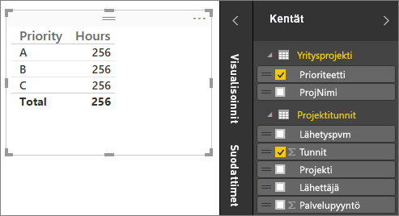

Raporttipohjalla olevaa taulukkoa tarkastellessa nähdään, että tuntien määrä on **256,00** kunkin projektin osalta, ja se on myös kokonaismäärä. Tämä ei selvästikään ole oikein. Miksi? Siksi, että tietyssä taulukossa olevien arvojen kokonaismäärää (Projekti-taulukon Tunnit-arvo), jotka on ositettu toisen taulukon arvoilla (Yritysprojekti-taulukon Prioriteetti-arvo), ei voida laskea luomatta taulukoiden välille suhdetta.

Luodaan siis suhde näiden kahden taulukon välille.

Muistatko molemmissa taulukoissa olevat sarakkeet, joilla on projektin nimi mutta samannäköiset arvot? Luomme näiden kahden sarakkeen avulla suhteen taulukoiden välille.

Miksi nämä sarakkeet? No, Projektitunnit-taulukon Projekti-sarakkeessa on arvoja kuten Sininen, Punainen, Keltainen, Oranssi ja niin edelleen. Itse asiassa monella rivillä on sama arvo. Projektille on siis useita väriarvoja.

Yritysprojekti-taulukon ProjNimi-sarakkeessa kutakin väriarvoa on vain yksi. Tässä taulukossa kukin väriarvo on yksilöllinen, mikä on tärkeää, koska voimme luoda näiden kahden taulukon välille suhteen. Tässä tapauksessa Monta yhteen -suhteen. Monta yhteen -suhteessa vähintään yhden taulukon sarakkeen on sisällettävä yksilöllisiä arvoja. Joillekin suhteille on lisäasetuksia, ja tarkastelemme niitä myöhemmin, mutta luodaan nyt suhde näiden kahden taulukon projektisarakkeiden välille.

### Uuden suhteen luominen
1. Valitse **Suhteiden hallinta**.
2. Valitse **suhteiden hallinta** -kohdassa **Uusi**. Tämä avaa **Luo suhde** -valintaikkunan, jossa suhteeseen voidaan valita halutut taulukot, sarakkeet ja mahdolliset lisäasetukset.
3. Valitse ensimmäisessä taulukossa **Projektitunnit** ja valitse sitten **Projekti**-sarake. Tämä on suhteen monta-osa.
4. Valitse toisessa taulukossa **Yritysprojekti** ja valitse sitten **ProjNimi**-sarake. Tämä on suhteen yksi-osa.  
5. Jatka valitsemalla **OK** sekä **Luo suhde** -valintaikkunassa että **Suhteiden hallinta** -valintaikkunassa.

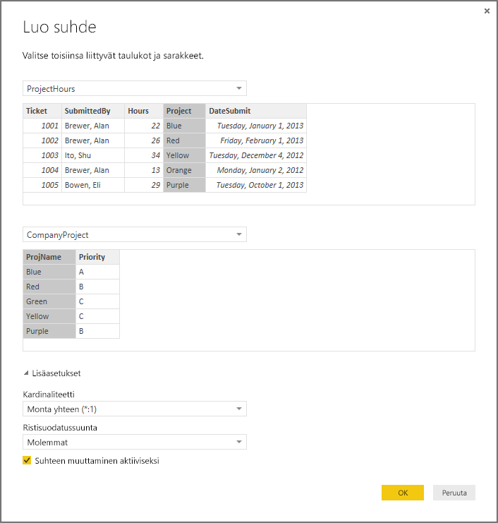

Totta puhuen loit tämän suhteen nyt vaikealla tavalla. Olisit päässyt helpommalla valitsemalla Automaattinen tunnistus -painikkeen Suhteiden hallinta -valintaikkunassa. Itse asiassa automaattinen tunnistus olisi tehnyt työn puolestasi heti, kun latasit tiedot, jos molemmilla sarakkeilla olisi ollut sama nimi. Mutta eihän siinä olisi ollut mitään haastetta!

Tarkastellaan seuraavaksi taas raporttipohjalla olevaa taulukkoa.

 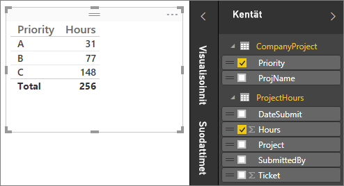

Sehän näyttää nyt paljon paremmalta.

Kun tunnit lasketaan yhteen Prioriteetin mukaan, Power BI Desktop etsii Yritysprojekti-hakutaulukosta kaikki yksilölliset väriarvot ja sitten kaikkien näiden arvojen esiintymät Yritysprojekti-taulukosta ja laskee lopuksi jokaisen yksilöllisen arvon kokonaismäärän.

Tämähän oli melko helppoa, mutta automaattisen tunnistuksen avulla et välttämättä joudu tekemään näinkään paljon.

## Tietoja lisäasetuksista
Kun suhde luodaan joko automaattisella tunnistuksella tai manuaalisesti, Power BI Desktop määrittää automaattisesti lisäasetuksia taulukoiden tietojen perusteella. Voit määrittää nämä suhteiden lisäominaisuudet Luo/Muokkaa-valintaikkunan alimmassa osassa.

 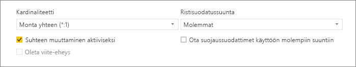

Kuten sanottua, nämä määritetään yleensä automaattisesti eikä sinun tarvitse koskea niihin. Tietyissä tilanteissa nämä asetukset kannattaa kuitenkin määrittää itse.

## Tietojen tulevat päivitykset vaativat eri kardinaliteetin
Power BI Desktop osaa tavallisesti määrittää suhteen parhaan kardinaliteetin automaattisesti.  Jos haluat kuitenkin ohittaa automaattisen asetuksen, koska tiedät tietojen muuttuvan tulevaisuudessa, voit valita asetuksen Kardinaliteetti-ohjausobjektissa. Katsotaan esimerkkiä, jossa meidän on valittava eri kardinaliteetti.

Alla oleva Yritysprojektiprioriteetti-taulukko on luettelo yrityksen kaikista projekteista ja niiden prioriteeteista. Projektibudjetti-taulukossa on ne projektit, joiden budjetti on hyväksytty.

**Projektibudjetti**

| **HyväksytytProjektit** | **Budjettiallokointi** | **Allokointipvm** |
|:--- | ---:| ---:|
| Sininen |40 000 |1.12.2012 |
| Punainen |100 000 |1.12.2012 |
| Vihreä |50 000 |1.12.2012 |

**Yritysprojektiprioriteetti**

| **Projekti** | **Prioriteetti** |
| --- | --- |
| Sininen |A |
| Punainen |B |
| Vihreä |C |
| Keltainen |C |
| Purppura |B |
| Oranssi |C |

Jos Yritysprojektiprioriteetti-taulukon Projekti-sarakkeen ja Projektibudjetti-taulukon HyväksytytProjektit-sarakkeen välille luodaan suhde tällä tavalla:

 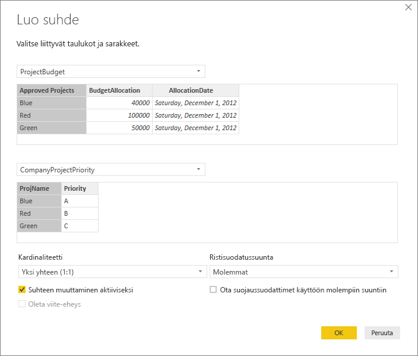

Kardinaliteetti on automaattisesti yksi yhteen (1:1) ja ristisuodatus on Molemmat (esitetyllä tavalla).  Tämä johtuu siitä, että Power BI Desktopissa näiden kahden taulukon paras yhdistelmä näyttää tältä:

| **Projekti** | **Prioriteetti** | **Budjettiallokointi** | **Allokointipvm** |
|:--- | --- | ---:| ---:|
| Sininen |A |40 000 |1.12.2012 |
| Punainen |B |100 000 |1.12.2012 |
| Vihreä |C |50 000 |1.12.2012 |
| Keltainen |C |  |  |
| Purppura |B |  |  |
| Oranssi |C |  |  |

Taulukoiden välillä on yksi yhteen -suhde, koska yhdistettyjen taulukoiden Projekti-sarakkeessa ei ole toistuvia arvoja. Projekti-sarake on yksilöllinen, koska kukin arvo esiintyy vain kerran, joten molempien taulukoiden arvot voidaan yhdistää suoraan ilman kahdentamista.

Mutta oletetaan, että tiedät tietojen muuttuvan seuraavan kerran, kun päivität ne. Projektibudjetti-taulukon päivitetyssä versiossa on nyt ylimääräisiä sinisiä ja punaisia rivejä:

**Projektibudjetti**

| **HyväksytytProjektit** | **Budjettiallokointi** | **Allokointipvm** |
| --- | ---:| ---:|
| Sininen |40 000 |1.12.2012 |
| Punainen |100 000 |1.12.2012 |
| Vihreä |50 000 |1.12.2012 |
| Sininen |80 000 |1.6.2013 |
| Punainen |90 000 |1.6.2013 |

 Tämän seurauksena näiden kahden taulukon paras yhdistelmä näyttää nyt tältä: 

| **Projekti** | **Prioriteetti** | **Budjettiallokointi** | **Allokointipvm** |
| --- | --- | ---:| ---:|
| Sininen |A |40 000 |1.12.2012 |
| Punainen |B |100 000 |1.12.2012 |
| Vihreä |C |50 000 |1.12.2012 |
| Keltainen |C |  |  |
| Purppura |B |  |  |
| Oranssi |C |  |  |
| Sininen |A |80 000 |1.6.2013 |
| Punainen |B |90 000 |1.6.2013 |

Tässä uudessa yhdistetyssä taulukossa Projekti-sarakkeessa on toistuvia arvoja.  Alkuperäisillä taulukoilla ei ole enää yksi yhteen -suhdetta, kun taulukko päivitetään. Tässä tapauksessa, koska tiedämme tulevien päivitysten aiheuttavan kaksoisarvoja Projekti-sarakkeeseen, kardinaliteetiksi kannattaa vaihtaa Monta yhteen (\*:1) siten, että monet ovat Projektibudjetin puolella ja yksi Yritysprojektiprioriteetin puolella.

## Ristisuodatussuunnan säätäminen monimutkaisia taulukoita ja suhteita varten
Useimmissa suhteissa ristisuodatussuunnaksi on määritetty Molemmat.  Joissakin harvinaisemmissa tilanteissa tämä asetus on määritettävä poikkeamaan oletusarvosta, kuten tuotaessa malleja vanhemmasta Power Pivot -versiosta, jolloin kaikki suhteet on määritetty yksisuuntaisiksi. 

Molemmat-asetuksen avulla Power BI Desktop voi käsitellä liitettyjen taulukoiden kaikkia ominaisuuksia yhtenä taulukkona.  Joissakin tilanteissa Power BI Desktop ei voi kuitenkaan määrittää suhteiden ristisuodatussuuntaa Molemmaksi sekä säilyttää yksiselitteistä oletusarvojoukkoa raportointia varten. Jos suhteen ristisuodatussuunnaksi ei ole määritetty Molemmat, se yleensä johtuu siitä, että Molemmat aiheuttaisi moniselitteisyyttä.  Jos oletusarvoinen ristisuodatin ei käy, kokeile määrittää asetus tiettyyn taulukkoon tai Molempiin.

Yksisuuntainen ristisuodatus toimii monissa tilanteissa.  Itse asiassa, jos olet tuonut mallin Power Pivot Excel 2013:sta tai aiemmasta versiosta, kaikki suhteet on määritetty yksisuuntaisiksi.  Yksisuuntainen tarkoittaa, että yhdistettyjen taulukoiden suodatusvalinnat toimivat siinä taulukossa, johon tiedot kerätään.  Ristisuodatuksen ymmärtäminen voi olla joskus hieman hankalaa, joten katsotaanpa esimerkkiä.

 

Jos yksisuuntaisella ristisuodatuksella luodaan projektin tunnit sisältävä yhteenveto, voit tehdä yhteenvedon (tai suodattaa) Yritysprojektin, Prioriteetin tai YrityksenTyöntekijän, Kaupungin mukaan.   Jos taas haluat laskea työntekijöiden määrän projektia kohti (harvinaisempi kysymys), se ei toimi. Saat sarakkeen, jonka arvot ovat kaikki samoja.  Alla olevassa esimerkissä molempien suhteiden ristisuodatuksen suunta on määritetty yksisuuntaiseksi Projektitunnit-taulukkoa kohti:

 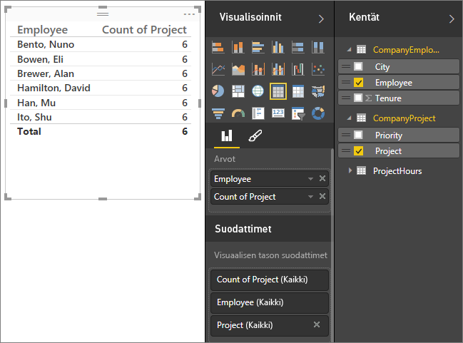

Suodattimen määritystä käytetään Yritysprojektista YrityksenTyöntekijän suuntaan (kuten alla olevassa kuvassa) mutta ei vastavirtaan YrityksenTyöntekijään.  Suodatin kuitenkin toimii, jos ristisuodatuksen suunnaksi määritetään Molemmat.  Molemmat-asetuksen avulla suodattimen määritystä käytetään myös Työntekijään.

 

Kun ristisuodatuksen suunnaksi määritetään Molemmat, raportti näyttää oikealta:

 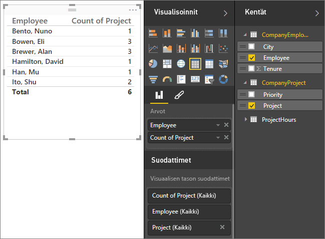

Ristisuodatus molempiin suuntiin toimii hyvin yllä olevan kaltaisiin taulukkosuhteisiin. Tätä kutsutaan yleisimmin tähtirakenteeksi, kuten tässä:

 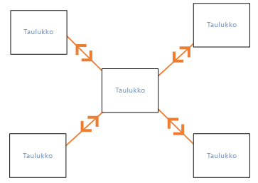

Ristisuodatuksen suunta ei toimi hyvin yleisempään tietokannoista usein löytyvään malliin, kuten tässä kaaviossa:

 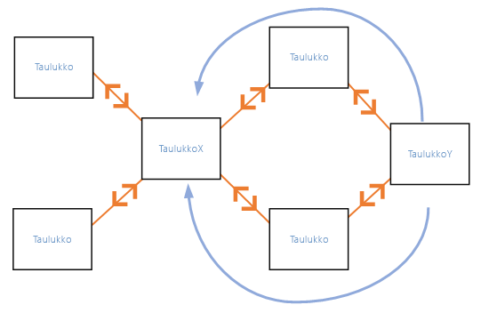

Jos sinulla on tällainen silmukoita sisältävä taulukkomalli, ristisuodatus voi luoda moniselitteisen suhdejoukon. Jos esimerkiksi X-taulukon kenttä lasketaan yhteen ja sitten suodatetaan Y-taulukon kentän mukaan, suodattimen tarkoitettu kulkusuunta ei ole selkeä, eli suodatetaanko ylemmän vai alemman taulukon kautta. Tavallinen esimerkki tämäntyyppisestä mallista on se, että X-taulukko on myyntituloksia sisältävä taulukko ja Y-taulukossa on budjettitiedot. Silloin keskellä olevat taulukot ovat molempien taulukoiden käyttämiä hakutaulukoita, esimerkiksi Yksikkö tai Alue. 

Samaan tapaan kuin aktiivisissa/passiivisissa suhteissa, Power BI Desktop ei salli suhteen määrittämistä Molemmiksi, jos se luo moniselitteisyyttä raporteissa. Tällaisen tilanteen voi ratkaista monella eri tavalla, ja tässä on kaksi yleisintä:

* Vähennä moniselitteisyyttä poistamalla suhteet tai merkitsemällä ne passiivisiksi. Sitten voit ehkä määrittää suhteen ristisuodatukseksi Molemmat.
* Poista silmukat tuomalla taulukko kahdesti (erinimisenä toisella kerralla).  Tämä luo tähtirakennetta muistuttavan suhdemallin.  Tähtirakennetta käytettäessä kaikki suhteet voidaan määrittää Molemmiksi.

## Väärä aktiivinen suhde
Kun Power BI Desktop luo suhteita automaattisesti, se havaitsee joskus useamman kuin yhden suhteen kahden taulukon välillä.  Kun näin tapahtuu, vain yksi suhteista määritetään aktiiviseksi.  Aktiivinen suhde toimii oletussuhteena niin, että kun valitset kenttiä kahdesta eri taulukosta, Power BI Desktop voi luoda automaattisesti visualisoinnin puolestasi.  Joissakin tapauksissa automaattisesti valitut suhteet voivat kuitenkin olla vääriä.  Suhteiden hallinta -valintaikkunan avulla voit määrittää suhteen aktiiviseksi tai passiiviseksi, tai voit määrittää aktiivisen suhteen Muokkaa suhdetta -valintaikkunassa. 

Jotta voidaan varmistaa, että oletussuhde on aina olemassa, Power BI Desktop sallii kerrallaan vain yhden aktiivisen suhteen kahden taulukon välillä.  Sinun on siis ensin määritettävä nykyinen suhde passiiviseksi ja määritettävä sitten haluamasi suhde aktiiviseksi.

Tarkastellaan esimerkkiä. Tämä ensimmäinen taulukko on ProjektinPalvelupyynnöt ja seuraava taulukko on TyöntekijänRooli.

**ProjektinPalvelupyynnöt**

| **Palvelupyyntö** | **Avaaja** | **Lähettäjä** | **Tunnit** | **Projekti** | **Lähetyspvm** |
| ---:|:--- |:--- | ---:|:--- | ---:|
| 1001 |Niemi, Hannes |Vasala, Jani |22 |Sininen |1.1.2013 |
| 1002 |Lepistö, Stefan |Vasala, Jani |26 |Punainen |1.2.2013 |
| 1003 |Wahlman, Miika |Kurri, Viljo |34 |Keltainen |4.12.2012 |
| 1004 |Niemi, Hannes |Vasala, Jani |13 |Oranssi |2.1.2012 |
| 1005 |Lepistö, Stefan |Tuominen, Antero |29 |Purppura |1.10.2013 |
| 1006 |Wahlman, Miika |Laurinen, Kalevi |35 |Vihreä |1.2.2013 |
| 1007 |Wahlman, Miika |Mylläri, Harri |10 |Keltainen |1.10.2013 |
| 1008 |Niemi, Hannes |Vasala, Frans |28 |Oranssi |2.1.2012 |
| 1009 |Lepistö, Stefan |Kurri, Viljo |22 |Purppura |1.2.2013 |
| 1010 |Wahlman, Miika |Tuominen, Antero |28 |Vihreä |1.10.2013 |
| 1011 |Niemi, Hannes |Tuominen, Antero |9 |Sininen |15.10.2013 |

**TyöntekijänRooli**

| **Työntekijä** | **Rooli** |
| --- | --- |
| Laurinen, Kalevi |Projektipäällikkö |
| Tuominen, Antero |Projektijohtaja |
| Vasala, Jani |Projektipäällikkö |
| Mylläri, Harri |Projektijohtaja |
| Vasala, Frans |Projektijohtaja |
| Kurri, Viljo |Projektijohtaja |
| Niemi, Hannes |Projektin rahoittaja |
| Lepistö, Stefan |Projektin rahoittaja |
| Wahlman, Miika |Projektin rahoittaja |

Tässä on itse asiassa kaksi suhdetta. Toinen on ProjektinPalvelupyynnöt-taulukon Lähettäjä-arvon ja TyöntekijänRooli-taulukon Työntekijä-arvon välillä ja toinen on ProjektinPalvelupyynnöt-taulukon Avaaja-arvon ja TyöntekijänRooli-taulukon Työntekijä-arvon välillä.

 

Jos molemmat suhteet lisätään malliin (Avaaja-suhde ensin), Suhteiden hallinta -valintaikkunassa näkyy, että Avaaja-suhde on aktiivinen:

 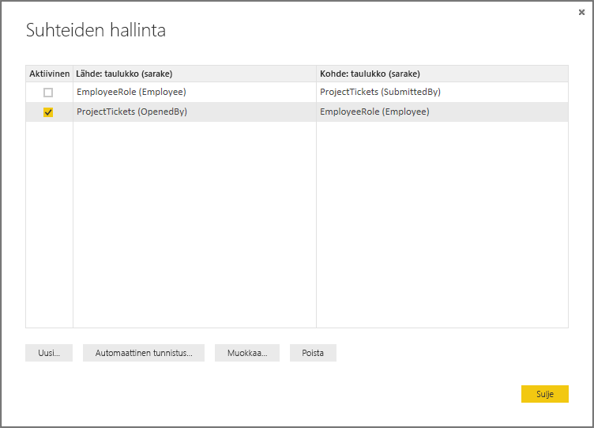

Jos nyt luodaan raportti, joka käyttää TyöntekijänRooli-taulukon Rooli- ja Työntekijä-kenttiä ja ProjektinPalvelupyynnöt-taulukon tunnit-kenttää taulukon visualisoinnissa raporttipohjassa, vain yhden projektin rahoittajat näkyvät, koska kukaan muu ei ole avannut projektin palvelupyyntöä.

 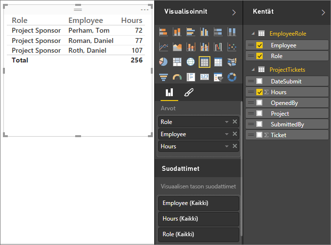

Aktiivista suhdetta voidaan muuttaa käyttämällä Lähettäjä-kenttää Avaaja-kentän sijaan. Poistetaan Suhteiden hallinnassa valinta ProjektinPalvelupyyntöjen (Avaaja) ja TyöntekijänRoolin (Työntekijä) välisestä suhteesta ja valitaan ProjektinPalvelupyyntöjen (Lähettäjä) ja TyöntekijänRoolin (Työntekijä) välinen suhde.

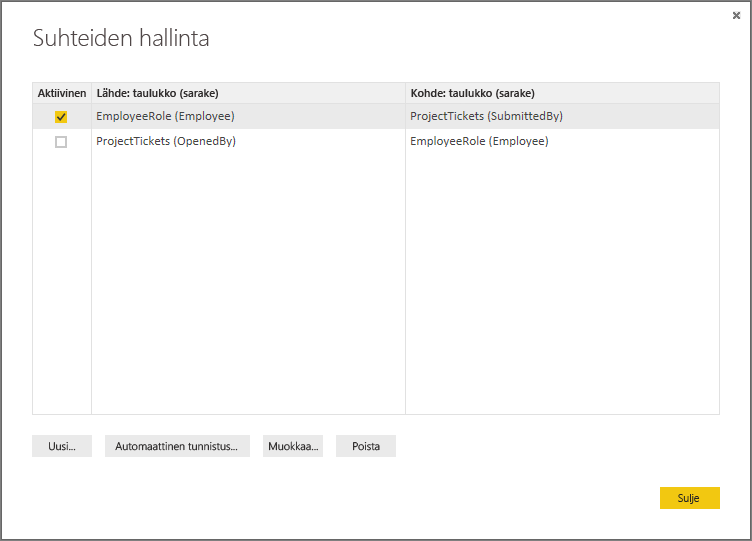

## Kaikkien suhteiden tarkasteleminen Suhde-näkymässä
Joskus mallissa on useita taulukoita ja monimutkaisia suhteita. Power BI Desktopin Suhde-näkymässä voit tarkastella kaikkia mallin suhteita sekä niiden suuntia ja kardinaliteetteja helppotajuisessa ja mukautettavassa kaaviossa. Lisätietoja on artikkelissa [Suhdenäkymä Power BI Desktopissa](desktop-relationship-view.md).

