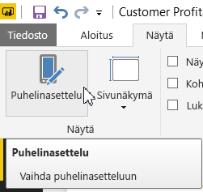
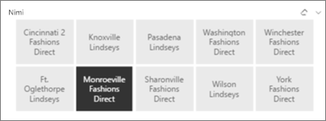
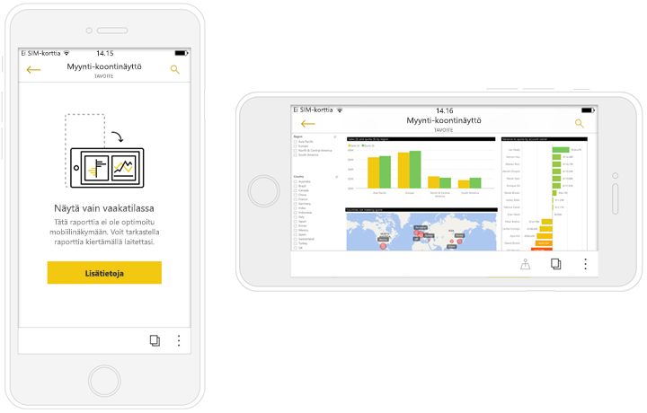

# Power BI -puhelinsovelluksille optimoitujen raporttien luominen
Voit parantaa raporttien tarkastelemista puhelimessa mobiilisovelluksissa luomalla raportista erityisesti puhelimiin soveltuvan version. Power BI Desktopissa ja Power BI -palvelussa raportti mukautetaan puhelimia varten niin, että raportin visualisointeja järjestellään uudelleen ja niiden kokoa muutetaan parhaan mahdollisen käyttökokemuksen tuottamiseksi. Lisäksi voit luoda [ *reagoivia* visualisointeja](#optimize-a-visual-for-any-size) ja [reagoivia osittajia](#enhance-slicers-to-to-work-well-in-phone-reports), joiden koko muuttuu kätevästi puhelimella tarkastelemista ajatellen. Jos lisäät raporttiin suodattimia, suodattimet näkyvät automaattisesti myös puhelinraportissa. Raportin lukijat voivat nähdä ne ja käyttää niitä raportin suodattamiseen.

## Raporttisivun asettelu puhelinta varten

Kun olet luonut raportin, voit optimoida sen puhelinkäyttöä varten.

1. Valitse Power BI Desktopin raporttinäkymässä **Näkymä**-välilehdeltä **Puhelinasettelu**.  
   
    
   
    Valitse Power BI -palvelussa **Muokkaa raporttia** > **Mobiiliasettelu**.

    Näkyviin tulee tyhjä puhelinpohja. Oikean reunan Visualisoinnit-paneelissa on luettelo kaikista alkuperäisen raporttisivun visualisoinneista.

3. Lisää puhelinasetteluun haluamasi visualisointi vetämällä se Visualisoinnit-paneelista puhelinpohjalle.
   
    Puhelinraporteissa käytetään ruudukkoasettelua. Kun vedät visualisointeja mobiilipohjaan, ne kohdistuvat ruudukon ruutujen mukaisesti.
   
    
   
    Voit lisätä puhelimen raporttisivulle joko osan pääraporttisivun visualisoinneista tai ne kaikki. Voit kuitenkin lisätä kunkin visualisoinnin vain kerran.

4. Voit muuttaa visualisointien kokoa ruudukossa samalla tavalla kuin ruutujen kokoa muutetaan koontinäytöissä tai mobiililaitteiden koontinäytöissä.
   
   Puhelinraportin ruudukko skaalautuu erikokoisiin puhelimiin, joten raportti näyttää yhtä hyvältä niin pienillä kuin suurillakin puhelimen näytöillä.
   
   

## Visualisoinnin optimointi mihin tahansa kokoon
Voit määrittää koontinäytön tai raportin visualisoinnin *reagoivaksi*, jos haluat, että dataa ja merkityksellisiä tietoja näytetään dynaamisesti suurin mahdollinen määrä oli näyttö minkäkokoinen tahansa. 

Visualisoinnin koon muuttuessa Power BI priorisoi tietonäkymän automaattisesti esimerkiksi poistamalla täytön ja siirtämällä selitteen visualisoinnin yläpuolelle, jolloin visualisointi pysyy informatiivisena myös pienessä koossa.

Voit valita visualisointikohtaisesti, otetaanko reagointi käyttöön. Lisätietoja [visualisointien optimoinnista](visuals/desktop-create-responsive-visuals.md).

## Huomioon otettavia seikkoja luotaessa raporttien puhelinasetteluja
* Jos raportissa on useita sivuja, voit joko optimoida kaikki sivut tai vain osan niistä. 
* Jos olet määrittänyt raporttisivulle taustavärin, puhelinraportissa käytetään samaa taustaväriä.
* Muotoiluasetuksia ei voi määrittää erikseen puhelinkäyttöä varten. Alkuperäisen asettelun ja mobiiliasettelun muotoilut ovat yhdenmukaiset. Esimerkiksi fonttikoot ovat samat.
* Jos haluat muuttaa visualisointia, esimerkiksi sen muotoilua, tietojoukkoa, suodattimia tai muita ominaisuuksia, palaa normaaliin raportin luontitilaan.
* Power BI tarjoaa puhelinraportteja varten oletusarvoisia otsikoita ja sivujen nimiä mobiilisovelluksessa. Jos olet luonut raporttiin tekstivisualisointeja otsikoita ja sivujen nimiä varten, niitä ei ehkä kannata lisätä puhelinraportteihin.     

## Visualisoinnin poistaminen puhelinasettelusta
* Jos haluat poista visualisoinnin, napsauta rastia visualisoinnin oikeasta yläkulmasta tai valitse visualisointi ja paina **Poista**.
  
   Visualisoinnin poistaminen tällä tavalla poistaa sen vain puhelinasettelun pohjalta. Se ei vaikuta itse visualisointiin tai alkuperäiseen raporttiin.
  
   

## Osittajien optimointi puhelinraporteissa käyttämistä varten
Osittajien avulla voidaan suodattaa raportin tietoja raporttipohjalla. Luodessasi osittajia normaalissa raportin luontitilassa voit muokata joitakin osittaja-asetuksia niin, että osittajat toimivat paremmin myös puhelinraporteissa:

* Valitse, saavatko raportin lukijat valita vain yhden kohteen vai useita.
* Kehystä osittajat, jotta raportti on helpompi silmäillä läpi.
* Tee osittajista joko pystysuoria, vaakasuoria tai *reagoivia*. 

Jos teet osittajasta reagoivan, se näyttää enemmän tai vähemmän vaihtoehtoja sen mukaan, miten sen kokoa ja muotoa muutetaan. Se voi näkyä joko korkeana, lyhyenä, leveänä tai kapeana. Jos pienennät sitä riittävästi, siitä tulee pelkkä suodatinkuvake raporttisivulle. 

Lisätietoja [reagoivien osittajien luomisesta](power-bi-slicer-filter-responsive.md).

## Puhelinraportin julkaiseminen
* Kun haluat julkaista raportin puhelinversion, [julkaise varsinainen raportti Power BI Desktopista Power BI -palveluun](desktop-upload-desktop-files.md), niin puhelinversio julkaistaan samassa yhteydessä.
  
    Lisätietoja [jakamisesta ja käyttöoikeuksista Power BI:ssä](service-how-to-collaborate-distribute-dashboards-reports.md).

## Optimoitujen ja optimoimattomien raporttien näyttäminen puhelimessa
Power BI tunnistaa puhelinten mobiilisovelluksissa automaattisesti optimoidut ja optimoimattomat puhelinraportit. Jos raportista on puhelinoptimoitu versio, Power BI:n puhelinsovellus avaa automaattisesti raportin puhelinraporttina.

Jos raportista ei ole puhelinoptimoitua versiota, raportti avautuu optimoimattomana, vaakanäkymässä.  

Puhelinraportissa puhelimen suunnan muuttaminen vaakasuuntaiseksi avaa raportin optimoimattomassa näkymässä alkuperäisellä raporttiasettelulla, oli raportista olemassa optimoitu versio tai ei.

Jos optimoit vain joitakin sivuja, lukijat saavat pystynäkymässä ilmoituksen siitä, että raportti on saatavilla vaakanäkymässä.

Raportin lukijat voivat kääntää puhelimen sivuttain ja tarkastella sivua vaakasuuntaisena. Lisätietoja [vuorovaikutuksesta puhelimelle optimoitujen Power BI ‑raporttien kanssa](consumer/mobile/mobile-apps-view-phone-report.md).

## Seuraavat vaiheet
* [Koontinäytön puhelinnäkymän luominen Power BI:ssä](service-create-dashboard-mobile-phone-view.md)
* [Puhelimelle optimoitujen Power BI ‑raporttien tarkastelu](consumer/mobile/mobile-apps-view-phone-report.md)
* [Mihin tahansa kokoon optimaalisten reagoivien visualisointien luominen](visuals/desktop-create-responsive-visuals.md)
* Onko sinulla muuta kysyttävää? [Voit esittää kysymyksiä Power BI -yhteisössä](http://community.powerbi.com/)

