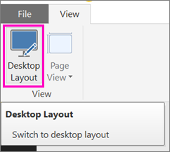
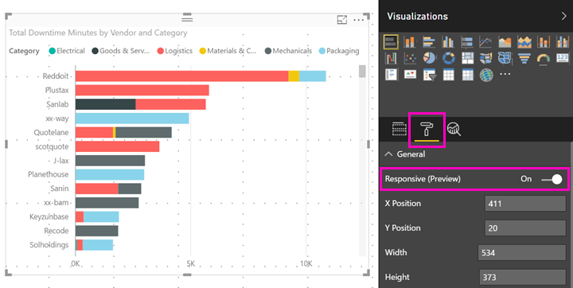

# Power BI:n visualisoinnin optimointi mihin tahansa kokoon
Kun luot uuden raportin, visualisoinnit ovat oletuksena *reagoivia*: dataa ja merkityksellisiä tietoja näytetään dynaamisesti suurin mahdollinen määrä, oli näyttö minkä kokoinen tahansa. Voit määrittää myös vanhempien raporttien sisältämien visualisointien koon dynaamisesti muuttuvaksi.

Visualisoinnin koon muuttuessa Power BI priorisoi tietonäkymän automaattisesti esimerkiksi poistamalla täytön ja siirtämällä selitteen visualisoinnin yläpuolelle, jolloin visualisointi pysyy informatiivisena myös pienessä koossa. Reagoinnista on hyötyä erityisesti puhelinten Power BI -mobiilisovelluksien visualisoinneissa.

Minkä tahansa X- ja Y-akselit ja osittajia sisältävän visualisoinnin kokoa voidaan muuttaa dynaamisesti.

## Power BI Desktopin reagoinnin ottaminen käyttöön
1. Ollessasi vanhemmassa raportissa Power BI Desktopissa, varmista **Näkymä**-välilehdellä, että olet **Työpöydän asettelussa**.
   
    
2. Valitse visualisointi, ja valitse **Visualisoinnit**-ruudussa **Muotoile**-osa.
3. Laajenna **Yleinen** > siirrä **Reagoiva** tilaan **Päällä**.
   
    
   
     Nyt, kun [luot puhelimelle optimoidun raportin](desktop-create-phone-report.md) ja lisäät tämän visualisoinnin, sen koko muuttuu hallitusti.

## Power BI -palvelun reagoinnin ottaminen käyttöön
Voit ottaa käyttöön visualisoinnin reagoinnin vanhemmalle raportille Power BI -palvelussa. Sinun on pystyttävä muokkaamaan raporttia.

1. Valitse Power BI -palvelun raportissa ([https://powerbi.com](https://powerbi.com)) **Muokkaa raporttia**.
2. Valitse visualisointi, ja valitse **Visualisoinnit**-ruudussa **Muotoile**-osa.
3. Laajenna **Yleinen** > siirrä **Reagoiva** tilaan **Päällä**.
   
    
   
     Kun nyt [luot puhelinnäkymän raportista](desktop-create-phone-report.md) ja lisäät tämän visualisoinnin, sen koko muuttuu hallitusti.

## Seuraavat vaiheet
* [Power BI -puhelinsovelluksille optimoitujen raporttien luominen](desktop-create-phone-report.md)
* [Puhelimelle optimoitujen Power BI ‑raporttien tarkastelu](mobile-apps-view-phone-report.md)
* Ilmenikö muuta kysyttävää? [Voit esittää kysymyksiä Power BI -yhteisössä](http://community.powerbi.com/)

