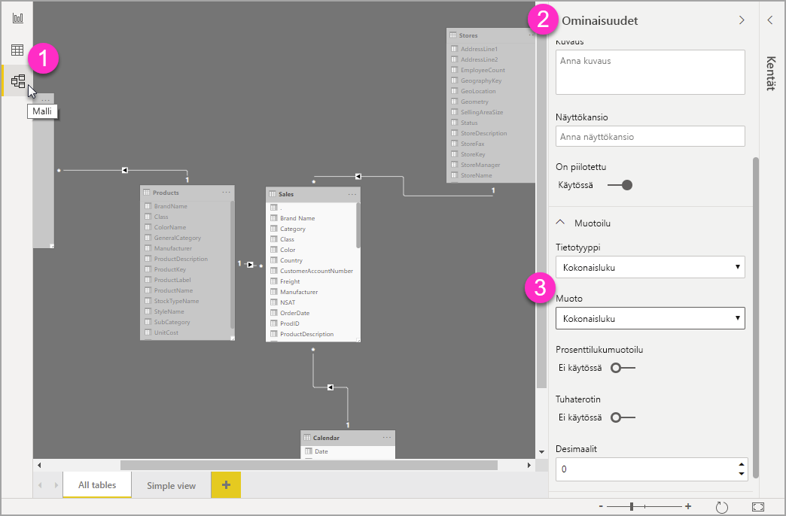

# Mukautettujen muotoilumerkkijonojen käyttö Power BI Desktopissa

**Power BI Desktopissa** mukautettujen muotoilumerkkijonojen avulla voit mukauttaa kenttien ulkoasua visualisoinneissa ja varmistaa, että raporttisi näyttävät juuri siltä kuin haluat niiden näyttävän.

## Miten mukautettuja muotoilumerkkijonoja käytetään

Voit luoda mukautettuja muotoilumerkkijonoja valitsemalla kentän **Mallinnus**-näkymässä ja valitsemalla sitten **Muotoilu** **Ominaisuudet**-ruudusta.

Kun olet valinnut **Mukautettu** avattavasta **Muotoilu**-valikosta, voit valita luettelosta yleisimmin käytettyjä merkkijonoja. 

## Tuettu mukautetun muotoilun syntaksi

Mukautetut muotoilumerkkijonot noudattavat VBA-tyylin syntaksia, joka on yleinen Excelissä ja muissa Microsoft-tuotteissa, mutta ne eivät tue kaikkia muissa tuotteissa käytettyjä syntakseja. 

Seuraavat taulukot määrittävät Power BI:n tukeman syntaksin.

Seuraavassa taulukossa näytetään tuetut **päivämääräsymbolit**:

| **Symboli** | **Alue** |
| --- | --- |
| _d_ | 1–31 (kuukauden päivä, ei edeltävää nollaa) |
| _dd_ | 01–31 (kuukauden päivä, edeltävä nolla) |
| _m_ | 1–12 (kuukausi, ei edeltävää nollaa, alkaen tammikuusta = 1) |
| _mm_ | 01–12 (kuukausi, edeltävä nolla, alkaen tammikuusta = 1) |
| _mmm_ | Näyttää kuukausien lyhennetyt nimet (islamilaisen kalenterin kuukausien nimillä ei ole lyhenteitä) |
| _mmmm_ | Näyttää kuukausien kokonaiset nimet |
| _y_ | 1–366 (vuoden päivä) |
| _yy_ | 00–99 (vuosiluvun kaksi viimeistä merkkiä) |
| _yyyy_ | 100–9999 (kolme-tai nelinumeroinen vuosiluku) |

Seuraavassa taulukossa näytetään tuetut **ajan symbolit**:

| **Symboli** | **Alue** |
| --- | --- |
| _h_ | 0–23 (1–12, jonka perässä &quot;AM&quot; tai &quot;PM&quot;-liite) (tunti, ilman edeltävää nollaa) |
| _hh_ | 00–23 (01–12, jonka perässä &quot;AM&quot; tai &quot;PM&quot;-liite) (tunti, edeltävä nolla) |
| _n_ | 0–59 (tunnin minuutti, ei edeltävää nollaa) |
| _nn_ | 00–59 (tunnin minuutti, edeltävä nolla) |
| _m_ | 0–59 (tunnin minuutti, ei edeltävää nollaa). Vain, jos edellä on _h_ tai _hh_ |
| _mm_ | 00–59 (tunnin minuutti, edeltävä nolla). Vain, jos edellä on _h_ tai _hh_ |
| _s_ | 0–59 (minuutin sekunti, ei edeltävää nollaa) |
| _ss_ | 00–59 (minuutin sekunti, edeltävä nolla) |

Näet [esimerkin](https://docs.microsoft.com/office/vba/language/reference/user-interface-help/format-function-visual-basic-for-applications#example) mukautettujen arvomerkkijonojen muotoilemisesta.

Käyttäjän määrittämä numeroiden muotoilulauseke voi sisältää 1–3 osiota puolipisteillä eroteltuina. Jos sisällytät puolipisteitä, joiden välissä ei ole mitään, puuttuvaa osaa ei näytetä (se on &quot;&quot;). Positiivista muotoa käytetään, jos puolipistettä ei ole määritetty.

Tässä on esimerkkejä eri arvomerkkijonojen eri muotoiluista:

|   | **Muotoilumerkkijonot** |   |   |   |
| --- | --- | --- | --- | --- |
| **Arvot** | **0.00;-0.0;&quot;Nolla&quot;** | **0.00;;** | **0.00;-0.0;** | **0.00;** |
| **-1.234** | -1.2 | &quot;&quot; | -1.2 | &quot;&quot; |
| **0** | &quot;Nolla&quot; | &quot;&quot; | &quot;&quot; | 0.00 |
| **1.234** | 1.23 | 1.23 | 1.23 | 1.23 |

Seuraavassa taulukossa on määritetty esimääritetyt **nimetyt päivämäärän ja kellonajan muodot**:

| **Muotoilun nimi** | **Kuvaus** |
| --- | --- |
| **Yleinen päivämäärä** | Näytä päivämäärä ja/tai kellonaika, esimerkiksi 4/3/93 05:34 PM. Jos murto-osaa ei ole, näytä vain päivämäärä, esimerkiksi 4/3/93. Jos kokonaislukuosaa ei ole, näytä vain kellonaika, esimerkiksi 05:34 PM. Järjestelmäasetukset määrittävät näytetyn päivämäärän. |
| **Pitkä päivämäärä** | Näytä järjestelmäsi pitkään päivämäärämuotoon perustuva päivämäärä. |
| **Lyhyt päivämäärä** | Näytä järjestelmäsi lyhyeen päivämäärämuotoon perustuva päivämäärä. |
| **Pitkä kellonaika** | Näytä järjestelmäsi pitkään kellonaikamuotoon perustuva kellonaika; sisältää tunnit, minuutit, sekunnit. |
| **Lyhyt kellonaika** | Näytä kellonaika 24 tunnin muodossa, esimerkiksi 17:45. |

Nimetyt numeromuodot

Seuraavassa taulukossa on määritetty esimääritetyt **nimetyt numeromuodot**:

| **Muodon nimi** | **Kuvaus** |
| --- | --- |
| **Yleinen numero** | Näytä luku ilman tuhaterotinta. |
| **Valuutta** | Näytä luku, jossa on tuhaterotin, jos se on tarpeen; näytä kaksi numeroa desimaalierottimen oikealla puolella. Tulos perustuu järjestelmän aluekohtaisiin asetuksiin. |
| **Kiinteä** | Näytä vähintään yksi numero desimaalierottimen vasemmalla ja kaksi sen oikealla puolella. |
| **Vakio** | Näytä numero, jossa on tuhaterotin, vähintään yksi numero desimaalierottimen vasemmalla ja kaksi sen oikealla puolella. |
| **Prosentti** | Näytä numero, joka on kerrottu sadalla ja jonka oikealla puolella on prosentti merkki ( **%** ); näytä aina kaksi numeroa desimaalierottimen oikealla puolella. |
| **Tieteellinen** | Käytä tieteellistä vakiomerkintää. |

Seuraavassa taulukossa on yksilöity merkit, joiden avulla voit luoda **käyttäjän määrittämät päivämäärän ja kellonajan muodot**.

| **Merkki** | **Kuvaus** |
| --- | --- |
| ( **:** ) | Kellonajan erotin. Joillakin alueilla kellonajan erottimena voidaan käyttää myös muita merkkejä. Kellonajan erotin erottaa tunnit, minuutit ja sekunnit, kun kellonajan arvot muotoillaan. Järjestelmäasetukset määrittävät merkin, jota käytetään kellonajan erottimena muotoilluissa tuloksissa. |
| ( **/** ) | Päivämääräerotin. Joillakin alueilla päivämääräerottimena voidaan käyttää myös muita merkkejä. Päivämääräerotin erottaa päivän, kuukauden ja vuoden, kun päivämääräarvot muotoillaan. Järjestelmäasetukset määrittävät merkin, jota käytetään päivämäärän erottimena muotoilluissa tuloksissa. |
| d | Näyttää kuukauden päivän ilman edeltävää nollaa (1–31). |
| dd | Näyttää kuukauden päivän edeltävän nollan kanssa (01–31). |
| ddd | Näyttää päivän lyhenteenä (Su–La). Lokalisoitu. |
| dddd | Näyttää päivän koko nimen (sunnuntai–lauantai). Lokalisoitu. |
| M | Näyttää kuukauden lukuna ilman edeltävää nollaa (1–12). Jos m tulee välittömästi h:n tai hh:n jälkeen, näet kuukauden asemesta minuutin. |
| mm | Näyttää kuukauden lukuna edeltävän nollan kanssa (01–12). Jos m tulee välittömästi h:n tai hh:n jälkeen, näet kuukauden asemesta minuutin. |
| mmm | Näyttää kuukauden lyhenteenä (Tammi–Joulu). Lokalisoitu. |
| mmmm | Näyttää kuukauden koko nimen (tammikuu–joulukuu). Lokalisoitu. |
| y | Näytä vuodenpäivän lukuna (1–366). |
| yy | Näyttää vuoden kaksinumeroisena lukuna (00–99). |
| yyyy | Näyttää vuoden nelinumeroisena lukuna (100–9999). |
| h | Näyttää tunnit ilman edeltävää nollaa (0–23). |
| hh | Näyttää tunnit edeltävän nollan kanssa (00–23). |
| n | Näyttää minuutit lukuna ilman edeltävää nollaa (0–59). |
| nn | Näyttää minuutit lukuna edeltävän nollan kanssa (00–59). |
| s | Näyttää sekunnit lukuna ilman edeltävää nollaa (0–59). |
| ss | Näyttää sekunnit lukuna edeltävän nollan kanssa (00–59). |
| AM/PM | Käytä 12 tunnin kelloa ja näytä AM-merkintä isoilla kirjaimilla keskipäivää edeltävinä ajankohtina; näytä PM-merkintä isoilla kirjaimilla klo 12:00–23:59. |

Seuraavassa taulukossa on yksilöity merkit, joiden avulla voit luoda **käyttäjän määrittämät numeromuodot**.

| **Merkki** | **Kuvaus** |
| --- | --- |
| Ei mitään | Näytä luku ilman muotoilua. |
| ( **0** ) | Numeroiden paikkamerkki. Näytä numero tai nolla. Jos lausekkeessa on numero paikassa, jossa 0 esiintyy muotoilumerkkijonossa, näytä se; muussa tapauksessa kyseisessä sijainnissa näytetään nolla. Jos numerossa on vähemmän numeroita kuin muotoilussa on nollia (desimaalipilkun kummalla tahansa puolella), näytä edeltävät tai lopussa olevat nollat. Jos luvussa on desimaalierottimen oikealla puolella on enemmän numeroita kuin muotoilulausekkeen desimaalierottimen oikealla puolella on nollia, pyöristä luku nollia vastaavaan määrään desimaaleja. Jos luvussa on desimaalierottimen vasemmalla puolella on enemmän numeroita kuin muotoilulausekkeen desimaalierottimen vasemmalla puolella on nollia, näytä ylimääräiset numerot ilman muutoksia. |
| ( **#** ) | Numeroiden paikkamerkki. Näytä numero tai ei mitään. Jos lausekkeessa on numero paikassa, jossa # esiintyy muotoilumerkkijonossa, näytä se; muussa tapauksessa kyseisessä sijainnissa ei näytetä mitään. Tämä symboli toimii kuin 0-numeron paikkamerkki sillä erotuksella, että alussa ja lopussa olevia nollia ei näytetä, jos luvussa on sama tai pienempi määrä numeroita kuin muotolausekkeen desimaalierottimen kummalla tahansa puolella on #-merkkejä. |
| ( **.** ) | Desimaalien paikkamerkki. Joillakin alueilla desimaalierottimena käytetään pilkkua. Desimaalien paikkamerkki määrittää, montako numeroa näytetään desimaalierottimen vasemmalla ja oikealla puolella. Jos muotoilulauseke sisältää vain numeromerkkejä kyseisen symbolin vasemmalla puolella, luvut, jotka ovat pienempiä kuin 1, alkavat desimaalierottimella. Jos haluat näyttää edeltävän nollan murtolukujen kanssa, käytä 0:aa ensimmäisen numeron paikkamerkkinä desimaalierottimen vasemmalla puolella. Muotoillun tuloksen desimaalipaikkamerkkinä käytettävä merkki määräytyy järjestelmän tunnistaman lukumuotoilun mukaan. |
| ( **%)** | Prosenttien paikkamerkki. Lauseke kerrotaan 100:lla. Prosenttimerkki ( **%** ) lisätään sijaintiin, jossa se näkyy muotoilumerkkijonossa. |
| ( **,** ) | Tuhaterotin. Joillakin alueilla tuhaterottimena käytetään pistettä. Tuhaterotin erottaa tuhannet sadoista luvussa, jonka desimaalierottimen vasemmalla puolella on vähintään neljä paikkaa. Tuhaterottimen vakiokäyttö on määritetty, jos muoto sisältää tuhaterottimen, jonka ympärillä on numeroiden paikkamerkit ( **0**  tai  **#** ). Kaksi vierekkäistä tuhaterotinta tai välittömästi desimaalierottimen vasemmalla puolella oleva tuhaterotin (riippumatta siitä, onko desimaali määritetty) tarkoittaa &quot;numeron skaalaamista jakamalla sen 1000:lla ja pyöristämällä tarvittaessa.&quot; Voit esimerkiksi käyttää muotoilumerkkijonoa &quot;##0,,&quot; edustamaan 100 miljoonaa muodossa 100. Luvut, jotka ovat pienempiä kuin 1 miljoona, näytetään muodossa 0. Kahta vierekkäistä tuhaterotinta, jotka sijaitsevat missä tahansa paitsi heti desimaalierottimen vasemmalla puolella, käsitellään yksinkertaisesti tuhaterottimen käyttönä. Muotoillun tuloksen tuhaterottimena käytettävä merkki määräytyy järjestelmän tunnistaman lukumuotoilun mukaan. |
| ( **:** ) | Kellonajan erotin. Joillakin alueilla kellonajan erottimena voidaan käyttää myös muita merkkejä. Kellonajan erotin erottaa tunnit, minuutit ja sekunnit, kun kellonajan arvot muotoillaan. Järjestelmäasetukset määrittävät merkin, jota käytetään kellonajan erottimena muotoilluissa tuloksissa. |
| ( **/** ) | Päivämääräerotin. Joillakin alueilla päivämääräerottimena voidaan käyttää myös muita merkkejä. Päivämääräerotin erottaa päivän, kuukauden ja vuoden, kun päivämääräarvot muotoillaan. Järjestelmäasetukset määrittävät merkin, jota käytetään päivämäärän erottimena muotoilluissa tuloksissa. |
| ( **E- E+ e- e+** ) | Tieteellinen muoto. Jos muotoilulauseke sisältää vähintään yhden numeron paikkamerkin ( **0** tai **#** ) E-, E+-, e- tai e+-merkin oikealla puolella, luku näytetään tieteellisessä muodossa, ja E tai e lisätään luvun ja sen eksponentin väliin. Oikealla olevien numeroiden paikkamerkkien määrä määrittää eksponentissa olevien numeroiden määrän. Aseta miinusmerkki negatiivisten eksponenttien viereen E-:n tai e-:n avulla. Aseta miinusmerkki negatiivisten eksponenttien ja plusmerkki positiivisten eksponenttien viereen E+:n tai e+:n avulla. |
| **- + $**  ( ) | Näytä literaalimerkki. Jos haluat näyttää muun kuin jonkin luettelossa olevan merkin, kirjoita sen eteen kenoviiva (\) tai kirjoita se kaksinkertaisiin lainausmerkkeihin (&quot; &quot;). |
| ( * *\** ) | Näytä seuraava merkki muotoilumerkkijonossa. Jos haluat näyttää merkin, jolla on erityinen merkitys literaalimerkkinä, kirjoita sen eteen kenoviiva (\). Kenoviivaa itseään ei näytetä. Kenoviivan käyttäminen vastaa merkin lisäämistä kaksinkertaisiin lainausmerkkeihin. Jos haluat kenoviivan näkyvän, käytä kahta kenoviivaa (\\). Literaalimerkkeinä ei voida näyttää esimerkiksi päivämäärän ja kellonajan muotoilumerkkejä (a, c, d, h, m, n, p, q, s, t, w, y, / ja :), numeromuotoilumerkkejä (#, 0, %, E, e, pilkku ja piste) sekä merkkijonomuotoilun merkkejä (@, &amp;, \&lt;, \&gt; ja !). |
| (&quot;ABC&quot;) | Näytä merkkijono kaksinkertaisten lainausmerkkien sisällä (&quot; &quot;). |

## Seuraavat vaiheet
Voit olla kiinnostunut myös seuraavista artikkeleista:

* [VBA-muotoilumerkkijonot](https://docs.microsoft.com/office/vba/language/reference/user-interface-help/format-function-visual-basic-for-applications#example)
* [Mittarit Power BI Desktopissa](desktop-measures.md)
* [Tietotyypit Power BI Desktopissa](desktop-data-types.md)
* [Ehdollinen muotoilu taulukoissa](desktop-conditional-table-formatting.md)

