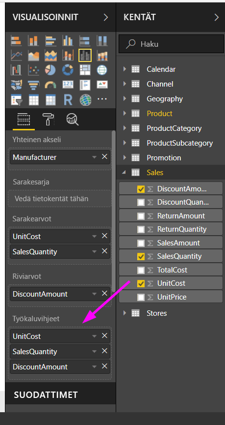
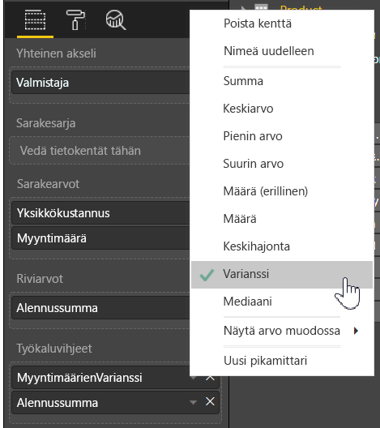

# Työkaluvihjeiden mukautus Power BI Desktopissa
Työkaluvihjeet ovat tyylikäs tapa tarjota tilannekohtaista lisätietoa ja yksityiskohtia visualisoinnin arvopisteistä. Alla olevassa kuvassa näkyy Power BI Desktopissa kaaviossa käytetty työkaluvihje.

Uudessa visualisoinnissa työkaluvihje esittää oletusarvoisesti arvopisteen arvon ja luokan. Työkaluvihjeen tietojen mukauttamisesta voi olla hyötyä monenlaisissa tilanteissa, kun työkaluvihjeen avulla voidaan esittää tilannekohtaista lisätietoa visualisointia tarkasteleville käyttäjille. Mukautettujen työkaluvihjeiden avulla voit määrittää lisää arvopisteitä, jotka näkyvät osana työkaluvihjettä.

## Ohjeet työkaluvihjeiden mukauttamiseen
Jos haluat luoda mukautetun työkaluvihjeen, siirry **Visualisoinnit**-paneelista kohtaan **Kentät** ja vedä haluamasi kenttä **Työkaluvihjeet**-säilöön kuvan osoittamalla tavalla. Kuvasta näkyy, että **Työkaluvihjeet**-säilöön on lisätty kaksi kenttää.

Kun työkaluvihjeet on lisätty kenttävalitsimeen, hiiren osoittimen vieminen visualisoinnin arvopisteen kohdalle näyttää työkaluvihjeessä kyseisten kenttien arvot.

## Työkaluvihjeiden mukauttaminen koostamalla tai pikalaskinten avulla
Voit mukauttaa työkaluvihjettä lisää valitsemalla koostefunktion tai *pikalaskimen*. Se tehdään valitsemalla nuoli **Työkaluvihjeet**-kohdan vierestä ja valitsemalla luettelosta sitten halutut asetukset.

**Työkaluvihjeitä** voi mukauttaa monin tavoin esittämään nopeasti merkityksellisiä tietoja käyttäjille, jotka tarkastelevat koontinäyttöjä tai raportteja, käyttämällä mitä tahansa tietojoukossa olevaa kenttää.

