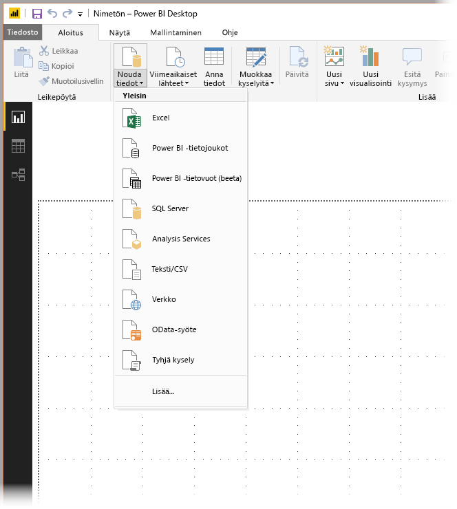
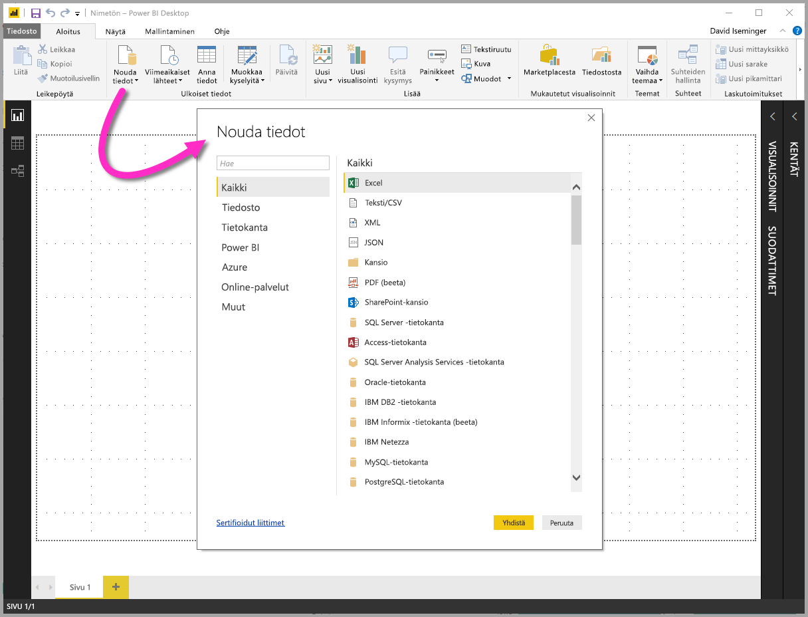
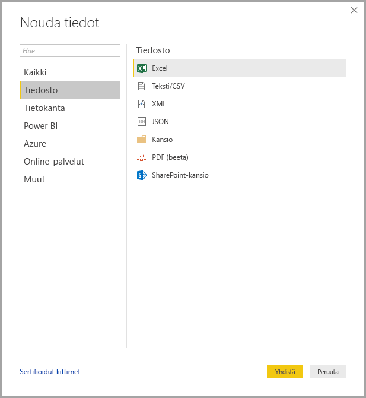
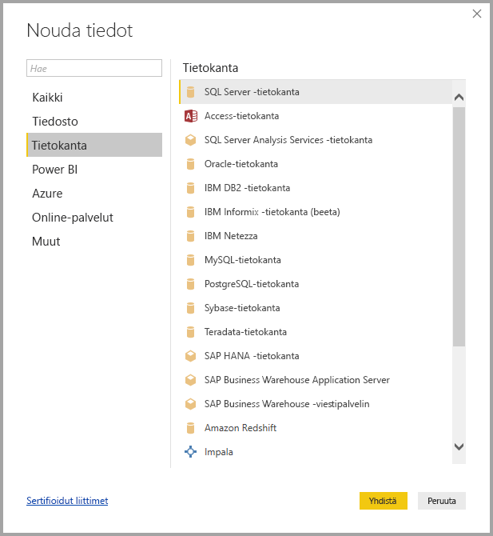
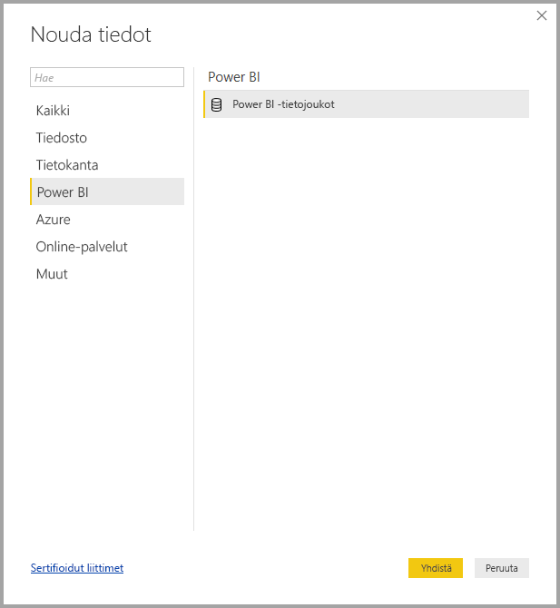
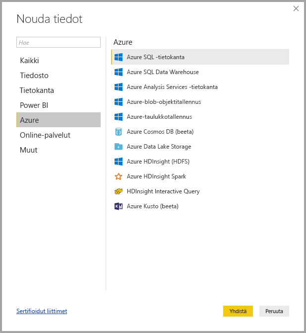
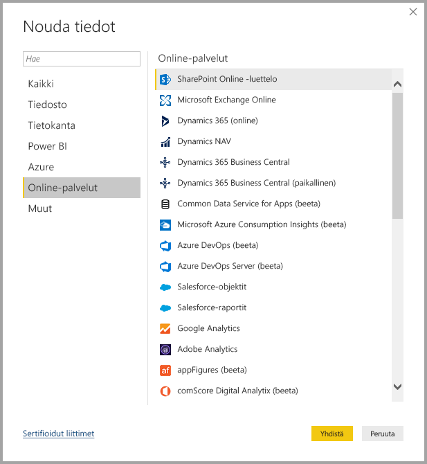
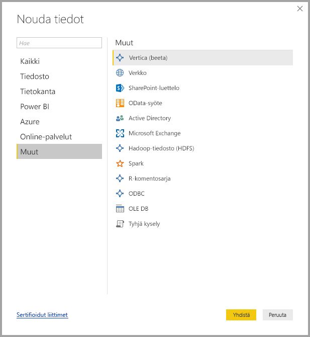
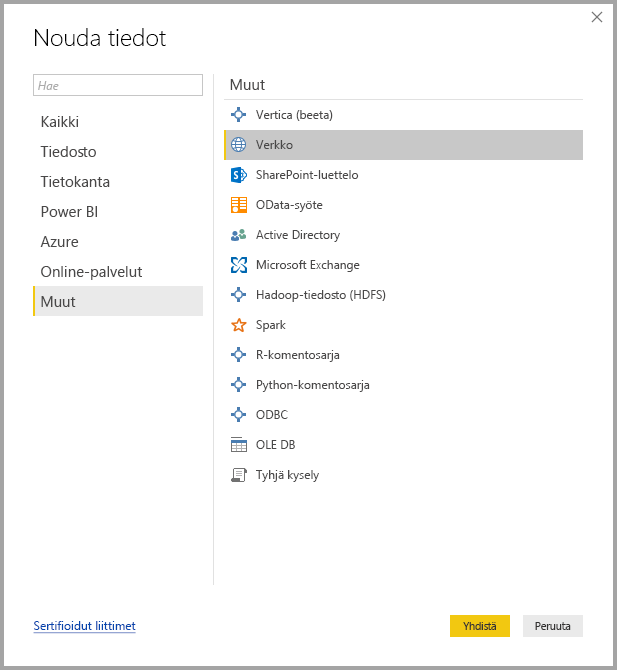

# Power BI Desktopin tietolähteet
Power BI Desktopin avulla voit yhdistää tietoja monista eri lähteistä. Täydellinen luettelo käytettävissä olevista tietolähteistä on tämän sivun alareunassa.

Muodosta yhteys tietoihin valitsemalla **Aloitus**-valintanauhassa **Nouda tiedot**. Jos valitset alanuolen tai **Nouda tiedot** -painikkeen, näyttöön tulee **yleisimpien** tietotyyppien valikko, joka näkyy seuraavassa kuvassa:

Valitsemalla **Lisää...** **Yleisimmät**-valikossa saat **Nouda tiedot** -ikkunan näkyviin. Voit myös tuoda **Nouda tiedot** -ikkunan (ja ohittaa **Yleisimmät**-valikon) valitsemalla suoraan **Nouda tiedot** **-kuvakepainikkeen**.

> [!NOTE]
> Power BI -tiimi laajentaa jatkuvasti **Power BI Desktopin** ja **Power BI -palvelun** käytettävissä olevia tietolähteitä. Näet näin ollen usein keskeneräisten tietolähteiden varhaisia versioita, joissa on merkintä *beeta* tai *esikatselu*. Tietolähteen, jolla on merkintä *beeta* tai *esikatselu*, tuki ja toiminnallisuus ovat rajoitettua, eikä sitä tulisi käyttää tuotantoympäristössä.
> 
> 

## Tietolähteet
Kaikki tietotyypit on järjestelty seuraaviin luokkiin:

* Kaikki
* Tiedosto
* Tietokanta
* Power BI
* Azure
* Online-palvelut
* Muut

**Kaikki**-luokka sisältää kaikki tietoyhteystyypit kaikista luokista.

**Tiedosto**-luokka tarjoaa seuraavat tietoyhteydet:

* Excel
* Teksti/CSV
* XML
* JSON
* Kansio
* SharePoint-kansio

Seuraavassa kuvassa näkyy **Tiedosto**-luokan **Nouda tiedot** -ikkuna.

**Tietokanta**-luokka tarjoaa seuraavat tietoyhteydet:

* SQL Server -tietokanta
* Access-tietokanta
* SQL Server Analysis Services -tietokanta
* Oracle-tietokanta
* IBM DB2 -tietokanta
* IBM Informix -tietokanta (beeta)
* IBM Netezza
* MySQL-tietokanta
* PostgreSQL-tietokanta
* Sybase-tietokanta
* Teradata-tietokanta
* SAP HANA -tietokanta
* SAP Business Warehouse -sovelluspalvelin
* SAP Business Warehouse -viestipalvelin (beeta)
* Amazon Redshift
* Impala
* Google BigQuery
* Snowflake
* Exasol

> [!NOTE]
> Jotkin tietokannan yhdistimet edellyttävät, että otat ne käyttöön valitsemalla **Tiedosto > Asetukset ja vaihtoehdot > Asetukset** ja valitsemalla **Esikatselutoiminnot** ja ottamalla yhdistin käyttöön. Jos et näe joitakin edellä mainituista yhdistimistä ja haluat käyttää niitä, tarkista **Esikatselutoiminnot**-asetukset. Huomaa myös, että tietolähteen, jolla on merkintä *beeta* tai *esikatselu*, tuki ja toiminnallisuus ovat rajoitettua, eikä sitä tulisi käyttää tuotantoympäristössä.
> 
> 

Seuraavassa kuvassa näkyy **Tietokanta**-luokan **Nouda tiedot** -ikkuna.

**Power BI** -luokka tarjoaa seuraavat tietoyhteydet:

* Power BI -tietojoukot

Seuraavassa kuvassa näkyy **Power BI** -luokan **Nouda tiedot** -ikkuna.

**Azure**-luokka tarjoaa seuraavat tietoyhteydet:

* Azure SQL -tietokanta
* Azure SQL Data Warehouse
* Azure Analysis Services -tietokanta
* Azure Blob -säilö
* Azure-taulukkosäilö
* Azure Cosmos DB (beeta)
* Azure Data Lake Store
* Azure HDInsight (HDFS)
* Azure HDInsight Spark (beeta)
* HDInsight Interactive Query (beeta)
* Azure KustoDB (beeta)

Seuraavassa kuvassa näkyy **Azure**-luokan **Nouda tiedot** -ikkuna.

**Online-palvelut**-luokka tarjoaa seuraavat tietoyhteydet:

* SharePoint Online -luettelo
* Microsoft Exchange Online
* Dynamics 365 (online)
* Dynamics NAV (beeta)
* Dynamics 365 Business Central
* Common Data Service for Apps (beeta)
* Common Data Service (beeta)
* Microsoft Azure Consumption Insights (beeta)
* Visual Studio Team Services (beeta)
* Salesforce-objektit
* Salesforce-raportit
* Google Analytics
* Adobe Analytics
* appFigures (beeta)
* comScore Digital Analytix (beeta)
* Dynamics 365 for Customer Insights (beeta)
* Data.World – nouda tietojoukko (beeta)
* Facebook
* GitHub (beeta)
* MailChimp (beeta)
* Marketo (beeta)
* Mixpanel (beeta)
* Planview Enterprise One - PRM (beeta)
* Planview Projectplace (beeta)
* QuickBooks Online (beeta)
* Smartsheet
* SparkPost (beeta)
* Stripe (beeta)
* SweetIQ (beeta)
* Planview Enterprise One - CMT (beeta)
* Twilio (beeta)
* tyGraph (beeta)
* Webtrends (beeta)
* Zendesk (beeta)
* TeamDesk (beeta)

Seuraavassa kuvassa näkyy **Online-palvelut**-luokan **Nouda tiedot** -ikkuna.

**Muut**-luokka tarjoaa seuraavat tietoyhteydet:

* Vertica (beeta)
* Verkko
* SharePoint List
* OData-syöte
* Active Directory
* Microsoft Exchange
* Hadoop-tiedosto (HDFS)
* Spark
* R-komentosarja
* ODBC
* OLE DB
* Tyhjä kysely

Seuraavassa kuvassa näkyy **Muut**-luokan **Nouda tiedot** -ikkuna.

> [!NOTE]
> Tällä hetkellä ei ole mahdollista muodostaa yhteyttä mukautettuihin tietolähteisiin, jotka suojattu Azure Active Directorylla.
> 
> 

## Yhteyden muodostaminen tietolähteeseen
Jos haluat muodostaa yhteyden tietolähteeseen, valitse tietolähde **Nouda tiedot** -ikkunassa ja valitse **Muodosta yhteys**. Seuraavassa kuvassa **Muut**-tietoyhteysluokasta on valittu **WWW**.

Näyttöön tulee tietoyhteyden mukainen yhteysikkuna. Jos tunnistetietoja vaaditaan, sinua pyydetään antamaan ne. Seuraavassa kuvassa näytetään URL-osoitteen kirjoittaminen WWW-tietolähteeseen yhdistämistä varten.

Kun URL-osoite tai resurssiyhteyden tiedot on annettu, valitse **OK**. Power BI Desktop muodostaa yhteyden tietolähteeseen ja esittää saatavilla olevat tietolähteet **siirtymistoiminnossa**.

Voit joko ladata tiedot valitsemalla **Lataa**-painike **Siirtymistoiminto**-ruudun alareunassa tai muokata kyselyä ennen tietojen lataamista valitsemalla **Muokkaa**-painike.

Tietolähteisiin yhdistäminen Power BI Desktopissa ei muuta vaadi! Yritä muodostaa yhteys tietoihin kasvavassa tietolähteiden valikoimassa ja tarkista päivitetyt tiedot – kasvatamme tätä luetteloa koko ajan.

## Seuraavat vaiheet
Voit tehdä kaikenlaista Power BI Desktopilla. Saat lisätietoja sen toiminnoista seuraavista resursseista:

* [Mikä on Power BI Desktop?](desktop-what-is-desktop.md)
* [Power BI Desktopin kyselyiden yleiskatsaus](desktop-query-overview.md)
* [Tietotyypit Power BI Desktopissa](desktop-data-types.md)
* [Tietojen muotoilu ja yhdistäminen Power BI Desktopissa](desktop-shape-and-combine-data.md)
* [Yleiset kyselytehtävät Power BI Desktopissa](desktop-common-query-tasks.md)    
