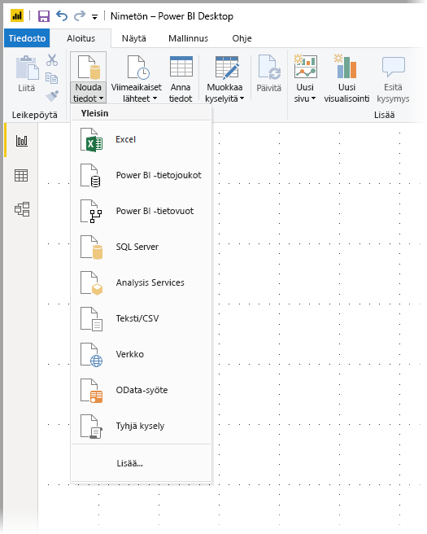
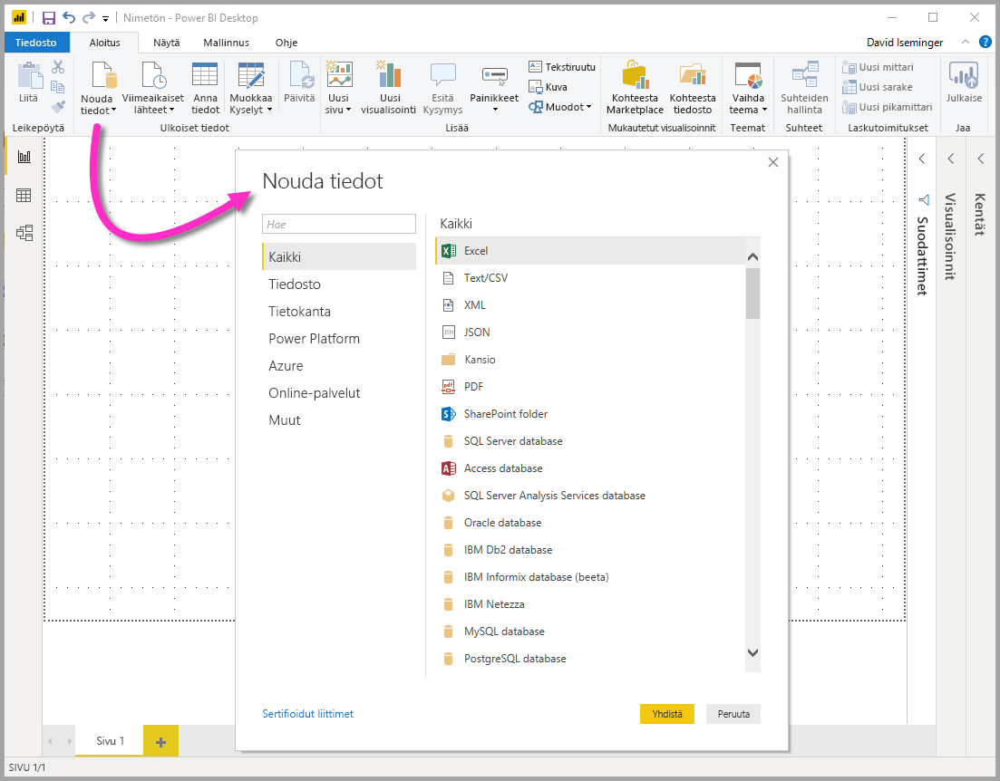
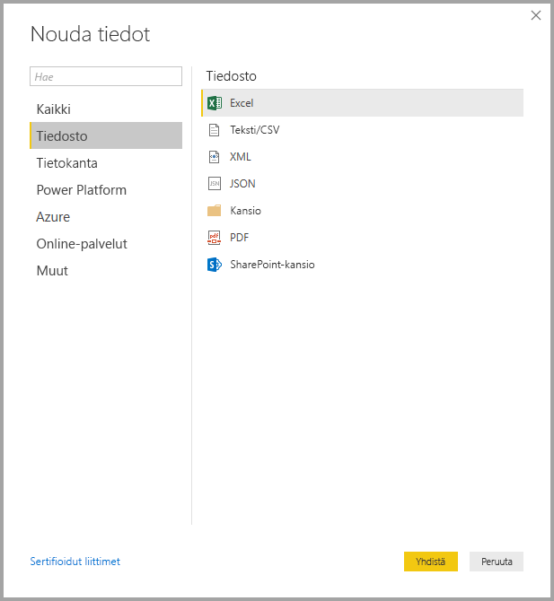
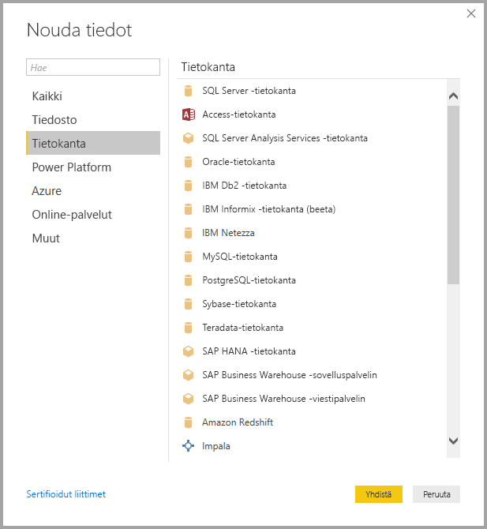
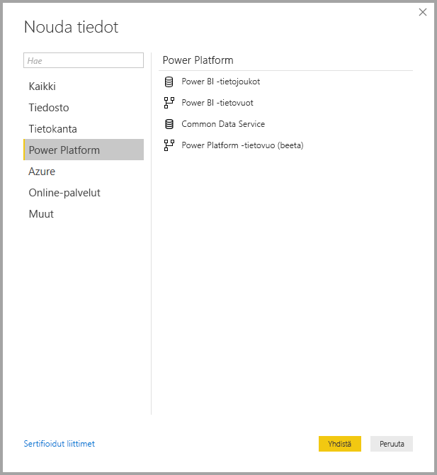
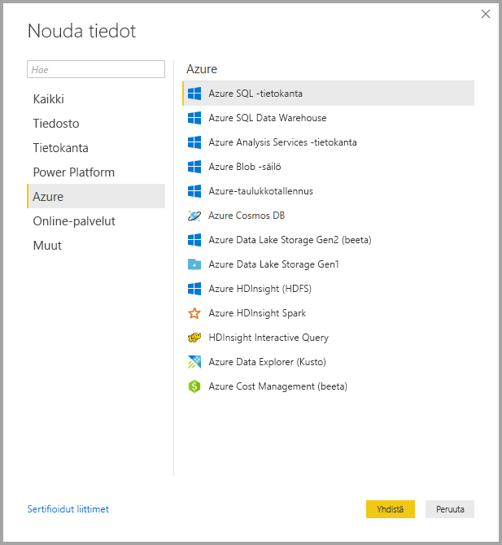
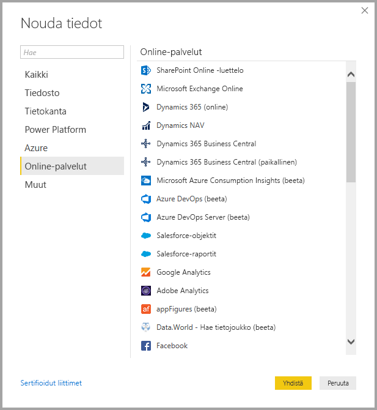
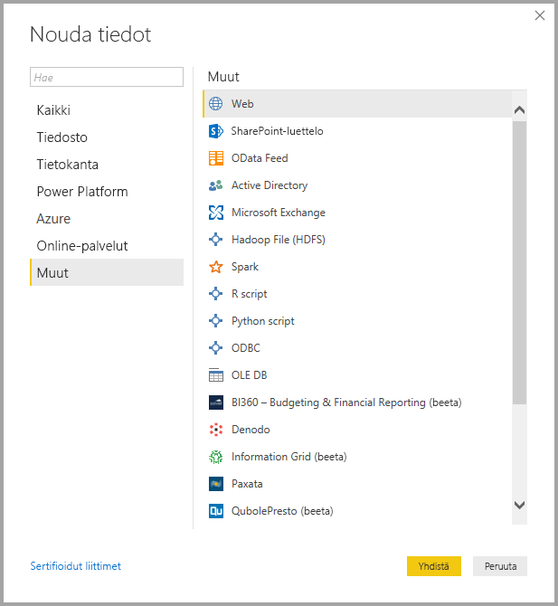
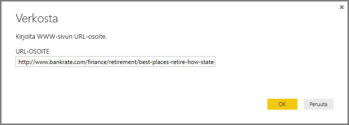
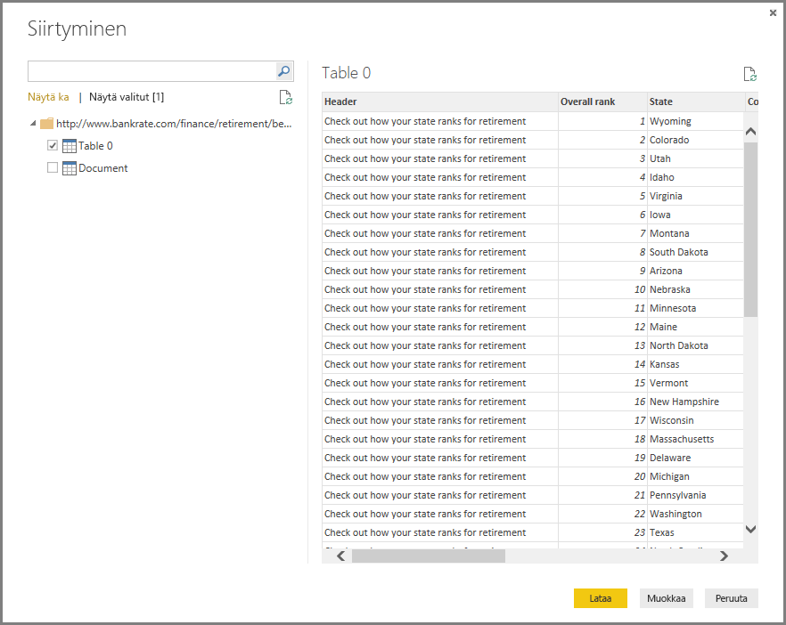

# <a name="data-sources-in-power-bi-desktop"></a>Power BI Desktopin tietolähteet

Power BI Desktopin avulla voit yhdistää tietoja monista eri lähteistä. Täydellinen luettelo käytettävissä olevista tietolähteistä löytyy [Power BI:n tietolähteiden artikkelista](power-bi-data-sources.md).

Voit muodostaa yhteyden tietoihin **Aloitus**-valintanauhan avulla. Jos haluat näyttää **Yleisin**-tietotyyppivalikon, valitse **Nouda tiedot** -painikkeen nimi tai alanuoli.



Jos haluat siirtyä **Nouda tiedot** -valintaikkunaan, näytä **Yleisin**-tietotyyppivalikko ja valitse **Lisää**. Voit myös tuoda **Nouda tiedot** -valintaikkunan (ja ohittaa **Yleisin**-valikon) valitsemalla suoraan **Nouda tiedot** -kuvakkeen.



> [!NOTE]
> Power BI -tiimi laajentaa jatkuvasti Power BI Desktopin ja Power BI -palvelun käytettävissä olevia tietolähteitä. Näet näin ollen usein keskeneräisten tietolähteiden varhaisia versioita, joissa on merkintä **beeta** tai **esikatselu**. Tietolähteen, jolla on **Beeta**- tai **Esikatselu**-merkintä, tuki ja toiminnallisuus ovat rajoitettua, eikä sitä tulisi käyttää tuotantoympäristöissä. Lisäksi mikään **Beeta-** tai **Esikatselu**-merkinnällä varustettu Power BI Desktop -sisältö ei ehkä ole käytettävissä Power BI -palvelussa tai muissa Microsoftin palveluissa ennen kuin tietolähde on yleisesti saatavana (GA).

> [!NOTE]
> Power BI Desktopille on useita tietoliittimiä, jotka edellyttävät todentamista Internet Explorer 10:llä (tai uudemmalla versiolla). 


## <a name="data-sources"></a>Tietolähteet

**Nouda tiedot**-valintaikkuna järjestää tietotyypit seuraaviin luokkiin:

* Kaikki
* Tiedosto
* Tietokanta
* Power Platform
* Azure
* Online-palvelut
* Muut

**Kaikki**-luokka sisältää kaikki tietoyhteystyypit kaikista luokista.

### <a name="file-data-sources"></a>Tiedoston tietolähteet

**Tiedosto**-luokka tarjoaa seuraavat tietoyhteydet:

* Excel
* Teksti/CSV
* XML
* JSON
* Kansio
* PDF
* SharePoint-kansio

Seuraavassa kuvassa näkyy **Tiedosto**-luokan **Nouda tiedot** -ikkuna.



### <a name="database-data-sources"></a>Tietokannan tietolähteet

**Tietokanta**-luokka tarjoaa seuraavat tietoyhteydet:

* SQL Server -tietokanta
* Access-tietokanta
* SQL Server Analysis Services -tietokanta
* Oracle-tietokanta
* IBM DB2 -tietokanta
* IBM Informix -tietokanta (beeta)
* IBM Netezza
* MySQL-tietokanta
* PostgreSQL-tietokanta
* Sybase-tietokanta
* Teradata-tietokanta
* SAP HANA -tietokanta
* SAP Business Warehouse -sovelluspalvelin
* SAP Business Warehouse -viestipalvelin
* Amazon Redshift
* Impala
* Google BigQuery
* Vertica
* Snowflake
* Essbase
* AtScale-kuutiot
* BI-liitin 
* Tietojen virtuaalisuus, LDW (beeta)
* Denodo
* Dremio
* Exasol
* Indexima (beeta)
* InterSystems IRIS (beeta)
* Jethro (beeta)
* Kyligence
* MarkLogic

> [!NOTE]
> Jotkin tietokannan yhdistimet edellyttävät, että otat ne käyttöön valitsemalla **Tiedosto > Asetukset ja vaihtoehdot > Asetukset** ja valitsemalla **Esikatselutoiminnot** ja ottamalla yhdistin käyttöön. Jos et näe joitakin edellä mainituista yhdistimistä ja haluat käyttää niitä, tarkista **Esikatselutoiminnot**-asetukset. Huomaa myös, että tietolähteen, jolla on merkintä *beeta* tai *esikatselu*, tuki ja toiminnallisuus ovat rajoitettua, eikä sitä tulisi käyttää tuotantoympäristössä.

Seuraavassa kuvassa näkyy **Tietokanta**-luokan **Nouda tiedot** -ikkuna.



### <a name="power-platform-data-sources"></a>Power Platform -tietolähteet

**Power Platform** -luokka tarjoaa seuraavat tietoyhteydet:

* Power BI -tietojoukot
* Power BI -tietovuot
* Common Data Service
* Power Platform -tietovuot

Seuraavassa kuvassa näkyy **Power Platform** -luokan **Nouda tiedot** -ikkuna.



### <a name="azure-data-sources"></a>Azure-tietolähteet

**Azure**-luokka tarjoaa seuraavat tietoyhteydet:

* Azuren SQL-tietokanta
* Azure SQL Data Warehouse
* Azure Analysis Services -tietokanta
* Azure-tietokanta PostgreSQL:lle
* Azure-blob-objektitallennus
* Azure-taulukkotallennus
* Azure Cosmos DB
* Azure Data Lake Storage Gen2
* Azure Data Lake Storage Gen1
* Azure HDInsight (HDFS)
* Azure HDInsight Spark
* HDInsight Interactive Query
* Azure Data Explorer (Kusto)
* Azure Cost Management


Seuraavassa kuvassa näkyy **Azure**-luokan **Nouda tiedot** -ikkuna.



### <a name="online-services-data-sources"></a>Online Services -tietolähteet

**Online-palvelut**-luokka tarjoaa seuraavat tietoyhteydet:

* SharePoint Online -luettelo
* Microsoft Exchange Online
* Dynamics 365 (online)
* Dynamics NAV
* Dynamics 365 Business Central
* Dynamics 365 Business Central (paikallinen)
* Microsoft Azure Consumption Insights (beeta)
* Azure DevOps (vain taulut)
* Azure DevOps Server (vain taulut)
* Salesforce-objektit
* Salesforce-raportit
* Google Analytics
* Adobe Analytics
* appFigures (beeta)
* Data.World – nouda tietojoukko (beeta)
* GitHub (beeta)
* LinkedIn Sales Navigator (beeta)
* Marketo (beeta)
* Mixpanel (beeta)
* Planview Enterprise One - PRM (beeta)
* Planview Projectplace (beeta)
* QuickBooks Online (beeta)
* Smartsheet
* SparkPost (beeta)
* SweetIQ (beeta)
* Planview Enterprise One - CTM (beeta)
* Twilio (beeta)
* tyGraph (beeta)
* Webtrends (beeta)
* Zendesk (beeta)
* Asana (beeta)
* Dynamics 365 Customer Insights (beeta)
* Emigo-tietolähde
* Entersoft Business Suite (beeta)
* FactSet Analytics (beeta)
* App Store teollisuuskäyttöön
* Intune-tietovarasto (beeta)
* Microsoft Graph Security (beeta)
* Product Insights (beeta)
* Quick Base
* TeamDesk (beeta)
* Workplace Analytics (beeta)
* Projectplace Power BI:lle (beeta)
* Webtrends Analytics (beeta)
* Zoho Creator (beeta)

Seuraavassa kuvassa näkyy **Online-palvelut**-luokan **Nouda tiedot** -ikkuna.



### <a name="other-data-sources"></a>Muut tietolähteet

**Muut**-luokka tarjoaa seuraavat tietoyhteydet:

* Verkko
* SharePoint-luettelo
* OData-syöte
* Active Directory
* Microsoft Exchange
* Hadoop-tiedosto (HDFS)
* Spark
* Hive LLAP (beeta)
* R-komentosarja
* Python-komentosarja
* ODBC
* OLE DB
* BI360 – Budjetointi- ja talousraportointi (beeta)
* Cognite Data Fusion (beeta)
* FHIR
* Tietoruudukko (beeta)
* Jamf Pro (beeta)
* MicroStrategy for Power BI
* Paxata
* QubolePresto (beeta)
* Roamler (beeta)
* Siteimprove
* SurveyMonkey (beeta)
* TIBCO (R):n tietojen virtualisointi (beeta)
* Vena (beeta)
* Työvoiman dimensiot (beeta)
* Zucchetti HR Infinity (beeta)
* Tenforce (Smart)List
* Shortcuts Business Insights (beeta)
* Vessel Insight (beeta)
* Tyhjä kysely

Seuraavassa kuvassa näkyy **Muut**-luokan **Nouda tiedot** -ikkuna.



> [!NOTE]
> Tällä hetkellä ei ole mahdollista muodostaa yhteyttä mukautettuihin tietolähteisiin, jotka suojattu Azure Active Directorylla.

## <a name="connecting-to-a-data-source"></a>Yhteyden muodostaminen tietolähteeseen

Jos haluat muodostaa yhteyden tietolähteeseen, valitse tietolähde **Nouda tiedot** -ikkunassa ja valitse **Muodosta yhteys**. Seuraavassa kuvassa **Muut**-tietoyhteysluokasta on valittu **WWW**.


Näyttöön tulee tietoyhteyden mukainen yhteysikkuna. Jos tunnistetietoja vaaditaan, sinua pyydetään antamaan ne. Seuraavassa kuvassa näytetään URL-osoitteen kirjoittaminen WWW-tietolähteeseen yhdistämistä varten.



Kirjoita URL-osoite tai resurssiyhteyden tiedot ja valitse sitten **OK**. Power BI Desktop muodostaa yhteyden tietolähteeseen ja esittää saatavilla olevat tietolähteet **siirtymistoiminnossa**.



Lataa tiedot valitsemalla **Lataa**-painike **Siirtymistoiminto**-ruudun alareunasta. Jos haluat muuntaa tai muokata kyselyä Power Query -editorissa ennen tietojen lataamista, valitse **Muunna tiedot** -painike.

Tietolähteisiin yhdistäminen Power BI Desktopissa ei muuta vaadi! Yritä muodostaa yhteys tietoihin kasvavassa tietolähteiden valikoimassa ja tarkista päivitetyt tiedot – kasvatamme tätä luetteloa koko ajan.

## <a name="using-pbids-files-to-get-data"></a>Tietojen hakeminen PBIDS-tiedostojen avulla

PBIDS-tiedostot ovat Power BI Desktop -tiedostoja, joilla on tietty rakenne ja joilla on .PBIDS-tiedostotunniste merkkinä siitä, että ne ovat Power BI -tietolähdetiedostoja.

Voit luoda PBIDS-tiedoston tehostaaksesi **tietojen noutamista** organisaatiossasi raportteja luoville käyttäjille. Jotta uuden raportin tekijän olisi helpompi käyttää PBIDS-tiedostoja, on suositeltavaa, että järjestelmänvalvoja luo nämä tiedostot usein käytettyihin yhteyksiin.

Kun tekijä avaa PBIDS-tiedoston, Power BI Desktop avautuu ja kysyy käyttäjältä tunnistetietoja, joilla todennetaan ja muodostetaan yhteys tiedostossa määritettyyn tietolähteeseen. Näyttöön avautuu **Siirtymistoiminto**-valintaikkuna, jossa käyttäjän täytyy valita tietolähteestä taulukot, jotka ladataan malliin. Käyttäjien on ehkä myös valittava tietokanta, jos mitään tietokantaa ei ole määritetty PBIDS-tiedostossa.

Tämän jälkeen käyttäjä voi aloittaa visualisointien luomisen tai valita **Viimeaikaiset lähteet** -kohdan uuden taulukkosarjan lataamiseksi malliin.

Tällä hetkellä PBIDS-tiedostot tukevat vain yhtä tietolähdettä yhdessä tiedostossa. Jos määrität useita tietolähteitä, tämä aiheuttaa virheen.

PBIDS-tiedoston luomiseksi järjestelmänvalvojan täytyy määrittää vaadittavat syötteet yksittäiselle yhteydelle. He voivat myös määrittää yhteystilaksi joko DirectQuery tai Tuo. Jos **tila** puuttuu tiedostosta tai on nolla-arvoinen, Power BI Desktopissa tiedoston avaavaa käyttäjää pyydetään valitsemaan joko **DirectQuery** tai **Tuo**.

### <a name="pbids-file-examples"></a>Esimerkkejä PBIDS-tiedostoista

Tämä osio sisältää joitain esimerkkejä usein käytetyistä tietolähteistä. PBIDS-tiedostotyyppi tukee vain tietoyhteyksiä, joita tuetaan myös Power BI Desktopissa, mutta tässä on kaksi poikkeusta: reaaliaikainen yhteys ja tyhjä kysely.

PBIDS-tiedosto *ei* sisällä todennustietoja, taulukkotietoja ja rakennetietoja.  

Seuraavissa koodikatkelmissa näytetään useita yleisiä esimerkkejä PBIDS-tiedostoista, mutta ne eivät ole täydellisiä tai kattavia. Jos käytät muita tietolähteitä, voit tarkistaa [Data Source Reference (DSR) -muodon protokolla- ja osoitetiedot](https://docs.microsoft.com/azure/data-catalog/data-catalog-dsr#data-source-reference-specification).

Nämä esimerkit on tarkoitettu vain malliksi. Tämä ei ole kattava luettelo eikä sisällä kaikkia DSR-muodon tuettuja yhdistimiä. Järjestelmänvalvoja tai organisaatio voi luoda näiden esimerkkien pohjalta omia tietolähteitään, joista he voivat luoda omia tietolähdetiedostoja ja tukea niitä.

#### <a name="azure-as"></a>Azure AS

```json
{ 
    "version": "0.1", 
    "connections": [ 
    { 
        "details": { 
        "protocol": "analysis-services", 
        "address": { 
            "server": "server-here" 
        }, 
        } 
    } 
    ] 
}
```

#### <a name="folder"></a>Kansio

```json
{ 
  "version": "0.1", 
  "connections": [ 
    { 
      "details": { 
        "protocol": "folder", 
        "address": { 
            "path": "folder-path-here" 
        } 
      } 
    } 
  ] 
} 
```

#### <a name="odata"></a>OData

```json
{ 
  "version": "0.1", 
  "connections": [ 
    { 
      "details": { 
        "protocol": "odata", 
        "address": { 
            "url": "URL-here" 
        } 
      } 
    } 
  ] 
} 
```

#### <a name="sap-bw"></a>SAP BW

```json
{ 
  "version": "0.1", 
  "connections": [ 
    { 
      "details": { 
        "protocol": "sap-bw-olap", 
        "address": { 
          "server": "server-name-here", 
          "systemNumber": "system-number-here", 
          "clientId": "client-id-here" 
        }, 
      } 
    } 
  ] 
} 
```

#### <a name="sap-hana"></a>SAP Hana

```json
{ 
  "version": "0.1", 
  "connections": [ 
    { 
      "details": { 
        "protocol": "sap-hana-sql", 
        "address": { 
          "server": "server-name-here:port-here" 
        }, 
      } 
    } 
  ] 
} 
```

#### <a name="sharepoint-list"></a>SharePoint-luettelo

URL-osoitteen täytyy osoittaa itse SharePoint-sivustoon, ei luetteloon sivustossa. Käyttäjät saavat käyttöönsä siirtymistoiminnon, jossa he voivat valita luetteloita sivustosta. Näistä luetteloista tulee taulukoita mallissa.

```json
{ 
  "version": "0.1", 
  "connections": [ 
    { 
      "details": { 
        "protocol": "sharepoint-list", 
        "address": { 
          "url": "URL-here" 
        }, 
       } 
    } 
  ] 
} 
```

#### <a name="sql-server"></a>SQL Server

```json
{ 
  "version": "0.1", 
  "connections": [ 
    { 
      "details": { 
        "protocol": "tds", 
        "address": { 
          "server": "server-name-here", 
          "database": "db-name-here (optional) "
        } 
      }, 
      "options": {}, 
      "mode": "DirectQuery" 
    } 
  ] 
} 
```

#### <a name="text-file"></a>Tekstitiedosto

```json
{ 
  "version": "0.1", 
  "connections": [ 
    { 
      "details": { 
        "protocol": "file", 
        "address": { 
            "path": "path-here" 
        } 
      } 
    } 
  ] 
} 
```

#### <a name="web"></a>Verkko

```json
{ 
  "version": "0.1", 
  "connections": [ 
    { 
      "details": { 
        "protocol": "http", 
        "address": { 
            "url": "URL-here" 
        } 
      } 
    } 
  ] 
} 
```

#### <a name="dataflow"></a>Tietovuo

```json
{
  "version": "0.1",
  "connections": [
    {
      "details": {
        "protocol": "powerbi-dataflows",
        "address": {
          "workspace":"workspace id (Guid)",
          "dataflow":"optional dataflow id (Guid)",
          "entity":"optional entity name"
        }
       }
    }
  ]
}
```

## <a name="next-steps"></a>Seuraavat vaiheet

Power BI Desktopilla voit tehdä kaikenlaista. Saat lisätietoja sen toiminnoista seuraavista resursseista:

* [Mikä on Power BI Desktop?](desktop-what-is-desktop.md)
* [Power BI Desktopin kyselyjen yleiskatsaus](desktop-query-overview.md)
* [Tietotyypit Power BI Desktopissa](desktop-data-types.md)
* [Tietojen muotoilu ja yhdistäminen Power BI Desktopissa](desktop-shape-and-combine-data.md)
* [Yleiset kyselytehtävät Power BI Desktopissa](desktop-common-query-tasks.md)
