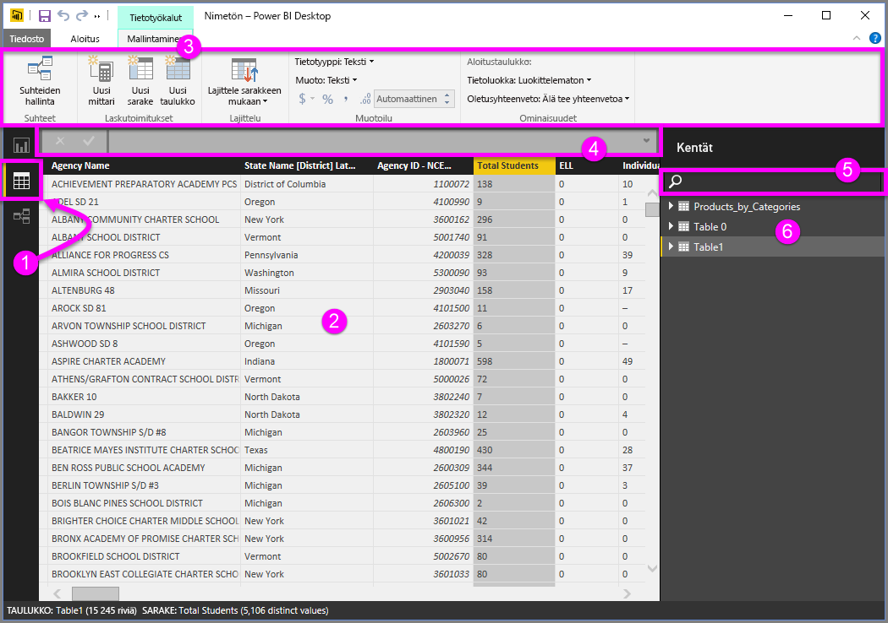
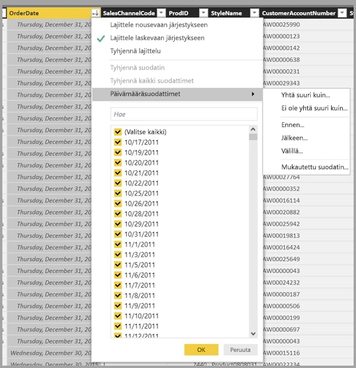

# Tieto-näkymän käsittely Power BI Desktopissa

*Tiedot-näkymän* avulla voit tarkastaa *Power BI Desktop* -mallin tiedot, tutustua niihin ja ymmärtää niitä. Se poikkeaa taulukoiden, sarakkeiden ja tietojen tarkastelusta *Power Query -editorissa*. Tiedot-näkymässä tarkastelet tietojasi sen *jälkeen*, kun ne on ladattu tietomalliin.

Kun mallinnat tietojasi, haluat ehkä nähdä, mitä taulukossa tai sarakkeessa todella on ilman visualisoinnin luomista raporttipohjaan. Haluat ehkä nähdä aivan rivitasolle asti. Tämä ominaisuus on hyödyksi erityisesti silloin, kun luot mittareita ja laskettuja sarakkeita tai kun sinun on tunnistettava tietotyyppi tai tietoluokka.

Seuraavaksi katsotaan tarkemmin joitakin Tietonäkymän elementtejä.

1. **Tietonäkymäkuvake**. Valitse tämä kuvake, kun haluat siirtyä Tietonäkymään.

2. **Tietoruudukko**. Tämä alue näyttää valitun taulukon ja sen sarakkeet ja rivit. *Raportti-näkymässä* piilotetut sarakkeet näytetään harmaina. Voit napsauttaa saraketta hiiren kakkospainikkeella tuodaksesi esiin valinnaiset tiedot.

3. **Mallinnusnauha**. Tässä voit hallinnoida suhteita, luoda laskelmia, muuttaa tietotyyppiä, muokata sarakkeen tietoluokkaa.

4. **Kaavarivi**. Syötä DAX-kaavoja Mittarit- ja Lasketut-sarakkeita varten.

5. **Haku**. Hae mallistasi taulukkoa tai saraketta.

6. **Kentät-luettelo**. Valitse taulukko tai sarake tarkasteltavaksi tietoruudukossa.

## Suodattaminen tietonäkymässä

Voit myös suodattaa ja lajitella tietoja Tietonäkymässä. Jokaisessa sarakkeessa näkyy kuvake, joka tunnistaa lajittelusuunnan, jos sellainen on käytössä.

Voit suodattaa yksittäisiä arvoja tai käyttää sarakkeen tietoihin perustuvaa lisäsuodatusta.

> [!NOTE]
> Kun Power BI -malli luodaan maa-asetukselle, joka eroaa senhetkisestä käyttöliittymästä, hakuruutu ei näy käyttöliittymän tietonäkymässä muissa kuin tekstikentissä. Tämä koskee esimerkiksi amerikanenglanniksi luotua mallia, jota tarkastelet espanjaksi.
