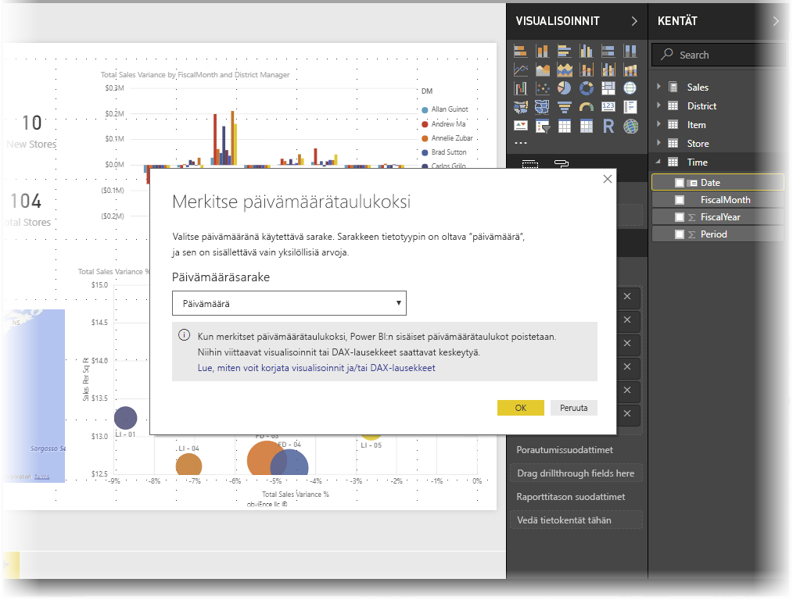
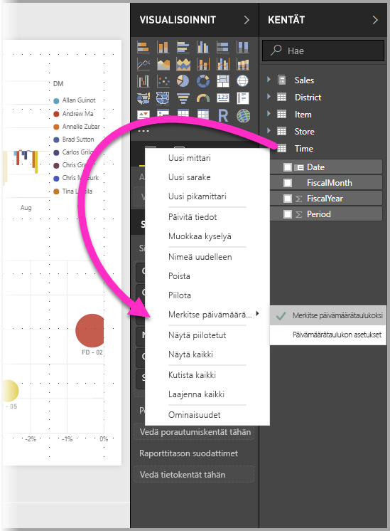
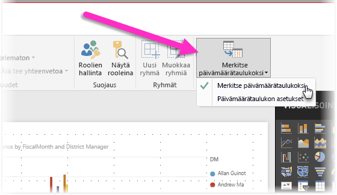
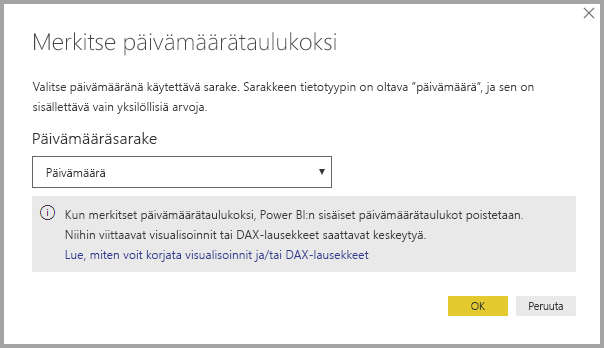
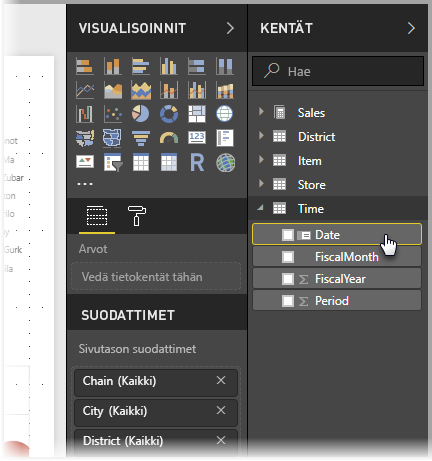
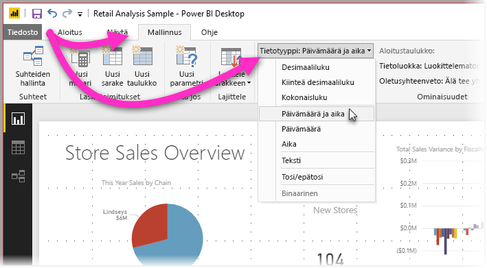

# Päivämäärätaulukkojen määrittäminen ja käyttäminen Power BI Desktopissa

**Power BI Desktop** toimii taustalla tunnistaen sarakkeita automaattisesti päivämääräsarakkeiksi ja luo sitten päivämäärähierarkioita ja muita mallin käyttöönoton metatietoja puolestasi. Voit sitten käyttää näitä valmiita hierarkioita, kun luot raporttiominaisuuksia, kuten visualisointeja, taulukoita, pikamittareita, sektoreita ja niin edelleen. Power BI Desktop tekee tämän luomalla puolestasi piilotettuja taulukkoja, joita voit sitten käyttää raporttien ja DAX-lausekkeiden luomiseen.

Monet tietoanalyytikot luovat mieluummin itse omat päivämäärätaulukkonsa, mikä tietysti sopii mainiosti. **Power BI Desktopissa** voit määrittää taulukon, jota haluat mallisi käyttävän **päivämäärätaulukkona**, ja voit sitten luoda päivämäärään liittyviä visualisointeja, taulukoita, pikamittareita ja niin edelleen käyttäen kyseisen taulukon päivämäärätietoja. Kun määrität oman päivämäärätaulukon, hallitset mallissasi luotuja päivämäärähierarkioita ja käytät niitä **pikamittareissa** ja muissa toiminnoissa, jotka käyttävät oman mallisi päivämäärätaulukkoa. 

## Oman päivämäärätaulukon määrittäminen

Jos haluat määrittää **päivämäärätaulukon**, valitse **Kentät**-ruudussa taulukko, jota haluat käyttää päivämäärätaulukkona, napsauta sitten taulukkoa hiiren kakkospainikkeella ja valitse avautuvasta valikosta **Merkitse päivämäärätaulukoksi > Merkitse päivämäärätaulukoksi** seuraavassa kuvassa esitetyllä tavalla.

Voit myös valita taulukon ja valita sitten **Merkitse päivämäärätaulukoksi** -vaihtoehdon **Mallinnus**-valintanauhasta alla esitetyllä tavalla.

Kun määrität oman **päivämäärätaulukon**, Power BI Desktop suorittaa seuraavat kyseisen sarakkeen ja sen tietojen validoinnit sen varmistamiseksi, että tiedot

* sisältävät ainutkertaisia arvoja
* eivät sisällä tyhjäarvoja
* sisältävät (alusta loppuun) vierekkäisiä päivämääräarvoja
* sisältävät saman aikaleiman jokaisen arvon kohdalla, jos kyseessä on **Päivämäärä/kellonaika**-tietotyyppi.

Oman päivämäärätaulukon luomiseen on kaksi todennäköistä skenaariota, joista molemmat ovat järkeviä ratkaisumalleja:

* Ensimmäisessä skenaariossa käytät kanonista eli peruspäivämäärätaulukkoa ja -hierarkiaa. Tämä on tietoihisi sisältyvä taulukko, joka täyttää edellä mainitut päivämäärätaulukon validointiehdot. 

* Toisessa skenaariossa käytät Analysis Servicesistä tuotua taulukkoa, jossa on esimerkiksi *dim date* -kenttä, jota haluat käyttää päivämäärätaulukkona. 

Kun määrität päivämäärätaulukon, voit valita, mikä sarake tässä taulukossa on päivämääräsarake. Voit määrittää käytettävän sarakkeen valitsemalla taulukon **Kentät**-ruudussa, napsauttamalla taulukkoa hiiren kakkospainikkeella ja valitsemalla **Merkitse päivämäärätaulukoksi > Päivämäärätaulukon asetukset**. Näkyviin tulee seuraava ikkuna, jossa voit valita päivämäärätaulukkona käytettävän sarakkeen avattavasta ruudusta.

On tärkeää ottaa huomioon, että määrittäessäsi oman päivämäärätaulukon **Power BI Desktop** ei luo automaattisesti hierarkioita, jotka se muussa tapauksessa loisi malliin puolestasi. Jos myöhemmin poistat päivämäärätaulukon valinnan (ja sinulla ei enää ole manuaalisesti määritettyä päivämäärätaulukkoa), Power BI Desktop luo puolestasi uudelleen automaattisesti luodut sisäiset päivämäärätaulukot taulukon päivämääräsarakkeita varten.

Lisäksi on tärkeää huomioida, että merkitessäsi taulukon päivämäärätaulukoksi Power BI Desktopin luoma sisäinen (automaattisesti luotu) päivämäärätaulukko poistetaan, ja mahdolliset aikaisemmin luomasi näihin sisäisiin taulukkoihin perustuvat visualisoinnit tai DAX-lausekkeet eivät enää toimi oikein. 

## Päivämäärätaulukon merkitseminen oikeaksi tietotyypiksi

Kun määrität oman **päivämäärätaulukon**, sinun on varmistettava, että tietotyyppi on määritetty oikein. **Tietotyypiksi** kannattaa asettaa **Päivämäärä/aika** tai **Päivämäärä**. Voit tehdä sen noudattamalla seuraavia ohjeita:

1. Valitse **päivämäärätaulukkosi** **Kentät**-ruudusta, laajenna se tarvittaessa ja valitse sitten päivämääränä käytettävä sarake.
   
     

2. Valitse **Mallinnus**-välilehdeltä **Tietotyyppi:** ja tuo sitten käytettävissä olevat tietotyypit näkyviin napsauttamalla alanuolta.

    

3. Määritä sarakkeen tietotyyppi. 

## Seuraavat vaiheet

Voit olla kiinnostunut myös seuraavista artikkeleista.

* [Tietotyypit Power BI Desktopissa](desktop-data-types.md)

 
