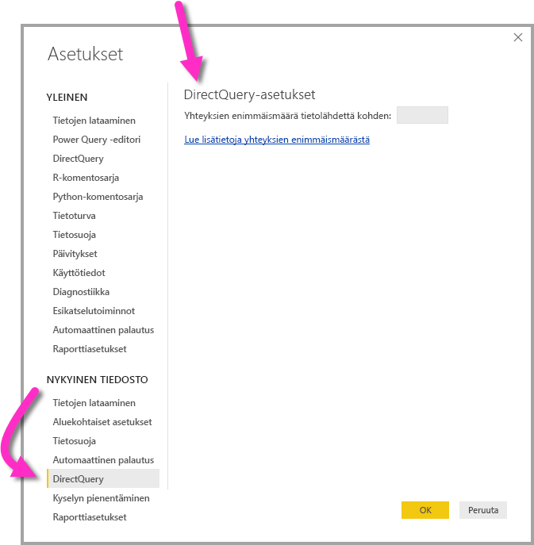

# <a name="about-using-directquery-in-power-bi"></a>Tietoja DirectQueryn käytöstä Power BI:ssä

Voit yhdistää kaikenlaisiin erilaisiin tietolähteisiin, kun käytät *Power BI Desktopia* tai *Power BI -palvelua*, ja muodostaa nämä tietoyhteydet eri tavoin. Voit *tuoda* tietoja Power BI:hin, mikä on yleisin tapa hakea tietoja, tai voit muodostaa yhteyden tietoihin suoraan alkuperäisessä lähdesäilössä. Tätä tapaa kutsutaan nimellä *DirectQuery*. Tässä artikkelissa kuvataan DirectQuery-ominaisuuksia:

* DirectQueryn eri yhdistämistavat
* tilanteet, joissa kannattaa käyttää DirectQueryä tuomisen asemesta
* DirectQueryn käytön varjopuolet
* DirectQueryn käytön parhaat käytännöt

Noudata parhaita käytäntöjä valitessasi tuonnin ja DirectQueryn käytön välillä:

* Tiedot kannattaa tuoda Power BI:hin aina, kun se on mahdollista. Tuonnissa hyödynnetään Power BI:n tehokasta kyselytoimintoa. Lisäksi tämä tarjoaa kattavammat toiminnot ja paremman tietojen käsittelyn.
* Jos et voi saavuttaa tavoitteitasi tuomalla tietoja, voit harkita DirectQueryn käyttöä. Jos tiedot esimerkiksi muuttuvat jatkuvasti ja raporttien täytyy aina olla uusimpien tietojen mukaisia, DirectQuery voi olla paras vaihtoehto. DirectQueryn käyttö on kuitenkin järkevää vain silloin, kun taustalla oleva tietolähde kykenee tarjoamaan vuorovaikutteisia kyselyitä alle viidessä sekunnissa tyypillisille koostekyselyille ja kykenee suoriutumaan kyselykuormituksesta. Lisäksi DirectQueryn käyttörajoitusten luettelo tulee huomioida tarkasti.

PowerBI:n tarjoamat toiminnot tuomiselle ja DirectQuerylle kehittyvät ajan myötä. Muutokset tuovat mukanaan enemmän joustavuutta tuotujen tietojen käytölle, esimerkiksi siten, että tuotuja tietoja voi käyttää useammissa tapauksissa. Lisäksi tällä tavoin päästää eroon joistain DirectQueryn käytön varjopuolista. Parannuksista riippumatta taustalla olevan tietolähteen suorituskyky on aina merkittävä huomioitava seikka. Jos taustalla oleva tietolähde on hidas, DirectQueryn käyttö tämän tietolähteen kanssa ei ole järkevää.

Tässä artikkelissa käsitellään DirectQueryn käyttöä Power BI:n kanssa, ei *SQL Server Analysis Servicesin* kanssa. DirectQuery on myös SQL Server Analysis Services -ominaisuus. Monet tässä artikkelissa kuvatut tiedot koskevat kyseistä ominaisuutta. Joitain merkittäviä eroja kuitenkin myös löytyy. Jos haluat lisätietoja DirectQueryn käytöstä SQL Server Analysis Servicesin kanssa, lue [DirectQuery SQL Server 2016 Analysis Servicesissä](https://download.microsoft.com/download/F/6/F/F6FBC1FC-F956-49A1-80CD-2941C3B6E417/DirectQuery%20in%20Analysis%20Services%20-%20Whitepaper.pdf).

Tässä artikkelissa keskitytään DirectQueryn suositeltuun työnkulkuun, kun raportti luodaan Power BI Desktopissa, mutta käsittelemme myös yhdistämistä suoraan Power BI -palvelussa.

## <a name="power-bi-connectivity-modes"></a>Power BI:n yhteystilat

Power BI:llä voi muodostaa yhteyksiä moniin erilaisiin tietolähteisiin, kuten:

* verkkopalvelut (Salesforce, Dynamics 365 ja muut)
* tietokannat (SQL Server, Access, Amazon Redshift ja muut)
* yksinkertaiset tiedostot (Excel, JSON ja muut)
* muut tietolähteet (Spark, verkkosivustot, Microsoft Exchange ja muut).

Näitä lähteitä käytettäessä tiedot voi tuoda Power BI:hin. Jotkin niistä on mahdollista yhdistää myös DirectQuerylla. Löydät yhteenvedon DirectQueryä tukevista tietolähteistä artikkelista [DirectQueryn tukemat tietolähteet](desktop-directquery-data-sources.md). DirectQuery tukee jatkossa entistä useampia lähteitä. Aiomme keskittyä ensisijaisesti lähteisiin, joiden uskomme toimivan tehokkaasti vuorovaikutteisten kyselyiden kanssa.

SQL Server Analysis Services on erikoistapaus. Kun muodostat yhteyden SQL Server Analysis Servicesiin, voit joko tuoda tiedot tai käyttää *reaaliaikaista yhteyttä*. Reaaliaikaisen yhteyden käyttäminen vastaa DirectQueryn käyttöä. Mitään tietoja ei tuoda, ja pohjana olevaan tietolähteeseen tehdään aina kysely visualisoinnin päivittämiseksi. Reaaliaikainen yhteys on kuitenkin erilainen monessa muussa suhteessa, minkä vuoksi *reaaliaikaisista yhteyksistä* ja *DirectQuerystä* käytetään eri nimityksiä.

Kolme eri tapaa yhdistää tietoihin: *tuominen*, *DirectQuery* ja *reaaliaikainen yhteys*.

### <a name="import-connections"></a>Tuontiyhteydet

Kun muodostat tuonnissa yhteyden tietolähteeseen (esimerkiksi SQL Serveriin) Power BI Desktopin **Nouda tiedot** -toiminnolla, yhteys toimii seuraavasti:

* Kun aloitat Nouda tiedot -toiminnon käytön, valittujen taulukoiden joukko määrittää kyselyn, joka palauttaa tietojoukon. Kyselyitä voi muokata ennen tietojen lataamista. Voit esimerkiksi lisätä suodattimia, koostaa tietoja tai liittää eri taulukoita.
* Kun tietoja ladataan, kyselyiden määrittämät tiedot tuodaan Power BI:n välimuistiin.
* Kun luot visualisointia Power BI Desktopissa, tuoduille tiedoille tehdään kyselyitä. Power BI -säilöllä varmistetaan, että kysely on nopea. Kaikki visualisointiin tehdyt muutokset näkyvät heti.
* Mitkään taustalla olevien tietojen muutokset eivät näy missään visualisoinneissa. Tietojen tuominen uudelleen edellyttää *päivittämistä*.
* Kun julkaiset raportin *.pbix*-tiedostona Power BI -palveluun, tietojoukko luodaan ja ladataan Power BI -palveluun. Tuodut tiedot sisältyvät tähän tietojoukkoon. Tämän jälkeen voit ajoittaa näiden tietojen päivityksen esimerkiksi siten, että tiedot tuodaan uudelleen joka päivä. Alkuperäisen tietolähteen sijainnista riippuen sinun täytyy ehkä määrittää paikallinen tietoyhdyskäytävä.
* Kun avaat olemassa olevan raportin Power BI -palvelussa tai luot uutta raporttia, tuoduille tiedoille tehdään uusi kysely, mikä takaa vuorovaikutteisuuden.
* Visualisointeja tai kokonaisia raporttisivuja voi kiinnittää koontinäytön ruutuihin. Ruudut päivittyvät automaattisesti aina, kun taustalla oleva tietojoukko päivittyy.

### <a name="directquery-connections"></a>DirectQuery-yhteydet

Kun muodostat DirectQueryssä yhteyden tietolähteeseen Power BI Desktopin **Nouda tiedot** -toiminnolla, yhteys toimii seuraavasti:

* Lähde valitaan Nouda tiedot -toiminnon ensimmäisen suorittamisen yhteydessä. Suhteellisia tietolähteitä käytettäessä valitset joukon taulukoita, joista jokainen määrittää kyselyn, joka palauttaa loogisesti joukon tietoja. Monidimensioisia tietolähteitä (esimerkiksi SAP BW) käytettäessä valitaan vain lähde.
* Ladattaessa mitään tietoja ei kuitenkaan varsinaisesti tuoda Power BI -säilöön. Sen sijaan järjestelmä lähettää kyselyt taustalla olevaan tietolähteeseen tarvittavien tietojen hakemiseksi siinä vaiheessa, kun luot visualisointia Power BI Desktopissa. Visualisoinnin päivittämiseen kuluva aika määräytyy taustalla olevan tietolähteen tehokkuuden perusteella.
* Mitkään taustalla olevien tietojen muutokset eivät näy heti missään olemassa olevissa visualisoinneissa. Päivittäminen on yhä tarpeen. Tarvittavat kyselyt lähetetään uudelleen kullekin visualisoinnille, ja visualisointia päivitetään tarvittaessa.
* Kun raportti julkaistaan Power BI -palvelussa, tämä tuottaa tietojoukon Power BI -palveluun, aivan kuten tietoja tuodessakin. Tämä tietojoukko *ei kuitenkaan sisällä mitään tietoja*.
* Kun avaat aiemmin luodun raportin Power BI -palvelussa tai luot uuden raportin, tarvittavat tiedot haetaan tekemällä jälleen kysely taustalla olevaan tietolähteeseen. Alkuperäisen tietolähteen sijainnista riippuen sinun täytyy ehkä määrittää paikallinen tietoyhdyskäytävä, aivan kuten tietoja päivitettäessä tuontitilassakin.
* Visualisointeja tai kokonaisia raporttisivuja voi kiinnittää koontinäytön ruutuihin. Koontinäytön avaamisen nopeuden takaamiseksi ruudut päivitetään automaattisesti aikataulun mukaisesti, esimerkiksi kerran tunnissa. Voit muokata tätä päivitysväliä esimerkiksi sen mukaan, kuinka usein tiedot muuttuvat tai kuinka tärkeää uusimpien tietojen näkeminen on. Kun avaat koontinäytön, ruudut näyttävät tiedot viimeisimmän päivityksen ajankohdalta, eivät välttämättä taustalla olevan tietolähteen uusimpien tietojen mukaisesti. Voit päivittää avoimen koontinäytön varmistaaksesi, että se on ajan tasalla.

### <a name="live-connections"></a>Reaaliaikaiset yhteydet

Kun yhdistät SQL Server Analysis Servicesiin, voit joko tuoda tiedot tai muodostaa reaaliaikaisen yhteyden valittuun tietomalliin. Jos käytät tuontia, sinun täytyy määrittää kysely ulkoiselle SQL Server Analysis Services -lähteelle, minkä jälkeen tiedot tuodaan normaalisti. Jos käytät reaaliaikaiste yhteyttä, kyselyä ei määritetä, sillä koko ulkoinen malli näytetään kenttäluettelossa.

Edellisessä kappaleessa kuvattu tilanne koskee myös seuraaviin lähteisiin yhdistämistä, mutta niissä ei ole ollenkaan mahdollisuutta tietojen tuomiseen:

* Power BI -tietojoukot, jos esimerkiksi muodostat yhteyden Power BI -tietojoukkoon, joka on luotu aiemmin ja julkaistu palveluun, luodaksesi uuden raportin tiedoista.
* Yleiset tietopalvelut.

SQL Server Analysis Services -tietolähteitä käyttävät raportit toimivat Power BI -palvelussa julkaisemisen jälkeen samankaltaisesti kuin DirectQuery-raportit seuraavin tavoin:

* Kun avaat aiemmin luodun raportin Power BI -palvelussa tai luot uuden raportin, taustalla olevaan SQL Server Analysis Services -lähteeseen lähetetään kysely. Tämä saattaa vaatia paikallista tietoyhdyskäytävää.
* Koontinäytön ruudut päivitetään automaattisesti aikataulun mukaan, esimerkiksi kerran tunnissa.

Joitain merkittäviä eroja kuitenkin myös löytyy. Esimerkiksi reaaliaikaisissa yhteyksissä raportin avaavan käyttäjän käyttäjätiedot välitetään aina pohjana olevaan SQL Server Analysis Services -lähteeseen.

Nyt kun olemme käsitelleet nämä vertailut, voimme keskittyä artikkelin loppuosassa pelkästään DirectQueryyn.

## <a name="when-is-directquery-useful"></a>Milloin DirectQuery on hyödyllinen?

Seuraavassa taulukossa kuvataan tilanteita, joissa yhdistäminen DirectQueryyn voi olla erityisen hyödyllistä. Se sisältää tapauksia, joissa alkuperäisen lähteen tietoja ei pidetä hyödyllisinä. Kuvauksissa käsitellään myös sitä, voiko kyseisen tilanteen toteuttaa Power BI:llä.

| Rajoitus | Kuvaus |
| --- | --- |
| Tiedot muuttuvat toistuvasti, joten tarvitaan miltei reaaliaikaista raportointia. |Mallit, joissa on tuotuja tietoja, voidaan päivittää enintään kerran tunnissa (useammin Power BI Pro- tai Power BI Premium -tilauksella). Jos tiedot muuttuvat jatkuvasti ja raporttien täytyy näyttää uusimmat tiedot, tietojen tuominen ja ajoitetut päivitykset eivät ehkä täytä tarpeita. Tiedot voi myös suoratoistaa suoraan Power BI:hin, mutta tässä tapauksessa tuettujen tietojen määrällä on rajoituksia. <br/> <br/> DirectQueryn käyttö sitä vastoin tarkoittaa, että raportin tai koontinäytön avaaminen tai päivittäminen näyttää aina uusimmat tiedot lähteestä. Lisäksi koontinäytön ruutuja voi päivittää useammin, jopa 15 minuutin välein. |
| Tietoja on erittäin paljon. |Jos tietoja on erittäin paljon, kaikkien tietojen tuominen ei ole järkevää. DirectQuery sitä vastoin ei vaadi suuren tietomäärän siirtämistä, koska tiedot pysyvät paikoillaan, niille vain tehdään kyselyitä. <br/> <br/> Jos tietoja on erittäin paljon, tämä voi kuitenkin tarkoittaa myös sitä, että taustalla olevaan tietolähteeseen tehdyt kyselyt toimivat liian hitaasti. Tätä käsitellään tarkemmin kohdassa [DirectQueryn käytössä huomioitavia seikkoja](#implications-of-using-directquery). Sinun ei aina tarvitse tuoda kaikkia yksityiskohtaisia tietoja. Sen sijaan tietoja voidaan esikoostaa tuonnin aikana. *Kyselyeditorin* avulla tietoja on helppo esikoostaa tuonnin aikana. Äärimmäisessä tapauksessa voit jopa tuoda vain juuri ne koostetiedot, joita kussakin visualisoinnissa tarvitaan. Vaikka DirectQuery on yksinkertaisin tapa, kun tietoja on paljon, koostetietojen tuominen voi olla ratkaisu, jos taustalla oleva tietolähde on liian hidas. |
| Taustalla olevassa tietolähteessä on määritetty suojaussääntöjä. |Kun tiedot tuodaan, Power BI muodostaa yhteyden tietolähteeseen nykyisen käyttäjän tunnistetiedoilla, jotka ovat peräisin Power BI Desktopista, tai tunnistetiedoilla, jotka on määritetty ajoitetulle päivitykselle. Tässä tapauksessa tunnistetiedot ovat peräisin Power BI -palvelusta. Kun tällainen raportti julkaistaan ja jaetaan, varmista, että jaat raportin vain niille käyttäjille, joilla on oikeudet tarkastella tietoja. Voit myös määrittää rivitason suojauksen osana tietojoukkoa. <br/> <br/> Koska DirectQuery tekee aina kyselyn taustalla olevaan lähteeseen, tämä kokoonpano mahdollistaa taustalla olevan lähteen suojausasetusten noudattamisen, mikä on yleensä toivottua. Tällä hetkellä Power BI kuitenkin muodostaa aina yhteyden taustalla olevaan tietolähteeseen samoilla tunnistetiedoilla, joita käytetään tuonnissa. <br/> <br/> Siihen saakka, kunnes Power BI mahdollistaa raportin käyttäjän henkilöllisyyden välittämisen taustalla olevaan lähteeseen, DirectQuery ei tarjoa mitään etuja tietolähteen suojaukseen. |
| Voimassa on tietojen suvereniteettirajoituksia. |Joillain organisaatioilla on käytäntöjä tietojen suvereniteettiin liittyen, mikä tarkoittaa sitä, että tietoja ei voi siirtää organisaation ulkopuolelle. Tuontiin perustuva ratkaisu on tässä tapauksessa tietysti ongelmallinen. DirectQueryä käytettäessä tiedot sitä vastoin pysyvät taustalla olevassa lähteessä. <br/> <br/> Myös DirectQueryä käytettäessä joitain visualisointitason tietoja kuitenkin tallennetaan Power BI -palvelun välimuistiin ruutujen ajoitetun päivityksen vuoksi. |
| Taustalla oleva tietolähde on OLAP-lähde, joka sisältää mittareita |Jos taustalla oleva tietolähde sisältää *mittareita*, kuten SAP HANA tai SAP Business Warehouse, tietojen tuominen aiheuttaa muita ongelmia. Tämä tarkoittaa sitä, että tiedot tuodaan tietyllä koostamistasolla kyselyn määrittämällä tavalla. Jos sinulla on esimerkiksi mittarit **kokonaismyynnille** **luokan**, **vuoden** ja **kaupungin** mukaan ja luot sitten visualisoinnin, joka pyytää tietoja korkeammalta koostetasolta, esimerkiksi **kokonaismyynti** **vuoden** mukaan, kysely koostaa koostearvoa edelleen. Koostaminen ei ole ongelma lisääville mittareille, joita ovat esimerkiksi **Summa** ja **Vähimmäisarvo**, mutta se aiheuttaa ongelmia mittareille, jotka eivät ole lisääviä, kuten **Keskiarvo** ja **Erillisten määrä**. <br/> <br/> Jotta saat tietyn visualisoinnin tarpeiden mukaiset koostetiedot helposti suoraan lähteestä, sinun täytyy lähettää kyselyt visualisointikohtaisesti, kuten DirectQueryssä. <br/> <br/> Kun muodostat yhteyden SAP Business Warehouseen (BW), voit käsitellä mittareita tällä tavalla valitsemalla DirectQueryn. Lisätietoja SAP BW:stä on kohdassa [DirectQuery ja SAP BW](desktop-directquery-sap-bw.md). <br/> <br/> Kun käytät DirectQueryä SAP HANAn kanssa, järjestelmä käsittelee tällä hetkellä tietolähdettä kuitenkin suhteellisena lähteenä, joten toiminta on samankaltaista kuin tietoja tuotaessa. Tätä menetelmää käsitellään tarkemmin ohjeartikkelissa [DirectQuery ja SAP HANA](desktop-directquery-sap-hana.md). |

Kun otamme huomioon DirectQueryn nykyiset toiminnot Power BI:n kanssa käytettäessä, DirectQueryn käytöstä on siis etua seuraavissa tilanteissa:

* Tiedot muuttuvat miltei jatkuvasti, joten tarvitaan miltei reaaliaikaista raportointia.
* Käsittelet erittäin suurta määrää tietoja, joita ei tarvitse esikoostaa.
* Voimassa on tietojen suvereniteettirajoituksia.
* Lähde on monidimensioinen lähde, joka sisältää mittareita, kuten SAP BW.

Edellä olevan luettelon tiedot koskevat yksinomaan Power BI:n käyttöä. Vaihtoehtoisesti voit käyttää tietojen tuomiseen ulkoista SQL Server Analysis Services- tai Azure Analysis Services -mallia. Sen jälkeen voit muodostaa yhteyden tähän malliin Power BI:n avulla. Tämä tapa edellyttää lisämäärityksiä, mutta se on myös joustavampi tapa. Se mahdollistaa paljon suurempien tietomäärien tuonnin. Tietojen päivitysvälille ei ole rajoituksia.

## <a name="implications-of-using-directquery"></a>DirectQueryn käytössä huomioitavia seikkoja

DirectQueryn käytöllä voi olla myös negatiivisia vaikutuksia, joita käsitellään tässä osiossa. Jotkin näistä rajoituksista ovat hieman erilaisia käytetystä tietolähteestä riippuen. Kerromme tällaisista tilanteista erikseen. Lisäksi tarjoamme erilliset artikkelit lähteille, jotka eroavat merkittävästi.

### <a name="performance-and-load-on-the-underlying-source"></a>Taustalla olevan lähteen suorituskyky ja kuormitus

Kun käytät DirectQueryä, yleinen käytettävyys riippuu hyvin pitkälti taustalla olevan tietolähteen tehokkuudesta. Jos kunkin visualisoinnin päivittäminen esimerkiksi osittajan arvon muuttamisen jälkeen kestää muutaman sekunnin, yleensä alle 5 sekuntia, käyttökokemus on kohtuullinen. Tämä saattaa tuntua hitaalta verrattuna välittömään vasteeseen, kun tietoja tuodaan Power BI:stä. Jos lähteen hitaus aiheuttaa sen, että yksittäisten visualisointien lataamiseen kuluu kymmeniä sekunteja, kokemus muuttuu erittäin huonoksi. Kyselyiden lataamisessa saattaa esiintyä jopa aikakatkaisua.

Kiinnitä pohjana olevan lähteen suorituskyvyn lisäksi huomiota lähteeseen kohdistuvaan kuormaan. Kuorma vaikuttaa suorituskykyyn. Jokaista jaetun raportin avaavaa käyttäjää ja päivitettyä koontinäytön ruutua kohden lähetetään pohjana olevaan lähteeseen vähintään yksi kysely kullekin visualisoinnille. Tämä edellyttää sitä, että lähde kykenee suoriutumaan tällaisesta kuormituksesta siten, että käytettävyys pysyy kohtuullisena.

### <a name="security-implications-when-combining-data-sources"></a>Vaikutukset tietoturvaan yhdistettäessä tietolähteitä

DirectQuery-mallissa on mahdollista käyttää useita tietolähteitä samalla tavalla kuin tietojakin tuotaessa [Yhdistelmämallit](desktop-composite-models.md)-ominaisuutta käyttämällä. Kun käytät useita tietolähteitä, on tärkeää ymmärtää, miten tietoja siirretään edestakaisin pohjana olevien tietolähteiden välillä sekä millaisia [vaikutuksia tietoturvaan](desktop-composite-models.md#security-implications) tällä on.

### <a name="limited-data-transformations"></a>Rajoitetut tietomuunnokset

Lisäksi kyselyeditorilla tehtävillä tietomuunnoksilla on rajoituksia. Kun tuot tiedot, voit käyttää kehittyneitä muunnostoimintoja, joilla voit helposti puhdistaa tietoja ja muotoilla niitä uudelleen, ennen kuin luot tiedoista visualisointeja. Voit esimerkiksi jäsentää JSON-tiedostoja tai pivotoida tietoja sarakkeesta rivimuotoon. Nämä muunnokset ovat rajoitetumpia DirectQueryä käytettäessä.

Kun muodostat yhteyden SAP Business Warehousen kaltaiseen OLAP-malliin, et esimerkiksi voi määrittää mitään muunnoksia, vaan koko ulkoinen malli otetaan lähteestä. Jos käytät SQL Serverin kaltaista suhteellista lähdettä, voit silti määrittää joukon muunnoksia per kysely, mutta näitä muunnoksia rajoitetaan suorituskykysyistä.

Mikä tahansa tällainen muunnos täytyy ottaa käyttöön jokaisessa kyselyssä taustalla olevaan tietolähteeseen (sen sijaan, että sitä käytettäisiin kerran tietoja päivitettäessä), joten nämä muunnokset on rajoitettu sellaisiin muunnoksiin, jotka voidaan kohtuullisesti kääntää yhdeksi natiivikyselyksi. Jos käytät liian monimutkaista muunnosta, saat virheilmoituksen, jolloin sinun täytyy joko poistaa muunnos tai vaihtaa malli tuontimuotoon.

Lisäksi kyselyä, joka saadaan tulokseksi **Nouda tiedot** -valintaikkunasta tai kyselyeditorista, käytetään alivalinnassa kyselyissä, jotka luodaan ja lähetetään visualisoinnissa tarvittavien tietojen hakemiseksi. Kyselyeditorissa määritetyn kyselyn täytyy olla kelvollinen tässä kontekstissa. Huomioi erityisesti, että et voi käyttää kyselyä, joka käyttää yleisiä taulukkolausekkeita tai kutsuu tallennettuja toimintasarjoja.

### <a name="modeling-limitations"></a>Mallinnusrajoitukset

Tässä kontekstissa *mallinnus* tarkoittaa raakatietojen tarkentamista ja täydentämistä, kun luot tietoja käyttävää raporttia. Esimerkkejä mallinnuksesta ovat muun muassa seuraavat:

* suhteiden määrittäminen taulukoiden välillä
* uusien laskelmien (lasketut sarakkeet ja mittarit) lisääminen
* sarakkeiden ja mittarien piilottaminen sekä nimeäminen uudelleen
* hierarkioiden määrittäminen
* muotoilun määrittäminen, oletusyhteenvedon määrittäminen ja sarakkeen lajittelujärjestyksen määrittäminen
* arvojen ryhmittely tai klusterointi.

Kun käytät DirectQueryä, voit edelleen hyödyntää monia näistä mallinnustoiminnoista. Periaate on edelleen se, että voit jalostaa raakatietoja jatkokäytön parantamiseksi. Jotkin mallinnustoiminnot eivät kuitenkaan ole käytettävissä tai niitä on rajoitettu, kun käytät DirectQueryä. Rajoituksien tarkoituksena on yleensä suorituskykyongelmien välttäminen. Kaikille DirectQuery-lähteille yhteiset rajoitukset on lueteltu täällä. Yksittäisiin lähteisiin saatetaan soveltaa lisärajoituksia, jotka on kuvattu [seuraavissa vaiheissa](#next-steps).

* **Ei sisäistä päivämäärähierarkiaa:** Kun tuot tiedot, jokaisella päivämääräsarakkeella ja päivämäärän ja kellonajan sarakkeella on oletusarvoisesti käytettävissä sisäinen hierarkia. Jos tuot esimerkiksi myyntitilaustaulukon, jossa on **tilauspäivämäärän** sarake, ja käytät **tilauspäivämäärää** visualisoinnissa, voit valita soveltuvan käytettävän tason (vuosi, kuukausi tai päivä). Tämä sisäinen päivämäärähierarkia ei ole käytettävissä DirectQueryä käytettäessä. Jos taustalla olevassa lähteessä on käytettävissä **päivämäärä**-taulukko, kuten monissa tietovarastoissa on, DAX-aikatietofunktioita voi käyttää normaalisti.
* **Päivä määrän/ajan tuki vain sekunnin tarkkuudella:** Kun käytät tietojoukossasi aikasarakkeita, Power BI lähettää kyselyt pohjana olevaan lähteeseen vain sekuntien tarkkuudella. Kyselyitä ei lähetetä DirectQuery-lähteeseen millisekunneista. Poista tämä aika-arvojen osa lähdesarakkeista.
* **Laskettujen sarakkeiden rajoitukset:** Lasketut sarakkeet voivat olla vain rivin sisäisiä. Tämä tarkoittaa sitä, että ne voivat viitata vain saman taulukon muiden sarakkeiden arvoihin ilman mitään koostefunktioita. Lisäksi sallitut DAX-skalaarifunktiot, kuten `LEFT()`, on rajoitettu niihin funktioihin, jotka voidaan lähettää pohjana olevaan lähteeseen. Funktiot vaihtelevat lähteen ominaisuuksista riippuen. Funktioita, joita ei tueta, ei näytetä automaattisessa täydennyksessä, kun kirjoitat lasketun sarakkeen DAX-funktiota. Jos annat funktion, jota ei tueta, saat virheilmoituksen.
* **Ei tukea pää- ja alatason DAX-funktioille:** Kun käytät DirectQuery-mallia, et voi käyttää `DAX PATH()`-perheen funktioita, jotka yleensä käsittelevät pää- ja alatasorakenteet, kuten tilikaavion tai työntekijähierarkian.
* **Laskettuja taulukoita ei tueta:** laskettua taulukkoa ei voi määrittää DAX-lausekkeella DirectQuery-tilassa.
* **Yhteyden suodatus:** Lisätietoja kaksisuuntaisesta suodatuksesta on kohdassa [Kaksisuuntainen ristiinsuodatus](https://download.microsoft.com/download/2/7/8/2782DF95-3E0D-40CD-BFC8-749A2882E109/Bidirectional%20cross-filtering%20in%20Analysis%20Services%202016%20and%20Power%20BI.docx). Tässä raportissa on esimerkkejä käytöstä SQL Server Analysis Servicesin kanssa. Perustoiminnot ovat samat kuin Power BI:ssä.
* **Ei klusterointia:** kun käytät DirectQueryä, et voi etsiä ryhmiä automaattisesti klusterointitoiminnon avulla.

### <a name="reporting-limitations"></a>Raportoinnin rajoitukset

DirectQuery-malleissa tuetaan miltei kaikkia raportointitoimintoja. Voit siis käyttää samoja visualisointeja, kunhan taustalla oleva lähde tarjoaa riittävän suorituskyvyn. Power BI -palvelussa raportin julkaisemisen jälkeen tarjottavilla muilla toiminnoilla on joitain tärkeitä rajoituksia:

* **Nopeita merkityksellisiä tietoja ei tueta:** Power BI:n Nopeat merkitykselliset tiedot -toiminto hakee tietojoukosta erilaisia alijoukkoja ja hyödyntää kehittyneitä algoritmeja, joiden avulla se pyrkii tunnistamaan mahdollisesti merkityksellisiä tietoja. Tätä toimintoa ei tueta DirectQueryä käyttävissä tietojoukoissa, koska kyselyjen täytyy olla erittäin suorituskykyisiä.
* **Q&A:ta ei tueta:** Power BI:n Q&A-toiminnolla voit tutkia tietojasi helppokäyttöisillä luonnollisen kielen toiminnoilla ja hankkia vastauksia kaavioiden sekä kuvaajien muodossa. Tätä toimintoa ei kuitenkaan tueta DirectQueryä käyttävissä tietojoukoissa.
* **Tutki-toiminnon käyttö Excelissä hidastaa todennäköisesti käyttöä:** Voit tutkia tietojasi tietojoukon Tutki Excelissä -toiminnolla. Tällä tavalla voit luoda Pivot-taulukoita ja -kaavioita Excelissä. Vaikka tätä toimintoa tuetaankin DirectQueryä käyttävissä tietojoukossa, se toimii yleensä hitaammin kuin visualisointien luominen Power BI:ssä. Jos siis Excelin käyttö on sinulle tärkeää, ota tämä huomioon, kun mietit, kannattaako sinun käyttää DirectQueryä.

### <a name="security"></a>Suojaus

Kuten aiemmin tässä artikkelissa mainittiin, DirectQuery-raportti muodostaa aina yhteyden taustalla olevaan tietolähteeseen samoilla kiinteillä tunnistetiedoilla, kun raportti on julkaistu Power BI -palvelussa. Tämä koskee DirectQueryä, ei reaaliaikaisia yhteyksiä SQL Server Analysis Servicesiin, jotka ovat erilaisia tässä suhteessa. Kun julkaiset DirectQuery-raportin, sinun täytyy määrittää heti käytettävän käyttäjän tunnistetiedot. Raportin avaaminen Power BI -palvelussa ennen tunnistetietojen määrittämistä aiheuttaa vain virheen.

Kun olet määrittänyt käyttäjätunnistetiedot, niitä käytetään *kaikille raportin avaaville käyttäjille*. Tässä suhteessa se toimii samoin kuin tuodut tiedot. Jokainen käyttäjä näkee samat tiedot, ellei rivitason suojausta ole määritetty osana raporttia. Raportin jakamisessa täytyy olla tarkkana, jos taustalla olevassa tietolähteessä on määritetty joitain suojaussääntöjä.

### <a name="behavior-in-the-power-bi-service"></a>Toiminta Power BI -palvelussa

Tässä osiossa kerrotaan DirectQuery-raportin toiminnasta Power BI -palvelussa. Sen avulla ymmärrät, kuinka paljon kuormitusta taustatietolähteelle aiheutuu sen mukaan, kuinka monta käyttäjää raportilla on ja kenen kanssa koontinäyttö jaetaan, kuinka monimutkainen raportti on ja onko rivitason suojaus määritetty raportissa.

#### <a name="reports--opening-interacting-with-editing"></a>Raportit: avaaminen, käyttäminen ja muokkaaminen

Kun avaat raportit, kaikki näytettävän sivun visualisoinnit päivitetään. Jokainen visualisointi edellyttää yleensä ainakin yhtä kyselyä taustatietolähteeseen. Jotkin visualisoinnit saattavat vaatia useamman kuin yhden kyselyn. Visualisointi saattaa esimerkiksi näyttää koostearvot kahdesta erillisestä taulukosta, sisältää monimutkaisemman mittarin tai sisältää summia mittareista, jotka eivät ole lisääviä, kuten Erillisten määrä. Uuteen sivuun siirtyminen päivittää nämä visualisoinnit. Päivitys lähettää uuden kyselyjoukon pohjana olevaan lähteeseen.

Jokainen käyttäjän toimi raportissa saattaa aiheuttaa visualisointien päivittämisen. Jos esimerkiksi valitset eri arvon osittajassa, järjestelmän täytyy lähettää uudet kyselyt, jotta kaikki tähän liittyvät visualisoinnit päivitetään. Tämä koskee myös visualisoinnin napsauttamista, kun käyttäjä haluaa ristiinkorostaa muita visualisointeja, ja suodattimen vaihtamista.

Samalla tavalla myös uuden raportin muokkaaminen edellyttää, että kyselyt lähetetään visualisoinnin luomisen jokaisessa vaiheessa.

Jotkin tulokset tallennetaan välimuistiin. Tällöin visualisointi päivittyy heti, jos tulokset ovat täysin samat. Jos rivitason suojausta ei ole määritetty, välimuisteja ei jaeta käyttäjien välillä.

#### <a name="dashboard-refresh"></a>Koontinäytön päivittäminen

Yksittäisiä visualisointeja tai kokonaisia sivuja voi kiinnittää koontinäyttöön ruutuina. DirectQuery-tietojoukkoihin perustuvat ruudut päivittyvät automaattisesti aikataulun mukaan. Ruudut lähettävät kyselyitä pohjana olevaan tietolähteeseen. Oletusarvoisesti tietojoukot päivitetään kerran tunnissa, mutta päivitysvälin voi määrittää tietojoukon asetuksissa (se voi olla mitä tahansa 15 minuutista jopa viikkoon).

Jos mallissa ei ole määritetty mitään rivitason suojausta, kukin ruutu päivitetään kerran, minkä jälkeen tulokset jaetaan kaikille käyttäjille. Muussa tapauksessa kerrannaisvaikutus voi olla suuri. Jokainen ruutu edellyttää erillisten kyselyiden lähettämistä pohjana olevaan lähteeseen kutakin käyttäjää kohti.

Jos sinulla on 10 ruutua sisältävä koontinäyttö, joka on jaettu 100 käyttäjälle, joka on luotu DirectQuery-tietojoukosta, jossa käytetään rivitason suojausta ja joka on määritetty päivitettäväksi 100 minuutin välein, järjestelmä lähettää taustatietolähteeseen tuhat kyselyä 1000 minuutin välein.

Harkitse tarkkaan rivitason suojauksen käyttöä ja päivitysaikataulua.

#### <a name="time-outs"></a>Aikakatkaisu

Power BI -palvelussa yksittäiseen kyselyyn sovelletaan neljän minuutin aikakatkaisurajaa. Tätä pidempään kestävät kyselyt epäonnistuvat. Kuten aiemmin on korostettu, suosittelemme, että käytät DirectQueryä lähteisiin, joiden suorituskyky on lähes reaaliaikaista. Tämän rajoituksen tarkoituksena on estää liian pitkän suoritusajan aiheuttamat ongelmat.

### <a name="other-implications"></a>Muita huomioitavia seikkoja

DirectQueryn käytössä tulee huomioida myös seuraavat yleiset seikat:

* **Jos tiedot muuttuvat, näytettävät tiedot täytyy päivittää, jotta uusimmat tiedot näytetään:** Välimuistien käytöstä johtuen ei ole mitään takeita sille, että visualisointi näyttää aina uusimmat tiedot. Visualisointi voi näyttää esimerkiksi eilisen tapahtumat. Koska osittajaa on muutettu, se saatetaan päivittää näyttämään tapahtumat viimeisen kahden päivän ajalta. Tapahtumat voivat sisältää äskettäin saapuneita tapahtumia. Osittajan palauttaminen alkuperäiseen arvoonsa johtaisi siihen, että se näyttäisi aiemmin välimuistiin tallennetut tiedot.

  Kun valitset **Päivitä**, kaikki välimuistit tyhjennetään ja kaikki sivun visualisoinnit näyttävät uusimmat tiedot.

* **Jos tiedot muuttuvat, visualisointien välistä johdonmukaisuutta ei voida taata:** Eri visualisointeja voidaan päivittää eri aikoihin riippumatta siitä, ovatko ne samalla sivulla vai eri sivuilla. Jos taustatietolähteen tiedot muuttuvat, ei voida taata, että jokainen visualisointi näyttää tiedot täysin samalta ajankohdalta. Koska usein yksittäinen visualisointi edellyttää useita kyselyitä, esimerkiksi tarkempien tietojen ja kokonaissummien hakemiseksi, ei edes yksittäisen visualisoinnin johdonmukaisuutta voida taata. Johdonmukaisuuden takaaminen edellyttäisi sitä, että kaikki visualisoinnit päivitettäisiin taustatietolähteestä aina, kun mitä tahansa visualisointia päivitetään, ja lisäksi tämä täytyisi tehdä samanaikaisesti tilannevedoksen eristämisen kaltaisten raskaiden prosessien kanssa.

  Tämä ongelma voidaan kuitenkin kiertää suhteellisen tehokkaasti päivittämällä sivun kaikki visualisoinnit valitsemalla **Päivitä**. Vaikka käyttäisit tuontitilaa, siinä on samankaltainen ongelma johdonmukaisuuden takaamisessa, jos tuot tietoja useista taulukoista.

* **Power BI Desktopissa täytyy suorittaa Päivitä-toiminto, jos haluat ottaa metatietomuutokset käyttöön:** Kun raportti julkaistaan, **Päivitä**-toiminto päivittää raportin visualisoinnit. Jos taustatietolähteen rakenne muuttuu, näitä muutoksia ei oteta automaattisesti käyttöön kenttäluettelon käytettävissä olevissa kentissä. Jos taustalähteestä on poistettu taulukoita tai sarakkeita, kysely saattaa epäonnistua päivitettäessä. Kun avaat raportin Power BI Desktopissa ja valitset siinä **Päivitä**, mallin kentät päivitetään muutosten mukaisesti.

* **Mikä tahansa kysely voi palauttaa enintään miljoona riviä:** Yhdellä taustatietolähteen kyselyllä voi palauttaa enintään miljoona riviä. Tämä rajoitus on kiinteä. Rajoituksella ei yleensä ole käytännöllisiä vaikutuksia, sillä itse visualisoinnit eivät näytä näin montaa pistettä. Tämä rajoitus saattaa kuitenkin tulla vastaan, jos Power BI ei optimoi täysin lähetettäviä kyselyitä ja jos järjestelmä pyytää jotain välitulosta, joka ylittää tämän rajoituksen. Näin voi käydä myös visualisointia luotaessa, kun se ei ole vielä lopullisessa muodossaan. Esimerkiksi **Asiakas-** ja **Kokonaismyynti**-sarakkeiden sisällyttäminen ylittäisi tämän rajoituksen ennen suodattimien käyttöä, jos asiakkaita olisi yli miljoona.

  Tällöin palautettava virhe olisi: ”Ulkoisen tietolähteen kyselyn tulosjoukko on ylittänyt suuriman sallitun koon, joka on 1000000 riviä.”

* **Tuontitilasta ei voi vaihtaa DirectQuery-tilaan:** Vaikka yleensä onkin mahdollista vaihtaa malli DirectQuery-tilasta tuontitilaan, kaikki tarvittavat tiedot on tällöin tuotava. Takaisin vaihtaminen ei kuitenkaan ole mahdollista. Pääasiassa tämä johtuu niistä toiminnoista, joita DirectQuery-tila ei tue. DirectQuery-malleja, jotka käyttävät SAP BW:n kaltaisia monidimensioisia lähteitä, ei myöskään voi vaihtaa DirectQuery-tilasta tuontitilaan, koska ulkoisia mittareita käsitellään eri tavalla.

## <a name="directquery-in-the-power-bi-service"></a>DirectQuery Power BI -palvelussa

Kaikkia Power BI Desktopin malleja tuetaan. Jotkin lähteet ovat myös käytettävissä suoraan Power BI -palvelusta. Yrityskäyttäjä voi esimerkiksi muodostaa Power BI:llä yhteyden Salesforce-tietoihinsa, jolloin hän saa heti käyttöönsä koontinäytön ilman Power BI Desktopin käyttöä.

Palvelussa on suoraan käytettävissä vain kaksi DirectQueryä käyttävää lähdettä:

* Spark
* Azure SQL Data Warehouse

Suosittelemme kuitenkin, että mikä tahansa DirectQueryn käyttö näiden kahden lähteen kanssa aloitetaan Power BI Desktopista. Syynä on se, että Power BI -palveluun yhdistämisen yhteydessä sovelletaan rajoituksia. Vaikka aloittaminen onkin helppoa, Power BI -palvelun käytön aloittamiseen liittyy rajoituksia sen suhteen, miten tuloksena saatavaa raporttia voidaan parantaa. Et voi esimerkiksi luoda laskutoimituksia tai käyttää monia analyysitoimintoja tai edes päivittää metatietoja vastaamaan pohjana olevaan rakenteeseen tehtyjä muutoksia.

## <a name="guidance-for-using-directquery-successfully"></a>Ohjeet DirectQueryn onnistuneeseen käyttöön

Jos aiot käyttää DirectQueryä, tästä osiosta saat yleisiä ohjeita onnistuneeseen käyttöön. Tämän osion ohjeet perustuvat aiemmin tässä artikkelissa käsiteltyihin DirectQueryn käyttöön liittyviin huomioitaviin seikkoihin.

### <a name="back-end-data-source-performance"></a>Taustatietolähteen suorituskyky

Varmista, että yksinkertaiset visualisoinnit päivitetään kohtuullisessa ajassa. Päivityksen tulisi onnistua alle viidessä sekunnissa kohtuullisen käytettävyyden takaamiseksi. Jos visualisointien päivittäminen vie yli 30 sekuntia, kohtaat erittäin todennäköisesti ongelmia raportin julkaisemisen jälkeen. Tämä voi johtaa siihen, että ratkaisu ei ole käyttökelpoinen.

Jos kyselyt toimivat hitaasti, tarkista taustalähteeseen lähetettävät kyselyt ja syy sille, miksi kyselyt toimivat hitaasti. Tässä artikkelissa ei käsitellä tietokannan optimoinnin monia erilaisia parhaita käytäntöjä kaikkien mahdollisten taustalla olevien tietolähteiden kanssa. Se sisältää kuitenkin muutamia yleisiä tietokannan vakiokäytäntöjä, jotka pätevät useimmissa tilanteissa:

* Kokonaislukusarakkeisiin perustuvat suhteet toimivat yleensä paremmin kuin muiden tietotyyppien sarakkeiden liitokset.
* Soveltuvat indeksit on syytä luoda. Indeksien luonti tarkoittaa yleensä sarakesäilöindeksien käyttämistä lähteissä, jotka tukevat niitä, esimerkiksi SQL Server.
* Kaikki lähteen tarvittavat tilastot on syytä päivittää.

### <a name="model-design-guidance"></a>Ohjeita mallin suunnitteluun

Huomioi seuraavat ohjeet, kun määrität mallia:

* **Vältä monimutkaisia kyselyitä kyselyeditorissa.** Kyselyeditori kääntää monimutkaisen kyselyn yksittäiseksi SQL-kyselyksi. Yksittäinen kysely näkyy jokaisen kyseiseen taulukkoon lähetetyn kyselyn alivalinnassa. Jos tämä kysely on monimutkainen, jokainen lähetettävä kysely saattaa toimia hitaasti. Voit tarkistaa vaihejoukon varsinaisen SQL-kyselyn valitsemalla kyselyeditorissa viimeisen vaiheen ja valitsemalla sitten pikavalikosta **Näytä natiivi kysely**.
* **Pidä mittarit yksinkertaisina.** Suosittelemme, että ainakin aluksi käytät mittareina vain yksinkertaisia koosteita. Jos mittarit toimivat tyydyttävästi, voit määrittää monimutkaisempia mittareita. Huomioi kuitenkin niiden jokaisen tehokkuus tarkasti.
* **Vältä suhteita lasketuissa sarakkeissa.** Nämä ohjeet koskevat tietokantoja, joissa sinun on tehtävä monisarakkeisia liitoksia. Power BI ei salli tällä hetkellä sitä, että suhde perustuu useisiin sarakkeisiin viiteavaimena/perusavaimena. Yleensä tämän voi kiertää ketjuttamalla sarakkeet yhteen lasketulla sarakkeella ja perustamalla liitoksen sitten tähän sarakkeeseen. Vaikka tämä kiertotapa toimii kohtuullisesti tuoduille tiedoille, DirectQueryn kohdalla se aiheuttaa liitoksen lausekkeessa. Tämä yleensä estää indeksien käyttämisen ja johtaa huonoon suorituskykyyn. Ainoa tapa tämän kiertämiseen on yhdistää useiden sarakkeiden tiedot yhteen sarakkeen taustatietokannassa.
* **Vältä suhteita uniqueidentifier-sarakkeissa.** Power BI ei oletusarvoisesti tue `uniqueidentifier`-tietotyyppiä. Jos määrität suhteen kahden `uniqueidentifier`-tietotyypin sarakkeen välille, tuloksena on kysely, jossa on muuntolauseen sisältävä liitos. Yleensä myös tämä menetelmä johtaa heikkoon suorituskykyyn. Ellei tätä tapausta nimenomaisesti optimoida, ainoa tapa tämän kiertämiseen on luoda sarakkeet eri tietotyypillä taustatietokannassa.
* **Piilota to-sarake suhteissa.** Suhteiden *to*-sarake toimii usein perusavaimena *to*-taulukkoon. Tämä sarake tulee piilottaa. Jos se on piilotettu, sitä ei näytetä kenttäluettelossa, eikä sitä voi käyttää visualisoinneissa. Usein sarakkeet, joihin suhteet perustuvat, ovat itse asiassa *järjestelmäsarakkeita*, esimerkiksi tietovaraston korvaavia avaimia. Näiden sarakkeiden piilottaminen on hyvä käytäntö joka tapauksessa. Jos sarakkeella on merkitys, luo laskettu sarake, joka on näkyvissä ja jossa on yksinkertainen lauseke sille, että sen arvot vastaavat perusavainta, kuten seuraavassa esimerkissä:

  ```sql  
      ProductKey_PK   (Destination of a relationship, hidden)
      ProductKey (= [ProductKey_PK],   visible)
      ProductName
      ...
  ```

* **Tarkista laskettujen sarakkeiden kaikki käyttö ja tietotyyppimuutokset.** Näiden ominaisuuksien käyttö ei välttämättä ole haitallista. Ne johtavat kuitenkin siihen, että pohjana olevaan lähteeseen lähetetään kyselyitä, jotka sisältävät pelkkien sarakeviittausten sijaan lausekkeita. Tämä taas saattaa johtaa siihen, että indeksejä ei käytetä.
* **Vältä kaksisuuntaista ristiinsuodatusta suhteissa.** Kaksisuuntaisen ristiinsuodatuksen käyttö voi johtaa kyselylausekkeisiin, jotka eivät toimi kunnolla.
* **Kokeile *Oleta viite-eheys* -asetusta.** Suhteiden Oleta viite-eheys -asetus mahdollistaa sen, että kyselyt voivat käyttää `INNER JOIN`-lausekkeita `OUTER JOIN`-lausekkeiden asemesta. Yleensä tämä ohjeistus parantaa kyselyn tehokkuutta, mutta tämä riippuu kuitenkin tietolähteen ominaisuuksista.
* **Älä käytä suhteellista tietojen suodattamista kyselyeditorissa.** Kyselyeditorissa voi määrittää suhteellisen päivämääräsuodatuksen. Voit esimerkiksi suodattaa näkyviin rivit, joiden päivämäärä on edellisen 14 päivän aikana.
  
  
  
  Tämä suodatin kuitenkin käännetään suodattimeksi, joka perustuu kiinteään päivämäärään (kiinteä päivämäärä on kyselyn luomispäivämäärä). Näet tämän tuloksen tarkistamalla natiivikyselyn.
  
  
  
  Tämä tulos ei todennäköisesti ole se, mitä halusit. Jos haluat varmistaa, että suodatinta käytetään sen päivän perusteella, jolloin raportti suoritetaan, ota sen sijaan suodatin käyttöön raportissa raporttisuodattimena. Tällä hetkellä tämä menetelmä toteutetaan luomalla laskettu sarake, joka laskee edeltävien päivien määrän `DAX DATE()` -funktiolla, ja käyttämällä sitten tätä laskettua saraketta suodattimessa.

### <a name="report-design-guidance"></a>Ohjeita raportin suunnitteluun

Kun luot DirectQuery-yhteyttä käyttävää raporttia, noudata seuraavia ohjeita:

* **Harkitse Kyselyn pienentäminen -asetusten käyttöä:** Power BI tarjoaa raportissa asetukset lähetettävien kyselyiden määrän pienentämiseksi. Lisäksi se tarjoaa mahdollisuuden poistaa käytöstä tiettyjä toimintoja, jotka heikentäisivät käytettävyyttä, jos tulokseksi saatavien kyselyiden suorittaminen kestäisi kauan. Pääset näihin asetuksiin Power BI Desktopissa valitsemalla **Tiedosto** > **Asetukset ja vaihtoehdot** > **Asetukset** ja sitten **Kyselyn pienentäminen**.

   

    Valitsemalla **Kyselyn pienentäminen** -asetuksia voit poistaa ristiinkorostuksen käytöstä koko raportissa. Voit myös näyttää **Käytä**-painikkeen osittajien tai suodattimien valinnassa. Tämän menetelmän avulla voit sitten tehdä useita osittaja- ja suodatusvalintoja ennen niiden käyttämistä. Kyselyitä ei lähetetä ennen kuin olet valinnut osittajan **Käytä**-painikkeen. Tiedot voidaan suodattaa sitten valintojesi mukaisesti.

    Nämä asetukset koskevat raporttiasi, kun käytät Power BI Desktopia. Näitä asetuksia käytetään myös silloin, kun käyttäjät kuluttavat raporttia Power BI -palvelussa.

* **Ota suodattimet käyttöön ensin:** Ota aina kaikki suodattimet käyttöön heti, kun aloitat visualisoinnin luomisen. Älä siis esimerkiksi vedä **Kokonaismyynti-** ja **Tuotenimi**-sarakkeita mukaan ja suodata sitten näkyviin tiettyä vuotta, vaan ota suodatin käyttöön **Vuosi**-sarakkeessa heti alussa. Jokainen visualisoinnin luomisen vaihe lähettää kyselyn. Vaikka voitkin tehdä toisen muutoksen, ennen kuin ensimmäinen kysely on suoritettu, tämä menetelmä aiheuttaa silti tarpeetonta kuormitusta taustalähteelle. Kun otat suodattimet käyttöön aikaisessa vaiheessa, nämä välivaiheen kyselyt eivät ole niin raskaita. Jos et ota suodattimia käyttöön aikaisessa vaiheessa, saatat myös ylittää miljoonan rivin rajoituksen.
* **Rajoita sivun visualisointien määrää:** Kun avaat sivun tai muutat sivun osittajaa tai suodatinta, sivun kaikki visualisoinnit päivitetään. Lisäksi samanaikaisesti lähetettävien kyselyiden määrää on rajoitettu. Kun visualisointien määrä kasvaa, osa visualisoinneista päivitetään sarjamaisesti, jolloin koko sivun päivittäminen kestää kauemmin. Tästä syystä suosittelemme, että rajoitat yhden sivun visualisointien määrää. Voit käyttää sen sijaan useita yksinkertaisempia sivuja.
* **Harkitse visualisointien välisen vuorovaikutuksen poistamista käytöstä:** Raporttisivun visualisoinneilla voi oletusarvoisesti ristiinsuodattaa ja ristiinkorostaa sivun muita visualisointeja. Jos esimerkiksi valitset ympyräkaaviosta vuoden **1999**, pylväskaavio voidaan ristiinkorostaa näyttämään myynnin luokan mukaan vuonna **1999**.
  
  
  
  Ristiinsuodatuksen ja ristiinkorostamisen vuorovaikutukset DirectQueryssä edellyttävät, että kyselyt lähetetään pohjana olevaan lähteeseen. Vuorovaikutus kannattaa poistaa käytöstä, jos käyttäjien valintoihin vastaamiseen kuluva aika olisi kohtuuttoman pitkä. Voit poistaa tämän vuorovaikutuksen käytöstä. Voit poistaa vuorovaikutuksen käytöstä joko koko raportissa kohdassa Kyselyn pienentämisen asetukset kuvatulla tavalla tai tapauskohtaisesti. Lisätietoja on kohdassa [Visualisointien ristiinsuodatus keskenään Power BI -raportissa](consumer/end-user-interactions.md).

Aiempien ehdotusten lisäksi myös kaikki seuraavista raportointitoiminnoista voivat aiheuttaa suorituskykyongelmia:

* **Mittarisuodattimet:** Mittareita sisältävät visualisoinnit tai sarakkeiden koosteet voivat sisältää suodattimia näille mittareille. Alla olevassa kaaviossa näytetään **myynti** **luokan** mukaan siten, että mukana ovat vain ne luokat, joiden myynti on vähintään **20 miljoonaa**.
  
  
  
  Tämä menetelmä aiheuttaa sen, että taustalähteeseen lähetetään kaksi kyselyä:
  
  * Ensimmäinen kysely hakee luokat, jotka täyttävät ehdon **Myynti** > 20 miljoonaa dollaria.
  * Toinen kysely hakee sitten visualisoinnissa tarvittavat tiedot, mukaan lukien luokat, jotka täyttivät `WHERE`-lausekkeen ehdon.
  
  Tämä menetelmä toimii yleensä hyvin, jos luokkia on satoja tai tuhansia, kuten tässä esimerkissä. Suorituskyky voi huonontua, jos luokkien määrä on paljon suurempi. Kysely epäonnistuu, jos ehdon täyttäviä luokkia on yli miljoona. Miljoonan rivin rajoitus mainittiin jo aiemmin.

* **Ylimmät N -suodattimet:** Lisäsuodatuksen voi määrittää suodattamaan vain ylimmät tai alimmat N-arvot, jotka on luokiteltu jonkin mittarin mukaan. Suodattimet voivat esimerkiksi sisältää edellisen visualisoinnin kymmenen parasta luokkaa. Tämä menetelmä aiheuttaa taas sen, että taustalähteeseen lähetetään kaksi kyselyä. Ensimmäinen kysely kuitenkin palauttaa kaikki luokat taustalähteestä, kun taas Ylimmät N -suodattimella näytettävät arvot määritetään palautettujen tulosten pohjalta. Käytetyn sarakkeen kardinaliteetista riippuen tämä menetelmä voi johtaa suorituskykyongelmiin tai kyselyn epäonnistumiseen, jos miljoonan rivin raja ylittyy.

* **Mediaani:** Yleensä mikä tahansa kooste, kuten `Sum` tai `Count Distinct`, lähetetään pohjana olevaan lähteeseen. Tämä ei kuitenkaan pidä paikkaansa mediaanin kohdalla, koska pohjana oleva lähde ei yleensä tue sitä. Tässä tapauksessa haetaan tarkat tiedot taustalähteestä ja mediaani lasketaan palautetuista tuloksista. Tämä menetelmä toimii kohtuullisesti, kun mediaani lasketaan suhteellisen pienestä määrästä tuloksia. Suorituskykyyn liittyviä ongelmia tai miljoonan rivin rajoituksesta johtuvia kyselyvirheitä esiintyy, jos kardinaliteetti on suuri. Esimerkiksi **maiden asukaslukujen mediaanin** hakeminen voi olla kohtuullista, mutta **myyntihinnan mediaanin** hakeminen tuskin on.

* **Kehittyneet tekstisuodattimet (_sisältää_-suodatin ja vastaavat):** Kun suodatat tekstisaraketta, lisäsuodatus mahdollistaa *sisältää*- ja *alkaa merkkijonolla* . Nämä suodattimet voivat heikentää suorituskykyä joissain tietolähteissä. Etenkään *sisältää*-oletussuodatinta ei tule käyttää, jos haettu arvo on tarkka vastine. Vaikka tulokset voivat olla samoja, todellisista tiedoista riippuen tehokkuus voi poiketa merkittävästi indeksien käytön vuoksi.

* **Monivalintaosittajat:** Osittajat sallivat oletusarvoisesti vain yhden valinnan. Monivalintaisten suodattimien salliminen voi aiheuttaa suorituskykyongelmia, koska käyttäjä valitsee joukon kohteita osittajassa. Jos käyttäjä esimerkiksi valitsee kymmenen kiinnostavaa tuotetta, jokainen uusi valinta johtaa lähteeseen lähetettäviin kyselyihin. Vaikka käyttäjä voikin valita seuraavan kohteen ennen kyselyn valmistumista, tämä menetelmä aiheuttaa lisäkuormitusta pohjana olevalle lähteelle.

* **Harkitse kokonaissummien poistamista käytöstä visualisoinneissa:** Taulukot ja matriisit näyttävät oletusarvoisesti kokonaissummat ja välisummat. Monissa tapauksissa näiden arvojen hakeminen edellyttää erillisten kyselyiden lähettämistä taustalähteeseen. Tämä koskee kaikkia *erillisten määrän* koosteiden suorituksia tai kaikkia tilanteita, joissa käytät DirectQueryä SAP BW:n tai SAP HANAn kanssa. Tällaiset summat kannattaa poistaa käytöstä **Muotoile**-ruudussa.

### <a name="maximum-number-of-connections-option-for-directquery"></a>DirectQueryn yhteysvaihtoehtojen enimmäismäärä

Voit määrittää niiden yhteyksien enimmäismäärän, jotka DirectQuery avaa kullekin pohjana olevalle tietolähteelle, ja hallita siten kuhunkin tietolähteeseen samanaikaisesti lähetettävien kyselyiden määrää.

DirectQuery avaa oletusarvoisesti enintään 10 samanaikaista yhteyttä. Voit muuttaa nykyisen tiedoston enimmäislukumäärää Power BI Desktopissa. Valitse **Tiedosto** > **Asetukset ja vaihtoehdot** > **Asetukset**. Valitse vasemman ruudun **Nykyinen tiedosto**-osassa **DirectQuery**.



Asetus on käytössä vain, kun nykyisessä raportissa on vähintään yksi DirectQuery-lähde. Arvoa sovelletaan kaikkiin DirectQuery-lähteisiin ja samaan raporttiin lisättyihin kaikkiin uusiin DirectQuery-lähteisiin.

Nostamalla **Yhteyksien enimmäismäärä tietolähdettä kohden** -asetuksen arvoa varmistat, että enemmän kyselyitä voidaan lähettää pohjana olevaan tietolähteeseen. Tästä menetelmästä on hyötyä, kun yhdellä sivulla on useita visualisointeja tai kun monet käyttäjät käyttävät raporttia yhtä aikaa. Kun yhteyksien enimmäismäärä on saavutettu, muut kyselyt  laitetaan jonoon, kunnes yhteys on saatavilla. Tämän rajan nostaminen lisää taustalla olevan tietolähteen kuormitusta, joten asetus ei välttämättä paranna yleistä suorituskykyä.

Kun raportti on julkaistu, pohjana olevaan tietolähteeseen lähetettyjen samanaikaisten kyselyiden enimmäismäärä riippuu myös kiinteistä rajoituksista. Rajat riippuvat kohdeympäristöstä, johon raportti on julkaistu. Eri ympäristöt, kuten Power BI, Power BI Premium tai Power BI -raporttipalvelin, voivat määrätä erilaisia rajoja.

### <a name="diagnosing-performance-issues"></a>Suorituskykyongelmien vianmääritys

Tässä osiossa annetaan ohjeita suorituskykyongelmien vianmääritykseen sekä siihen, miten voit hankkia lisätietoja raporttien optimoimiseksi.

Suosittelemme, että aloitat aina suorituskykyongelmien vianmäärityksen Power BI Desktopista, ei Power BI -palvelusta. Suorituskykyyn liittyvät ongelmat perustuvat usein pohjana olevan lähteen tehokkuuteen. Voit helpommin tunnistaa ja diagnosoida ongelmia Power BI Desktopin eristetymmässä ympäristössä. Tämä menetelmä sulkee ensin pois joitakin osia, kuten Power BI -yhdyskäytävän. Jos suorituskykyyn liittyvää ongelmaa ei esiinny Power BI Desktopissa, tutki raportin yksityiskohtia Power BI -palvelussa. [Suorituskyvyn analysointi](desktop-performance-analyzer.md) on hyödyllinen työkalu ongelmien tunnistamiseen tämän prosessin aikana.

Lisäksi suosittelemme ensin ongelmien määrittämistä yksittäisessä visualisoinnissa sivun useiden visualisointien asemesta.

Oletetaan, että olet tehnyt tämän osion aiemmissa kappaleissa kuvatut vaiheet. Käytössämme on nyt yksi visualisointi Power BI Desktopin sivulla, ja se toimii edeleen hitaasti. Voit määrittää Power BI Desktopin pohjana olevaan lähteeseen lähettämät kyselyt käyttämällä [suorituskyvyn analysointia](desktop-performance-analyzer.md). Voit myös tarkastella jäljityksiä ja diagnostiikkatietoja, jotka pohjana oleva tietolähde saattaa lähettää. Jäljitystiedot voivat sisältää hyödyllisiä tietoja siitä, miten kysely suoritettiin ja miten sitä voi parantaa.

Vaikka lähde ei tarjoaisi tällaisia jäljitystietoja, voit joka tapauksessa tarkistaa Power BI:n lähettämät kyselyt ja niiden suoritusajat. Saat ohjeet tähän seuraavassa osiossa.

#### <a name="determining-the-queries-sent-by-power-bi-desktop"></a>Power BI Desktopin lähettämien kyselyiden tarkistaminen

Power BI Desktop kirjaa oletusarvoisesti tietyn istunnon tapahtuman jäljitystiedostoon, jonka nimi on *FlightRecorderCurrent.trc*.

Joidenkin DirectQuery-lähteiden osalta loki sisältää kaikki pohjana olevaan tietolähteeseen lähetetyt kyselyt. Loput DirectQuery-lähteet sisällytetään tulevaisuudessa. Seuraaviin lähteisiin lähetetyt kyselyt kirjataan lokiin:

* SQL Server
* Azuren SQL-tietokanta
* Azure SQL Data warehouse
* Oracle
* Teradata
* SAP HANA.

Jäljitystiedosto löytyy nykyisen käyttäjän *AppData*-kansiosta:

*\<User>\AppData\Local\Microsoft\Power BI Desktop\AnalysisServicesWorkspaces*

Pääset kansioon helposti valitsemalla Power BI Desktopissa**Tiedosto** > **Asetukset ja vaihtoehdot** > **Asetukset** ja sitten **Diagnostiikka**. Näyttöön avautuu seuraava valintaikkuna:


Kun valitset **Diagnostiikka-asetukset**-kohdasta **Avaa kaatumisvedosten/jäljitysten kansio**, seuraava kansio avautuu: *\<User>\AppData\Local\Microsoft\Power BI Desktop\Traces*.

Siirry tämän kansion yläkansioon. Näet siellä *AnalysisServicesWorkspaces*-kansion, joka sisältää yhden työtilakansion jokaiselle avoimelle Power BI Desktop -esiintymälle. Näiden kansioiden nimen lopussa on kokonaisluku, esimerkiksi *AnalysisServicesWorkspace2058279583*.

Kansion sisällä on *\\Data*-kansio. Se sisältää nykyisen Power BI -istunnon jäljitystiedoston *FlightRecorderCurrent.trc*. Power BI Desktop -istuntoa vastaava työtilakansio poistetaan, kun istunto lopetetaan.

Jäljitystiedostoja voi lukea käyttämällä *SQL Serverin profilointi* -työkalua. Saat se osana maksutonta [SQL Server Management Studio](https://msdn.microsoft.com/library/mt238290.aspx) -lataustiedostoa.

Kun olet ladannut ja asentanut SQL Server Management Studion, suorita SQL Serverin profilointi.


Avaa jäljitystiedosto seuraavasti:

1. Valitse SQL Serverin profiloinnissa **Tiedosto** > **Avaa** > **Jäljitystiedosto**.

1. Anna tällä hetkellä auki olevan Power BI -istunnon jäljitystiedoston polku. Se voi olla esimerkiksi seuraava: *C:\Users\<user>\AppData\Local\Microsoft\Power BI Desktop\AnalysisServicesWorkspaces\AnalysisServicesWorkspace2058279583\Data*.

1. Avaa *FlightRecorderCurrent.trc*.

Näet kaikki nykyisen istunnon tapahtumat. Tässä esimerkissä on korostettu tietyt tapahtumat. Jokaisella ryhmällä on seuraavat tapahtumat:

* Niissä on `Query Begin`- ja `Query End` -tapahtuma, joista näet käyttöliittymän luoman DAX-kyselyn, esimerkiksi visualisoinnista tai luettelon arvojen täyttämisestä suodatinkäyttöliittymästä, alkamis- ja päättymisajankohdan.
* Niissä on ainakin yksi pari `DirectQuery Begin`- ja `DirectQuery End` -tapahtumia, joista näet taustatietolähteeseen lähetetyn kyselyn, kun DAX-kysely suoritettiin.

Useita DAX-kyselyitä voidaan suorittaa rinnakkain, joten eri ryhmien tapahtumat voivat olla limittäisiä. Niissä on `ActivityID`-arvo, jonka avulla voit tarkistaa, mitkä tapahtumat kuuluvat samaan ryhmään.


Muita huomionarvoisia sarakkeita:

* **TextData:** Nämä ovat tapahtuman tekstitiedot. `Query Begin/End` -tapahtumissa tiedot ovat DAX-kyselyitä. `DirectQuery Begin/End` -tapahtumissa tiedot ovat SQL-kyselyitä, jotka lähetetään pohjana olevaan lähteeseen. Valitun tapahtuman **TextData** näytetään myös alhaalla olevalla alueella.
* **EndTime:** tämä on tapahtuman päättymisaika.
* **Duration:** tämä ilmaisee DAX- tai SQL-kyselyn suoritusajan millisekunteina.
* **Error:** Tämä ilmaisee, aiheuttiko tapahtuma virheen. Jos tapahtuma aiheutti virheen, tapahtuma näytetään punaisena.

Yllä olevassa kuvassa joitain vähemmän kiinnostavia sarakkeita on kavennettu, jotta muut sarakkeet näkyvät paremmin.

Suosittelemme seuraavaa tapaa mahdollisten suorituskykyongelmien määrittämiseen jäljitystietojen avulla:

* Avaa yksi Power BI Desktop -istunto, jotta sinulla ei ole useita työtilakansioita.
* Tee Power BI Desktopissa toiminnot, joita haluat tutkia. Suorita myös muutama muu toiminto. Näin varmistat, että tapahtumat, joita haluat tutkia, kirjataan varmasti jäljitystiedostoon.
* Avaa SQL Serverin profilointi ja tutki jäljitystiedostoa aiemmin annettujen ohjeiden mukaisesti. Muista, että jäljitystiedosto poistetaan, kun suljet Power BI Desktopin. Muita Power BI Desktopin toimintoja ei myöskään näytetä heti. Jäljitystiedosto tulee sulkea ja avata uudelleen, jotta uudet tapahtumat näkyvät.
* Pidä yksittäiset istunnot kohtuullisen pieninä siten, että niissä on toimintoja kymmenien sekuntien edestä, ei satojen. Tällöin jäljitystiedostoa on helpompi tulkita. Jäljitystiedoston kokoa on myös rajoitettu. Pitkien istuntojen aikana on mahdollista, että varhaiset tapahtumat poistetaan.

#### <a name="understanding-the-form-of-query-sent-by-power-bi-desktop"></a>Power BI Desktopin lähettämän kyselyn tulkitseminen

Power BI Desktopin luomissa ja lähettämissä kyselyissä käytetään yleensä alivalintoja jokaiselle viitatulle taulukolle. Alivalinta määrittyy kyselyeditorin kyselyn perusteella. Otetaan esimerkiksi seuraavat TPC-DS-taulukot SQL Serverissä:


Esimerkkikysely on seuraava:


Tämä kysely tuottaa seuraavan visualisoinnin:


Kun päivität tämän visualisoinnin, tämä tuottaa SQL-kyselyn, joka näytetään tässä. Kuten näet, siinä on kolme alivalintaa (`Web Sales`, `Item` ja `Date_dim`), joista kukin palauttaa kaikki vastaavan taulukon sarakkeet, vaikka visualisoinnissa viitataan todellisuudessa vain neljään sarakkeeseen. Nämä alivalintojen kyselyt (ne näytetään harmaalla taustalla) ovat tarkka tulos kyselyille, jotka on määritetty kyselyeditorissa. Alikyselyiden tällaisen käytön ei ole havaittu vaikuttavan suorituskykyyn tietolähteissä, joita DirectQuery tähän mennessä tukee. SQL Serverin kaltaiset tietolähteet optimoivat pois viittaukset muihin sarakkeisiin.

Power BI käyttää tätä kaavaa, koska analyytikko voi antaa käytetyn SQL-kyselyn suoraan. Sitä käytetään "sellaisena kuin se on annettu" eikä sitä yritetä kirjoittaa uudelleen.


## <a name="next-steps"></a>Seuraavat vaiheet

Tässä artikkelissa kuvataan DirectQueryn niitä osa-alueita, jotka ovat yhteisiä kaikille tietolähteille. Tietyillä yksittäisillä lähteillä on kuitenkin tiettyjä omia tärkeitä huomioitavia seikkojaan. Saat lisätietoja erityisistä lähteistä seuraavista artikkeleista:

* [DirectQuery ja SAP HANA](desktop-directquery-sap-hana.md)
* [DirectQuery ja SAP BW](desktop-directquery-sap-bw.md)

Saat lisätietoja DirectQuerystä seuraavista resursseista:

* [DirectQueryn tukemat tietolähteet](desktop-directquery-data-sources.md)
