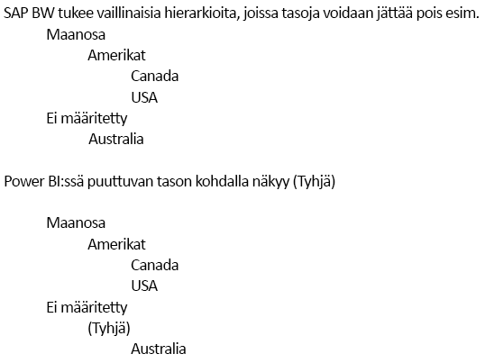

# SAP Business Warehouseen yhdistäminen DirectQueryn avulla Power BI:ssä
Voit muodostaa yhteyden **SAP Business Warehouse (BW)** -tietolähteisiin suoraan **DirectQueryn** avulla. SAP BW:n OLAP- ja monidimensioluonteesta johtuen DirectQueryn käytöllä SAP BW:n kanssa ja DirectQueryn käytöllä relaatiolähteiden (esimerkiksi SQL Server) kanssa on monia tärkeitä eroja. Nämä erot esitellään seuraavassa:

* Kun **DirectQuerya** käytetään relaatiolähteiden kanssa, käytössä on joukko kyselyitä (jotka määritetään **Nouda tiedot**- tai **Kyselyeditori**-valintaikkunassa), jotka määrittävät loogisesti, mitkä tiedot ovat käytettävissä kenttäluettelossa. Tämä *ei* kuitenkaan pidä paikkaansa, kun muodostetaan yhteys SAP BW:n kaltaiseen OLAP-lähteeseen. Kun SAP-palvelimeen muodostetaan yhteys **Nouda tiedot** -toiminnolla, valitaan sen sijaan vain Infocube tai BEx-kysely. Tämän jälkeen kaikki valitun Infocuben tai BEx-kyselyn dimensiot ja avainluvut ovat käytettävissä kenttäluettelossa.   
* Lisäksi käytettävissä ei ole **kyselyeditoria**, kun muodostat yhteyden SAP BW:hen. Voit muokata tietolähdeasetuksia (esimerkiksi palvelimen nimeä) valitsemalla **Muokkaa kyselyitä > Tietolähdeasetukset**. Voit muokata minkä tahansa parametrin asetuksia valitsemalla **Muokkaa kyselyitä > Parametrien hallinta**.
* OLAP-lähteiden ainutlaatuisuuden vuoksi voimassa on lisärajoituksia (sekä mallinnukselle että visualisoinneille) DirectQueryn normaalirajoitusten lisäksi. Nämä rajoitukset kuvataan myöhemmin tässä artikkelissa.

Lisäksi on *äärimmäisen tärkeää* ymmärtää, että monia SAP BW:n toimintoja ja ominaisuuksia ei tueta Power BI:ssä. Lisäksi SAP BW:n julkisen liittymän luonteen vuoksi on olemassa tärkeitä tapauksia, joissa Power BI:ssä nähtävät tulokset eivät vastaa SAP-työkalussa nähtäviä tuloksia. Nämä rajoitukset kuvataan myöhemmin tässä artikkelissa. Nämä rajoitukset ja toimintaerot on syytä käydä läpi tarkasti. Näin varmistat, että osaat tulkita Power BI:ssä nähtäviä SAP:n julkisen liittymän palauttamia tuloksia oikein.  

> [!NOTE]
> DirectQueryn käyttö SAP BW:n kanssa oli esikatseluvaiheessa Power BI Desktopin maaliskuun 2018 päivitykseen saakka. Esikatselun vaiheen aikana saatu palaute ja parannusehdotukset tuottivat muutoksia, jotka vaikuttavat raportteihin, jotka on luotu tällä esikatseluversiolla. Nyt kun DirectQueryn käyttö SAP BW:n kanssa on julkaistu yleiseen käyttöön, sinun *täytyy* hylätä kaikki olemassa olevat (esikatseluversioon perustuvat) raportit, jotka käyttävät DirectQuerya yhdessä SAP BW:n kanssa ja jotka luotiin ennen yleisesti saatavilla olevan version julkaisua. Raporteissa, jotka on luotu DirectQueryn ja SAP BW:n yhteiskäytön esikatseluversiolla, ilmenee virheitä, kun päivitystä kutsutaan, kun metatietoja yritetään päivittää taustalla olevan SAP BW -kuution muutoksilla. Luo nämä raportit uudelleen tyhjän raportin pohjalta DirectQueryn ja SAP BW:n yhteiskäytön yleisesti julkaistulla versiolla. 

## Mallinnuksen lisärajoitukset
Kun muodostat yhteyden SAP BW:n Power BI:n DirectQuerylla, ensisijaiset mallinnuksen lisärajoitukset ovat seuraavat:

* **Ei tukea lasketuille sarakkeille**: Laskettujen sarakkeiden luominen ei ole mahdollista. Tämä tarkoittaa sitä, että myöskään ryhmittely ja klusterointi eivät ole käytettävissä, sillä ne luovat laskettuja sarakkeita.
* **Mittarien lisärajoitukset**: mittareissa käytettäville DAX-lausekkeille on lisärajoitukset SAP BW:n tarjoaman tukitason johdosta.
* **Ei tukea suhteiden määrittämiselle**: suhteen ovat luontaisia ulkoisessa SAP-lähteessä, joten mallissa ei voi määrittää muita suhteita.
* **Ei tietonäkymää**: **Tietonäkymässä** näytetään yleensä taulukoiden tarkemmat tiedot. SAP BW:n kaltaisten OLAP-lähteiden luonteesta johtuen tämä näkymä ei ole käytettävissä SAP BW -tietoja käytettäessä.
* **Sarakkeiden ja mittarien tiedot ovat kiinteät**: Kenttäluettelossa näkyvä sarakkeiden ja mittarien luettelo on kiinteä taustalla olevan lähteen mukaisesti, joten sitä ei voi muokata. Et voi esimerkiksi poistaa saraketta tai vaihtaa sen tietotyyppiä (voit kuitenkin vaihtaa sen nimeä).
* **Muut rajoitukset DAX:ssä**: Mittarimääritelmissä käytettävälle DAX:lle on lisärajoituksia lähteen rajoitusten johdosta. Et esimerkiksi voi käyttää koostefunktiota taulukossa.

## Visualisointien lisärajoitukset
Kun muodostat yhteyden SAP BW:n Power BI:n DirectQuerylla, ensisijaiset visualisointien lisärajoitukset ovat seuraavat:

* **Ei sarakkeiden koostamista**: Et voi vaihtaa visualisoinnin sarakkeen koostamista. Sen asetus on aina *Älä tee yhteenvetoa*.
* **Mittarien suodatus ei ole käytettävissä**: mittarien suodatus ei ole käytettävissä SAP BW:n tarjoamasta tukitasosta johtuen.
* **Monivalinta ja sisällyttäminen sekä pois jättäminen**: Visualisoinnissa ei voi valita useita arvopisteitä, jos pisteet edustavat arvoja useammasta kuin yhdestä sarakkeesta. Jos sinulla on esimerkiksi palkkikaavio, joka kuvaa myyntiä maittain ja jonka selite on Luokka, et voi valita pistettä, joka edustaa Yhdysvaltoja ja pyöriä, sekä pistettä, joka edustaa Ranskaa ja vaatteita. Et myöskään voi valita pistettä, joka edustaa Yhdysvaltoja ja pyöriä, ja jättää sitä pois visualisoinnista. Molemmat rajoitukset johtuvat SAP BW:n tarjoamasta tuesta.

## SAP BW:n toimintojen ja ominaisuuksien tuki
Seuraavassa taulukossa luetellaan kaikki SAP BW:n toiminnot ja ominaisuudet, joita ei tueta tai jotka toimivat eri tavalla Power BI:n kanssa käytettäessä.   

| Toiminto | Description |
| --- | --- |
| Paikalliset laskennat |BEx-kyselyssä määritetyt paikalliset laskennat muuttavat lukuja, kun niitä näytetään BEx Analyzerin kaltaisten työkalujen kautta. Nämä muutokset eivät kuitenkaan näy SAP:n julkisen MDX-liittymän palauttamissa luvuissa.     **Tästä johtuen Power BI -visualisoinnissa näytettävät luvut eivät välttämättä vastaa lukuja SAP-työkalun vastaavassa visualisoinnissa.**     Jos esimerkiksi muodostat yhteyden BEx-kyselyn kyselykuutioon, joka määrittää koostamisasetukseksi Cumulated (eli kertymä), Power BI saisi takaisin kantaluvut ja ohittaisi tämän asetuksen.  Analyytikko voisi tietysti tehdä kertymälaskennan paikallisesti Power BI:ssä, mutta hänen täytyy olla varovainen näiden lukujen tulkinnassa, jos tätä ei tehdä. |
| Koostamiset |Joissain tapauksissa (etenkin käsiteltäessä useita valuuttoja), SAP:n julkisen liittymän palauttamat koosteluvut eivät vastaa SAP-työkaluissa näytettyjä.     **Tästä johtuen Power BI -visualisoinnissa näytettävät luvut eivät välttämättä vastaa lukuja SAP-työkalun vastaavassa visualisoinnissa.**     Esimerkiksi eri valuuttojen kokonaissummat näytettäisiin muodossa ”*” BEx Analyzerissa, mutta SAP:n julkinen liittymä palauttaisi kokonaissumman ilman mitään tietoa siitä, että tällainen koosteluku on merkityksetön. Näin ollen siis Power BI näyttäisi luvun (joka koostaa esimerkiksi dollareita, euroja ja Australian dollareita). |
| Valuuttamuotoilu |Mitään valuuttamuotoiluja (esimerkiksi 2 300 $ tai 4 000 AUD) ei huomioida Power BI:ssä. |
| Mittayksiköt |Mittayksiköitä (esimerkiksi 230 kg) ei huomioida Power BI:ssä. |
| Avain vs. teksti (lyhyt, keskipitkä ja pitkä) |Esimerkiksi CostCenterin kaltaisille SAP BW:n ominaisuuksille näytetään kenttäluettelossa yksisarakkeinen kustannuspaikka.  Tämän sarakkeen käyttö näyttää oletustekstin.  Näyttämällä piilotetut kentät voidaan näyttää myös yksilöllisesti nimetty sarake (joka palauttaa SAP BW:n määrittämän yksilöllisen nimen ja joka on yksilöllisyyden peruste).     Avain ja muut tekstikentät eivät ole käytettävissä. |
| Ominaisuuden useat hierarkiat |**SAP:ssä** ominaisuudella voi olla useita hierarkioita. Tämän ansiosta BEx Analyzerin kaltaisissa työkaluissa käyttäjä voi valita käytettävän hierarkian, kun ominaisuus sisällytetään kyselyyn.     **Power BI:ssä** useat hierarkiat näytetään kenttäluettelossa saman dimension eri hierarkioina.  Saman dimension kahden eri hierarkian useiden tasojen valitseminen aiheuttaa kuitenkin sen, että SAP palauttaa tyhjiä tietoja. |
| Vaillinaisten hierarkioiden käyttö | |
| Skaalauskerroin / käänteinen merkki |SAP:ssä avainluvulla voi olla skaalauskerroin (esimerkiksi 1 000), joka on määritetty muotoiluasetuksena, mikä merkitsee sitä, että kaikki näytettävä skaalataan tällä kertoimella.     Sille voidaan myös määrittää ominaisuus, joka kääntää merkin. Tällaisen avainluvun käyttö Power BI:ssä (visualisoinnissa tai osana laskelmaa) aiheuttaa skaalaamattoman luvun käytön (eikä merkkiä käännetä). Taustalla oleva skaalauskerroin ei ole käytettävissä. Power BI -visualisointien akselilla (K,M,B) näytettäviä skaalausyksiköitä voi hallita osana visualisoinnin muotoilua. |
| Hierarkiat, joissa tasot näytetään tai piilotetaan dynaamisesti |Kun muodostat yhteyden SAP BW:hen, järjestelmä hakee alussa hierarkiatasot, mikä tuo joukon kenttiä kenttäluetteloon. Nämä tiedot tallennetaan välimuistiin. Jos tasot muuttuvat, kenttäjoukko ei muutu, ellei päivityskutsua tehdä.     Tämä on mahdollista vain **Power BI Desktopissa**. Tällaista päivitystä tasomuutosten päivittämiseksi ei voi kutsua Power BI:ssä julkaisemisen jälkeen. |
| Oletussuodatin |BEx-kysely voi sisältää oletussuodattimia, joita SAP BEx Analyzer käyttää automaattisesti. Ne eivät ole näkyvissä, joten vastaava käyttö Power BI:ssä ei käytä oletusarvoisesti samoja suodattimia. |
| Piilotetut avainluvut |BEx-kysely voi hallita avainlukujen näkyvyyttä. Piilotetut avainluvut eivät näy SAP BEx Analyzerissa. Tätä ei huomioida julkisessa ohjelmointirajapinnassa, joten tällaiset piilotetut avainluvut näytetään silti kenttäluettelossa. Ne voi kuitenkin piilottaa Power BI:ssä. |
| Numeromuotoilu |Mitään numeromuotoiluja (desimaalien määrä, desimaalimerkki jne.) ei huomioida automaattisesti Power BI:ssä. Näitä muotoiluja voi kuitenkin hallita sitten Power BI:ssä. |
| Hierarkiaversiot |SAP BW mahdollistaa hierarkioiden eri versiot, esimerkiksi kustannuspaikkahierarkiat versiosta 2007 ja 2008. Power BI:ssä on käytettävissä vain uusin versio, koska julkinen ohjelmointirajapinta ei anna tietoa versioita. |
| Aikariippuvaiset hierarkiat |Kun käytät Power BI:tä, aikariippuvaiset hierarkiat arvioidaan nykyisen päivämäärän mukaisesti. |
| Valuuttamuunnos |SAP BW tukee valuuttamuunnoksia, joka perustuvat kuutioon sisältyviin valuuttakursseihin. Julkinen ohjelmointirajapinta ei tarjoa näitä ominaisuuksia, joten ne eivät ole käytettävissä Power BI:ssä. |
| Lajittelujärjestys |Ominaisuuden lajittelujärjestyksen (tekstin tai avaimen perusteella) voi määrittää SAP:ssä. Tätä lajittelujärjestystä ei huomioida Power BI:ssä. Esimerkiksi kuukaudet voivaan näyttää muodossa ”Huhtikuu,” ”Elo” ja niin edelleen.     Tätä lajittelujärjestystä ei voi muokata Power BI:ssä. |
| Tekniset nimet |**Nouda tiedot** -toiminnossa näytetään sekä ominaisuuden/mittayksikön nimet (kuvaukset) että tekniset nimet. Kenttäluettelo sisältää vain ominaisuuksien/mittayksiköiden nimet (kuvaukset). |
| Määritteet |Ominaisuuden määritteitä ei voi käyttää Power BI:ssä. |
| Käyttäjien kieliasetus |Kieliasetus, joka on käytössä SAP BW:hen yhdistettäessä, määritetään osana yhteystietoja, joten ei vastaa raportin lopullisen käyttäjän kieliasetusta. |
| Tekstimuuttujat |SAP BW mahdollistaa sen, että kenttänimet voivat sisältää muuttujien paikkamerkkejä (esimerkiksi "$YEAR$ Actuals"), jotka sitten korvataan valitulla arvolla. Kenttä voidaan esimerkiksi näyttää muodossa "2016 Actuals" BEx-työkaluissa, jos muuttujaksi on valittu vuosi 2016.     Sarakkeen nimeä Power BI:ssä ei vaihdeta muuttujan arvon mukaisesti, joten se näytetään muodossa "$YEAR$ Actuals".  Sarakkeen nimeä voi kuitenkin sitten vaihtaa Power BI:ssä. |
| Customer Exit -muuttujat | Julkinen ohjelmointirajapinta ei tarjoa Customer Exit -muuttujia, joten niitä ei tueta Power BI:ssä. |
| Ominaisuusrakenteet | Mitkä tahansa ominaisuusrakenteet taustalla olevassa SAP BW -lähteessä aiheuttavat Power BI:ssä näytettävien mittarien ”räjähdyksen”. Jos esimerkiksi käytössä on kaksi mittaria Sales ja Costs sekä ominaisuusrakenne, joka sisältää Budget- ja Actual-mittarit, näytetään neljä mittaria: Sales.Budget, Sales.Actual, Costs.Budget, Costs.Actual. |

## Seuraavat vaiheet
Saat lisätietoja DirectQuerystä seuraavista resursseista:

* [DirectQueryn käyttö Power BI:ssä](desktop-directquery-about.md)
* [DirectQueryn tukemat tietolähteet](desktop-directquery-data-sources.md)
* [DirectQuery ja SAP HANA](desktop-directquery-sap-hana.md)

