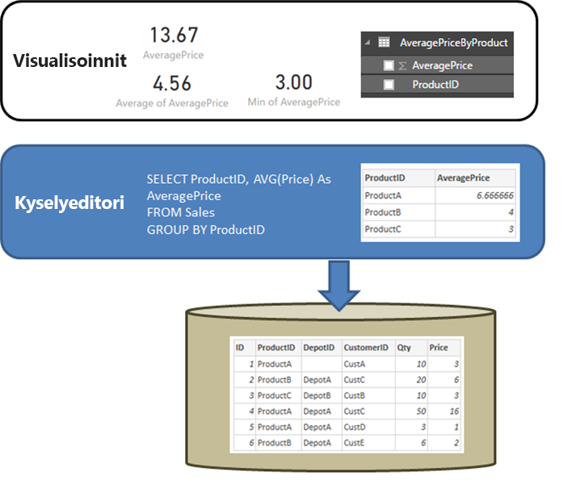

# DirectQuery ja SAP HANA
Voit muodostaa yhteyden **SAP HANA** -tietolähteisiin suoraan **DirectQueryn** avulla. Voit muodostaa yhteyden SAP HANA -tietolähteisiin kahdella tavalla:

* **Käsittele SAP HANAa monidimensioisena lähteenä (oletus):**  Tässä tapauksessa Power BI toimii samankaltaisesti kuin muihin monidimensioisiin tietolähteisiin yhdistettäessä (esimerkiksi SAP Business Warehouse tai Analysis Services). Kun muodostat yhteyden SAP HANA -tietolähteeseen tällä asetuksella, valittuna on yksi analyysi- tai laskentanäkymä ja kaikki sen mittarit, hierarkiat ja määritteet ovat käytettävissä kenttäluettelossa. Kun visualisointeja luodaan, koostetiedot haetaan aina SAP HANA -tietolähteestä. Tämä on suositeltu tapa. Se on myös oletustapa uusille DirectQuery-raporteille, jotka käyttävät SAP HANA -tietolähteitä.

* **Käsittele SAP HANAa suhteellisena lähteenä:** Tässä tapauksessa Power BI käsittelee SAP HANA -tietolähdettä suhteellisena lähteenä. Tämä on joustavampi tapa. Tällä tavalla täytyy kuitenkin olla tarkkana, jotta mittarit koostetaan odotetusti ja jotta suorituskykyongelmat voidaan välttää.

Yhdistämistapa määritetään yleisellä työkaluasetuksella, jonka voit määrittää valitsemalla **Tiedosto > Asetukset ja vaihtoehdot** > **Asetukset > DirectQuery** > **Käsittele SAP HANAa suhteellisena lähteenä**, kuten seuraavassa kuvassa näytetään. 

Asetus SAP HANAn käsittelemiseksi suhteellisena lähteenä määrittää tavan, jolla kaikki *uudet* DirectQuerya käyttävät raportit muodostavat yhteyden SAP HANA -tietolähteisiin. Sillä ei ole vaikutusta mihinkään nykyisen raportin olemassa oleviin SAP HANA -yhteyksiin tai mihinkään yhteyksiin missään muissa avatuissa raporteissa. Jos asetusta ei ole tällä hetkellä valittu ja lisäät sitten uuden yhteyden SAP HANA -tietolähteeseen **Nouda tiedot** -toiminnolla, yhteys muodostetaan siten, että SAP HANA -tietolähdettä käsitellään monidimensioisena lähteenä. Jos taas avaat eri raportin, joka muodostaa myös yhteyden SAP HANA -tietolähteeseen, tämä raportti toimii jatkossakin sen asetuksen mukaisesti, joka oli valittuna *raportin luontihetkellä*. Tämä tarkoittaa sitä, että kaikki SAP HANA -tietolähteisiin yhteyden muodostavat raportit, jotka on luotu ennen helmikuuta 2018, käsittelevät jatkossakin SAP HANA -tietolähteitä suhteellisina lähteinä. 

Nämä kaksi tapaa toimivat eri tavalla, joten olemassa olevan raportin tapaa ei voi vaihtaa toiseksi. 

Tutustumme nyt molempiin näistä tavoista.

## Käsittele SAP HANAa monidimensioisena lähteenä (oletus)

Kaikki uudet SAP HANA -tietolähteisiin tällä tavalla muodostetut yhteydet käsittelevät SAP HANA -tietolähteitä oletusarvoisesti monidimensioisina tietolähteinä. Jos haluat käsitellä SAP HANA -tietolähdettä suhteellisena lähteenä, sinun täytyy valita **Tiedosto > Asetukset ja vaihtoehdot > Asetukset** > **Direct Query ja valita sitten Käsittele SAP HANAa suhteellisena lähteenä -valintaruutu**. Kun tämä toiminto on **esikatseluvaiheessa**, monidimensioisella tavalla luotuja raportteja *ei voi* julkaista Power BI -palveluun. Jos niitä julkaistaan, tämä aiheuttaa virheitä, kun raportti avataan Power BI -palvelussa.  

Kun muodostat yhteyden SAP HANA -tietolähteeseen monidimensioisena tietolähteenä, huomioi seuraavat seikat:

* **Nouda tiedot -siirtymistoiminnossa** voi valita vain yhden SAP HANA -näkymän. Yksittäisten mittarien tai määritteiden valitseminen ei ole mahdollista. Yhdistämisen yhteydessä ei määritetä kyselyä, mikä eroaa tietojen tuomisesta tai DirectQueryn käytöstä, kun SAP HANA -tietolähdettä käsitellään suhteellisena lähteenä. Tämä tarkoittaa myös sitä, että et voi käyttää suoraan SAP HANA SQL -kyselyä, kun valitset tämän yhdistämistavan.

* Kaikki valitun näkymän mittarit, hierarkiat ja määritteet näytetään kenttäluettelossa. 

* Kun mittaria käytetään visualisoinnissa, SAP HANA -tietolähteeseen lähetetään kysely, jolla haetaan mittari siltä koostamistasolta, jota visualisoinnissa tarvitaan. Kun käsittelet ei-lisääviä mittareita (laskureita, suhteita ja niin edelleen), SAP HANA suorittaa kaikki koosteet, Power BI ei suorita mitään lisäkoosteita. 

* Jotta järjestelmä voi hakea oikeat koostearvot SAP HANA -tietolähteestä, tiettyjä rajoituksia täytyy noudattaa. Et esimerkiksi voi lisätä laskettuja sarakkeita tai yhdistää tietoja useista SAP HANA -näkymistä samaan raporttiin. 

SAP HANA -tietolähteen käsitteleminen monidimensioisena tietolähteenä ei ole yhtä joustava kuin vaihtoehtoinen *suhteellinen* tapa, mutta se on yksinkertaisempi tapa. Se myös varmistaa oikeat koostearvot, kun käsittelet monimutkaisempia SAP HANA -mittareita. Se on myös yleisesti tehokkuudeltaan parempi tapa. 

**Kenttä**-luettelo sisältää kaikki SAP HANA -näkymän mittarit, määritteet ja hierarkiat. Ota huomioon seuraavat toimintaan liittyvät seikat, jotka ovat voimassa tällä tavalla yhdistettäessä:

* Mikä tahansa määrite, joka sisältyy vähintään yhteen hierarkiaan, piilotetaan oletusarvoisesti. Saat ne kuitenkin tarvittaessa näkyviin valitsemalla kenttäluettelon pikavalikosta **Näytä piilotetut**. Samassa pikavalikossa voit myös tarvittaessa määrittää ne näkyviksi.

* SAP HANAssa määrite voidaan määrittää käyttämään toista määritettä selitteenä. Esimerkiksi **Product**-määrite (jonka arvot ovat 1,2,3, ja niin edelleen) voi käyttää selitteenä **ProductName**-määritettä (jonka arvot ovat Bike,Shirt,Gloves ja niin edelleen). Tässä tapauksessa kenttäluettelossa näytetään yksittäinen **Product**-kenttä, jonka arvoja ovat selitteet Bike, Shirt, Gloves ja niin edelleen, mutta ne lajitellaan ja niiden yksilöllisyys määritetään avainarvoilla 1,2,3. Myös piilotettu **Product.Key**-sarake luodaan, jotta taustalla olevia avainarvoja voidaan käyttää tarvittaessa. 

Mitkä tahansa taustalla olevassa SAP HANA -näkymässä määritetyt muuttujat näytetään yhdistämishetkellä, jolloin tarvittavat arvot voidaan antaa. Näitä arvoja voi myöhemmin muokata valitsemalla valintanauhasta **Muokkaa kyselyitä** ja valitsemalla sitten näyttöön avautuvasta avattavasta valikosta **Parametrien hallinta**. 

Sallitut mallinnustoiminnot ovat rajoitetumpia kuin yleensä DirectQuerya käytettävissä, koska järjestelmän täytyy varmistaa, että oikeat koostetiedot voidaan aina hankkia SAP HANA -tietolähteestä. Voit kuitenkin silti tehdä monia lisäyksiä ja muutoksia, voit esimerkiksi määrittää mittareita, piilottaa kenttiä ja nimetä niitä uudelleen sekä määrittää näyttömuotoja. Kaikki tällaiset muutokset säilytetään päivitettäessä. Lisäksi kaikki SAP HANA -näkymään tehdyt muutokset, jotka eivät ole ristiriidassa, otetaan käyttöön. 

### Mallinnuksen lisärajoitukset

Kun muodostat yhteyden SAP HANA -tietolähteeseen DirectQuerylla (siten, että tietolähdettä käsitellään monidimensioisena tietolähteenä), ensisijaiset mallinnuksen lisärajoitukset ovat seuraavat: 

* **Laskettuja sarakkeita ei tueta:** Laskettujen sarakkeiden luominen ei ole mahdollista. Tämä tarkoittaa sitä, että myöskään ryhmittely ja klusterointi eivät ole käytettävissä, sillä ne luovat laskettuja sarakkeita.
* **Mittarien lisärajoitukset:** Mittareissa käytettäville DAX-lausekkeille on lisärajoitukset SAP HANAn tarjoaman tukitason vuoksi.
* **Ei tukea suhteiden määrittämiselle:** Raportissa voi tehdä kyselyitä vain yhdestä näkymästä, joten suhteiden määrittämistä ei tueta.
* **Ei tietonäkymää:** **Tietonäkymässä** näytetään yleensä taulukoiden tarkemmat tiedot. SAP HANAn kaltaisten OLAP-lähteiden luonteesta johtuen tämä näkymä ei ole käytettävissä SAP HANA -tietoja käytettäessä.
* **Sarakkeiden ja mittarien tiedot ovat kiinteät:** Kenttäluettelossa näkyvä sarakkeiden ja mittarien luettelo on kiinteä taustalla olevan lähteen mukaisesti, joten sitä ei voi muokata. Et voi esimerkiksi poistaa saraketta tai vaihtaa sen tietotyyppiä (voit kuitenkin vaihtaa sen nimeä).
* **Muut DAX-rajoitukset:** Mittarimääritelmissä käytettävälle DAX:lle on lisärajoituksia lähteen rajoitusten johdosta. Et esimerkiksi voi käyttää koostefunktiota taulukossa.

### Visualisointien lisärajoitukset

Visualisoinneilla on rajoituksia, kun muodostat yhteyden SAP HANA -tietolähteeseen DirectQuerylla (siten, että tietolähdettä käsitellään monidimensioisena tietolähteenä): 
* **Ei sarakkeiden koostamista:** Et voi vaihtaa visualisoinnin sarakkeen koostamista. Sen asetus on aina *Älä tee yhteenvetoa*.

## Käsittele SAP HANAa suhteellisena lähteenä 

Kun muodostat yhteyden SAP HANA -tietolähteeseen suhteellisena lähteenä, voit käyttää sitä hieman joustavammin. Voit esimerkiksi luoda laskettuja sarakkeita, sisällyttää tietoja useista SAP HANA -näkymistä ja luoda suhteita tuloksiksi saatavien taulukoiden välille. Kun käytät SAP HANA -tietolähdettä tällä tavalla, on kuitenkin tärkeää, että ymmärrät tietyt asiat yhteyden käsittelystä, jotta osaat varmistaa seuraavat: 

* Sinun täytyy varmistaa, että tulokset ovat odotettuja, kun SAP HANA -näkymä sisältää ei-lisääviä mittareita (esimerkiksi erillisiä määriä tai keskiarvoja yksinkertaisten summien asemesta).
* Sinun täytyy varmistaa, että tuloksena saatavat kyselyt ovat tehokkaita.

Sinun kannattaa aloittaa selventämällä suhteellisen lähteen (esimerkiksi SQL Serverin) toimintaa, kun kysely määritetään **Nouda tiedot** -toiminnolla tai kun **kyselyeditori** suorittaa koostamisen. Seuraavassa esimerkissä **kyselyeditorissa** määritetty kysely palauttaa keskimääräisen hinnan *ProductID:n* perusteella.  

Jos tiedot tuotaisiin Power BI:hin (DirectQueryn käytön sijasta), tulos olisi seuraava:

* Tiedot tuodaan sillä koostamistasolla, jonka **kyselyeditorilla** luotu kysely määrittää. Se voi olla esimerkiksi keskimääräinen hinta tuotteen mukaan. Tämän tuloksena saadaan taulukko, jossa on kaksi saraketta: *ProductID* ja *AveragePrice*. Niitä voi käyttää visualisoinneissa.
* Visualisoinnissa mikä tahansa koostaminen tämän jälkeen (esimerkiksi *Summa*, *Keskiarvo* tai *Vähimmäisarvo*) suoritetaan näille tuoduille tiedoille. Jos esimerkiksi sisällytät *AveragePrice*-sarakkeen visualisointiin, järjestelmä käyttää oletusarvoisesti *Summa*-koostetta, jolloin se palauttaa *AveragePrice*-sarakkeen summan kullekin *ProductID:lle*. Tässä esimerkissä tulos olisi 13,67. Sama koskee kaikkia muita visualisoinnissa käytettäviä koostefunktioita (esimerkiksi *Vähimmäisarvo*, *Keskiarvo* ja niin edelleen). Esimerkiksi *AveragePrice*-sarakkeen *Keskiarvo*-funktio antaa keskiarvon arvoille 6,66, 4 ja 3 (tämän tulos on 4,56), ei keskiarvoa *Price*-sarakkeen kuudelle taustalla olevalle tietueelle (joiden keskiarvo on 5,17).
  
Jos **DirectQuerya** käytetään (saman suhteellisen lähteen avulla) tuomisen asemesta, sama semantiikka on voimassa ja tulos on täysin sama:  

* Jos käytetään samaa kyselyä, loogisesti tismalleen samat tiedot toimitetaan raportointikerrokseen, vaikka tietoja ei todellisuudessa tuoda.

* Visualisoinnissa mikä tahansa koostaminen tämän jälkeen (esimerkiksi *Summa*, *Keskiarvo* tai *Vähimmäisarvo*) suoritetaan taas kyselyn tälle loogiselle taulukolle. *AveragePrice*-sarakkeen *Keskiarvo*-funktio palauttaa täten saman arvon 4,56.
  
Seuraavaksi käsittelemme SAP HANA -tietoyhteyttä suhteellisena lähteenä. Power BI voi käyttää sekä SAP HANAn *analyysinäkymiä* että *laskentanäkymiä*. Molemmat niistä voivat myös sisältää mittareita. SAP HANA -tapa noudattaa kuitenkin samoja periaatteita, jotka kuvattiin aiemmin tässä osiossa: **Nouda tiedot** -toiminnolla tai **kyselyeditorilla** määritetty kysely määrittää käytettävissä olevat tiedot, minkä jälkeen kaikki visualisoinnissa tämän jälkeen suoritettavat koosteet tehdään näille tiedoille. Tämä koskee sekä tuomista että DirectQuerya.  
SAP HANAn luonteesta johtuen alkuperäisellä **Nouda tiedot** -toiminnolla määritetty kysely tai **kyselyeditorissa** alun perin määritetty kysely on aina koostekysely. Yleensä se sisältää mittarit, joissa todellisen käytettävän koosteen määrittää SAP HANA -näkymä.

Yllä olevaa SQL Server -esimerkkiä vastaavassa tilanteessa SAP HANA -näkymä sisältää sarakkeet *ID*, *ProductID*, *DepotID* ja mittarin *AveragePrice*, jotka on määritetty näkymässä *Average of Price* -funktiolla.  
    
Jos **Nouda tiedot** -toiminnossa valitaan mittarit **ProductID** ja **AveragePrice**, tämä määrittää kyselyn tälle näkymälle siten, että näitä koostetietoja pyydetään (aiemmassa esimerkissä käytetään yksinkertaisempaa pseudo-SQL:ää, joka ei vastaa SAP HANA SQL:n tarkkaa syntaksia). Tämän jälkeen kaikki muut visualisoinnissa määritetyt koosteet siis koostavat edelleen tämän kyselyn tuloksia. Kuten aiemmin SQL Serverin kohdassa kerrottiin, tämä koskee sekä tuomista että DirectQuerya. DirectQuerya käytettäessä **Nouda tiedot** -toiminnon tai **kyselyeditorin** kyselyä käytetään alivalinnassa yksittäisessä kyselyssä, joka lähetetään SAP HANAan, joten kaikkia tietoja ei siis todellisuudessa lueta sisään ennen jatkokoostamista.  

Kaikkien edellä mainittujen seikkojen ja toimintojen johdosta sinun täytyy huomioida seuraavat tärkeät seikat, kun käytät DirectQuerya SAP HANAn kanssa:  

* Visualisoinneissa suoritettujen lisäkoostamisten kanssa täytyy olla tarkkana aina, kun SAP HANAn mittari ei ole lisäävä (jos se ei siis ole yksinkertainen *Summa*-, *Vähimmäisarvo*- tai *Enimmäisarvo*-funktio).

* **Nouda tiedot** -toiminnossa ja **kyselyeditorissa** tulee sisällyttää mukaan vain ne sarakkeet, joita tarvitaan tarvittavien tietojen noutamiseen, koska tulos on kysely ja koska tämän kyselyn täytyy olla sellainen kysely, jonka voi lähettää SAP HANAan. Jos valitset esimerkiksi kymmeniä sarakkeita, koska ajattelet, että tarvitset niitä ehkä myöhemmissä visualisoinneissa, tässä tapauksessa DirectQueryssa yksinkertainenkin visualisointi tarkoittaa sitä, että alivalinnassa käytetty koostekysely sisältää nämä kymmenet sarakkeet. Yleensä tämä tarkoittaa heikkoa tehokkuutta kyselylle.
  
Tarkastellaan esimerkkiä. Seuraavassa esimerkissä valitaan viisi saraketta (**CalendarQuarter**, **Color**, **LastName**, **ProductLine**, **SalesOrderNumber**) **Nouda tiedot** -valintaikkunassa sekä mittari *OrderQuantity*. Tämä merkitsee sitä, että kun luot myöhemmin yksinkertaisen visualisoinnin, joka sisältää Min OrderQuantity -määrän, saat tulokseksi seuraavan SQL-kyselyn SAP HANAan. Harmaana näkyvä osio on alivalinta, joka sisältää kyselyn **Nouda tiedot** -toiminnosta  /  **kyselyeditorista**. Jos tämä alivalinta tuottaa suuren kardinaliteettituloksen, SAP HANA antaa tuloksia todennäköisesti hitaasti.  

   
Tästä syystä suosittelemme, että **Nouda tiedot** -toiminnossa tai **kyselyeditorissa** valitaan vain tarvittavat kohteet, joilla saadaan silti aikaan kohtuullinen kysely SAP HANAan.  

## Parhaat käytännöt 

SAP HANAn molempien yhdistämistapojen kohdalla DirectQueryn suositukset koskevat myös SAP HANAa, etenkin tehokkuuteen ja suorituskykyyn liittyvät suositukset. Nämä suositukset kuvataan tarkemmin ohjeartikkelissa [DirectQuery Power BI:ssä](desktop-directquery-about.md).
   
## Rajoitukset

Seuraavassa taulukossa luetellaan kaikki SAP HANAn toiminnot ja ominaisuudet, joita ei tueta täysin tai jotka toimivat eri tavalla Power BI:n kanssa käytettäessä. 

* **Pää- ja alatasohierarkiat**: Pää- ja alatasohierarkiat eivät näy Power BI:ssä.
Tämä johtuu siitä, että Power BI käyttää SAP HANAa SQL-liittymän kautta (eikä pää- ja alatasohierarkioita voi käyttää täysin SQL:n avulla).
* **Muut hierarkian metatiedot**: Hierarkioiden perusrakenne näytetään Power BI:ssä, mutta joillain hierarkian metatiedoilla (esimerkiksi epäjatkuvien hierarkioiden toiminnan ohjaamisella) ei ole vaikutusta.
Tämäkin johtuu SQL-liittymän rajoituksista.
* **SSL:ää käyttävä yhteys**: voit muodostaa yhteyden käyttämällä tuontia ja moniulotteisuutta SSL:n avulla, mutta et voi muodostaa yhteyttä SAP HANA -esiintymiin, jotka on määritetty käyttämään SSL:ää.
* **Määritenäkymien tuki**: Power BI voi muodostaa yhteyden analyysi- ja laskentanäkymiin, mutta ei suoraan määritenäkymiin.
* **Luettelo-objektien tuki**: Power BI ei voi muodostaa yhteyttä luettelo-objekteihin.
* **Muutokset muuttujiin julkaisemisen jälkeen**: et voi muuttaa minkään SAP HANA -muuttujien arvoja suoraan Power BI -palvelussa sen jälkeen, kun raportti on julkaistu. 
 
## Tunnetut ongelmat 
Alla luetellaan kaikki tunnetut ongelmat joita esiintyy, kun muodostat yhteyden SAP HANAan (DirectQuery) Power BI:llä. 

* **SAP HANA -ongelma, kun kysellään laskureita ja muita mittareita**: SAP HANA palauttaa virheellisiä tietoja, jos muodostat yhteyden analyysinäkymään ja jos samaan visualisointiin sisältyy laskurimittari tai jokin muu suhdemittari. Tätä käsitellään SAP-huomautuksessa 2128928 (Odottamattomat tulokset, kun kysely tehdään lasketulle sarakkeelle tai laskurille). Suhdemittari on tässä tapauksessa väärä. 

* **Useat Power BI -sarakkeet yhdestä SAP HANA -sarakkeesta**: Joissain laskentanäkymissä, joissa SAP HANA -saraketta käytetään useissa hierarkioissa, SAP HANA näyttää tämän kahtena eri määritteenä. Tämä aiheuttaa sen, että Power BI:ssä luodaan kaksi saraketta.  Nämä sarakkeet on oletusarvoisesti piilotettu. Lisäksi kaikki kyselyt, joihin hierarkiat liittyvät, tai sarakkeet suoraan, toimivat virheellisesti. 
 
## Seuraavat vaiheet

Saat lisätietoja DirectQuerystä seuraavista resursseista:

* [DirectQuery Power BI:ssä](desktop-directquery-about.md)
* [DirectQueryn tukemat tietolähteet](desktop-directquery-data-sources.md)
* [DirectQuery ja SAP BW](desktop-directquery-sap-bw.md)
* [Paikallinen tietoyhdyskäytävä](service-gateway-onprem.md)

