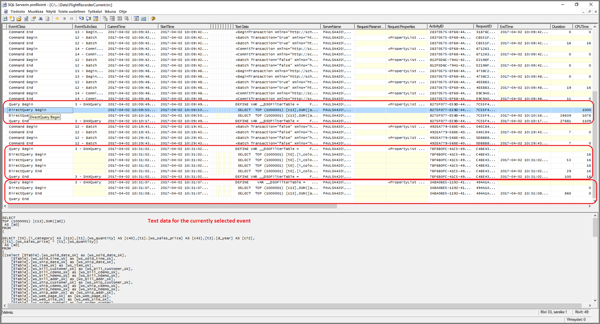
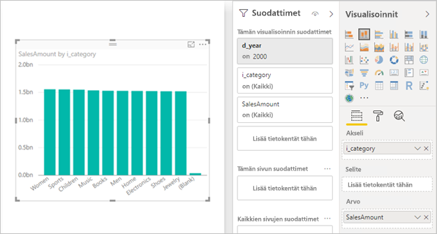

# <a name="troubleshoot-developing-directquery-models-in-power-bi-desktop"></a>DirectQuery-mallien kehittämisen vianmääritys Power BI Desktopissa

Tässä artikkelissa käsitellään tietojen mallintajia, jotka kehittävät Power BI:n DirectQuery-malleja, jotka on kehitetty joko Power BI Desktopin tai Power BI -palvelun avulla. Artikkelissa annetaan ohjeita suorituskykyongelmien vianmääritykseen sekä siihen, miten voit hankkia lisätietoja raporttien optimoimiseksi.

## <a name="performance-analyzer"></a>Suorituskyvyn analysointi

Suosittelemme painokkaasti, että aloitat suorituskykyongelmien vianmäärityksen aina Power BI Desktopista, et Power BI:stä (palvelusta tai Power BI -raporttipalvelimesta). Yleensä suorituskykyongelmat johtuvat taustatietolähteen suorituskyvystä. Tällaisten ongelmien tunnistaminen ja määrittäminen on helpompaa Power BI Desktopin eristetymmässä ympäristössä. Sen avulla myös vältetään alussa tietyt komponentit (esimerkiksi Power BI -yhdyskäytävä). Keskity ongelmien tutkimisessa Power BI:n raporttiin vasta sitten, jos ongelmaa ei löydy Power BI Desktopissa. [Suorituskyvyn analysointi](desktop-performance-analyzer.md) on hyödyllinen työkalu ongelmien tunnistamiseen tämän prosessin aikana.

Lisäksi suosittelemme ensin ongelmien määrittämistä yksittäisessä visualisoinnissa sivun useiden visualisointien asemesta.

Oletetaan, että nämä vaiheet (tämän aiheen aiemmassa kappaleessa) on suoritettu ja että olemme nyt Power BI Desktopissa sivun yksittäisessä visualisoinnissa, joka toimii edelleen hitaasti. Voit määrittää, mitä kyselyjä Power BI Desktop lähettää pohjana olevaan lähteeseen, käyttämällä suorituskyvyn analysointia. Voit myös tarkastella jäljityksiä/diagnostiikkatietoja, jotka pohjana oleva tietolähde saattaa lähettää. Nämä jäljitystiedot voivat sisältää hyödyllisiä tietoja siitä, miten kysely suoritettiin ja miten sitä voi parantaa.

Vaikka lähde ei tarjoaisi tällaisia jäljitystietoja, voit joka tapauksessa tarkistaa Power BI:n lähettämät kyselyt ja niiden suoritusajat. Saat ohjeet tähän alla.

## <a name="review-trace-files"></a>Tarkista jäljitystiedostot

Power BI Desktop kirjaa oletusarvoisesti tietyn istunnon tapahtuman jäljitystiedostoon, jonka nimi on **FlightRecorderCurrent.trc**.

Joissain DirectQuery-lähteissä tämä loki sisältää kaikki taustatietolähteeseen lähetetyt kyselyt (muita DirectQuery-lähteitä voidaan tukea tulevaisuudessa). Lokeihin kyselyitä kirjaavat lähteet ovat seuraavat:

- SQL Server
- Azuren SQL-tietokanta
- Azure SQL Data warehouse
- Oracle
- Teradata
- SAP HANA.

Jäljitystiedosto löytyy nykyisen käyttäjän **AppData**-kansiosta: _\\\<User>\AppData\Local\Microsoft\Power BI Desktop\AnalysisServicesWorkspaces_

Pääset sinne helposti valitsemalla Power BI Desktopissa _Tiedosto > Asetukset ja vaihtoehdot > Asetukset_ ja valitsemalla sitten **Diagnostiikka**-sivun. Näyttöön avautuu seuraava valintaikkuna:


Kun valitset kaatumisvedoskokoelmasta **Avaa kaatumisvedosten/jäljitysten kansio** -linkin, seuraava kansio avautuu: _\\\<User>\AppData\Local\Microsoft\Power BI Desktop\Traces_

Siirry tämän kansion yläkansioon. Näet siellä _AnalysisServicesWorkspaces_-kansion, joka sisältää yhden työtila-alikansion jokaiselle avoimelle Power BI Desktop -esiintymälle. Näiden alikansioiden nimen lopussa on kokonaisluku, esimerkiksi _AnalysisServicesWorkspace2058279583_.

Tämän kansion sisällä on _\Data_-alikansio. Se sisältää nykyisen Power BI -istunnon jäljitystiedoston FlightRecorderCurrent.trc. Power BI Desktop -istuntoa vastaava työtilakansio poistetaan, kun istunto lopetetaan.

Voit avata jäljitystiedostoja SQL Serverin profilointityökalulla, jonka voit ladata maksutta osana SQL Server Management Studioa. Voit hankkia sen [täältä](/sql/ssms/download-sql-server-management-studio-ssms?view=sql-server-2017).

Kun olet ladannut ja asentanut SQL Server Management Studion, suorita SQL Serverin profilointi.



Avaa jäljitystiedosto seuraavasti:

1. Valitse SQL Serverin profiloinnissa _File > Open > Trace_ file.
2. Anna tällä hetkellä auki olevan Power BI -istunnon jäljitystiedoston polku. Se voi olla esimerkiksi seuraava: _\\\<User>\AppData\Local\Microsoft\Power BI Desktop\AnalysisServicesWorkspaces\AnalysisServicesWorkspace2058279583\Data_
3. Avaa _FlightRecorderCurrent.trc_

Näet kaikki nykyisen istunnon tapahtumat. Alla olevassa esimerkissä on korostettu tietyt tapahtumat. Jokaisella ryhmällä on seuraavat:

- Niissä on _Query Begin_- ja _Query End_ -tapahtuma, joista näet käyttöliittymän luoman DAX-kyselyn (esimerkiksi visualisoinnista tai luettelon arvojen täyttämisestä suodatinkäyttöliittymästä) alkamis- ja päättymisajankohdan.
- Niissä on ainakin yksi pari _DirectQuery Begin_- ja _DirectQuery End_ -tapahtumia, joista näet taustatietolähteeseen lähetetyn kyselyn, kun DAX-kysely suoritettiin

Ota huomioon, että useita DAX-kyselyitä voidaan suorittaa rinnakkain, joten eri ryhmien tapahtumat voivat olla limittäisiä. Niissä on ActivityID-arvo, jonka avulla voit tarkistaa, mitkä tapahtumat kuuluvat samaan ryhmään.


Muita huomionarvoisia sarakkeita:

- **TextData:** Nämä ovat tapahtuman tekstitiedot. _Query Begin- ja Query End_ -tapahtumilla tämä on DAX-kysely. _DirectQuery Begin- ja DirectQuery End_ -tapahtumilla tämä on taustalähteeseen lähetetty SQL-kysely. Valitun tapahtuman _TextData_-arvo näytetään myös alhaalla olevalla alueella.
- **EndTime:** tämä on tapahtuman päättymisaika.
- **Duration:** tämä ilmaisee DAX- tai SQL-kyselyn suoritusajan millisekunteina.
- **Error:** Tämä ilmaisee, aiheuttiko tapahtuma virheen. Jos tapahtuma aiheutti virheen, tapahtuma näytetään punaisena.

Yllä olevassa kuvassa joitain vähemmän kiinnostavia sarakkeita on kavennettu, jotta kiinnostavat sarakkeet näkyvät paremmin.

Suosittelemme seuraavaa tapaa mahdollisten suorituskykyongelmien määrittämiseen jäljitystietojen avulla:

- Avaa yksi Power BI Desktop -istunto, jotta sinulla ei ole useita työtilakansioita.
- Suorita Power BI Desktopissa toiminnot, joita haluat tutkia. Suorita niiden lisäksi myös muutama muu toiminto. Näin varmistat, että tapahtumat, joita haluat tutkia, kirjataan varmasti jäljitystiedostoon.
- Avaa SQL Serverin profilointi ja tutki jäljitystiedostoa aiemmin annettujen ohjeiden mukaisesti. Muista, että jäljitystiedosto poistetaan, kun suljet Power BI Desktopin. Ota huomioon myös se, että Power BI Desktopin toiminnot eivät näy heti: sulje jäljitystiedosto ja avaa se uudelleen nähdäksesi uudet tapahtumat.
- Pidä yksittäiset istunnot kohtuullisen pieninä (10 sekunnin tapahtumat, ei satojen), jotta jäljitystiedoston lukeminen on helpompaa (ja koska jäljitystiedoston kokoa on rajoitettu, erittäin pitkissä istunnoissa et välttämättä näe jäljitystiedostosta istunnon alun tapahtumia).

## <a name="understand-queries-sent-to-the-source"></a>Lähteeseen lähetettyjen kyselyjen ymmärtäminen

Power BI Desktopin luomissa ja lähettämissä kyselyissä käytetään yleensä alikyselyjä jokaiselle viitatulle mallitaulukolle: alikysely määritetään Power Query -kyselyn mukaisesti. Otetaan esimerkiksi seuraavat SQL Serverin relaatiotietokannan TPC-DS-taulukot:


Tarkastele seuraavaa visualisointia ja sen määritystä ja huomioi, että **SalesAmount**-mittari (myynnin määrä) on määritetty käyttäen seuraavaa lauseketta:

```dax

SalesAmount = SUMX(Web_Sales, [ws_sales_price] * [ws_quantity])

```



Kun päivität tämän visualisoinnin, tämä tuottaa T-SQL-kyselyn, joka näytetään seuraavan kappaleen alla. Kuten huomaat, **Web_Sales**-, **Item**- ja **Date_dim**-mallitaulukoissa on kolme alikyselyjä. Jokainen näistä taulukoista palauttaa kaikki mallitaulukon sarakkeet, vaikka visualisointi viittaa vain neljään sarakkeeseen. Nämä alikyselyt (näkyvät varjostettuina) ovat Power Query kyselyiden täsmällisiä määritelmiä. Alikyselyiden tällaisen käytön ei ole havaittu vaikuttavan suorituskykyyn tietolähteissä, joita DirectQuery tähän mennessä tukee. SQL Serverin kaltaiset tietolähteet optimoivat pois viittaukset käyttämättömiin sarakkeisiin.

Yksi syy siihen, miksi Power BI käyttää tätä mallia,on, että voit määrittää Power Query -kyselyn käyttämään tiettyä kyselylauseketta. Niinpä sitä käytetään "sellaisena kuin se on annettu" eikä sitä yritetä kirjoittaa uudelleen. Huomaa, että nämä mallit rajoittavat Common Table Expressionseja (CTE)-ja tallennettuja toimintosarjoja käyttävien kyselylausekkeiden käyttöä. Näitä lausekkeita ei voi käyttää alilikyselyissä.


## <a name="gateway-performance"></a>Yhdyskäytävän suorituskyky

Jos haluat lisätietoja yhdyskäytävän suorituskyvystä, lue artikkeli [Yhdyskäytävien vianmääritys – Power BI](service-gateway-onprem-tshoot.md).

## <a name="next-steps"></a>Seuraavat vaiheet

Saat lisätietoja DirectQuerystä seuraavista resursseista:

- [DirectQueryn käyttö Power BI Desktopissa](desktop-use-directquery.md)
- [DirectQuery-mallit Power BI Desktopissa](desktop-directquery-about.md)
- [Power BI Desktopin DirectQuery-mallin ohjeet](guidance/directquery-model-guidance.md)
- Onko sinulla kysyttävää? [Voit esittää kysymyksiä Power BI -yhteisössä](https://community.powerbi.com/)
