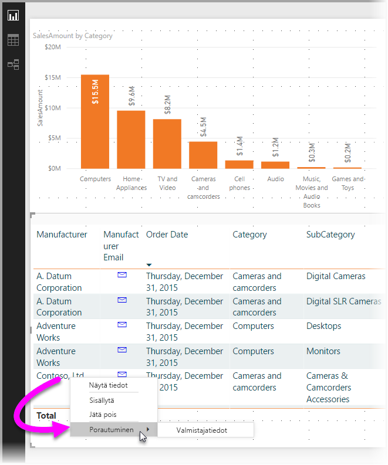

# Porautumisen käyttäminen Power BI Desktopissa
**Power BI Desktopin** **porautumisen** avulla voit luoda raporttisivun, jolla keskitytään tiettyyn entiteettiin, kuten toimittajaan, asiakkaaseen tai valmistajaan. Käyttäjät voivat keskitetyllä raporttisivuilla napsauttaa hiiren kakkospainikkeella arvopistettä toisella raporttisivulla ja porautua keskittyvälle sivulle saadakseen lisätietoja, jotka on suodatettu kyseisen kontekstin mukaisesti.

## Porautumisen käyttö
1. Jos haluat käyttää **porautumista**, luo raporttisivu, jolla on visualisointeja, jotka haluaisit nähdä porautumisen kohde-entiteettityypistä. 

    Esimerkiksi, jos haluat tarjota valmistajille porautumisen, voit luoda porautumissivun, jolla on visualisointeja kokonaismyynnistä, toimitettujen yksiköiden kokonaismääristä, kategoriakohtaisista myynneistä, aluekohtaisista myynneistä ja niin edelleen. Tällä tavoin, kun kyseiselle sivulle poraudutaan, visualisointi on kohdistettu valitsemaasi valmistajaan.

2. Vedä sitten porautumissivulla **visualisointipaneelin** **Kentät-** osiossa se kenttä, josta haluat porautua, **Porautumissuodattimiin**.

    

    Kun lisäät kentän **porautumissuodattimiin**, **Power BI Desktop** luo automaattisesti visualisoinnin *Takaisin*-painikkeelle. Visualisointi muuttuu julkaistuilla raporteilla painikkeeksi, jonka avulla raporttia **Power BI -palvelussa** hyödyntävät käyttäjät voivat palata kätevästi sille raporttisivulle, jolta he tulivat (sivu, jolla he valitsivat porauksen).

    

## Oman kuvan käyttäminen Takaisin-painikkeena    
 Takaisin-painike on kuva, joten voit korvata kuvan millä tahansa haluamallasi kuvalla, ja se toimii silti oikein Takaisin-painikkeena, jolla raportin käyttäjät voivat palata alkuperäiselle sivulle.

1. Valitse **Aloitus**-välilehdestä **Kuva**, etsi haluamasi kuva ja sijoita se porautumissivulle.
2. Valitse uusi kuva Porautuminen-sivulla ja aseta Muotoile kuva -osassa **Linkki**-liukusäädin päällä-asentoon ja valitse **Tyyppi**-asetukseksi **Takaisin**. Kuva toimii nyt Takaisin-painikkeena.

    

    Kun **porautumissivusi** on valmis, ja käyttäjä napsauttaa hiiren kakkospainikkeella sellaista raporttisi arvopistettä, joka käyttää **porautumissuodattimiin** lisäämääsi kenttää, näytölle tulee kontekstivalikko, jonka avulla käyttäjät voivat porautua kyseiselle sivulle.

    

    Kun raportin kuluttaja valitsee porautumisen, sivu suodatetaan näyttämään tietoja hiiren kakkospainikkeella napsautetusta arvopisteestä. Jos käyttäjä esimerkiksi napsauttaa hiiren kakkospainikkeella Contosoa (valmistaja) koskevaa arvopistettä ja valitsee porautumisen, hänet viedään Contosolla suodatetulle porautumissivulle.

## Kaikkien suodattimien siirtäminen porautumisessa

Toukokuun 2018 **Power BI Desktop** -versiosta alkaen voit siirtää kaikki käytetyt suodattimet porautumisikkunaan. Olet ehkä esimerkiksi valinnut vain tietyn tuoteluokan ja kyseiseen luokkaan suodatetut visualisoinnit ja valitset sitten porautumisen. Saatat olla kiinnostunut siitä, miltä porautuminen näyttäisi kaikkien näiden suodattimien ollessa käytössä.

Jos haluat säilyttää kaikki käytetyt suodattimet, aseta **Visualisoinnit**-ruudun **Porautuminen**-osiossa **Siirrä kaikki suodattimet** -vaihtopainike **päälle**. 

Toukokuuta 2018 edeltävissä **Power BI Desktop** -versioissa toiminta vastaa toimintaa siinä tapauksessa, että tämä vaihtopainike on **pois päältä**.

Kun sitten poraudut visualisointiin, voit nähdä, mitkä suodattimet on otettu käyttöön sen seurauksena, että lähdevisualisoinnissa on käytössä tilapäisiä suodattimia. Nämä tilapäiset suodattimet näkyvät porautumisikkunassa kursivoituina. 

Huomaa, että voisit tehdä tämän myös työkaluvihjesivujen tapauksessa, mutta käyttökokemus olisi tällöin outo (työkaluvihjeet eivät näyttäisi toimivan oikein), joten käyttöä työkaluvihjeiden kanssa ei suositella.

## Mittarin lisääminen porautumiseen

Sen lisäksi, että voit siirtää kaikki suodattimet porautumisikkunaan, voit myös lisätä mittarin (tai numeerisen yhteenvetosarakkeen) porautumisalueeseen. Voit ottaa sen käyttöön yksinkertaisesti vetämällä porautumiskentän porautumiskorttiin. 

Kun lisäät mittarin (tai numeerisen yhteenvetosarakkeen), voit porautua sivuun, kun kenttää käytetään visualisoinnin *Arvo*-alueella.

Sen enempää ei tarvita, jotta voit käyttää **porautumista** raporteissasi. Se on erinomainen tapa laajentaa porautumissuodattimeksi valitsemasi entiteetin tietonäkymää.

## Seuraavat vaiheet

Voit olla kiinnostunut myös seuraavista artikkeleista:

* [Osittajien käyttäminen Power BI Desktopissa](desktop-slicers.md)

