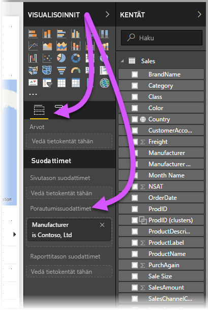
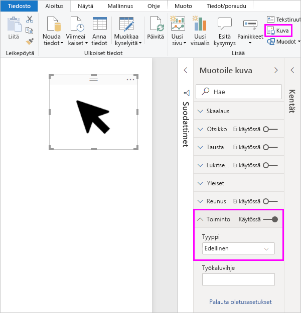
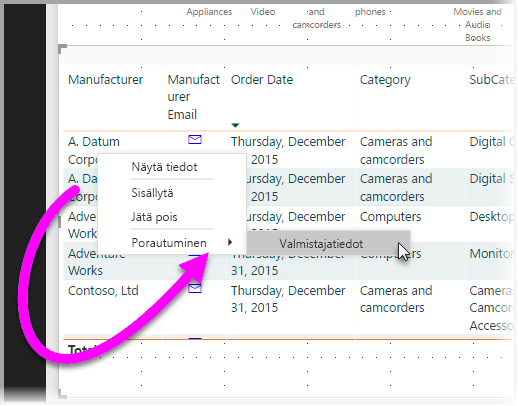
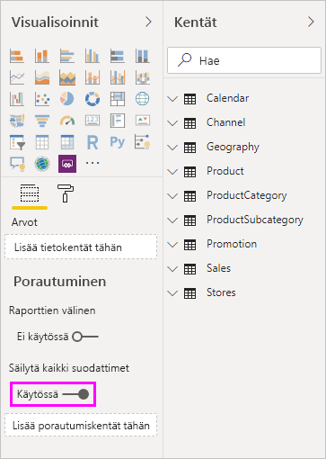
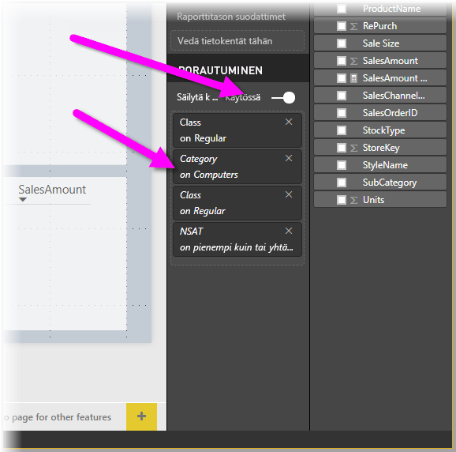
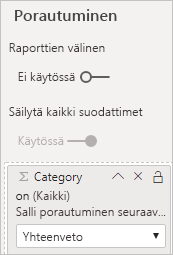

# Porautumisen määrittäminen Power BI -raporteissa
Power BI -raporttien *porautumisen* avulla voit luoda raporttisivun, jolla keskitytään tiettyyn entiteettiin, kuten toimittajaan, asiakkaaseen tai valmistajaan. Kun raporttiesi lukijat käyttävät porautumista, he napsauttavat kakkospainikkeella arvopistettä toisella raporttisivulla ja porautuvat sitten kohdistettuun sivuun. Näin saat lisätietoja, jotka on suodatettu kyseisen kontekstin mukaisesti. Voit myös [luoda painikkeen, joka porautuu](desktop-drill-through-buttons.md) tietoihin, kun lukijat napsauttavat sitä.

Voit määrittää porautumisen raporteissa Power BI Desktopissa tai Power BI -palvelussa.

## Porautumisen kohdesivun määrittäminen
1. Jos haluat käyttää porautumista, luo raporttisivu, jolla on visualisointeja, jotka haluat porautumisen kohde-entiteettityypille. 

    Oletetaan, että haluat tarjota porautumisen esimerkiksi valmistajille. Tässä tapauksessa voit luoda porautumissivun, jolla on visualisointeja kokonaismyynnistä, toimitettujen yksiköiden kokonaismääristä, kategoriakohtaisista myynneistä, aluekohtaisista myynneistä ja niin edelleen. Tällä tavoin, kun kyseiselle sivulle poraudutaan, visualisointi on kohdistettu valitsemaasi valmistajaan.

2. Vedä sitten porautumissivulla **visualisointipaneelin** **Kentät-** osiossa se kenttä, jolle haluat ottaa porautumisen käyttöön, **Porautumissuodattimiin**.

    

    Kun lisäät kentän **porautumissuodattimiin**, Power BI luo automaattisesti visualisoinnin *Takaisin*-painikkeelle. Visualisointi muuttuu painikkeeksi julkaistuissa raporteissa. Käyttäjät, jotka käyttävät raporttiasi Power BI -palvelussa, voivat tämän painikkeen avulla palata raporttisivulle, jolta he tulivat.

    

> [!IMPORTANT]
> Voit määrittää ja suorittaa porautumisen saman raportin sivulle, mutta et voi porautua eri raportin sivulle.  

## Oman kuvan käyttäminen Takaisin-painikkeena    
 Koska Takaisin-painike on kuva, voit korvata kyseisen visualisoinnin kuvan visualisoinnin millä tahansa haluamallasi kuvalla. Se toimii silti oikein Takaisin-painikkeena niin, että raportin käyttäjät voivat palata alkuperäiselle sivulle. 

Jos haluat käyttää itse valitsemaasi kuvaa Takaisin-painikkeena, toimi seuraavasti:

1. Valitse **Aloitus**-välilehdeltä **Kuva**. Etsi haluamasi kuva ja sijoita se porautumissivulle.

2. Valitse uusi kuva porautumissivulla. Aseta **Muotoile kuva** -ruudussa **Toiminto**-liukusäädin asentoon **Käytössä** ja määritä sitten **Tyyppi**-arvoksi **Takaisin**. Kuva toimii nyt Takaisin-painikkeena.

    

    
     Käyttäjät voivat nyt napsauttaa hiiren kakkospainikkeella raporttisi arvopistettä, jolloin avautuu pikavalikko, joka tukee porautumista kyseiselle sivulle. 

    

    Kun raportin käyttäjä valitsee porautumisen, sivu suodatetaan näyttämään tietoja hiiren kakkospainikkeella napsautetusta arvopisteestä. Oletetaan esimerkiksi, että käyttäjä napsauttaa hiiren kakkospainikkeella arvopistettä Contososta (valmistaja) ja valitsee porautumisen. Avautuva porautumissivu on suodatettu näyttämään tietoja Contososta.

## Kaikkien suodattimien siirtäminen porautumisessa

Voit siirtää kaikki käytetyt suodattimet porautumisikkunaan. Voit esimerkiksi valita vain tietyn tuoteluokan ja kyseiseen luokkaan suodatetut visualisoinnit ja valita sitten porautumisen. Saatat olla kiinnostunut siitä, miltä porautuminen näyttäisi kaikkien näiden suodattimien ollessa käytössä.

Jos haluat säilyttää kaikki käytetyt suodattimet, ota **Visualisoinnit**-ruudun **Porautuminen**-osiossa **Säilytä kaikki suodattimet** -asetus **käyttöön**. 

Kun sitten poraudut visualisointiin, voit nähdä, mitkä suodattimet on otettu käyttöön sen seurauksena, että lähdevisualisoinnissa on käytössä tilapäisiä suodattimia. Nämä tilapäiset suodattimet näkyvät **Visualisointi**-ruudun **Porautuminen**-osiossa kursivoituina. 

Voisit tehdä tämän myös työkaluvihjesivuille, mutta käyttö olisi tässä tapauksessa outoa, koska työkaluvihjeet eivät näyttäisi toimivan oikein. Tästä syystä käyttöä työkaluvihjeiden kanssa ei suositella.

## Mittarin lisääminen porautumiseen

Sen lisäksi, että voit siirtää kaikki suodattimet porautumisikkunaan, voit myös lisätä mittarin tai numeerisen yhteenvetosarakkeen porautumisalueeseen. Voit ottaa sen käyttöön vetämällä porautumiskentän **Porautuminen**-korttiin. 

Kun lisäät mittarin tai numeerisen yhteenvetosarakkeen, voit porautua sivuun, kun kenttää käytetään visualisoinnin *Arvo*-alueella.

Tässä oli kaikki, mitä sinun tarvitsee tietää käyttääksesi porautumista raporteissasi. Se on erinomainen tapa laajentaa porautumissuodattimeksi valitsemasi entiteetin tietonäkymää.

## Seuraavat vaiheet

Voit olla kiinnostunut myös seuraavista artikkeleista:

* [Raporttien välillä porautumisen käyttäminen Power BI -raporteissa](desktop-cross-report-drill-through.md)
* [Osittajien käyttäminen Power BI Desktopissa](visuals/power-bi-visualization-slicers.md)

