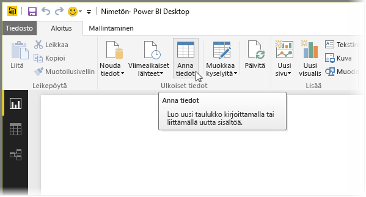
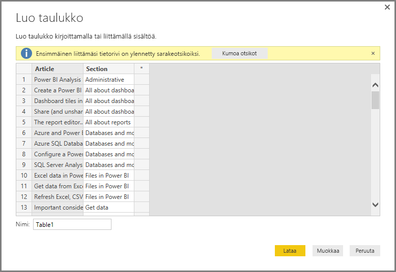

# Tietojen antaminen suoraan Power BI Desktopiin
Power BI Desktopin avulla voit antaa tiedot suoraan ja käyttää kyseisiä tietoja raportteihin ja visualisointeihin. Voit esimerkiksi kopioida osan työkirjasta tai web-sivusta ja sitten liittää sen Power BI Desktopiin.

Voit antaa tietoja suoraan valitsemalla **Anna tiedot** **Koti**-valintanauhasta.

Power BI Desktop saattaa yrittää tehdä pieniä muunnoksia tietoihin samalla tavalla kuin ladattaessa tietoja mistä tahansa lähteestä. Esimerkiksi seuraavassa tapauksessa se nostanut ensimmäisen tietorivin otsikoihin.

Jos haluat muotoilla antamiasi (tai liittämiäsi) tietoja, voit valita Muokkaa-painikkeen ja tuoda esiin **Kyselyeditorin**, jossa voit muotoilla ja muuntaa tietoja ennen niiden tuomista Power BI Desktopiin. Voit myös valita **Lataa**-painikkeen tietojen tuomiseksi sellaisina, kuin ne näkyvät.

Kun valitset **Lataa**, Power BI Desktop luo uuden taulukon tiedoista ja tuo sen käytettäväksi **Kentät** -ruutuun. Seuraavassa kuvassa Power BI Desktop näyttää uuden taulukkoni, jota kutsutaan oletuksena nimellä *Taulukko1* sekä kaksi luotua kenttää kyseisen taulukon sisällä.

Ja siinä kaikki – näin helppoa on tietojen syöttäminen Power BI Desktopiin.

Olet nyt valmis käyttämään Power BI Desktopia visualisointien tai raporttien luomiseen tai vuorovaikutukseen muiden tietojen kanssa, joihin ehkä haluat olla yhteydessä ja joita tuot, kuten Excel-työkirjat, tietokannat tai muut tietolähteet.

### Seuraavat vaiheet
Power BI Desktopin avulla voit muodostaa yhteyden hyvin monenlaisiin tietoihin. Lisätietoja näistä tietolähteistä saat seuraavista resursseista:

* [Power BI Desktopin käytön aloittaminen](desktop-getting-started.md)
* [Power BI Desktopin tietolähteet](desktop-data-sources.md)
* [Tietojen muotoilu ja yhdistäminen Power BI Desktopissa](desktop-shape-and-combine-data.md)
* [Yhteyden muodostaminen Excel-työkirjoihin Power BI Desktopissa](desktop-connect-excel.md)   
* [CSV-tiedostoihin yhdistäminen Power BI Desktopissa](desktop-connect-csv.md)   

