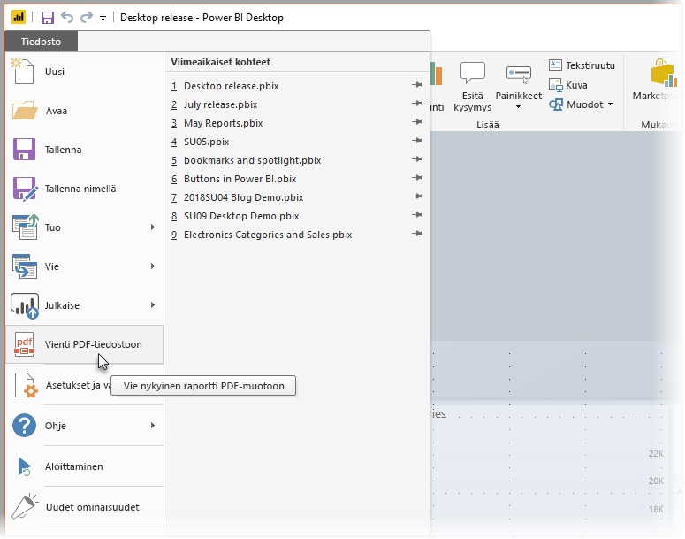
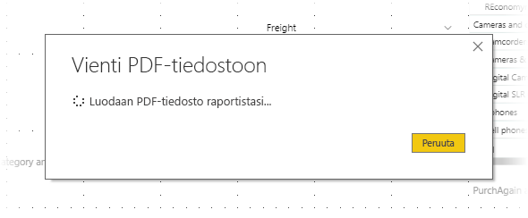

# Raporttien vienti PDF-tiedostoon Power BI Desktopista
**Power BI Desktopissa** voit viedä raportteja PDF-tiedostoon, ja jakaa tai tulostaa näitä raportteja siten helposti tästä PDF-tiedostosta.

Voit viedä raportin helposti **Power BI Desktopista** PDF-tiedostoon, jotta voit tulostaa PDF-raportin tai jakaa tämän PDF-asiakirjan muiden kanssa. Valitse vain **Tiedosto > Vie PDF-tiedostoon** Power BI Desktopista.

Kun valitset **Vie PDF-tiedostoon**, viet raportin kaikki *näkyvät* sivut ja kukin raporttisivu viedään PDF-tiedoston yhdelle sivulle. Raporttisivuja, jotka eivät ole nykyisin näkyvissä, kuten työkaluvihjeet tai piilotetut sivut, ei viedä PDF-tiedostoon. 

Vienti aloitetaan, kun valitset **Tiedosto > Vie PDF-tiedostoon**, ja esiin tulee valintaikkuna, joka näyttää vientiprosessin olevan käynnissä. Valintaikkuna pysyy näytössä, kunnes vientiprosessi on valmis. Vientiprosessin aikana kaikki raporttia koskevat toiminnot on poistettu käytöstä. Ainoa keino käsitellä raporttia on odottaa vientiprosessin päättymistä tai peruuttaa vienti. 

Kun vienti on valmis, PDF-tiedosto ladataan tietokoneen oletusarvoiseen PDF-katseluohjelmaan. 

## Huomioitavat asiat ja rajoitukset
**Vie PDF-tiedostoon** -ominaisuuden osalta on otettava huomioon pari seikkaa:

* **Vie PDF-tiedostoon** -ominaisuus on saatavilla vain **Power BI Desktopissa**, eikä sitä ole tällä hetkellä saatavilla **Power BI -palvelussa**.
* Ominaisuuden avulla voit viedä mukautettuja visualisointeja, mutta *et* taustakuvaa, jota olet ehkä käyttänyt raporttiin.

Koska taustakuvaa ei viedä PDF-tiedostoon, sinun on kiinnitettävä erityistä huomiota raportteihin, jotka käyttävät tummaa taustakuvaa. Jos raportin teksti on vaaleaa tai valkoista, eikä erotu tummasta taustakuvasta, tekstiä voi olla vaikea lukea tai sitä ei voida lukea lainkaan vientiprosessin aikana PDF-tiedostoon, koska taustakuvaa ei viedä raportin muiden osien kanssa. 

## Seuraavat vaiheet
**Power BI Desktopissa** on kaikenlaisia kiinnostavia visuaalisia elementtejä ja ominaisuuksia. Lisätietoja näistä saat seuraavista resursseista:

* [Power BI -raporttien parantaminen visuaalisia elementtejä käyttämällä](desktop-visual-elements-for-reports.md)
* [Mikä on Power BI Desktop?](desktop-what-is-desktop.md)

