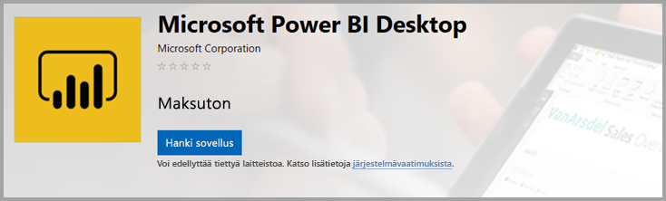
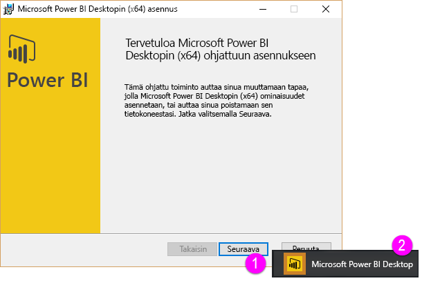
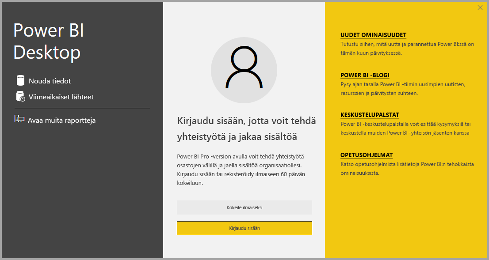

# <a name="get-power-bi-desktop"></a>Power BI Desktopin hankkiminen
Power BI Desktopissa voit luoda tarkempia kyselyjä, malleja ja raportteja, jotka visualisoivat tietoja. Power BI Desktopilla voit luoda tietomalleja ja raportteja sekä jakaa töitäsi julkaisemalla niitä Power BI ‑palvelussa. Power BI Desktop on ladattavissa maksutta.

Voit hankkia Power BI Desktopin kahdella eri tavalla, jotka kuvataan seuraavissa osioissa:

* [Sovelluksen asentaminen Microsoft Storesta](#install-as-an-app-from-the-microsoft-store)
* [Lataaminen suoraan suoritettavana tiedostona, joka asennetaan tietokoneeseen](#download-power-bi-desktop-directly)

Molemmilla tavoilla saat uusimman Power BI Desktop ‑version tietokoneeseesi, mutta tavoissa on joitakin eroja, jotka on syytä huomioida ja jotka kuvataan seuraavissa osioissa.

## <a name="install-as-an-app-from-the-microsoft-store"></a>Sovelluksen asentaminen Microsoft Storesta
Power BI Desktopin uusimman version voi hankkia Microsoft Storesta erilaisilla tavoilla. 

1. Avaa Microsoft Storen **Power BI Desktop** ‑sivu jollakin seuraavista tavoista:

   - Avaa selain ja siirry suoraan Microsoft Storen [Power BI Desktop ‑sivulle](https://aka.ms/pbidesktopstore).

    - Valitse [Power BI -palvelu](https://docs.microsoft.com/power-bi/service-get-started), valitse sitten oikeasta yläkulmasta **Lataa**-kuvake ja valitse **Power BI Desktop**.

      

   - Siirry [Power BI Desktopin tuotesivulle](https://powerbi.microsoft.com/desktop/) ja valitse sitten **Lataa ilmaiseksi**.
  
2. Kun siirryt Microsoft Storen **Power BI Desktop** ‑sivulle, valitse **Asenna**.

     

Power BI Desktopin hankkimisella Microsoft Storesta on joitakin etuja:

* **Automaattiset päivitykset**: Windows lataa uusimman version automaattisesti taustalla heti, kun uusi versio on saatavilla, joten sovellus pysyy aina ajan tasalla.
* **Pienemmät lataukset**: Microsoft Store varmistaa, että koneeseesi ladataan vain ne komponentit, jotka ovat muuttuneet kussakin päivityksessä. Tämä pienentää kunkin päivityksen latauskokoa.
* **Järjestelmänvalvojan oikeuksia ei tarvita**: Kun lataat paketin suoraan ja asennat sen, sinun on oltava järjestelmänvalvoja, jotta asennus voidaan suorittaa. Jos hankit Power BI Desktopin Microsoft Storesta, järjestelmänvalvojan oikeuksia *ei* tarvita.
* **Helpompi käyttöönotto**: Microsoft Store for Businessin kautta voit helpommin *ottaa käyttöön*Power BI Desktopin kaikille organisaatiossasi.

* **Kielen tunnistaminen**: Microsoft Store ‑versio sisältää kaikki tuetut kielet. Lisäksi se tarkastaa tietokoneessasi käytetyn kielen aina, kun sovellus käynnistetään. Sama kielituki vaikuttaa myös Power BI Desktopissa luotavien mallien lokalisointiin. Esimerkiksi sisäiset päivämäärähierarkiat vastaavat kieltä, jota Power BI Desktop käyttää .pbix-tiedoston luontihetkellä.

Ota huomioon seuraavat seikat ja rajoitukset, kun asennat Power BI Desktopin Microsoft Storesta:

* Jos käytät SAP-yhdistintä, sinun täytyy ehkä siirtää SAP-ohjaintiedostot *Windows\System32*-kansioon.
* Kun asennat Power BI Desktopin Microsoft Storesta, käyttäjäasetuksia ei kopioida .exe-versiosta. Sinun täytyy ehkä yhdistää uudelleen viimeisimmät tietolähteet ja antaa tietolähteiden tunnistetiedot uudelleen. 

> [!NOTE]
> Power BI Desktopin Power BI ‑raporttipalvelinversio on erillinen asennus tässä artikkelissa käsiteltyihin versioihin verrattuna. Jos haluat lisätietoja Power BI Desktopin raporttipalvelinversiosta, katso artikkeli [Power BI ‑raportin luominen Power BI ‑raporttipalvelimelle](report-server/quickstart-create-powerbi-report.md).
> 
> 

## <a name="download-power-bi-desktop-directly"></a>Power BI Desktopin lataaminen suoraan
  
  Jos haluat ladata Power BI Desktopin suoritettavan tiedoston Latauskeskuksesta, valitse [Latauskeskuksen](https://www.microsoft.com/download/details.aspx?id=58494) sivulta **Lataa**. Valitse sitten, haluatko ladata 32- vai 64-bittisen asennustiedoston.

  

### <a name="install-power-bi-desktop-after-downloading-it"></a>Power BI Desktopin asentaminen lataamisen jälkeen
Kun asennustiedoston lataus tulee valmiiksi, saat kehotteen suorittaa tiedosto.

Heinäkuun 2019 versiosta alkaen Power BI Desktop toimitetaan yksittäisenä .exe-asennuspakettina, joka sisältää kaikki tuetut kielet. 32- ja 64-bittisille versioille on omat .exe-tiedostonsa. .msi-pakettien julkaisu on lopetettu syyskuun 2019 versiosta alkaen. Sen jälkeen asennus on edellyttänyt .exe-tiedostoa. Tämä lähestymistapa tekee jakelusta, päivityksistä ja asennuksesta (erityisesti järjestelmänvalvojille) paljon helpompaa ja kätevämpää. Voit myös mukauttaa asennusprosessia käyttämällä komentoriviparametreja, jotka on kuvattu kohdassa [Komentorivivalintojen käyttö asennuksen aikana](#using-command-line-options-during-installation).

Kun käynnistät asennuspaketin, Power BI Desktop asennetaan sovelluksena, jonka voit suorittaa työpöydältäsi.



> [!NOTE]
> Power BI Desktopin ladattavan MSI-version (poistettu käytöstä) ja Microsoft Store -version asentamista samaan tietokoneeseen ei tueta. (Tätä kutsutaan joskus *rinnakkaisasennukseksi*.) Poista Power BI Desktopin asennus manuaalisesti, ennen kuin lataat sen Microsoft Storesta.
> 

## <a name="using-power-bi-desktop"></a>Power BI Desktopin käyttäminen
Kun käynnistät Power BI Desktopin, näytölle avautuu aloitusnäkymä.



Jos käytät Power BI Desktopia ensimmäistä kertaa (eli asennus ei ole päivitys), sinua kehotetaan täyttämään lomake tai kirjautumaan sisään Power BI -palveluun, ennen kuin voit jatkaa.

Tämän jälkeen voit aloittaa tietomallien ja raporttien luomisen sekä niiden jakamisen muiden kanssa Power BI -palvelussa. [Seuraavat vaiheet](#next-steps) ‑osiossa annetaan linkkejä oppaisiin, joiden avulla pääset alkuun Power BI Desktopin käyttämisessä.

## <a name="minimum-requirements"></a>Vähimmäisvaatimukset
Alla on lueteltu Power BI Desktopin käytön vähimmäisvaatimukset:

* Tarvitset Windows 7:n tai Windows Server 2008 R2:n tai tätä uudemman käyttöjärjestelmän.
* Tarvitset .NET 4.5:n.
* Tarvitset Internet Explorer 10:n tai tätä uudemman selaimen.
* Muistia (RAM): vapaata muistia täytyy olla vähintään 1 Gt, suositus on kuitenkin vähintään 1,5 Gt.
* Näyttö: näytön tarkkuuden täytyy olla vähintään 1 440 x 900, suositus on 1 600 x 900 (16:9). Pienempiä näyttötarkkuuksia (esimerkiksi 1 024 x 768 tai 1 280 x 800) ei suositella, koska jotkin ohjausobjektit (esimerkiksi aloitusnäytön sulkemistoiminto) eivät näy kunnolla niillä.
* Windowsin näyttöasetukset: Jos määrität näyttöasetuksesi siten, että tekstin, sovellusten tai muiden kohteiden koko on yli 100 %, et ehkä näe kaikkia valintaikkunoita, joissa sinun on päästävä toimimaan voidaksesi jatkaa Power BI Desktopin käyttöä. Jos kohtaat tämän ongelman, tarkista Windowsin näyttöasetukset valitsemalla **Asetukset** > **Järjestelmä** > **Näyttö** ja palauta näyttökoon asetus sataan prosenttiin liukusäätimellä.
* Suoritin: suosittelemme vähintään yhden gigahertsin (GHz) 32- tai 64-bittistä x86-suoritinta tai tätä nopeampaa suoritinta.

## <a name="considerations-and-limitations"></a>Huomioitavat asiat ja rajoitukset

Haluamme, että Power BI Desktopin käyttökokemuksesi on erinomainen. Saatat joskus kohdata ongelmia Power BI Desktopissa, joten tässä osiossa esitetään ratkaisuja tai ehdotuksia mahdollisten ongelmien selvittämiseksi. 

### <a name="using-command-line-options-during-installation"></a>Komentorivivalintojen käyttö asennuksen aikana 

Kun asennat Power BI Desktopin, voit määrittää ominaisuuksia ja asetuksia komentorivivalintojen avulla. Näistä asetuksista on hyötyä erityisesti järjestelmänvalvojille, jotka hallitsevat tai helpottavat Power BI Desktop ‑asennusta koko organisaatiossa. Nämä asetukset koskevat .msi- ja .exe-asennuksia. 


|Komentorivivalinta  |Toiminta  |
|---------|---------|
|-q, -quiet, -s, -silent     |Hiljainen asennus         |
|-passive     |Näytä edistymispalkki vain asennuksen aikana         |
|-norestart     |Jätä pois tietokoneen uudelleenkäynnistysvaatimus         |
|-forcerestart     |Käynnistä tietokone uudelleen asennuksen jälkeen ilman kehotetta         |
|-promptrestart     |Esitä käyttäjälle kehote, jos tietokone on käynnistettävä uudelleen (oletus)         |
|-l<>, -log<>     |Kirjaa asennus tiettyyn lokitiedostoon, tiedosto määritetään kulmasulkeisiin <>         |
|-uninstall     |Poista Power BI Desktopin asennus         |
|-repair     |Korjaa asennus (tai asenna, jos sovellus ei ole tällä hetkellä asennettuna)         |
|-package, -update     |Asenna Power BI Desktop (oletus, kunhan vaihtoehtoa -uninstall tai -repair ei ole määritetty)         |

Voit myös käyttää seuraavia syntaksiparametreja, jotka on määritetty syntaksilla *ominaisuus = arvo*:

|Parametri  |Merkitys  |
|---------|---------|
|ACCEPT_EULA     |Käyttöoikeussopimuksen automaattinen hyväksyminen edellyttää arvoa 1         |
|ENABLECXP     |Arvo 1 rekisteröi asiakkaan käyttömukavuusohjelman, joka tallentaa telemetriatiedot tuotteen käytöstä.         |
|INSTALLDESKTOPSHORTCUT     |Arvo 1 lisää pikakuvakkeen työpöydälle.         |
|INSTALLLOCATION     |Tiedostopolku, johon haluat asentaa         |
|LANGUAGE     |Kieliasetuksen koodi (esimerkiksi en-US, de-DE, pr-BR), joka pakottaa käyttöön sovelluksen oletuskielen. Jos et määritä kieltä, Power BI Desktop näytetään Windows-käyttöjärjestelmän kielellä. Voit muuttaa tätä asetusta **Asetukset**-valintaikkunasta.         |
|REG_SHOWLEADGENDIALOG     |Arvo 0 poistaa käytöstä valintaikkunan, joka näytetään ennen kuin olet kirjautunut Power BI Desktopiin.         |
|DISABLE_UPDATE_NOTIFICATION     |Arvo 1 poistaa päivitysilmoitukset käytöstä.         |


Voit esimerkiksi suorittaa Power BI Desktopin seuraavilla asetuksilla ja parametreilla, jolloin asennus suoritetaan ilman käyttöliittymää ja saksan kielellä: 

```-quiet LANG=de-DE ACCEPT_EULA=1```

### <a name="installing-power-bi-desktop-on-remote-machines"></a>Power BI Desktopin asentaminen etätietokoneisiin

Jos otat Power BI Desktopin käyttöön käyttäjillesi työkalulla, joka edellyttää Windows-asennustiedostoa (.msi-tiedosto), voit purkaa .msi-tiedoston Power BI Desktopin .exe-asennustiedostosta. Käytä kolmannen osapuolen työkalua, esimerkiksi WiX Toolset ‑työkalua.

> [!NOTE]
> WiX Toolset on kolmannen osapuolen työkalu, minkä vuoksi vaihtoehdot voivat muuttua ilman erillistä ilmoitusta. Tarkista työkalun ohjeista ajantasaiset tiedot ja pyydä tarvittaessa apua työkalun käyttäjien postituslistalta.

1. Asenna [WiX Toolsetin](https://wixtoolset.org/) uusin versio tietokoneelle, johon latasit Power BI Desktopin asennusohjelman.
2. Avaa komentorivi-ikkuna järjestelmänvalvojana ja siirry kansioon, johon asensit WiX Toolset ‑työkalun.
3. Suorita seuraava komento: 
    
    ```Dark.exe <path to Power BI Desktop installer> -x <output folder>```

    Esimerkki:

    ``` Dark.exe C:\PBIDesktop_x64.exe -x C:\output```

    Kohdekansiossa on kansio nimeltä *AttachedContainer*, joka sisältää .msi-tiedostot.

Asennuksen päivitystä .exe-tiedostosta .msi tiedostoksi, joka on poimittu exe-tiedostosta, ei tueta.   Tämän päivityksen tekeminen edellyttää, että poistat vanhan Power BI Desktop -version asennuksen.

### <a name="issues-when-using-previous-releases-of-power-bi-desktop"></a>Ongelmia Power BI Desktopin aiempia versioita käytettäessä

Jotkin käyttäjät saattavat kohdata seuraavanlaisen virheilmoituksen käyttäessään vanhentunutta versiota Power BI Desktopista: 

*Tallennettua tietokantaa ei voitu palauttaa malliin* 

Power BI Desktopin päivitys nykyisen versioon ratkaisee yleensä ongelman.

### <a name="disabling-notifications"></a>Ilmoitusten poistaminen käytöstä
Suosittelemme päivittämään Power BI Desktopin uusimpaan versioon ominaisuuksiin, suorituskykyyn ja vakauteen tehtyjen parannusten ja muiden parannusten hyödyntämiseksi. Jotkin organisaatiot ei ehkä halua käyttäjien päivittävän jokaiseen uuteen versioon. Voit poistaa ilmoitukset käytöstä muokkaamalla rekisteriä seuraavien ohjeiden mukaisesti:

1. Siirry Rekisterieditorissa avaimeen **HKEY_LOCAL_MACHINE\SOFTWARE\Microsoft\Microsoft Power BI Desktop**.
2. Luo avaimeen uusi **REG_DWORD**-kirjaus käyttäen seuraavaa nimeä: **DisableUpdateNotification**.
3. Määritä uuden merkinnän arvoksi **1**.
4. Käynnistä tietokone uudelleen, jotta muutos tulee voimaan.

### <a name="power-bi-desktop-loads-with-a-partial-screen"></a>Power BI Desktopista latautuu osittainen näyttö

Joissakin tilanteissa, kuten tiettyjen näytön tarkkuusmääritysten yhteydessä, Power BI Desktop saattaa hahmontaa sisältöä joillekin käyttäjille siten, että siinä näkyy laajoja mustia alueita. Ongelma johtuu yleensä viimeaikaisista käyttöjärjestelmän päivityksistä, jotka vaikuttavat kohteiden esitystapaan, sen sijaan, että kyseessä olisi Power BI Desktopin sisällön esitystavan suora tulos. Voit korjata ongelman seuraavasti:

1. Paina **aloitusnäppäintä** ja kirjoita näkyviin tulevaan hakupalkkiin sana *sumea*.
2. Valitse avautuvassa valintaikkunassa seuraava vaihtoehto: **Anna Windowsin korjata sumeat sovellukset.**
3. Käynnistä Power BI Desktop uudelleen.

Ongelma saattaa ratketa seuraavien Windowsin päivitysten julkaisun yhteydessä. 
 

## <a name="next-steps"></a>Seuraavat vaiheet
Kun olet asentanut Power BI Desktopin, seuraavien sisältöjen avulla voit aloittaa sen käytön nopeasti:

* [Mikä on Power BI Desktop?](desktop-what-is-desktop.md)
* [Kyselyn yleiskatsaus Power BI Desktopissa](desktop-query-overview.md)
* [Power BI Desktopin tietolähteet](desktop-data-sources.md)
* [Tietoihin yhdistäminen Power BI Desktopissa](desktop-connect-to-data.md)
* [Tietojen muotoilu ja yhdistäminen Power BI Desktopissa](desktop-shape-and-combine-data.md)
* [Yleiset kyselytehtävät Power BI Desktopissa](desktop-common-query-tasks.md)   

