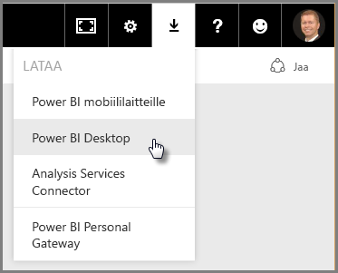
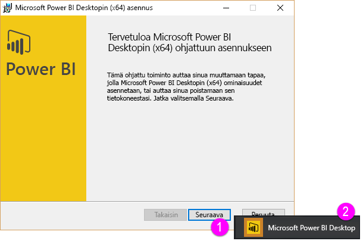
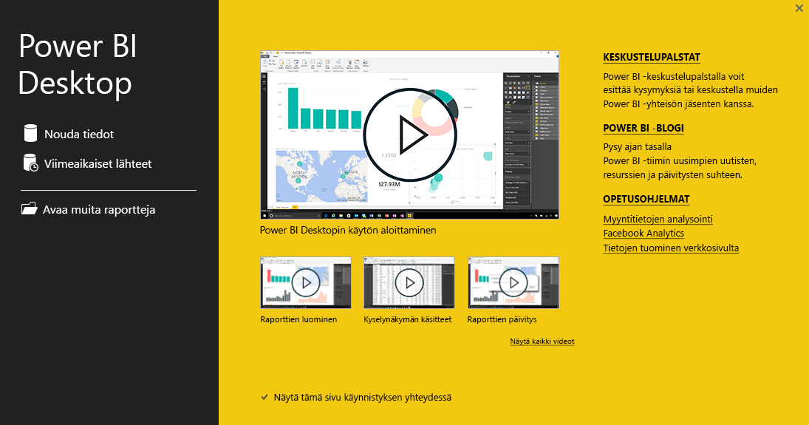
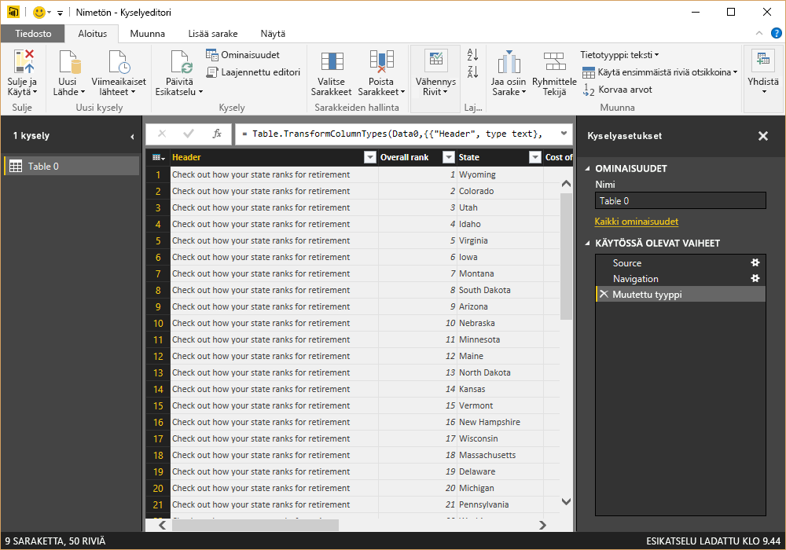
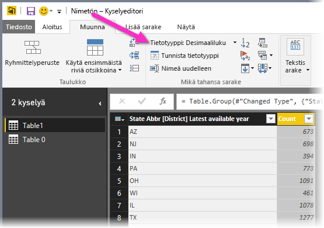
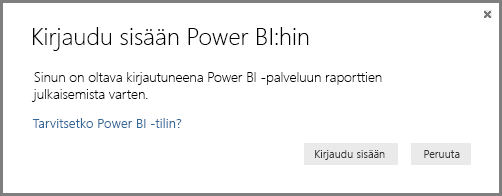

# Power BI Desktopin käytön aloittaminen
Tervetuloa **Power BI Desktopin aloitusoppaaseen**. Tässä lyhyessä esittelyssä kerrotaan, miten Power BI Desktop toimii ja mitä sillä voi tehdä, ja autetaan sinua rakentamaan tehokkaita tietomalleja ja upeita raportteja, jotka vahvistavat liiketoimintatietojasi. 

Katsotko mieluummin lukemisen sijaan? Voit myös [tutustua aloitusvideoomme](desktop-videos.md). Jos haluat seurata videota vastaavilla mallitiedoilla, voit [ladata tämän Excel-mallityökirjan](http://go.microsoft.com/fwlink/?LinkID=521962).

Power BI Desktopin avulla voit luoda kyselykokoelmia, tietoyhteyksiä ja raportteja, jotka on helppo jakaa muiden kanssa. Power BI Desktopissa yhdistyvät Microsoftin taatut tekniikat – tehokas kyselyohjelma, tietomallinnus ja visualisoinnit – ja se toimii saumattomasti [**Power BI -palvelun**](https://app.powerbi.com/) verkkoversion kanssa.

Yhdessä **Power BI Desktop** (jossa analyytikot ym. voivat luoda tehokkaita tietoyhteyksiä, malleja ja raportteja) ja [**Power BI -palvelu**](https://preview.powerbi.com/) (jossa Power BI Desktopin raportit voidaan jakaa, jotta käyttäjät voivat tarkastella ja ja käyttää niitä) tarjoavat uusia merkityksellisiä tietoja, jotka on helpompi mallintaa, rakentaa, jakaa ja laajentaa.

Tietoanalyytikot tulevat huomaamaan, että Power BI Desktop on tehokas, joustava ja erittäin helppo työkalu käyttää, mallintaa tietoja, rakentaa tehokkaita tietomalleja ja luoda hyvin jäsenneltyjä raportteja.

## Tämän oppaan käyttäminen
Voit käyttää tätä opasta muutamalla eri tavalla – voit selailla sitä nopeasti tai lukea läpi jokaisen osan, jolloin saat vahvan käsityksen siitä, miten Power BI Desktop toimii.

Jos sinulla on kiire, voit silmäillä oppaan läpi muutamassa minuutissa ja silti saada hyvän kuvan siitä, miten Power BI Desktop toimii ja miten sitä käytetään. Suurin osa tästä oppaasta koostuu näytöistä, jotka kertovat, miten Power BI Desktop toimii.

Jos haluat kattavamman käsityksen, voit lukea jokaisen osan, noudattaa vaiheita ja lopuksi julkaista itse luomasi Power BI Desktop -tiedoston **Power BI** -palveluun ja jakaa sen muiden kanssa.

>[!NOTE]
>**Power BI:stä** on myös erillinen erikoisversio, [**Power BI -raporttipalvelin**](report-server/get-started.md), joka on tarkoitettu asiakkaille, joiden tietoja ja raportteja on säilytettävä paikallisesti. **Power BI Desktopista** on myös saatavilla erillinen erikoisversio, **Power BI Desktop Power BI -raporttipalvelimelle**, joka toimii ainoastaan Power BI:n raporttipalvelinversion kanssa. Tämä artikkeli käsittelee **Power BI Desktopin** perusversiota.

## Näin Power BI Desktop toimii
Power BI Desktopin avulla voit *yhdistää tietoihin* (yleensä useita tietolähteitä), *muotoilla niitä* (kyselyillä, jotka luovat oivaltavia ja vakuuttavia tietomalleja) ja käyttää mallia *raporttien luomiseen* (muut voivat hyödyntää, käyttää pohjana ja jakaa raportteja).

Kun olet suorittanut vaiheet eli yhdistämisen, muotoilun ja raportoinnin, voit tallentaa työsi Power BI Desktopin .pbix-tiedostomuodossa. Power BI Desktop -tiedostoja voi jakaa minkä tahansa muun tiedoston tapaan, mutta paras tapa on ladata (jakaa) ne [**Power BI -palveluun**](https://preview.powerbi.com/). 

Power BI Desktop keskittää, yksinkertaistaa, tehostaa ja nopeuttaa muutoin hajaantunutta, irrallista ja hankalaa liiketoimintatietojen säilöjen ja raporttien suunnittelu- ja luontiprosessia.

Oletko valmis kokeilemaan? Aloitetaanpa.

## Power BI Desktopin asentaminen ja suorittaminen
Voit ladata Power BI Desktopin **Power BI** -palvelusta valitsemalla **ratas**kuvakkeen ja sitten **Power BI Desktop**.

Power BI Desktop asennetaan sovelluksena, jonka voit suorittaa työpöydältäsi.

Kun käynnistät Power BI Desktopin, näyttöön avautuu *Tervetuloa*-näyttö.

Voit **noutaa tiedot**, katsoa **viimeaikaiset lähteet** tai **avata muita** **raportteja** suoraan *Tervetuloa*-näytössä (vasemmanpuoleisen ruudun linkeistä). Jos suljet näytön (valitse **x** ikkunan oikeassa yläkulmassa), Power BI Desktopin **Raportti**-näkymä avautuu.

Power BI Desktopissa on kolme näkymää: **Raportti**-, **Tiedot**- ja **Suhteet**-näkymät. Power BI Desktop sisältää myös **kyselyeditorin**, joka avautuu erilliseen ikkunaan. **Kyselyeditorissa** voit laatia kyselyjä, muuntaa tietoja, ladata sitten tarkennetun tietomallin Power BI Desktopiin ja luoda raportteja.

Power BI Desktopin vasemmassa reunassa on kolme näkymäkuvaketta, jotka näkyvät seuraavassa ruudussa: ylhäältä alaspäin ne ovat **Raportti**, **Tiedot** ja **Suhteet**. Keltainen palkki vasemmalla on merkki parhaillaan käytössä olevasta näkymästä. Tässä tapauksessa **Raportti**-näkymä on käytössä. Voit vaihtaa näkymää valitsemalla minkä tahansa kolmesta kuvakkeesta.

Kun Power BI Desktop on asennettu, voit muodostaa yhteyden tietoihin, muotoilla niitä ja luoda raportteja (yleensä juuri tässä järjestyksessä). Seuraavissa osissa esittelemme jokaisen vaiheen erikseen.

## Tietoihin yhdistäminen
Kun Power BI Desktop on asennettu, olet valmis muodostamaan yhteyden alati laajenevaan tietomaailmaan. Kyselyikkunassa on käytettävissä *kaikenlaisia* tietolähteitä. Seuraavassa kuvassa näytetään, miten voit yhdistää tietoihin, valitsemalla **Aloitus**-valintanauhan ja sitten **Nouda tiedot \> Lisää**.

 

Tätä pikaesittelyä varten yhdistämme muutamaan eri **verkko**tietolähteeseen.

Kuvittele olevasi jäämässä eläkkeelle; haluat elää paikassa, jossa paistaa aurinko ja jossa on suotuisampi verotus ja hyvä terveydenhuolto. Tai ehkä olet tietoanalyytikko ja haluat auttaa näillä tiedoilla asiakkaitasi. Saatat esimerkiksi haluta auttaa aurinkolasien jälleenmyyjääsi kohdistamaan myynti sellaisille alueille, joilla aurinko paistaa eniten.

Joka tapauksessa seuraava verkkoresurssi sisältää kiinnostavaa tietoa näistä ja muista aiheista:

[*http://www.bankrate.com/finance/retirement/best-places-retire-how-state-ranks.aspx*](http://www.bankrate.com/finance/retirement/best-places-retire-how-state-ranks.aspx)

Valitse **Nouda tiedot \> Verkko**  ja liitä osoite.

 

Kun valitset **OK**, Power BI Desktopin **Kysely**-toiminto käynnistyy. Kysely muodostaa yhteyden verkkoresurssiin, ja **Siirtymistoiminnon** ikkuna palauttaa verkkosivulta löydetyn sisällön. Tässä tapauksessa se löysi taulukon (*Table 0*) ja yleisen verkkoasiakirjan. Meitä kiinnostaa taulukko, joten valitsemme sen luettelosta. **Siirtymistoiminnon** ikkuna näyttää esikatselun.

 

Tässä vaiheessa voimme muokata kyselyä ennen taulukon lataamista valitsemalla ikkunan alareunassa **Muokkaa** tai voimme ladata taulukon.

Kun valitsemme **Muokkaa**, kyselyeditori käynnistyy ja tyypillinen taulukkonäkymä näytetään. **Kyselyasetukset**-ruutu avautuu (jos ei, valitse valintanauhassa **Näytä** ja avaa **Kyselyasetukset**-ruutu valitsemalla **Näytä \> kyselyasetukset**). Se näyttää tältä.

 

Lisätietoa tietoihin yhdistämisestä on ohjeartikkelissa [Tietoihin yhdistäminen Power BI Desktopissa](desktop-connect-to-data.md).

> [!NOTE]
> Tässä artikkelissa mainitut taulukkotiedot saattavat muuttua ajan myötä. Näin ollen suoritettavat toimenpiteet saattavat erota seuraavaksi mainittavista. Sinun on siis oltava luova toimenpiteiden ja tulosten suhteen, mutta sehän vain tekee oppimisesta hauskempaa. 

Seuraavassa osassa muokkaamme tietoja tarpeittemme mukaan. Yhdistettyjen tietojen muokkaamista kutsutaan tietojen *muotoilemiseksi*.

## Tietojen muotoileminen ja yhdistäminen
Nyt kun tietolähde on yhdistetty, meidän on muokattava tietoja tarpeittemme mukaan. Joskus muokkaaminen tarkoittaa tietojen *muuntamista*, kuten sarakkeiden tai taulukoiden nimeämistä uudelleen, tekstin muuntamista numeroiksi, rivien poistamista, ensimmäisen rivin määrittämistä otsikoiksi ja niin edelleen.

Power BI Desktopin kyselyeditorissa käytetään runsaasti hiiren kakkospainikkeella avattavien valikoiden toimintoja sekä valintanauhan toimintoja. Useimmat toiminnot, jotka ovat valittavissa **Muunna**-valintanauhassa, ovat käytettävissä myös napsauttamalla kohdetta (esimerkiksi saraketta) hiiren kakkospainikkeella ja valitsemalla sitten toiminto näyttöön avautuvasta valikosta.

## Tietojen muotoileminen
Kun muotoilet tietoja **kyselyeditorissa**, annat vaiheittaiset ohjeet (jotka **kyselyeditori** toteuttaa puolestasi) tietojen muokkaamiseksi, kun **kyselyeditori** lataa ja näyttää tiedot. Tämä ei vaikuta alkuperäiseen tietolähteeseen, sillä vain tätä tietonäkymää muokataan eli *muotoillaan*.

Määrittämäsi vaiheet (esimerkiksi taulukon nimeäminen uudelleen, tietotyypin muuntaminen tai sarakkeiden poistaminen) kirjataan **kyselyeditoriin**. Nämä vaiheet suoritetaan sitten aina, kun kysely muodostaa yhteyden tietolähteeseen, jotta tiedot muotoillaan aina määrittämälläsi tavalla. Tämä prosessi suoritetaan aina, kun käytät Power BI Desktopin kyselyä tai kun joku käyttää jaettua kyselyäsi esimerkiksi **Power BI** -palvelussa. Vaiheet kirjataan järjestyksessä **Kyselyasetukset**-ruudun **Käytössä olevat vaiheet** -kohtaan.

Seuraavasta kuvasta näet **Kyselyasetukset**-ruudun kyselylle, jota on muotoiltu. Käymme läpi kaikki nämä vaiheet seuraavissa kappaleissa.

 

Palataan eläketietoihin, jotka löysimme yhdistämämme verkkotietolähteen kautta, ja muotoillaan ne tarpeittemme mukaan.

Ensinnäkin useimmat luokitukset tuotiin **kyselyeditoriin** kokonaislukuina, mutta eivät kaikki (yksi sarake sisälsi tekstiä ja numeroita, joten sitä ei muunnettu automaattisesti). Tietojen on oltava numeroita. Voit vaihtaa tietotyypin helposti napsauttamalla vain hiiren kakkospainikkeella sarakkeen otsikkoa ja valitsemalla **Muuta tyyppi \> Kokonaisluku**. Jos haluamme valita useita sarakkeita, valitsemme ensimmäisen sarakkeen, painamme **VAIHTO**-näppäimen pohjaan, valitsemme vierekkäisiä sarakkeita ja vaihdamme sitten kaikki valitut sarakkeet napsauttamalla hiiren kakkospainikkeella jotain valittua sarakeotsikkoa. Voit valita muita kuin vierekkäisiä sarakkeita myös **CTRL**-painikkeella.

 

Voit myös muuttaa tai *muuntaa* nämä sarakkeet tekstistä otsikoksi **Muunna**-valintanauhan avulla. Tässä on **Muunna**-valintanauha, jossa on **Tietotyyppi**-painikkeeseen osoittava nuoli. Tällä painikkeella voit muuntaa tietotyypin toiseksi.

 

Huomaa, että **Kyselyasetukset**-kohdan **Käytössä olevat vaiheet** kuvastavat tehtyjä muutoksia. Jos haluan poistaa vaiheen muotoiluprosessista, valitsen haluamani vaiheen vasemmalta puolelta **X**.

 

Meidän on vielä tehtävä pari muuta muutosta, jotta kyselystä tulee sellainen kuin haluamme:

* *Poistetaan ensimmäinen sarake* – emme tarvitse sitä, sillä se sisältää vain ylimääräisiä rivejä, joissa sanotaan ”Katso, miten osavaltiosi sijoittuu eläkeasioissa”, joka on verkkopohjaisen taulukon artefakti.

<!-- -->

* *Korjataan muutama virhe* – verkkosivulla yhdessä sarakkeessa oli sekaisin tekstiä ja numeroita (jotkin osavaltiot liitetty yhteen luokkaan). Se toimii hyvin sivustossa, mutta ei meidän tietoanalyysissamme. Tämä on helppo korjata (tässä tapauksessa) ja osoittaa **kyselyeditorin** ja sen **käytössä olevien vaiheiden** joitakin hienoja ominaisuuksia ja toimintoja.

<!-- -->

* *Vaihdetaan taulukon nimi* – **Table 0** ei ole hyödyllinen kuvaus, mutta nimen vaihtaminen on helppoa.

Jokainen näistä vaiheista esitellään ohjeartikkelissa **[Tietojen muotoilu ja yhdistäminen Power BI Desktopissa](desktop-shape-and-combine-data.md)** . Tutustu vapaasti kyseiseen sivuun tai jatka tämän oppaan seuraamista ja katso seuraavat vaiheet. Seuraavassa osassa jatketaan siitä, kun edellä mainitut muutokset on otettu käyttöön.

## Tietojen yhdistäminen
Nämä tiedot eri osavaltioista ovat mielenkiintoisia. Niistä on myös hyötyä muidenkin analyysien ja kyselyiden luomisessa. Tässä on kuitenkin yksi ongelma: suurin osa saatavilla olevista tiedoista käyttää kaksikirjaimisia osavaltiolyhenteitä, ei osavaltioiden koko nimiä. Meidän täytyy siis yhdistää osavaltioiden nimet ja niiden lyhenteet.

Meillä on kuitenkin onnea, sillä eräs toinen julkinen tietolähde tekee juuri tämän, mutta sen tiedot vaativat suhteellisen paljon muotoilua, ennen kuin voimme yhdistää ne tähän eläköitymistaulukkoomme. Tässä on osavaltiolyhenteiden verkkoresurssi:

<http://en.wikipedia.org/wiki/List_of_U.S._state_abbreviations>

Valitaan **kyselyeditorin** **Aloitus**-valintanauhasta **Nouda tiedot \> Verkko** ja kirjoitetaan osoite ja valitaan **OK**. Sen jälkeen **Siirtymistoiminnon** ikkuna näyttää verkkosivulta löydetyn sisällön.

 

Valitse **Taulukko[muokkaa]** , koska se sisältää haluamamme tiedot. Niitä täytyy kuitenkin muotoilla melko paljon, ennen kuin voimme yhdistää taulukon tiedot. Jokainen näistä vaiheista esitellään ohjeartikkelissa **[Tietojen muotoilu ja yhdistäminen Power BI Desktopissa](desktop-shape-and-combine-data.md)** . Yhteenveto mainituista vaiheista on seuraava:

Valitaan **Muokkaa** ja sitten:

* *Poistetaan kaksi ylintä riviä* – ne ovat seurausta tavasta, jolla verkkosivun taulukko on luotu, emmekä tarvitse niitä.

<!-- -->

* *Poistetaan alimmat 26 riviä* – ne ovat kaikki alueita, joita meidän ei tarvitse sisällyttää.

<!-- -->
* *Poissuljetaan Washington DC* – eläköitymistilastojen taulukko ei sisällä Washington DC:tä, joten suljemme sen pois luettelostamme.

<!-- -->

* *Poistetaan muutamat tarpeettomat sarakkeet* – meidän täytyy yhdistää vain osavaltio sen viralliseen kaksikirjaimiseen lyhenteeseen, joten voimme poistaa muut sarakkeet.

<!-- -->

* *Käytetään ensimmäistä riviä otsikkona* – koska poistimme kolme ylintä riviä, nykyinen ylin rivi on haluamamme otsikkorivi.

    >[!NOTE]
    >Tämä on hyvä hetki huomauttaa, että **kyselyeditorissa** käytössä olevien vaiheiden *järjestys* on tärkeä. Se voi myös vaikuttaa tietojen muotoiluun. On tärkeää huomioida se, miten yksi vaihe voi vaikuttaa toiseen myöhempään vaiheeseen. Jos poistat vaiheen **käytössä olevista vaiheista**, myöhemmät vaiheet eivät ehkä toimi niin kuin alun perin tarkoitit, koska vaiheen poistaminen kyselyn vaihejärjestyksestä vaikuttaa muihin vaiheisiin.

* *Nimetään sarakkeet ja itse taulukko uudelleen* – tuttuun tapaan sarakkeen voi nimetä uudelleen muutamalla eri tavalla, ja voit valita itsellesi mieluisimman tavan.

Nyt kun olemme muotoilleet *StateCodes*-taulukon, voimme yhdistää nämä kaksi taulukkoa (tai kyselyä) yhdeksi. Koska taulukot, jotka meillä nyt ovat, ovat tulos kyselyistä, jotka suoritimme tiedoille, niitä kutsutaan usein *kyselyiksi*.

Kyselyitä voi yhdistää kahdella tavalla: *yhdistämällä* tai *loppuun liittämällä*.

Jos sinulla on sarake tai sarakkeita, jonka tai jotka haluat lisätä toiseen kyselyyn, **yhdistä** kyselyt. Jos sinulla on lisärivejä tietoja, jotka haluat lisätä olemassa olevaan kyselyyn, **liitä ne kyselyn loppuun**.

Tässä tapauksessa haluamme yhdistää kyselyt. Aloitetaan valitsemalla kysely, *johon* haluamme yhdistää toisen kyselyn, ja valitaan sen jälkeen valintanauhan **Aloitus**-välilehdessä **Yhdistä kyselyt**.

 

Seuraavaksi näyttöön avautuu **Yhdistä**-ikkuna, jossa kysytään, minkä taulukon haluamme yhdistää valittuun taulukkoon ja pyydetään myös määrittämään yhdistämisen vastaavat sarakkeet. Valitse *RetirementStats*-taulukosta (kysely) *State*-sarake ja valitse sitten *StateCodes*-kysely (tämä on tässä tapauksessa helppoa, koska muita kyselyitä on vain yksi, mutta kun yhdistettynä on useita tietolähteitä, valittavissa olevia kyselyitä on paljon). Kun valitsemme oikeat vastaavat sarakkeet (*State*-sarake *RetirementStats*-taulukosta ja *State Name* -sarake *StateCodes*-taulukosta), **Yhdistä**-ikkuna näyttää seuraavanlaiselta. Myös **OK**-painike on käytettävissä.

 

Kyselyn loppuun luodaan **NewColumn**, joka sisältää sen taulukon (kyselyn) sisällön, joka yhdistettiin olemassa olevaan kyselyyn. Kaikki yhdistetyn kyselyn sarakkeet tiivistetään **NewColumn**-sarakkeeseen, mutta voit **laajentaa** taulukon ja sisällyttää haluamasi sarakkeet. Jos haluat laajentaa yhdistetyn taulukon ja valita sisällytettävät sarakkeet, valitse laajennuskuvake (). Näyttöön avautuu **Laajenna**-ikkuna.

 

Tässä tapauksessa haluamme vain *State Code* -sarakkeen, joten valitsemme sen ja sitten **OK**. Poistamme **Käytä alkuperäisen sarakkeen nimeä etuliitteenä** -valintaruudun valinnan, koska emme tarvitse tai halua sitä. Jos jätämme tämän valituksi, yhdistetyn sarakkeen nimi olisi *NewColumn.State Code* (alkuperäisen sarakkeen nimi eli *NewColumn*, sitten piste ja kyselyyn tuodun sarakkeen nimi).

>[!NOTE]
>Haluatko kokeilla eri tapoja tuoda tämä *NewColumn*-taulukko? Voit kokeilla eri tapoja. Jos et pidä tuloksista, poista kyseinen vaihe **Kyselyasetukset**-ruudun **käytössä olevien vaiheiden** luettelosta. Tämä palauttaa kyselysi tilaan, jossa se oli ennen tätä **laajennusvaihetta**. Voit siis kokeilla eri tapoja vapaasti niin monta kertaa kuin haluat, kunnes saat laajennusprosessista haluamasi kaltaisen.

Nyt meillä on yksi kysely (taulukko), joka yhdistää kaksi tietolähdettä, jotka kummatkin on muotoiltu tarpeidemme mukaisesti. Tämän kyselyn pohjalta voit luoda paljon muitakin kiinnostavia tietoyhteyksiä, esimerkiksi asumiskuluista, demografisista tiedoista tai työmahdollisuuksista missä tahansa osavaltiossa.

Tarkempia tietoja kustakin tietojen muotoilun ja yhdistämisen vaiheesta on ohjeartikkelissa [Tietojen muotoilu ja yhdistäminen Power BI Desktopissa](desktop-shape-and-combine-data.md).

Nyt meillä on riittävästi tietoja muutaman kiinnostavan raportin luomiseen Power BI Desktopissa. Koska olemme saavuttaneet välivaiheen, tallennetaan tämä Power BI Desktop -tiedosto nimellä **Power BI Desktopin käytön aloittaminen**. Ota muutokset käyttöön **kyselyeditorissa** ja lataa ne Power BI Desktopiin valitsemalla **Aloitus**-valintanauhassa **Sulje ja ota käyttöön**.

## Raporttien luominen
Lisää muutoksia voi tehdä sen jälkeen, kun taulukko on ladattu, ja voit ottaa käyttöön tekemäsi muutokset lataamalla mallin uudelleen. Toistaiseksi tämä kuitenkin kelpaa. Raportin luominen aloitetaan Power BI Desktopin **Raportti**-näkymässä.

**Raportti**-näkymässä on viisi pääaluetta:

1. Valintanauha sisältää raportteihin ja visualisointeihin liittyvät yleisimmät tehtävät.
2. **Raportti**-näkymä eli kangas on paikka, jossa visualisointeja luodaan ja järjestellään.
3. Alaosassa olevalla **Sivut**-välilehtialueella voit valita tai lisätä raporttisivun.
4. **Visualisoinnit**-ruudussa voit esimerkiksi muuttaa visualisointeja, mukauttaa värejä tai akseleita, käyttää suodattimia ja siirtää kenttiä.
5. **Kentät**-ruudussa olevia kyselyelementtejä ja suodattimia voi vetää **Raportti**-näkymään tai **Visualisoinnit**-ruudun **Suodattimet**-alueelle.
   
   

**Visualisoinnit**- ja **Kentät**-ruudut voi kutistaa valitsemalla reunassa olevan pienen nuolen, jolloin **Raportti**-näkymään jää enemmän tilaa näyttävien visualisointien luomiselle. Visualisointeja muokatessasi näet myös ylös ja alas osoittavat nuolet, joilla osion voi laajentaa tai kutistaa.

 

Aloita visualisoinnin luominen vetämällä kenttä **Kentät**-luettelosta **Raportti**-näkymään. Tässä tapauksessa voimme vetää *State*-kentän *RetirementStats*-luettelosta ja katsoa, mitä tapahtuu.

 

Vaikuttavaa, eikö totta? Power BI Desktop loi automaattisesti karttapohjaisen visualisoinnin, koska se tunnisti, että *State*-kenttä sisälsi maantieteellistä sijaintia kuvaavia tietoja.

Huomaa, että **Visualisoinnit**-ruudussa voi valita erityyppisiä visualisointeja ja niiden kuvakkeiden alapuolisella alueella ottaa käyttöön selitteen tai muokata visualisointia muulla tavalla raahaamalla kenttiä eri alueille.

 

Hypätään hiukan eteenpäin ja katsotaan, miltä **Raportti**-näkymä näyttää muutamien visualisointien ja uusien raporttisivujen lisäämisen jälkeen. Lisätietoja raporteista on ohjeartikkelissa [Raportti-näkymä Power BI Desktopissa](desktop-report-view.md).

Ensimmäinen raporttisivu antaa yleiskuvan tiedoista *yleisen sijoittumisen* perusteella. Kun valitsemme yhden visualisoinneista, **Kentät ja suodattimet** -ruudussa näkyy valitut kentät ja visualisoinnin rakenne (mitä kenttiä on käytetty **Jaettu akseli**-, **Sarakkeen arvot**-, ja **Riviarvot**-tietoihin).

 

Tässä raportissa on kuusi **sivua**, joista jokainen visualisoi tietojemme tiettyjä elementtejä.

1. Yllä näkyvä ensimmäinen sivu näyttää kaikki osavaltiot *yleisen sijoittumisen* perusteella.
2. Toisella sivulla keskitytään kärkikymmenikössä oleviin osavaltioihin *yleisen sijoittumisen* perusteella.
3. Kolmannella sivulla on visualisoitu kymmenen parhaan osavaltion elinkustannukset (ja niihin liittyvät tiedot).
4. Neljännellä sivulla sää on keskipisteessä: sivulle on suodatettu 15 aurinkoisinta osavaltiota.
5. Viidennellä sivulla on kaavio ja visualisointi yhteisön hyvinvoinnista 15 parhaassa osavaltiossa.
6. Viimeisellä sivulla on visualisoitu kymmenen ensimmäisen (ja myös viimeisen) osavaltion rikollisuustilastot.

Elinkustannuksiin keskittyvä raporttisivu näyttää tältä.

 

Voit luoda erilaisia kiinnostavia raportteja ja visualisointeja.

## Töiden jakaminen
Nyt kun meillä on Power BI Desktop -raportti, joka on lähes valmis, voimme jakaa sen muiden kanssa **Power BI** -palvelussa. Power BI Desktopissa työt voi jakaa muutamalla eri tavalla. Voit julkaista ne **Power BI** -palveluun, ladata .pbix-tiedoston suoraan Power BI -palvelusta tai tallentaa .pbix-tiedoston ja lähettää sen tavallisen tiedoston tapaan.

Katsotaan ensin, miten julkaisu Power BI Desktopista suoraan **Power BI** -palveluun tapahtuu. Valitse **Aloitus**-valintanauhassa **Julkaise**.

Sinua saatetaan pyytää kirjautumaan sisään Power BI:hin.

Kun olet kirjautunut sisään ja julkaisuprosessi on valmis, näet seuraavan valintaikkunan.

Kun kirjaudut Power BI:hin, näet juuri lataamasi Power BI Desktop -tiedoston palvelun **Raporttinäkymät**-, **Raportit**- ja **Tietojoukot**-osissa.

Toinen tapa jakaa työsi on ladata se **Power BI** -palvelun kautta. Seuraava linkki avaa **Power BI** -palvelun selaimeen:

`https://app.powerbi.com`

Aloita Power BI Desktop -raportin latausprosessi valitsemalla **Nouda tiedot**.

 

Näkyviin tulee **Nouda tiedot** -sivu, jolla voit valita, mistä tiedot haetaan. Tässä tapauksessa valitsemme **Tiedostot**-ruudussa **Hae**.

**Tiedostot**-näkymä avautuu. Tässä tapauksessa valitsemme **Paikallinen tiedosto**.

Kun tiedosto valitaan, Power BI lataa sen palveluun.

Kun tiedosto on ladattu, voit valita sen Power BI -palvelun vasemmassa ruudussa olevasta **Raportit**-kohdasta.

**Power BI** -palvelu näyttää raportin ensimmäisen sivun. Sivun alaosassa voit valita minkä tahansa välilehden, jolloin raportin kyseinen sivu avataan.

 

Voit tehdä raporttiin muutoksia **Power BI** -palvelussa valitsemalla raporttipohjan yläosassa **Muokkaa raporttia**.

Tallenna raporttisi valitsemalla palvelussa **Tiedosto \> Tallenna nimellä**. **Power BI** -palvelussa voit luoda raportistasi erilaisia kiinnostavia visualisointeja, jotka voit kiinnittää *raporttinäkymään*. Lisätietoja **Power BI** -palvelun<strong>[ raporttinäkymistä on raporttinäkymien suunnittelua koskevassa artikkelissa](service-dashboards-design-tips.md)</strong>.

 

Kun raportti on tallennettu, valitse pääsivulla **Jaa**-kuvake.

 

Tätä kautta voit lähettää sähköpostiviestin niille työtovereille, joiden kanssa haluat jakaa raporttinäkymän.

 

Lisätietoja raporttinäkymien luomisesta, jakamisesta ja muokkaamisesta on kohdassa [Raporttinäkymän jakaminen](service-share-dashboards.md).

Power BI Desktopin ja Power BI -palvelun avulla voi tehdä erilaisia vakuuttavia tietoihin pohjautuvia koosteita ja visualisointeja. Katso lisätietoja seuraavasta osasta.

## Diagnostiikka

Power BI Desktop tukee diagnostiikkaporttiin yhdistämistä. Diagnostiikkaportti sallii yhteydenmuodostuksen muilla työkaluilla ja sen avulla voidaan suorittaa jäljityksiä vianmääritystä varten. *Muutosten tekemistä malliin ei tueta! Malliin tehdyt muutokset saattavat johtaa vioittumiseen ja tietojen menettämiseen.*

## Seuraavat vaiheet
Voit tehdä kaikenlaista Power BI Desktopilla. Saat lisätietoja sen toiminnoista seuraavista resursseista:

* [Power BI Desktopin kyselyiden yleiskatsaus](desktop-query-overview.md)
* [Power BI Desktopin tietolähteet](desktop-data-sources.md)
* [Tietoihin yhdistäminen Power BI Desktopissa](desktop-connect-to-data.md)
* [Tietojen muotoilu ja yhdistäminen Power BI Desktopissa](desktop-shape-and-combine-data.md)
* [Yleiset kyselytehtävät Power BI Desktopissa](desktop-common-query-tasks.md)   