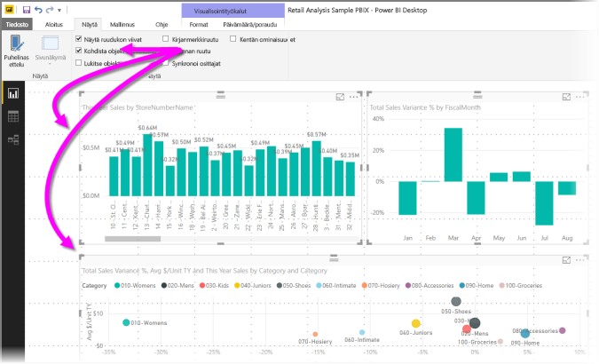
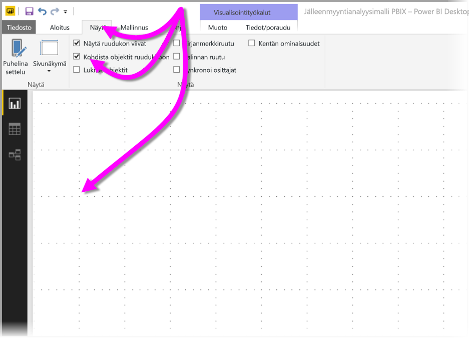
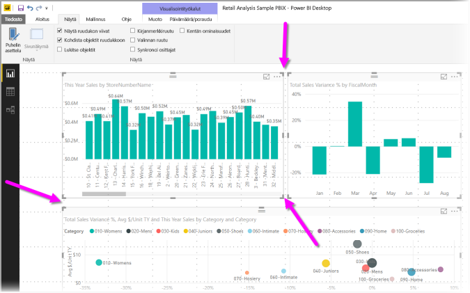
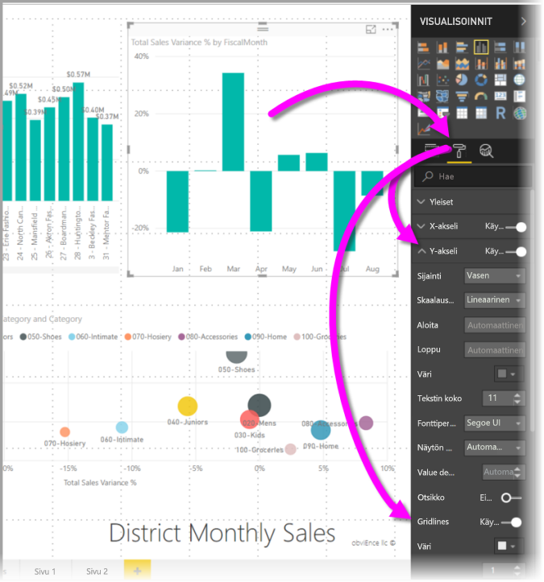
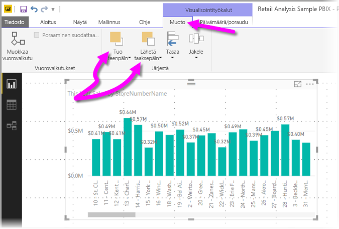
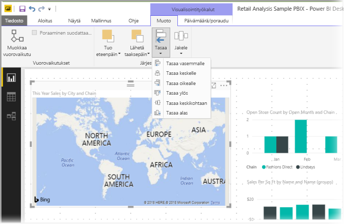
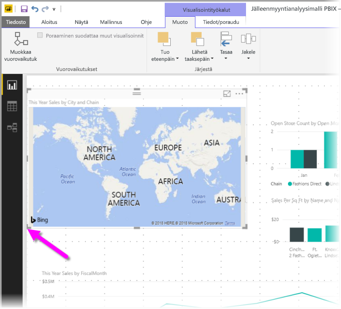
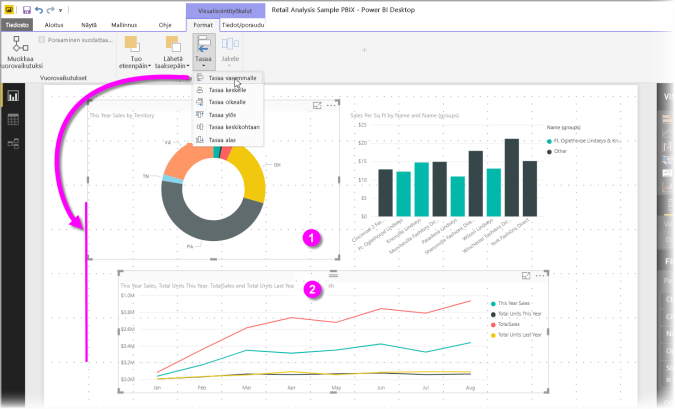
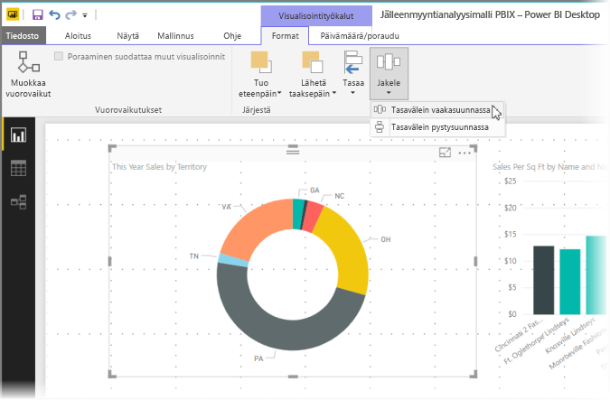

# Ruudukon ja Kohdista ruudukkoon -toiminnon käyttö Power BI Desktop -raporteissa
**Power BI Desktop** -raportin pohja sisältää ruudukoita, joiden avulla voit siististi tasata raporttisivun visualisoinnit. Sen avulla voit käyttää Kohdista ruudukkoon -toimintoa, jolloin raporttisi visualisoinnit näyttävät siisteiltä, ovat tasattuja ja tasaisin välein.

**Power BI Desktopissa** voit myös säätää raportin objektien z-järjestystä (Siirrä eteenpäin, Lähetä taaksepäin) sekä tasata tai jakaa tasaisesti valittuja visualisointeja pohjalla.

### Ruudukoiden ja ruudukkoon kohdistamisen käyttöönotto
Ota ruudukot käyttöön- ja Kohdista ruudukkoon -toiminnoissa valitaan **Näkymä**-valintanauha ja sitten valintaruudut toiminnoille **Näytä ruudukko** ja **Kohdista ruudukkoon.** Voit valita toisen tai molemmat vaihtoehdot, sillä ne toimivat itsenäisesti.

> [!NOTE]
> Jos **Näytä ruudukko** ja **Kohdista ruudukkoon** on poistettu käytöstä, muodosta yhteys mihin tahansa tietolähteeseen, jolloin ne tulevat käyttöön.
> 
> 

### Ruudukon viivojen käyttö
Ruudukon viivat ovat näkyviä ohjeviivoja, joiden avulla voit tasata visualisoinnit. Kun yrität määrittää, onko (vähintään) kaksi visualisointia tasattu vaakasuunnassa tai pystysuunnassa, käytä ruudukkoa määrittämään, onko reunat tasattu.

Voit valita komennolla Ctrl + napsautus useamman kuin yhden visualisoinnin kerrallaan. Tällöin näet kaikkien valittujen visualisointien reunat sekä sen, onko visualisoinnit tasattu oikein.

#### Ruudukon käyttö visualisointien sisällä
Power BI:ssa visualisointien sisällä on myös ruudukkoja, jotka antavat näkyvät ohjeviivat arvopisteiden ja arvojen vertailuun. Syyskuun 2017 versiosta alkaen **Power BI Desktop** mahdollistaa nyt ruudukoiden hallinnan visualisointien sisällä käyttämällä **X-akselin** tai **Y-akselin** korttia (soveltuvin osin visuaalisen tyypin perusteella), joka löytyy **Muoto**-osasta **Visualisoinnit**-ruudusta. Voit hallita ruudukon seuraavia elementtejä visualisoinnin sisällä:

* Ruudukon ottaminen käyttöön ja käytöstä poistaminen
* Ruudukon värin muuttaminen
* Ruudukon viivojen (leveys) säätäminen
* Valitse visualisoinnin ruudukon viivan tyyli, esimerkiksi yhtenäinen viiva, katkoviiva tai pisteviiva

Ruudukon tiettyjen elementtien muokkaaminen voi olla erityisen hyödyllistä raporteissa, joissa visualisointeihin käytetään tummia taustoja. Seuraavassa kuvassa näkyy **Ruudukot**-osion **Y-akselin** kortti.

### Ruudukkoon kohdistamisen käyttö
Kun otat käyttöön **Kohdista ruudukkoon**, kaikki visualisoinnit **Power BI Desktop** -pohjalla, joka siirrät (tai joiden kokoa muutat) tasataan automaattisesti lähimmälle ruudukon akselille, jolloin on paljon helpompaa varmistaa, että kaksi tai useampi visualisointi tasataan samaan vaaka- tai pystysijaintiin tai kokoon.

Muuta ei tarvitsekaan tehdä **Ruudukon** ja **Kohdista ruudukkoon** -toiminnon käyttämiseksi, jotta voidaan varmistaa, että raporttien visualisoinnit on tasattu siististi.

### Z-järjestyksen, tasauksen ja jakelun käyttö
Voit hallita raportin visualisoinnin järjestystä, jota kutsutaan usein elementtien *z-järjestykseksi*. Tämän ominaisuuden avulla voit asettaa visualisoinnit päällekkäin haluamallasi tavalla ja sitten muuttaa kunkin visualisoinnin järjestystä edestä taakse. Visualisointien järjestys voidaan määrittää käyttämällä **Siirrä eteenpäin**- ja **Siirrä taaksepäin** -painikkeita, jotka ovat **Muotoile**-nauhan **Järjestä**-osassa. **Muotoile**-nauha näkyy heti, kun valitset yhden tai useamman visualisoinnin sivulla.

**Muotoile**-nauhan avulla voit tasata visualisointeja monella eri tavalla, joka varmistaa sen, että visualisoinnit näkyvät sivulla sellaisessa tasausmuodossa, joka näyttää parhaalta ja toimii parhaiten.

**Tasaa**-painikkeella tasataan valittu visualisointi raporttipohjan reunaan (tai keskelle) seuraavassa kuvassa esitetyllä tavalla.

Kun valittuna on vähintään kaksi visualisointia, ne tasataan yhdessä ja niiden tasaukseen käytetään visualisointien aiemmin tasattua reunaa. Jos esimerkiksi valitset kaksi visualisointia ja valitset sitten **Tasaa vasemmalle** -vaihtoehdon, visualisoinnit tasataan tällöin kaikkien valittujen visualisointien äärimmäisenä vasemmalla olevaan reunaan.

Voit myös jakaa visualisoinnit tasaisesti raporttipohjalle joko pysty- tai vaakasuunnassa. Käytä vain **Jakele**-painiketta **Muoto**-valintanauhasta.

Käyttämällä vaikka vain muutamaa valintaa näistä ruudukoiden, tasauksen ja jakelun työkaluista raporttisi näyttävät juuri siltä, miltä haluat.

