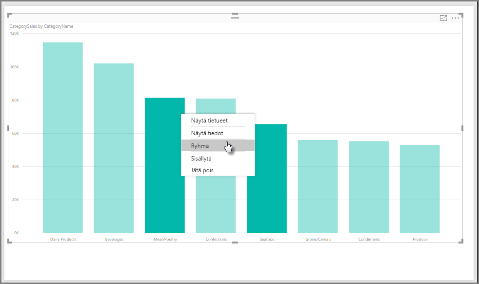
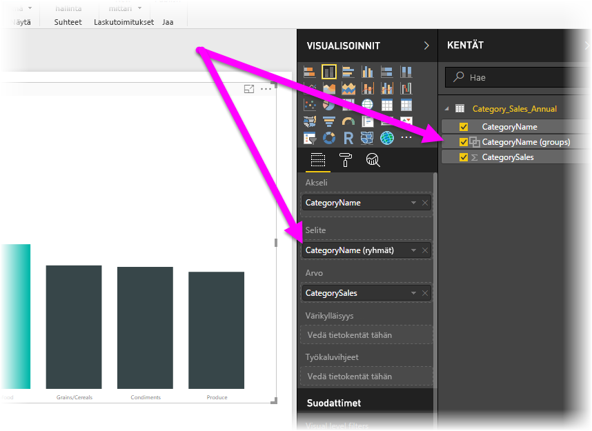
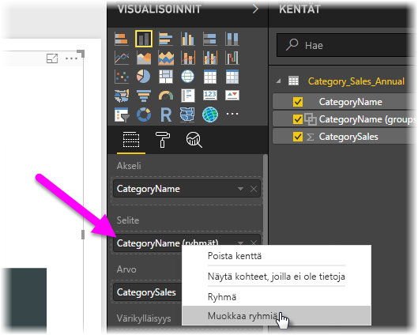
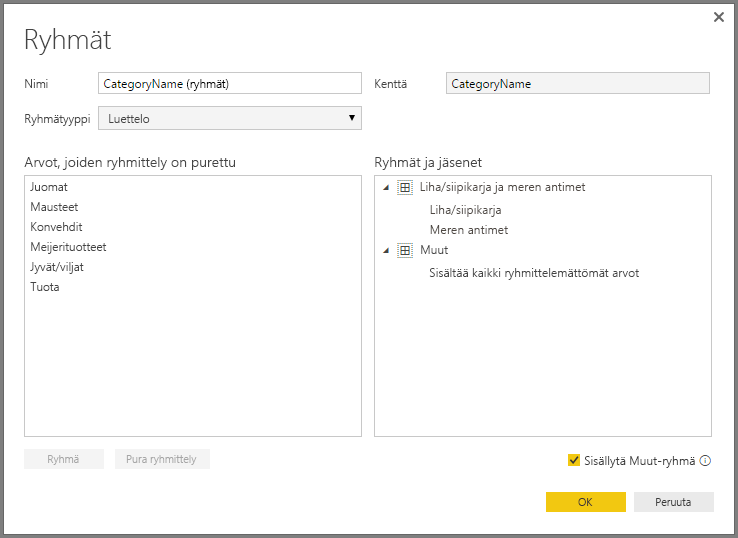
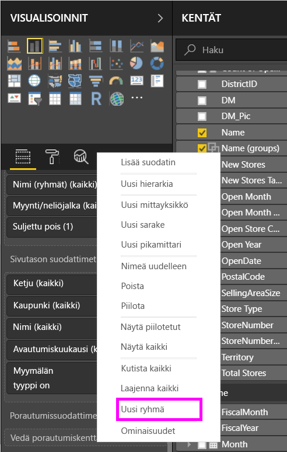
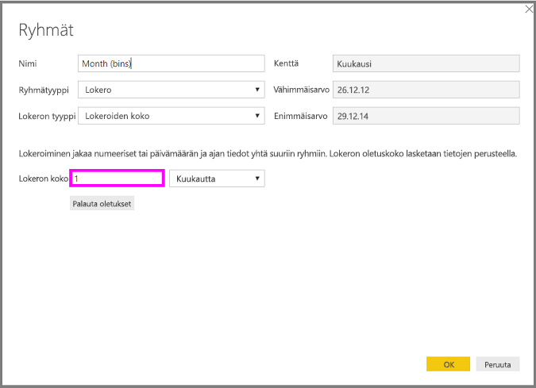
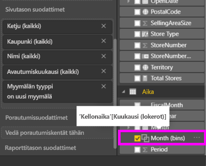

# Ryhmittely ja lokeroiminen Power BI Desktopissa
Kun **Power BI Desktop** luo visualisointeja, se kokoaa tiedot lohkoiksi (tai ryhmiksi), jotka perustuvat pohjalla olevien tietojen sisältämiin arvoihin. Useimmiten esitys on kunnossa, mutta joskus saatat haluta tarkentaa miten kyseiset lohkot esitetään. Saatat esimerkiksi haluta sijoittaa kolme tuoteluokkaa yhteen suurempaan luokkaan (yksi *ryhmä*). Tai haluat ehkä nähdä myyntiluvut yhdessä lokerossa lukuna 1 000 000 euroa tasaisesti jaetun 923 983 euron sijaan.

Power BI Desktopissa voit **ryhmitellä** arvopisteet, mikä auttaa sinua tarkastelemaan, analysoimaan ja tutkimaan visualisointien tietoja ja trendejä. Voit myös määrittää **lokeron koon**, mitä kutsutaan usein *lokeroimiseksi*, jos haluat sijoittaa arvot yhtä suuriin ryhmiin, joiden avulla voit paremmin visualisoida tietoja merkitsevällä tavalla.

## Ryhmittelyn käyttö
Jos haluat käyttää ryhmittelyä, valitse vähintään kaksi visualisoinnin elementtiä käyttämällä näppäinyhdistelmää CTRL + NAPSAUTUS elementtien monivalintaan. Napsauta seuraavaksi hiiren kakkospainikkeella monivalintaelementtejä ja valitse **Ryhmä** esiin tulevasta valikosta.

Kun ryhmä on luotu, se lisätään **Selite**-säilöön visualisointia varten, ja se näkyy myös **Kentät**-luettelossa.

Kun sinulla on ryhmä, voit helposti muokata kyseisen ryhmän jäseniä napsauttamalla hiiren kakkospainikkeella kenttää **Selite**-säilöstä tai **Kentät**-luettelosta ja valitsemalla **Muokkaa ryhmiä**.

Esiin tulevassa **Ryhmät**-ikkunassa voit luoda uusia ryhmiä tai muokata olemassa olevia ryhmiä. Voit myös *nimetä uudelleen* minkä tahansa ryhmän kaksoisnapsauttamalla ryhmän otsikkoa kohdasta **Ryhmät ja jäsenet** ja kirjoittamalla uuden nimen.

Voit tehdä ryhmillä kaikenlaista. Voit lisätä kohteita **Arvot, joiden ryhmittely on purettu** -luettelosta uuteen ryhmään tai yhdeksi olemassa olevaksi ryhmäksi. Jos haluat luoda uuden ryhmän, valitse kaksi tai useampi kohde (käyttäen painikeyhdistelmää CTRL + napsautus) **Arvot, joiden ryhmittely on purettu** -ruutuun ja napsauta sitten **Ryhmä** -painiketta kyseisen ruudun alta.

Voit lisätä puretun arvon aiemmin luotuun ryhmään: valitse purettu arvo ja valitse sitten aiemmin luotu ryhmä, johon haluat lisätä sen ja valitse **Ryhmä**-painike. Jos haluat poistaa tietoyksikön ryhmästä, valitse se **Ryhmät ja jäsenet** -ruudusta ja napsauta sitten **Pura ryhmittely**. Voit myös valita, onko ryhmittelemättömät luokat sijoitettava ryhmään **Muut** vai pitääkö niiden jäädä puretuiksi.

> [!NOTE]
> Voit luoda ryhmiä mille tahansa kentälle kohdassa **Kentät** ilman monivalintaa olemassa olevasta visualisoinnista. Napsauta kenttää hiiren kakkospainikkeella ja valitse **Uusi ryhmä** esiin tulevasta valikosta.

## Lokeroinnin käyttäminen
Voit määrittää numeeristen ja aika-kenttien lokeron koon **Power BI Desktopissa.** Voit käyttää lokeroimisen **Power BI Desktopissa** näkyvien tietojen oikeaan kokoon saattamiseksi.

Voit käyttää lokeron kokoa napsauttamalla hiiren kakkospainikkeella **Kenttä** ja valitsemalla **Uusi ryhmä**.

**Ryhmät**-ikkunassa asetetaan haluttu **lokeron koko**.

Kun valitset **OK** huomaat, että uusi kenttä tulee näkyviin **Kentät**-ruutuun *(lokerot)* liitettynä. Sitten voit vetää tämän kentän alustalle lokeron koon käyttämiseksi visualisoinnissa.

Jos haluat nähdä **lokeroimisen** käytännössä, katso tämä [video](https://www.youtube.com/watch?v=BRvdZSfO0DY).

Tässä kaikki **ryhmittelystä** ja **lokeroimisesta**, kun haluat varmistaa visualisointien näkymisen raporteissa juurin niin kuin haluat niiden näkyvän.

