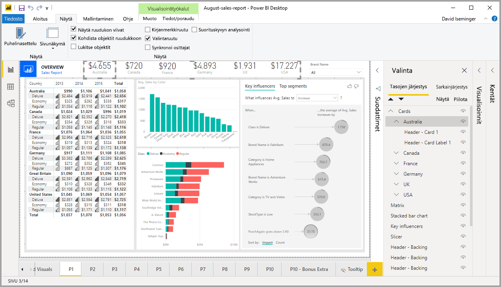
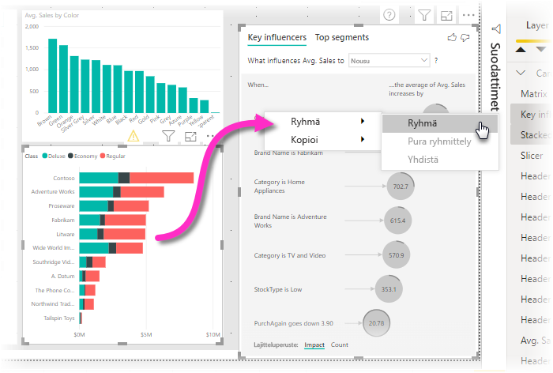
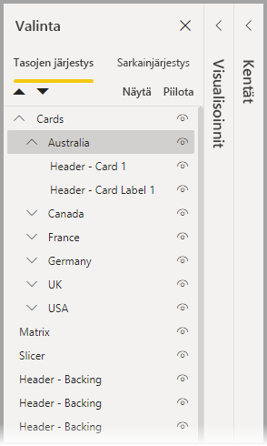
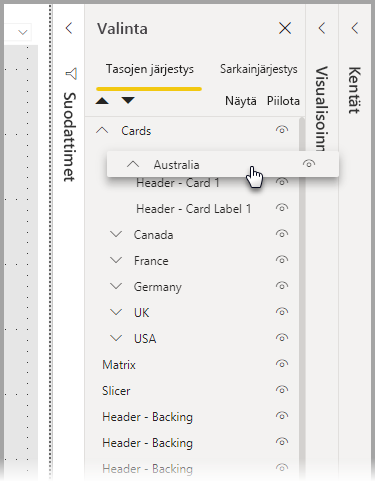
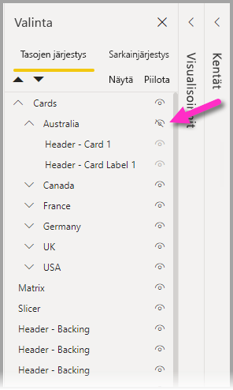
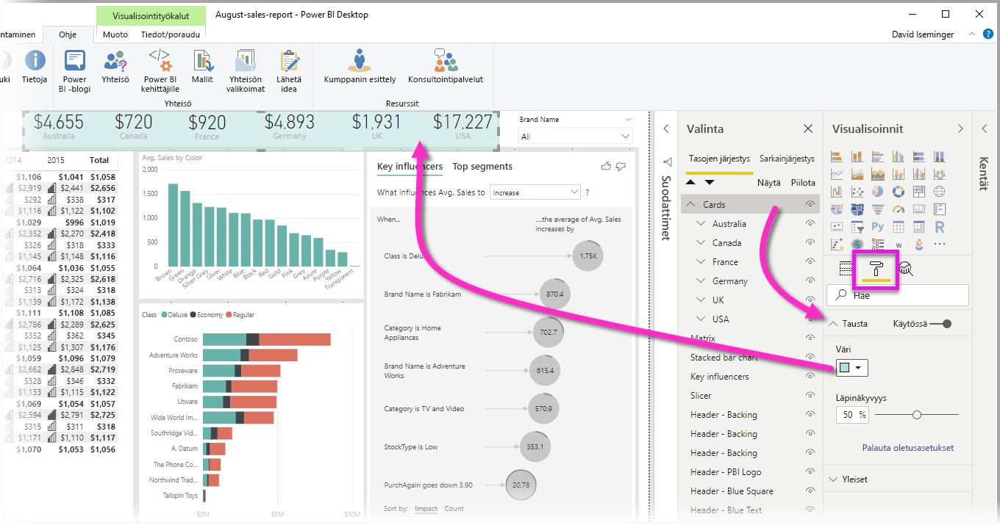

# Ryhmittely Power BI Desktopissa
Kun käytät **ryhmittelyä** **Power BI Desktopissa**, voit ryhmitellä visualisointeja yhteen raporteissa. Voit ryhmitellä esimerkiksi painikkeita, tekstiruutuja, muotoja, kuvia ja luomiasi visualisointeja samalla tavalla kuin PowerPointissa. Raportin visualisointien ryhmittelemisen ansiosta voit käsitellä ryhmää samalla tavalla kuin yksittäistä objektia. Sen myötä siirtäminen, koon muuttaminen ja raportin tasojen käsitteleminen on helpompaa, nopeampaa ja intuitiivisempaa.

## Ryhmien luominen

Jos haluat luoda visualisointien ryhmän Power BI Desktopissa, valitse ensimmäinen visualisointi pohjasta, pidä CTRL-näppäintä painettuna, napsauta yhtä tai useampaa ryhmään haluamaasi visualisointia, napsauta visualisointien kokoelmaa hiiren kakkospainikkeella ja valitse **Ryhmä** avautuvasta valikosta.

Ryhmät näytetään **valitsemisruudussa**. Raportissa voi olla rajaton määrä visualisointien ryhmiä. Lisäksi visualisointien ryhmiä voi asettaa sisäkkäin. Seuraavassa kuvassa *Australia*-ryhmä on asetettu sisäkkäin *Kortit*-ryhmän alle. Voit laajentaa ryhmän valitsemalla ryhmän nimen vieressä olevan sirkumfleksin ja kutistaa sen valitsemalla sirkumfleksin uudelleen. 

**Valitsemisruudussa** voit myös vetää ja pudottaa yksittäisiä visualisointeja, kun haluat sisällyttää ne ryhmään, poistaa ne ryhmästä, asettaa ryhmän sisäkkäin tai poistaa ryhmän tai yksittäisen visualisoinnin sisäkkäisestä ryhmästä. Vedä säädettävää visualisointia ja pudota se haluamaasi paikkaan. Jos visualisointien tasoja on päällekkäin, niiden järjestys määräytyy *Tasojen järjestys* -luettelon mukaan.

Voit purkaa ryhmittelyn valitsemalla ryhmän, napsauttamalla sitä hiiren kakkospainikkeella ja valitsemalla avautuvasta valikosta **pura ryhmittely**.

## Visualisointien tai ryhmien piilottaminen ja näyttäminen

Voit piilottaa tai näyttää ryhmät helposti **valitsemisruudun** avulla. Jos haluat piilottaa ryhmän, valitse silmäpainike ryhmän (tai minkä tahansa yksittäisen visualisoinnin) nimen vieressä. Voit sen avulla valita, onko visualisointi tai ryhmä piilotettu vai näkyvissä. Seuraavassa kuvassa *Australia*-ryhmä on piilotettu ja muut *Kortit*-ryhmässä sisäkkäin olevat ryhmät näkyvät.

Kun piilotat ryhmän, kaikki kyseisen ryhmän visualisoinnit piilotetaan, minkä merkiksi niiden silmäpainike näkyy harmaana (ei käytettävissä, jos haluat ottaa sen käyttöön tai poistaa sen käytöstä, koska koko ryhmä on piilotettu). Jos haluat piilottaa vain tietyt visualisoinnit ryhmässä, voit vaihtaa silmäpainikkeen tilan kyseisen visualisoinnin vieressä. Tällöin vain kyseinen visualisointi ryhmässä on piilotettu.

## Visualisointien valitseminen ryhmässä

Visualisointien ryhmässä voi siirtyä ja kohteita voi valita muutamalla eri tavalla. Toiminta kuvataan seuraavassa luettelossa:

* Tyhjän tilan napsauttaminen ryhmässä (kuten visualisointien välissä oleva tyhjä tila) ei valitse mitään
* Visualisoinnin napsauttaminen ryhmässä valitsee koko ryhmän, toinen napsautus valitsee yksittäisen visualisoinnin
* Ryhmän valitseminen, toisen objektin valitseminen raportin pohjassa ja sitten **Ryhmä**-vaihtoehdon valitseminen hiiren kakkospainikkeella avattavasta valikosta luo sisäkkäisen ryhmän
* Kahden ryhmän valitseminen ja napsauttaminen hiiren kakkospainikkeella tuo näkyviin vaihtoehdon valittujen ryhmien yhdistämiseksi sen sijaan, että ne asetettaisiin sisäkkäin

## Taustavärin käyttäminen

Voit käyttää taustaväriä ryhmässä valitsemalla **Visualisoinnit**-ruudusta **Muotoilu**-osion seuraavan kuvan mukaisesti. 

Kun otat taustavärin käyttöön, visualisointien välissä olevan tilan napsauttaminen ryhmässä valitsee ryhmän (vertaa tätä visualisointien välissä olevan tyhjän tilan napsauttamiseen, joka ei valitse ryhmää). 

## Seuraavat vaiheet
Saat lisätietoja ryhmittelystä katsomalla seuraavan videon:

* [Ryhmittely Power BI Desktopissa – video](https://youtu.be/sf4n7VXoQHY?t=10)

Voit olla kiinnostunut myös seuraavista artikkeleista:

* [Raporttien välillä porautumisen käyttäminen Power BI Desktopissa](desktop-cross-report-drill-through.md)
* [Osittajien käyttäminen Power BI Desktopissa](visuals/power-bi-visualization-slicers.md)

