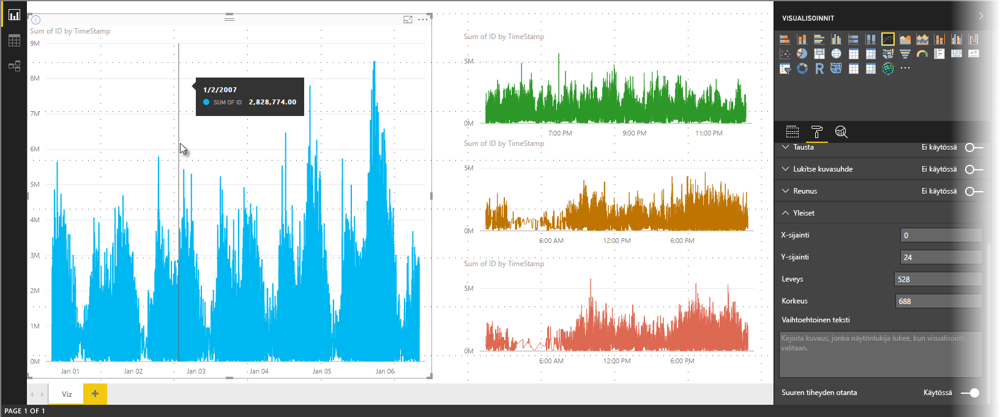
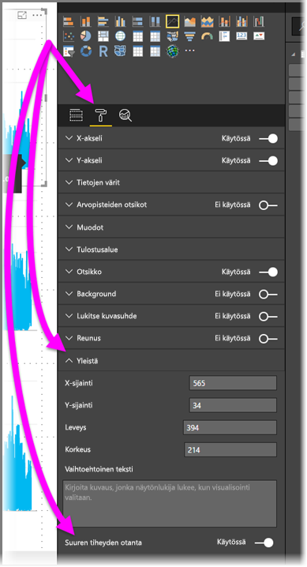

# Suuren tiheyden viivaotanta Power BI:ssä
Kesäkuussa 2017 julkaistussa **Power BI Desktop** -versiossa ja **Power BI -palvelun** päivityksissä otettiin käyttöön uusi näytteenottoalgoritmi, joka parantaa visualisointeja, joissa käytetään suuren tiheyden viivaotantaa. Saatat esimerkiksi luoda viivakaavion vähittäismyymälöidesi myyntituloksista, ja jokaisella myymälällä on yli 10 000 myyntikuittia joka vuosi. Tällaisten myyntitietojen viivakaavio ottaa näytteen jokaisen myymälän tiedoista, jotta niistä saadaan tuotettua merkityksellinen esitys ajallisen myyntivaihtelun kuvaamiseksi. Näytteistä luodaan pohjana olevia tietoja kuvaava monijaksoinen viivakaavio. Tämä on yleinen tapa suuren tiheyden tietojen visualisoinnissa. Power BI Desktopin suuren tiheyden näytteenottoa on parannettu, ja sitä kuvataan nyt tarkemmin tässä artikkelissa.

> [!NOTE]
> Artikkelissa kuvattu **suuren tiheyden näytteenoton** algoritmi on käytössä sekä **Power BI Desktopissa** että **Power BI -palvelussa**.
> 
> 

## Suuren tiheyden viivaotannan toimintaperiaate
Aiemmin **Power BI** valitsi näytteen arvopisteitä koko pohjana olevasta tietojoukosta deterministisesti. Esimerkiksi yhtä kalenterivuotta kuvaavassa visualisoinnissa, jonka pohjana on suuren tiheyden tietoa, saatettiin esittää 350 arvopisteen otos. Sillä pyrittiin varmistamaan, että koko tietojoukko (eli kaikki pohjatiedot) esitettiin visualisoinnissa. Asian havainnollistamiseksi voidaan ajatella esimerkiksi osakkeen hintaa yhden vuoden ajalta. Sitä kuvataan viivakaaviovisualisoinnilla, johon valitaan 365 arvopistettä eli yksi arvopiste jokaiselle päivälle.

Tässä tilanteessa osakkeen hinnalla on monia arvoja jokaisena päivänä. Luonnollisesti osakkeella on alin ja ylin hinta, mutta ne voivat ilmetä mihin tahansa aikaan sellaisina päivinä, joina osakkeilla käydään kauppaa. Suuren tiheyden viivaotannassa näytteet pohjatiedoista saatetaan ottaa joka päivä klo 10.30 ja klo 24.00, jolloin tuloksena on edustava tilannevedos pohjatiedoista eli hinnasta kyseisinä ajankohtina. Tämä näyte ei kuitenkaan välittämättä taltioi tietopisteen eli kyseisen päivän alinta ja ylintä osakehintaa. Tässä ja monissa muissa tilanteissa näyte kuvaa pohjatietoja edustavasti mutta ei aina pysty taltioimaan tärkeitä seikkoja, kuten tässä tapauksessa osakkeen alimpia ja ylimpiä hintoja päivittäin.

Suuren tiheyden tiedoista otetaan näytteitä siksi, että voidaan luoda kohtuullisen nopeasti visualisointeja, joiden vuorovaikutteisuus säilyy. Jos visualisoinnissa on liikaa arvopisteitä, sen käyttö hidastuu ja trendit voivat jäädä hahmottamatta. Näytteenottoalgoritmeja kehitetään siis sen takia, että tällaisista tiedoista saataisiin tuotettua parhaita mahdollisia visualisointeja. Power BI Desktopin käyttämää algoritmia on parannettu siten, että se tarjoaa parhaan vasteajan ja esityksen. Sen tavoitteena on lisäksi taltioida tärkeimmät arvopisteet jokaisesta näytteistetystä ajankohdasta.

## Uuden viivaotanta-algoritmin toimintaperiaate
Suuren tiheyden viivaotannan uusi algoritmi on käytettävissä jatkuvan X-akselin sisältävien viivakaavioiden ja aluekaavioiden visualisointiin.

Suuren tiheyden visualisointia varten **Power BI** viipaloi älykkäästi suuren tiheyden tiedot lohkoihin ja poimii sitten tärkeät arvopisteet edustamaan kutakin lohkoa. Suuren tiheyden tietojen viipalointiprosessi on säädetty erityisesti sen varmistamiseksi, että tuloksena syntyvää kaaviota ei voi visuaalisesti erottaa kaaviosta, joka syntyisi kaikista pohjana olevista arvopisteistä. Visualisointi on kuitenkin koko tietomäärästä luotua paljon nopeampi ja vuorovaikutteisempi.

### Suuren tiheyden viivavisualisointien vähimmäis- ja enimmäisarvot
Kaikkia visualisointeja koskevat seuraavat rajoitukset:

* Visualisoinnissa *näytettävien* arvopisteiden enimmäismäärä on **3 500** riippumatta pohjatietojen arvopisteiden tai sarjojen määrästä. Näin ollen jos käytettävissä on kymmenen sarjaa, joista kussakin on 350 arvopistettä, visualisoinnin arvopisteiden enimmäismäärä on saavutettu. Jos sarjoja on yksi, siinä voi olla jopa 3 500 arvopisteitä, mikäli uuden algoritmin mukaan ne kaikki tarvitaan pohjatietojen parasta esittämistä varten.
* Visualisoinnissa voi olla enintään **60 sarjaa**. Jos sarjoja on yli 60, jaa tiedot ja luo useita visualisointeja, joista kussakin on korkeintaan 60 sarjaa. On suositeltava tapa käyttää **osittajaa** näyttämään vain osia tiedoista, kuten vain tietyt sarjat. Jos esimerkiksi näytät tietyn selitteen kaikki aliluokat, voit osittajan avulla suodattaa tiedot yleisen luokan mukaan samalla raporttisivulla.

Nämä parametrit varmistavat, että Power BI Desktop pystyy hahmontamaan visualisoinnit erittäin nopeasti ja että niiden vuorovaikutteisuus säilyy. Samalla visualisointia hahmontavaa tietokonetta ei rasiteta liikaa.

### Suuren tiheyden viivavisualisointien edustavien arvopisteiden arviointi
Kun pohjatietojen arvopisteiden määrä ylittää visualisoinneissa esitettävien arvopisteiden enimmäismäärän (3 500 pistettä), aloitetaan prosessi nimeltä *lokeroiminen*. Se jakaa pohjatiedot *lokeroiksi* kutsuttuihin ryhmiin ja alkaa sitten iteratiivisesti tarkentaa näitä lokeroita.

Algoritmi luo niin monta lokeroa kuin mahdollista, jotta visualisointiin saadaan suurin määrä tietopisteiden askelvälejä. Algoritmi etsii jokaisen lokeron sisältä pienimmän ja suurimman tietoarvon, jotta tärkeät ja merkittävät arvot, kuten poikkeavat havainnot, saadaan taltioitua ja esitettyä visualisoinnissa. Tietojen lokeroimisen ja arvioinnin tulosten pohjalta Power BI määrittää visualisoinnin X-akselin vähimmäistarkkuuden, jotta visualisointiin saadaan mahdollisimman paljon askelvälejä.

Jokaisen sarjan pienin askelvälimäärä on 350 pistettä ja suurin 3 500.

Jokainen lokero esitetään kahdella arvopisteellä, joista muodostetaan lokeroa edustavat arvopisteet visualisointiin. Arvopisteet ovat yksinkertaisesti lokeron ylin ja alin arvo. Valitsemalla nämä arvot lokerointiprosessi varmistaa, että visualisointiin tallennetaan ja hahmonnetaan kaikki mahdolliset tärkeät ylimmät ja alimmat arvot.

Tämä saattaa kuulostaa siltä kuin satunnaisten poikkeavien havaintojen taltiointia ja visualisointia analysoitaisiin paljon – ja näin myös on. Juuri siitä syystä uusi algoritmi ja lokerointiprosessi on kehitetty.

## Työkaluvihjeet ja suuren tiheyden viivaotanta
On tärkeää huomioida, että tämä lokerointiprosessi, jossa lokeron enimmäis- ja vähimmäisarvot taltioidaan ja esitetään visualisoinnissa, saattaa vaikuttaa työkaluvihjeiden näyttämiin tietoihin, kun hiiri viedään arvopisteiden ylle. Käytetään mallina aiempaa esimerkkiä osakkeiden hinnoista.

Oletetaan, että olet luomassa visualisointia osakkeen hinnasta ja vertaat kahta eri osaketta, joista kummassakin käytetään **suuren tiheyden näytteenottoa**. Kummankin sarjan pohjatiedoissa on paljon arvopisteitä, kuten osakkeen hinta päivän jokaisena sekuntina. Suuren tiheyden näytteenottoalgoritmi lokeroi kunkin sarjan erillään toisistaan.

Oletetaan sitten, että ensimmäisen osakkeen hinta nousee kello 12.02 ja laskee nopeasti kymmenen sekuntia myöhemmin. Tämä on tärkeä arvopiste. Kun osake lokeroidaan, klo 12.02:n hintapiikki muodostuu lokeron edustavaksi arvopisteeksi.

Toisen osakkeen ylin tai alin arvo ei kuitenkaan osunut ajan 12.02 sisältävään lokeroon. Lokeron, joka sisältää klo 12.02:n, ylin ja alin arvo saattoivat ilmetä kolme minuuttia myöhemmin. Kun tässä tilanteessa viivakaavio on luotu ja viet hiiren klo 12.02:n ylle, näet työkaluvihjeessä ensimmäisen osakkeen arvon, koska se nousi klo 12.02 ja arvo valittiin tämän lokeron ylimmäksi arvopisteeksi. *Et* kuitenkaan näe mitään arvoa toisen osakkeen klo 12.02:n työkaluvihjeessä. Tämä johtuu siitä, että toisella osakkeella ei ollut ylintä tai alinta arvoa lokerossa, joka sisältää klo 12.02:n. Toisen osakkeen hinnalle ei siis ole näytettävää arvoa klo 12.02 eikä näin ollen näytettävää tietoa työkaluvihjeessäkään.

Tämä tilanne toistuu työkaluvihjeissä usein. Tietyn lokeron ylimmät ja alimmat arvot eivät välttämättä täysin täsmää tasaisesti skaalatun X-akselin arvopisteiden kanssa, ja siksi työkaluvihje ei näytä arvoa.  

## Suuren tiheyden viivaotannan ottaminen käyttöön
Oletusarvoisesti uusi algoritmi on **käytössä**. Voit muuttaa tätä asetusta siirtymällä **Yleiset**-kortin **Muotoilu**-ruutuun, jonka alaosassa näet **Suuren tiheyden näytteenotto** -valitsimen. Poista algoritmi käytöstä siirtämällä valitsin **Ei käytössä** -asentoon.

## Huomioon otettavat seikat ja rajoitukset
Suuren tiheyden viivaotannan uusi algoritmi on merkittävä parannus Power BI:hin, mutta suuren tiheyden arvojen ja tietojen käsittelyssä on muutamia huomioon otettavia seikkoja.

* Parannettu askelväli ja lokerointiprosessi saattavat aiheuttaa sen, että **työkaluvihjeet** näyttävät arvon vain, jos kohdistimen paikkaa vastaa edustava arvopiste. Katso lisätietoja tämän artikkelin *Työkaluvihjeet ja suuren tiheyden viivaotanta* -osiosta.
* Kun tietolähteen koko on liian suuri, uusi algoritmi jättää käsittelemättä sarjoja (selitteen osia) tietojen tuomisen enimmäisrajoitusten noudattamiseksi.
  
  * Tässä tilanteessa uusi algoritmi järjestää selitesarjat aakkosjärjestykseen ja alkaa käydä läpi selitteen osien luetteloa aakkosjärjestyksessä, kunnes tietojen tuomisen enimmäisraja täyttyy. Sen jälkeen lisäsarjoja ei tuoda.
* Kun pohjana olevassa tietojoukossa on yli 60 sarjaa (aiemmin kuvattu sarjojen enimmäismäärä), uusi algoritmi järjestää sarjat aakkosjärjestykseen ja jättää käsittelemättä aakkosjärjestyksessä 60. sarjan jälkeen tulevat sarjat.
* Jos tietojen arvot eivät ole tyypiltään *numeerisia* tai *päivämääriä/kellonaikoja*, Power BI ei käytä uutta algoritmia ja palaa käyttämään aiempaa algoritmia, jossa ei hyödynnetä suuren tiheyden näytteenottoa.
* Uusi algoritmi ei tue **Näytä kohteet, joilla ei ole tietoja** -asetusta.
* Uutta algoritmia ei tueta, kun käytössä on reaaliaikainen yhteys SQL Server Analysis Servicesissä isännöityyn malliin (versio 2016 tai aiempi). Sitä tuetaan **Power BI:ssä** tai Azure Analysis Servicesissä isännöidyissä malleissa.

## Seuraavat vaiheet
Lisätietoja suuren tiheyden näytteenotosta pistekaavioissa on seuraavassa artikkelissa.

* [Suuren tiheyden näytteenotto Power BI:n pistekaavioissa](desktop-high-density-scatter-charts.md)

