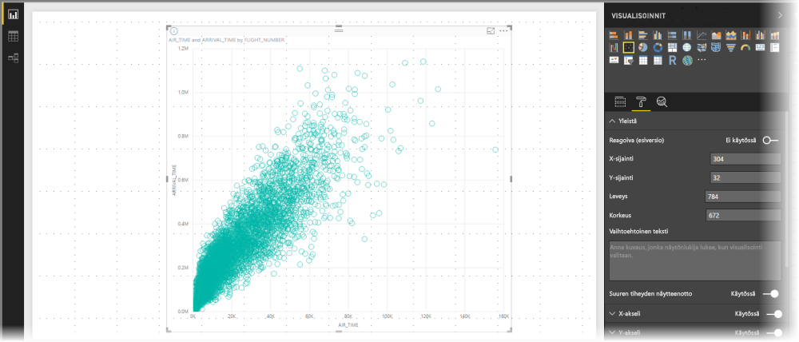
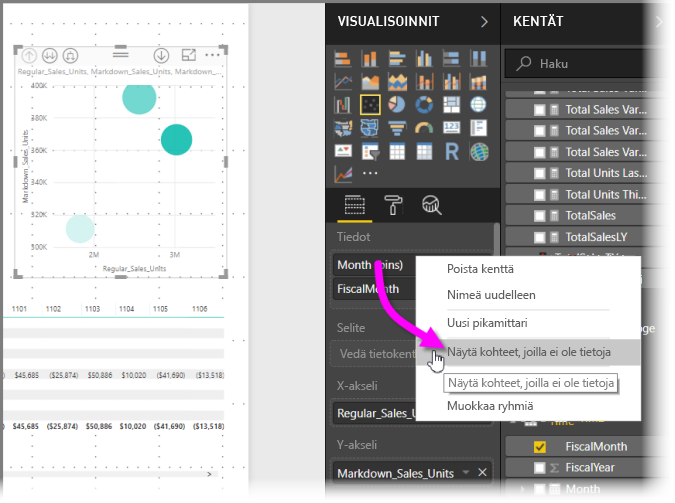
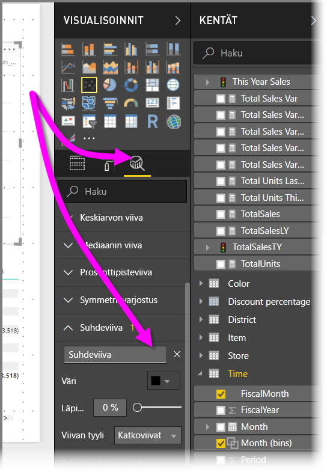
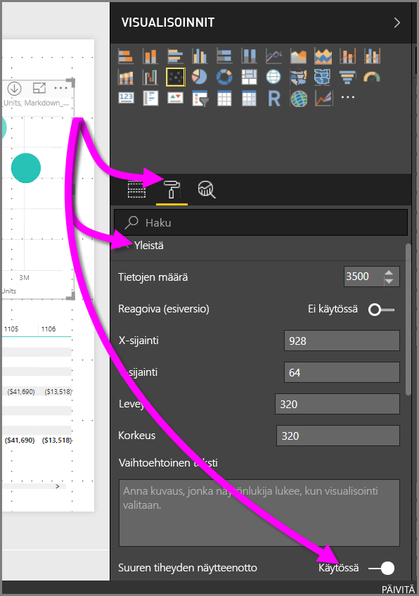

# Suuren tiheyden näytteenotto Power BI:n pistekaavioissa
Syyskuussa 2017 julkaistussa **Power BI Desktop** -versiossa ja **Power BI -palvelun** päivityksissä otettiin käyttöön uusi näytteenottoalgoritmi, joka parantaa sitä, kuinka pistekaaviot esittävät suuren tiheyden tiedot.

Voit esimerkiksi luoda pistekaavion organisaatiosi myyntitoiminnasta, jossa jokaisella myymälällä on kymmeniätuhansia arvopisteitä vuosittain. Tällaisten tietojen pistekaavio ottaa näytteen jokaisen myymälän tiedoista, jotta niistä saadaan tuotettua merkityksellinen esitys ajallisen myyntivaihtelun kuvaamiseksi. Näytteistä luodaan pohjana olevia tietoja kuvaava pistekaavio. Tämä on yleinen käytäntö pistekaavioissa. Power BI:n suuren tiheyden näytteenottoa on parannettu, ja sitä kuvataan tarkemmin tässä artikkelissa.

> [!NOTE]
> Tässä artikkelissa kuvattu **suuren tiheyden näytteenoton** algoritmi on käytettävissä pistekaavioissa sekä **Power BI Desktopissa** että **Power BI -palvelussa**.
> 
> 

## Suuren tiheyden pistekaavioiden toimintaperiaate
Aiemmin **Power BI** loi pistekaavion valitsemalla koko pohjana olevasta tietojoukosta deterministisesti otannan arvopisteitä. Tarkemmin sanottuna Power BI valitsi ensimmäisen ja viimeisen tietorivin pistekaaviosarjassa ja jakoi sitten jäljellä olevat rivit tasaisesti siten, että pistekaavioon piirrettiin yhteensä 3500 arvopistettä. Jos näytteessä oli esimerkiksi 35 000 riviä, ensimmäinen ja viimeinen rivi valittiin kaavioon piirrettäviksi ja sen jälkeen kaavioon piirrettiin joka kymmenes rivi (35 000 / 10 = joka kymmenes rivi = 3500 arvopistettä). Lisäksi tyhjäarvot tai pisteet (kuten tekstiarvot), joita ei voitu piirtää tietosarjaan, eivät aiemmin olleet näkyvissä, joten niitä ei huomioitu visualisointia luotaessa. Tällaisen näytteenoton vuoksi pistekaavion havaittu tiheys perustui myös edustaviin arvopisteisiin, joten implisiittinen visuaalinen tiheys oli näytteistettyjen pisteiden otanta, ei täydellinen kokoelma sivustokokoelman pohjana olevista tiedoista.

Kun otat **suuren tiheyden näytteenoton** käyttöön, Power BI toteuttaa algoritmin, joka poistaa päällekkäiset pisteet ja varmistaa, että visualisoinnin pisteet voidaan saavuttaa visualisointia käsittelemällä. Algoritmi myös varmistaa, että kaikki tietojoukon pisteet esitetään visualisoinnissa, ja antaa valittujen pisteiden merkitykselle kontekstin pelkän edustavan otannan esittämisen sijasta.

Suuren tiheyden tiedoista otetaan näytteitä siksi, että näin voidaan kohtuullisen nopeasti luoda visualisointeja, joiden vuorovaikutteisuus säilyy. Jos visualisoinnissa on liikaa arvopisteitä, sen käyttö hidastuu ja trendit voivat jäädä hahmottamatta. Näytteenottoalgoritmeja kehitetään siksi, että tällaisista tiedoista saataisiin tuotettua parhaita mahdollisia visualisointeja ja että kaikki tiedot olisivat edustettuina. Power BI:n käyttämää algoritmia on parannettu siten, että se tarjoaa parhaan vasteajan ja esityksen ja taltioi selkeästi tärkeimmät pisteet koko tietojoukosta.

> [!NOTE]
> **Suuren tiheyden näytteenoton** algoritmia käyttävät pistekaaviot piirretään kaikkien pistekaavioiden tavoin parhaiten neliömäisiin visualisointeihin.
> 
> 

## Uuden pistekaavion näytteenottoalgoritmin toimintaperiaate
Uusi pistekaavioiden **suuren tiheyden näytteenoton** algoritmi hyödyntää menetelmiä, jotka taltioivat ja edustavat pohjana olevia tietoja entistä tehokkaammin, ja poistaa päällekkäisiä pisteitä. Algoritmi saa tämän aikaan aloittamalla kunkin arvopisteen pienellä säteellä (tarkoittaa visuaalista ympyrän kokoa visualisoinnin tietyssä pisteessä). Tämän jälkeen se suurentaa kaikkien arvopisteiden sädettä. Kun kaksi arvopistettä (tai useampia arvopisteitä) menee päällekkäin, yksittäinen ympyrä (jonka säteen koko on suurempi) edustaa näitä päällekkäisiä arvopisteitä. Algoritmi suurentaa arvopisteiden sädettä entisestään, kunnes säteen arvo johtaa kohtuullisen arvopisteiden määrän eli 3500 pisteen näkymiseen pistekaaviossa.

Algoritmin menetelmät varmistavat, että tuloksena saadussa visualisoinnissa esitetään myös ääriarvot. Päällekkäisyyttä määritettäessä algoritmi myös noudattaa mittakaavaa siten, että eksponentiaaliset asteikot visualisoidaan tarkasti suhteessa pohjana oleviin visuaalisiin pisteisiin.

Lisäksi algoritmi säilyttää pistekaavion yleisen muodon.

> [!NOTE]
> Kun **suuren tiheyden näytteenoton** algoritmia käytetään pistekaavioiden luomiseen, tavoitteena on tietojen *tarkka jakauma*, *ei* implisiittinen visuaalinen tiheys. Saatat esimerkiksi nähdä pistekaavion, jossa on paljon ympyröitä päällekkäin (tiheässä) tietyllä alueella, joten ajattelet, että kyseiseen kohtaan täytyy olla klusteroitunut useita arvopisteitä. **Suuren tiheyden näytteenoton** algoritmi voi esittää useita arvopisteitä yhden ympyrän avulla, joten tällaista implisiittistä visuaalista tiheyttä (tai ”klusteroitumista”) ei esiinny. Voit tarkastella tiettyä aluetta yksityiskohtaisemmin osittajien avulla.
> 
> 

Lisäksi arvopisteet (kuten tyhjäarvot tai tekstiarvot), joita ei voida kuvata, ohitetaan. Siksi niiden sijasta voidaan valita toinen piirrettävä arvo, jolloin varmistetaan pistekaavion oikean muodon säilyminen.

### Tapaukset, joissa käytetään pistekaavioiden vakioalgoritmia
Tietyissä olosuhteissa **suuren tiheyden näytteenottoa** ei voida soveltaa pistekaavioon. Tällöin käytetään alkuperäistä algoritmia. Nämä olosuhteet ovat seuraavat:

* Jos napsautat hiiren kakkospainikkeella **Tiedot**-kohdan alla olevaa arvoa ja valitset avautuvasta valikosta vaihtoehdon **Näytä kohteet, joilla ei ole tietoja**, pistekaavio palautuu alkuperäiseen algoritmiin.
  
  
* Mitkä tahansa **Toista**-akselin arvot aiheuttavat pistekaavion palautumisen alkuperäiseen algoritmiin.
* Jos sekä X-akseli että Y-akseli puuttuvat pistekaaviosta, kaavio palautuu alkuperäiseen algoritmiin.
* **Suhdeviivan** käyttäminen **Analytiikka**-ruudussa aiheuttaa kaavion palautumisen alkuperäiseen algoritmiin.
  
  

## Suuren tiheyden näytteenoton käyttöönotto pistekaaviossa
Voit ottaa **suuren tiheyden näytteenoton** käyttöön valitsemalla pistekaavion, siirtymällä **Muotoilu**-ruutuun, laajentamalla **Yleinen**-kortin ja liu’uttamalla kortin alalaidan lähellä **Suuren tiheyden näytteenotto** -liukusäätimen asentoon **Käytössä**.

> [!NOTE]
> Kun valitsin on Käytössä-asennossa, Power BI yrittää käyttää **suuren tiheyden näytteenoton** algoritmia aina, kun se on mahdollista. Kun algoritmia ei voi käyttää (esimerkiksi siinä tapauksessa, että sijoitat arvon *Toista*-akselille), valitsin pysyy **Käytössä**-asennossa, vaikka kaavio on palautunut vakioalgoritmiin. Jos sitten poistat arvon *Toista*-akselilta (tai olosuhteet muuttuvat niin, että suuren tiheyden näytteenoton algoritmi voidaan ottaa käyttöön), suuren tiheyden näytteenottoa käytetään automaattisesti kyseisessä kaaviossa, koska toiminto on käytössä.
> 
> [!NOTE]
> Arvopisteet ryhmitellään tai valitaan indeksikohtaisesti. Selitteen käyttö ei vaikuta algoritmin näytteenottoon. Se vaikuttaa vain visualisoinnin järjestykseen.
> 
> 

## Huomioon otettavat seikat ja rajoitukset
Suuren tiheyden näytteenoton uusi algoritmi on merkittävä parannus Power BI:hin, mutta suuren tiheyden arvojen ja pistekaavioiden käsittelyssä on muutamia huomioon otettavia seikkoja.

* **Suuren tiheyden näytteenoton** algoritmi toimii vain käytettäessä reaaliaikaisia yhteyksiä Power BI -palveluun pohjautuviin malleihin, tuotuihin malleihin tai DirectQueryyn.

## Seuraavat vaiheet
Lisätietoja suuren tiheyden näytteenotosta muissa kaavioissa on seuraavassa artikkelissa.

* [Suuren tiheyden viivaotanta Power BI:ssä](desktop-high-density-sampling.md)

