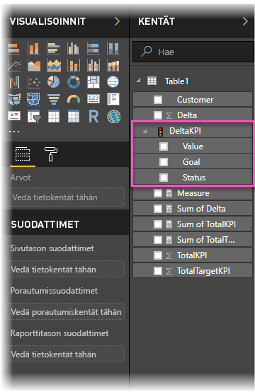
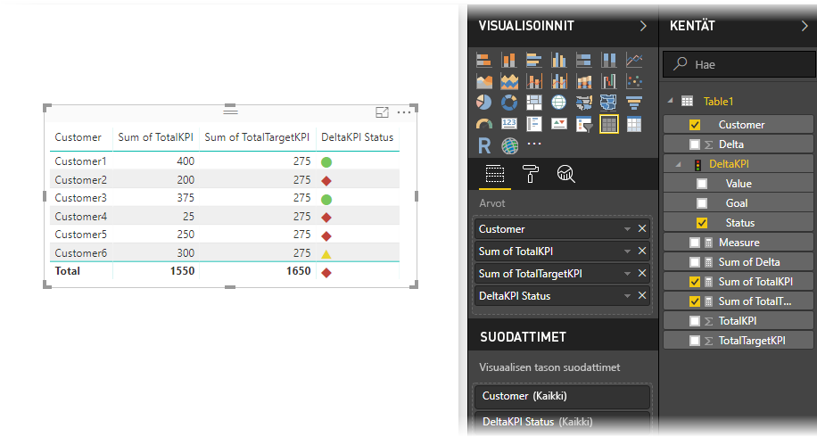

# Suorituskykyilmaisimien tuominen ja näyttäminen Power BI:ssä
**Power BI Desktopissa** voit tuoda ja esittää suorituskykyilmaisimia (KPI) taulukkoina, matriiseina ja kortteina.

Näiden ohjeiden avulla voit tuoda ja esittää suorituskykyilmaisimet.

1. Aloita Excel-työkirjasta, jossa on Power Pivot ‑malli ja suorituskykyilmaisimet. Tässä harjoituksessa käytetään työkirjaa, jonka nimi on *KPIs*.

1. Tuo Excel-työkirja Power BI:hin valitsemalla **Tiedosto -> Tuo -> Excel-työkirjan sisältö**. Ohjeet [työkirjojen tuomiseen](desktop-import-excel-workbooks.md). 

1. Power BI:hin tuonnin jälkeen suorituskykyilmaisin näkyy **Kentät**-ruudussa. Se on merkitty kuvakkeella. Suorituskykyilmaisimen käyttämiseksi raportissa muista laajentaa sen sisältö, jolloin **Arvo**-, **Tavoite**- ja **Tila**-kentät ilmestyvät näkyviin.

    

1. Tuotuja suorituskykyilmaisimia kannattaa käyttää vakiomuotoisissa visualisointityypeissä, kuten **Taulukko**-tyypissä. Power BI sisältää myös **Suorituskykyilmaisin**-visualisointityypin, joka tulee käyttää ainoastaan uusien suorituskykyilmaisimien luomiseen.
   
    

Siinä kaikki. Suorituskykyilmaisimien avulla voit korostaa trendit, etenemisen tai muita tärkeitä indikaattoreita.
